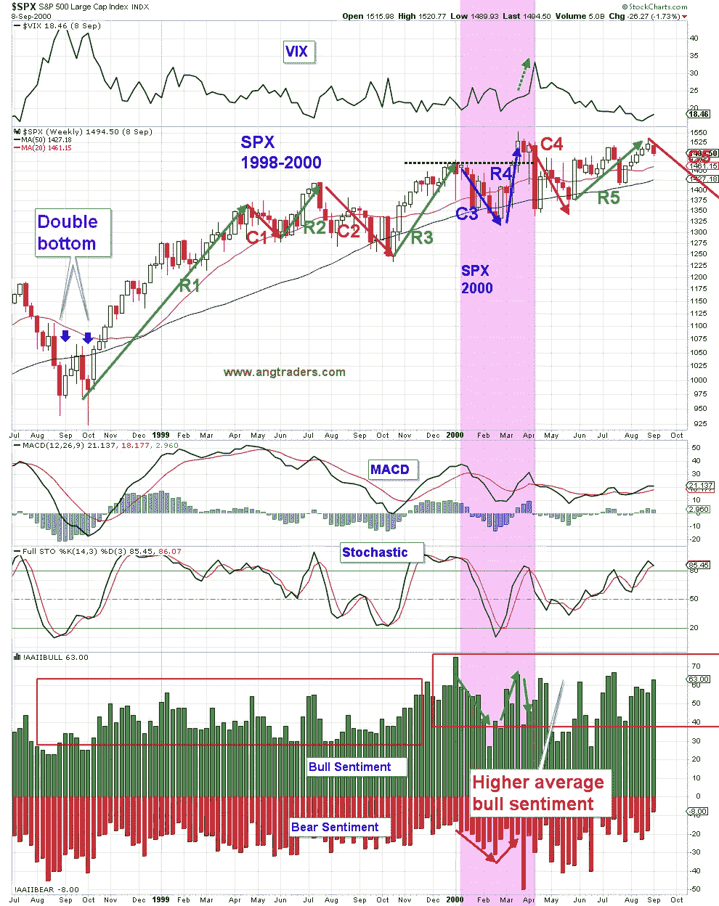
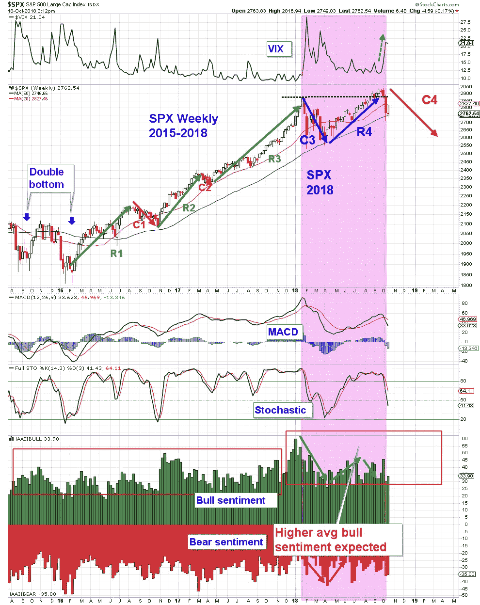
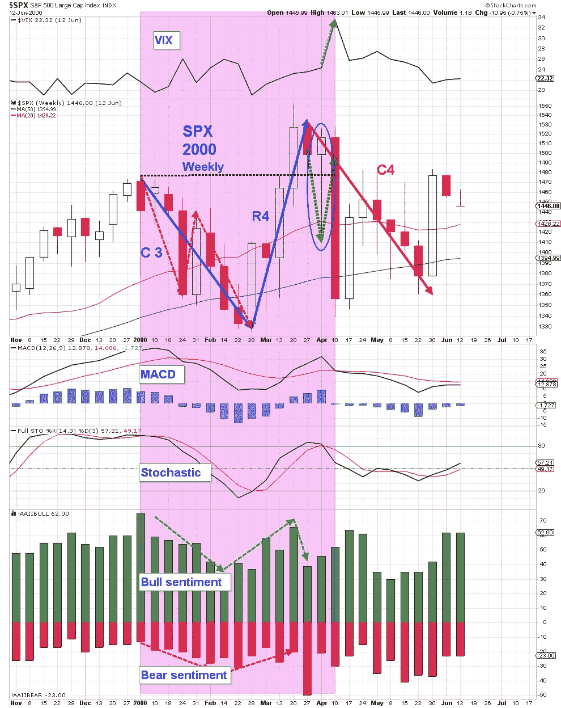
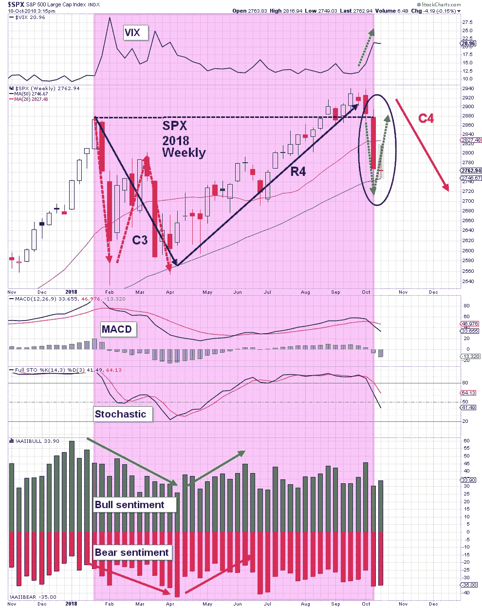

# 模式相似度:2000 年和 2018 年

> 原文：<https://medium.datadriveninvestor.com/pattern-similarity-2000-and-2018-86fcf7d67675?source=collection_archive---------27----------------------->

牛市由恐惧驱动，由基本面推动。牛市以兴奋和疲软的基本面结束。尽管本周市场经历了一段不舒服的旅程，我们的第一句话仍然描述了当前的形势。

AAII 牛市情绪出现了自 2017 年 11 月以来的最大单周跌幅。30.6%不是欣快水平；没有一个牛市是以牛市情绪低于 50%而结束的。

到目前为止，只有 6%的公司公布了本季度的业绩，但其中 86%的公司报告了 EPS 的积极惊喜，平均收益增长为+19.1%；从来没有牛市以如此强劲的增长结束。

尽管我们知道调整是不可避免的，但我们对本周走势的剧烈程度感到惊讶。也许我们不应该如此惊讶，因为这种剧烈的波动符合 2000 年的修正交易模式，在下面的两个图表中被标为 C4。

图表 1

图表 2

接下来的两张图表显示了标志着 2000 年 C4 修正开始的类似的急剧下降(蓝色椭圆),这可能会在今天重现。

图表 3

图表 4

如果 SPX 反弹至 2840–2850 区域，我们将在 SPXL 上开设一些多头看跌期权，在 UVXY 上开设多头看涨期权，以尝试捕捉 C4 的一些下跌行情。如果市场在没有足够反弹的情况下继续抛售，我们将在 2650 点左右开始加仓。

无论如何，我们仍然认为这一举动是正在进行的牛市中的一次调整，而不是新一轮熊市的开始。**恐惧和基本面都太强，牛市不会结束。**

**昂商**

在 www.angtraders.com[加入我们，复制我们的交易和利润。](http://www.angtraders.com)