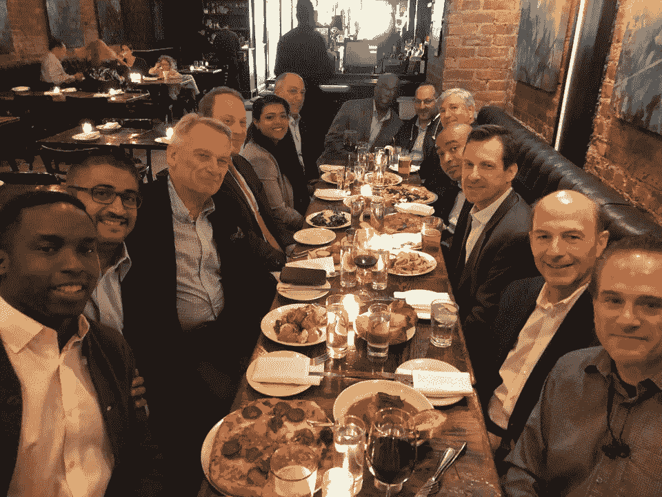
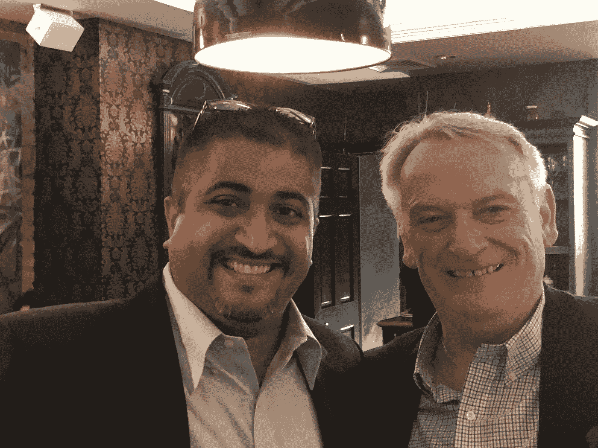
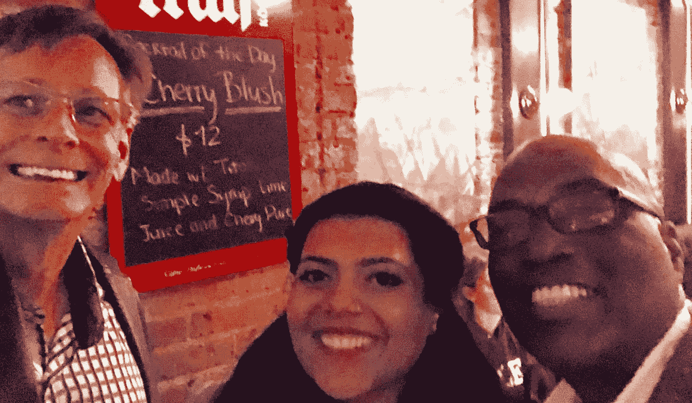
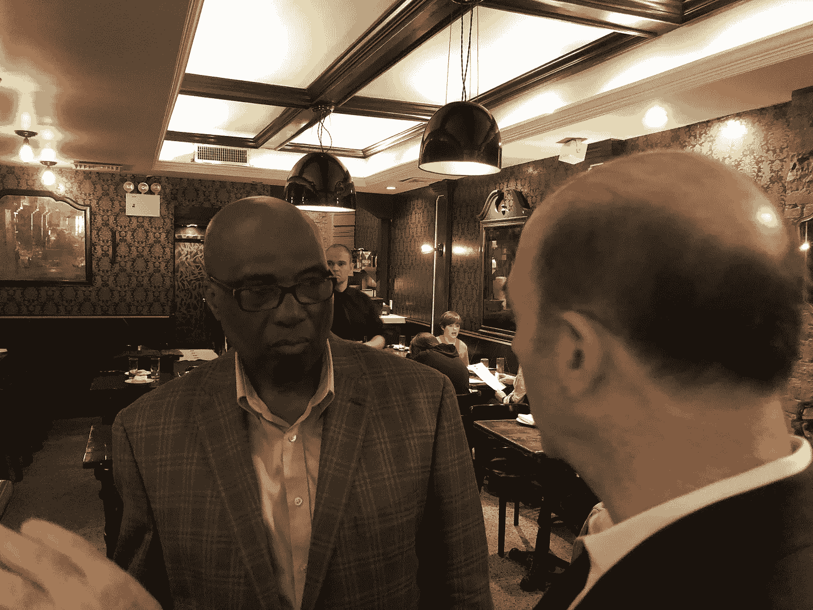
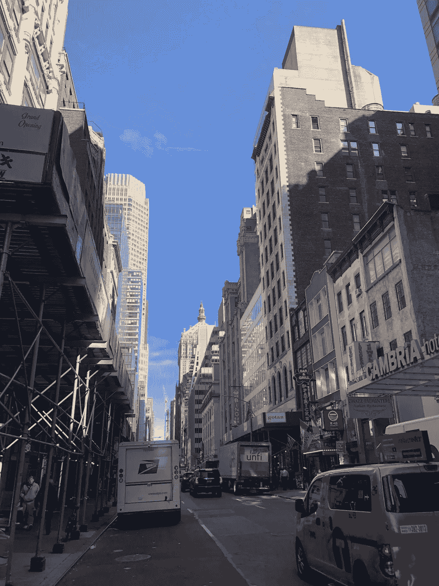

# #支付纽约金融科技会议

> 原文：<https://medium.datadriveninvestor.com/pay-nyc-fintech-meetup-cba9a2d2993f?source=collection_archive---------7----------------------->

#PAY Symposium & Exposition NYC Fintech Meetup at Ninos

#PAY 研讨会的发展有很多事情要做，所以我想我应该在复活节商业假期之前写一篇博客，让大家了解最新的消息。

首先，我想介绍#PAY 团队的两位新成员，Ashok Venkatraman 和 Bethany Frank，他们都是纽约居民。他们最近都加入了#PAY 运动，尽管我和他们都相处了很长时间，但实际上这次会面给了我一个很好的机会，让我最终见到了他们本人。

 [## 金融科技初创公司正在扰乱世界各地的银行业-数据驱动的投资者

### 传统的实体银行从未真正从金融危机后遭受的重大挫折中恢复过来…

www.datadriveninvestor.com](https://www.datadriveninvestor.com/2018/10/20/fintech-startups-are-disrupting-the-banking-industry-around-the-world/) 

Ashok 是万事达卡的资深人士，并成立了 NuStart Advisors，以帮助初创公司获得市场知名度和财务增长。Ashok 负责我们的金融科技初创公司展示，目前正在寻找最有希望在银行、金融科技和支付领域创新的新参与者。

Ashok Venkatraman, NuStart Advisors and Chris Skinner, www.thefinanser.com

Bethany 以前是 Alacrity 的高级营销助理，现在与我和我们的顾问委员会主席维恩·布朗一起工作，负责营销、传播和业务发展。

Bethany 还通过她的公司 b Media 帮助科技创业公司和金融服务公司执行定制的内向和外向营销策略。弗兰克女士是金融科技领域女性的坚定倡导者，并鼓励更多女性参与#PAY 运动和我们即将于 8 月在拉斯维加斯举行的活动。

Bruce Burke, The Mandalay Group with Bethany Frank, b Media and Wayne Brown, The Walker Group

Wayne 是 Walker Group 的管理合伙人，他在将这些人聚集在一起方面发挥了重要作用，他与他的长期合作伙伴 Chris Skinner 在 46 街的 Nino's 组织了这次#PAY NYC meetup。这家现代意大利美食的世外桃源为活动营造了完美的氛围。工作人员超级友好和乐于助人，每个人都喜欢傍晚的鸡尾酒和各种产品。克里斯和我想象的一样和蔼可亲，见解深刻。他是一个真正的绅士，非常活泼，健谈。

一大群人参加了我们的会议，包括 PRM 支付公司的创始人兼首席执行官彼得·戈登、超越弧公司的大卫·杰比诺、Transactis 公司的首席收入官里克·费奥里托、董事总经理多米尼克·沃德、Iconic Lab & Holdings 公司的美国投资总监马修·纳西耶、Earnix 公司的首席营销官乔治·拉维奇和 Vments 公司的首席执行官、创始人兼建筑师史蒂文·乏色曼。尼诺的充满了聊天，因为每个人都见面，讨论当前的新闻和谈论未来十年的付款。

Wayne Brown, Managing Partner, The Walker Group

Chris 分享了关于在“一切即服务”的时代，大银行在金融科技公司和银行客户方面做得对的新见解。每个人都有足够的时间互相认识、交流，并从克里斯那里听到一些精心挑选的话语。

Ashok 评论道，Wayne 已经找到了正确的联网方法。他对我们正在发起的#PAY 活动感到非常兴奋，在这个活动中，潮人、骗子和黑客将合作并挑战银行、金融科技和支付的现状。

这是纽约美丽晴朗的一天，城市的活力为我的聚会增添了激情。我大部分时间都在我居住的佛罗里达州一个安静的小岛社区工作，感受一个充满商业和活动的大都市的脉搏是很有趣的。

聚会结束后，#PAY 团队走到街角的一家咖啡店，为未来制定计划。虽然我们从未见过面，但我们很自然地就在一起了，彼此都很投缘。这是一个重要的因素，因为你必须明白，除了第一次拉斯维加斯活动，我们还在寻求建立#PAY 品牌。

Another beautiful, clear day in New York City

我们的愿景是打造#PAY 品牌，为支付行业提供研究、报告、精选新闻、信息和网络研讨会，以及本地会议小组和国际活动。

我们专注于高水平，同时关注最热门的新金融科技创业公司。喝着咖啡，我们都同意我们的姿态，目标和善意的努力，我们将带进我们的聚会。

未来的计划包括成立一个协会，致力于为行业带来新的互动方式和良好的业务，同时支持和促进正在改变金融面貌的公司。

喝完咖啡后，Ashok &我乘火车回到了他的住所，在那里，我有机会见到他可爱的妻子和家人，享受夜宵，同时讨论更多的想法，并为金融科技初创公司展示制定额外的计划。

如果您的公司专注于金融领域的创新，并希望参加此次推介竞赛，请在 paysymposium.com/showcase.提交您的推介资料，与 Ashok 取得联系

我想借此机会感谢 Wayne、Bethany 和 Ashok，感谢他们在与我一起帮助实现#PAY 的过程中表现出的兴趣和热情。最后，感谢大家来参加聚会，我们期待你们的参与。

New York Financial District at Night

欲了解更多关于#PAY 研讨会暨展览会的信息，包括我们的创业展示、顾问委员会和首轮发言人公告，请访问[www.paysymposium.com](http://www.paysymposium.com/)