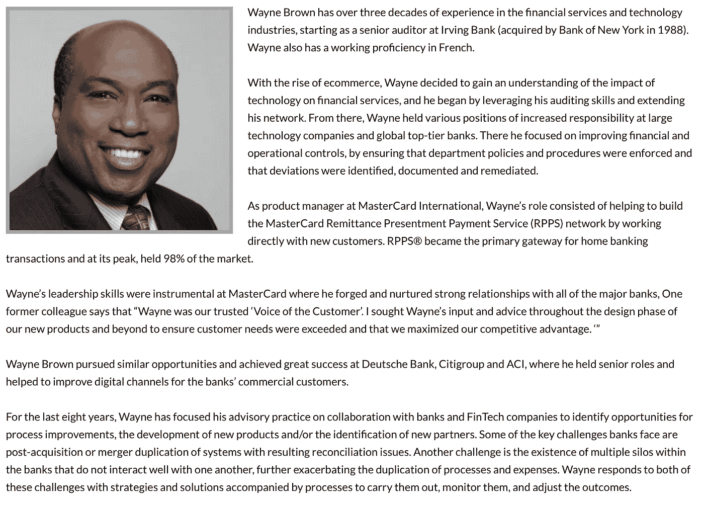
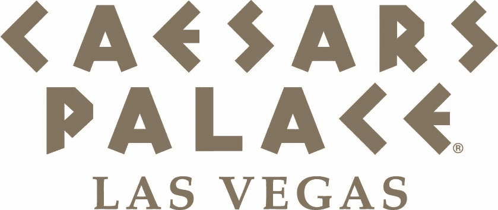
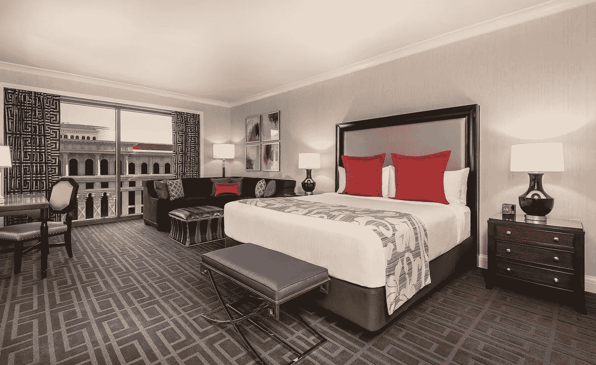
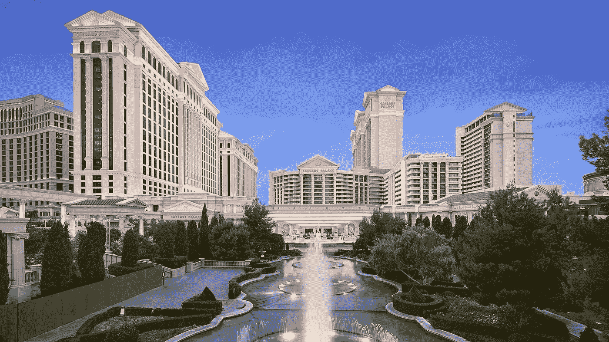
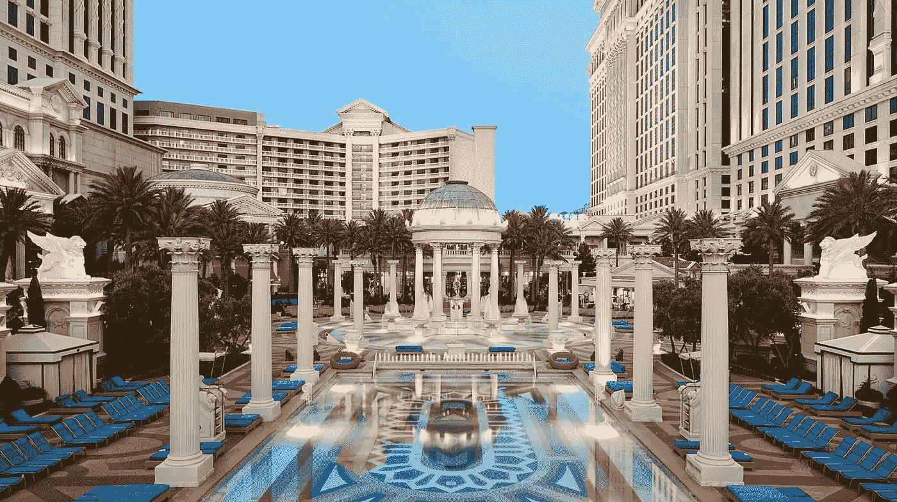

# #付钱——我们进展顺利！

> 原文：<https://medium.datadriveninvestor.com/pay-were-well-under-way-5c1cee0153b3?source=collection_archive---------19----------------------->

我们有一阵子没发博客了。我们一直忙于筹备这次活动，但我们想借此机会与您分享我们的一些进展。我们将向您介绍一些即将推出的新举措，以及您参加#PAY 研讨会暨展览会的方式。

首先，我们自豪地宣布，沃克集团的维恩·布朗被任命为#薪酬咨询集团主席。

随着活动的发展，来自支付、金融科技和银行业各个领域的高级领导人将参与并帮助指导活动。

我们期待着 Wayne 的指导和他的顾问委员会对该活动的影响，并鼓励您的组织参与我们即将举办的活动。

其次，我们欢迎所有加入我们并宣传我们 2019 年 8 月活动的媒体合作伙伴。我们很高兴增加了各种领先的金融出版物和基于网络的新闻和信息来源作为我们的媒体合作伙伴。

*   [尼尔森报告](https://nilsonreport.com/) |备受关注的新闻&全球卡分析&移动支付。
*   [绿皮书](http://www.greensheet.com/) |首家关注支付行业 ISO & MLS 渠道的出版商。
*   [软件高管杂志](https://www.softwareexecutivemag.com/)| B2B 软件公司高管的最佳实践。
*   [世界金融通知](https://www.worldfinanceinforms.com/) |金融领域的最新消息、更新和发展。
*   [预付费按](http://www.prepaidpress.com/) |预付费汇聚的地方！预付费市场的领先发行商。
*   [软件业务增长](https://www.softwarebusinessgrowth.com/) |告知软件社区成功的机会。
*   [加密货币](https://cryptocurrencies.com.au/) |所有加密的东西——澳大利亚排名第一的加密受众网站！
*   [ICOHolder](https://icoholder.com/) |智能追踪器，拥有最大加密数据库的全球分析平台。

我们要向所有这些媒体合作伙伴表示诚挚的感谢。如果您的金融科技新闻机构或出版物希望成为媒体合作伙伴，请立即联系我们。我们一直在寻找新的媒体合作伙伴——如果你是支付、金融科技和银行领域的 vlog、blog 或记者，我们有兴趣与你合作。

我们要感谢我们的活动主办方凯撒宫为我们提供了一个顶级的活动场地。由于 Caesars 最近花费 1 亿美元对 Palace Tower 进行了翻新，我们能够为我们的会议室大楼提供两种令人惊叹的住宿价值。

# 论坛经典客房 119 美元一晚— Wi-Fi &健身房通行证

# 皇宫高级客房每晚 169 美元——Wi-Fi 和健身房

专家提示:皇宫塔和会议中心在同一栋大楼里，所以乘电梯去会议和展览区很简单。论坛塔在神池区花园的对面。

您可以在大厅、赌场和餐厅四处走走，或者走到游泳池边，走到会议区。这两个房间都很漂亮，有很高的会议价格，如果您不介意步行，论坛塔房间是一个很大的节省，并且仍然有凯撒宫提供的所有便利设施。

折扣价格有效期至 2019 年 7 月 26 日，适用于 8 月 17 日至 21 日期间预订的所有房间。使用我们的[直接链接](https://book.passkey.com/gt/217326331?gtid=fb96b384dc7711ba44656622e7a2181d)进行预订，或拨打 866–227–5944 联系预订部，并告知团体代码 SCTPE9。

我们也很高兴地宣布，凯撒宫已经同意在 8 月 19 日星期一使用会议室区域举办一些活动前训练营、研讨会和大师班。

庞贝舞厅占地 5467 平方英尺，分为四个独立的空间，每个空间可容纳 90 人的教室，135 人的剧院风格，甚至更多的接待或宴会。

如果您的组织有兴趣在活动前一天举办活动，请联系我们。这是展示你的品牌和分享信息的绝佳机会。

在关闭博客之前，我们还有最后一件事要宣布。我们最近推出了#PAY 播客节目，我们将在八月份采访演讲、赞助、展示和指导该节目的颠覆性创新者。

每周我们都会有一集新的嘉宾参与或支持#PAY 活动。我们的#PAY 播客目前可以在[苹果播客](https://itunes.apple.com/us/podcast/pay/id1450867444?mt=2&ign-mpt=uo%3D4)、 [Spotify](https://open.spotify.com/show/7KqS9xumgontnSpqetccrU) 、 [Breaker](https://www.breaker.audio/number-pay) 、[谷歌播客](https://www.google.com/podcasts?feed=aHR0cHM6Ly9hbmNob3IuZm0vcy84YWI3M2IwL3BvZGNhc3QvcnNz)、[阴云](https://overcast.fm/itunes1450867444/pay)、[口袋广播](https://pca.st/Tc5v)、[公共电台](https://radiopublic.com/pay-8QdgrA)和[缝纫者](https://www.stitcher.com/podcast/anchor-podcasts/pay)上看到，更多内容即将推出。很快，我们还将推出#付费电视，对市场领导者进行视频采访。

随着我们进入二月，我们将充实 www.paysymposium.com 网站。我们将宣布并添加我们的第一轮发言人，并在网站上突出我们的赞助商、参展商和媒体合作伙伴，以及参加活动的代表的住宿和旅行信息。我们还在整个二月延长了我们的免费展览登记，并邀请每个人参加我们的赞助商网络&参展商。

它正在成形，我们期待着举办一次世界级的盛会。我们的征稿是公开的，我们有机会为我们的活动提供演讲者、赞助商、参展商和研讨会。

这一切都将于 2019 年 8 月 20 日至 21 日在拉斯维加斯凯撒宫上演。欲了解更多信息并下载我们的赞助计划书或媒体资料，请访问我们的网站[www.paysymposium.com](https://www.paysymposium.com/)——我们期待在拉斯维加斯与您见面。