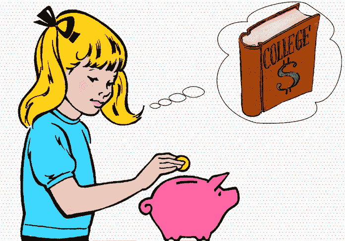

# 首先支付你自己

> 原文：<https://medium.datadriveninvestor.com/pay-yourself-first-da0751c32204?source=collection_archive---------27----------------------->

## 钱进来，钱出去。最后还有什么留给你的吗？

Photo by [Sharon McCutcheon](https://unsplash.com/@sharonmccutcheon?utm_source=medium&utm_medium=referral) on [Unsplash](https://unsplash.com?utm_source=medium&utm_medium=referral)

钱进来了。钱出去了。账单、债务偿还、杂货等。经历了这一切之后，你的储蓄策略进展如何？我们许多人都梦想有一天拥有很多钱。有些人运气好，中了头彩，但对大多数人来说，要有很多钱需要一个强有力的计划。这笔钱必须通过多年的工作、自律以及良好的储蓄和投资策略来积累。但这正是我们许多人陷入困境的地方。因为以后要有很多钱，就意味着现在就开始。你现在需要开始存钱了。这很困难。

最好的拯救方式是首先让自己成为一个现实的目标。如果你每月收入 2000 美元，有 1000 美元用于支付账单(房租、水、互联网、保险)，还有 500 美元的标准月生活费用(食品、订阅、燃料等)。)我不指望你每月能存 600 美元。毕竟你一个月没有 2100 美元。

我甚至不指望你能存下 500 美元。为什么不呢？因为不可预见的成本总是会发生。你的洗衣机可能会坏。你的车可能需要修理等等。这就是为什么在为一个长期的、更遥远的目标存钱之前，有一个应急基金(应该相当于一个月的工资，在这个例子中是 2000 美元)是一个好主意。

 [## 更好的预算，打造更大的|数据驱动型投资者

### 即使是专家也承认它们并不完美。从 1 到 10 的范围内，安东尼·科普曼和德尔…

www.datadriveninvestor.com](https://www.datadriveninvestor.com/2018/11/08/budget-better-to-build-bigger/) 

那么，更现实的是什么呢？我认为在开始的时候，把一切都投入应急基金是个好主意。所以，试着在 4 个月内每个月存 500 美元，让你的基金达到 2000 美元，并希望它不会在此期间耗尽。尽管不可预见的成本总是会出现，但如果你花了 5 个月的时间存了 400 美元才达到 2000 美元，也不要惊讶。如果你没有花掉最初计算中“剩余”的 100 美元，很好，在你领工资的前一天也把它放进去。那你可能会在 4 个月内完成。

然后，当你的应急基金达到最高水平(2000 美元)时，你可以将自己导向长期储蓄目标。随着你的应急基金的建立和运行，你应该能够将所有的 500 美元“剩余”资金用于储蓄。然而，你可能会注意到，你所有的钱都花在了必需品上(房租、燃料、杂货)，你没有留下任何细节。

有些人可以做得很好，有些人由于这种限制在几个星期后就失败了。如果你更像后者，再次“只”存 400 美元，给自己 100 美元的喘息时间，你甚至可以考虑将这笔钱转移到一个单独的银行账户。这样，你就有了未雨绸缪的基金，100 美元可以确保你的生活不会太无聊，你可以出去社交，或者买衣服等等。你还能省下 400 美元。

如果这看起来仍然太严格，改变数字，有 300 美元的储蓄和 200 美元的喘息。只要记住:你现在想花的钱越多，你以后得到的就越少！

但是，即使有了这个组织严密的计划，事情可能也不会像希望的那样顺利。想象你在月初收到你的工资。现在你可以付清你的账单了，我建议你在收到工资后马上付清。然后生活费用会分摊到整个月(除非你也在月初把所有的杂货都算进去？).然后这个月就这样过去了。你去工作，你看到家人和朋友用你的临时资金，然后在月底看看你还剩多少钱，把它转到储蓄账户。惊喜，惊喜，你没有达到你的储蓄目标。你根本没遇到它。这种策略行不通。幸运的是，有一种方法可以解决这个问题:不要等到月底。像支付账单一样，优先支付自己。是的，你的储蓄将是一张新的账单。你需要先支付自己**。**

**然后神奇的事情发生了:你不用等到月底才把 400 美元存入你的银行账户，只要你的工资一降下来，你就会把这笔钱从活期账户转到储蓄账户。是的，你的储蓄将是你的主要账单，而且需要全额支付。**

**这看起来是一个很小的改变，但它确实有效。怎么会？好吧，首先支付你自己所做的是根据你剩余的钱来调整你的花费。当你最后一次支付自己的时候，这笔钱就在你主要用来消费的活期账户里等着。因此，当检查你的余额时，看起来你有比实际多得多的钱。如果你把你的储蓄从这个消费账户中移走，它将反映出你实际剩余的钱的价值。[当人们只剩下 200 美元而不是 600 美元时，他们花钱的方式会非常不同。](https://www.moneyonthemind.org/post/when-rich-when-poor)**

**此外，当你动用你的储蓄账户把钱存回你的活期账户并用于消费时，你会感觉很糟糕。感觉很脏。感觉你是在欺骗自己。你是。你在从未来的自己身上抽离，来安慰现在的自己。你现在的自己可能会欣赏它。但是你如何向未来的自己证明这一点呢？尤其是，当你投资得当的时候，钱会增值。**

**是的，我完全赞成首先支付自己。这是确保你达到储蓄目标的可靠方法！**

**一个简单的提醒:如果你已经为自己设定了一个储蓄目标，甚至在首先支付自己的时候，你的钱似乎还有太多的月份，也许这个目标是不现实的。你将不得不检查你的财务状况:弄清楚钱去了哪里，是否所有的花费都是必要的。请务必阅读我关于如何减少开支的文章。或者，如果你的支出真的无法改变，你要么需要改变你的收入，要么改变你的目标。在这里阅读我关于如何建立成功目标的文章。**

**重要的是，当你设立一个目标时，你要把它作为一个明确的优先事项。首先支付自己是一种清楚地表明你的储蓄和支付其他账单一样重要的方式。**

**我希望这篇文章对你有用，请让我知道你还有哪些其他的技巧和窍门来达到你自己的储蓄目标！**

**莫尔·范·登·阿克是华威商学院行为科学专业的博士生。她研究了不同的支付方式，尤其是非接触式和移动支付方式，对我们管理个人财务的影响。在她的“空闲”时间里，她写了一些关于个人理财、行为科学、行为金融和博士生生活的文章，这些都发表在《金钱在头脑》上。通过 DDI，她撰写了关于个人和行为金融的文章，以确保学术界的知识流入主流，并能帮助尽可能多的人！**

***原载于 2019 年 12 月 17 日*[*【https://www.datadriveninvestor.com】*](https://www.datadriveninvestor.com/2019/12/17/pay-yourself-first/)*。***