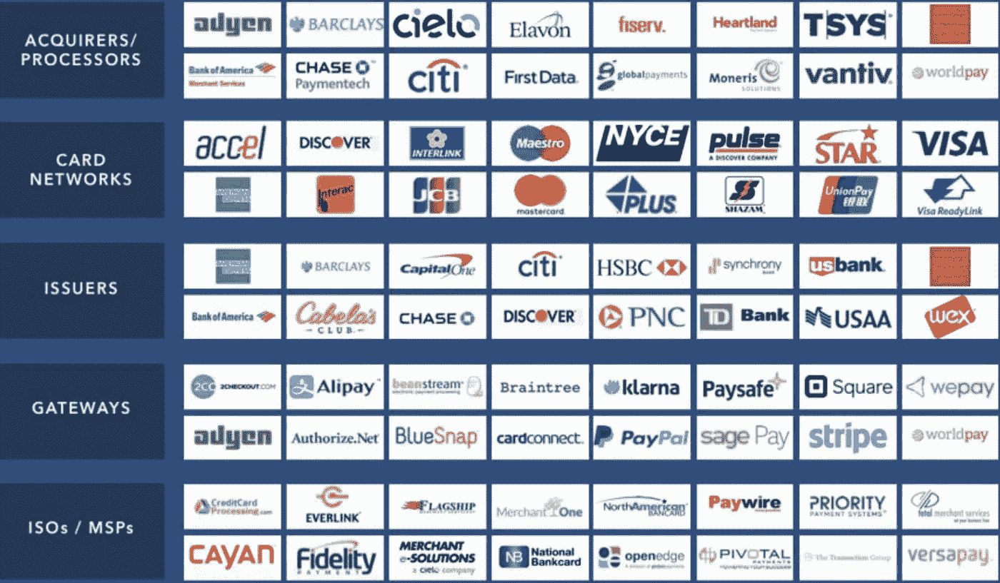
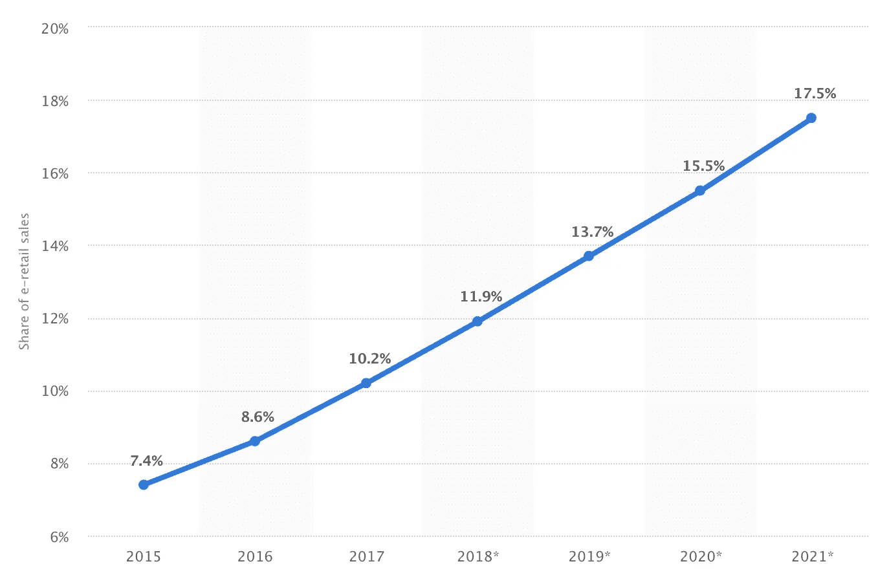
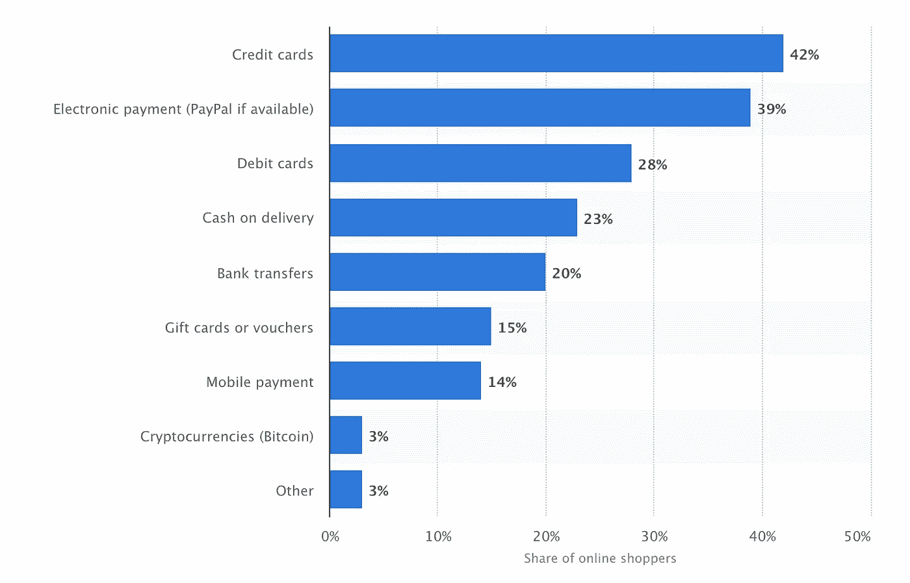
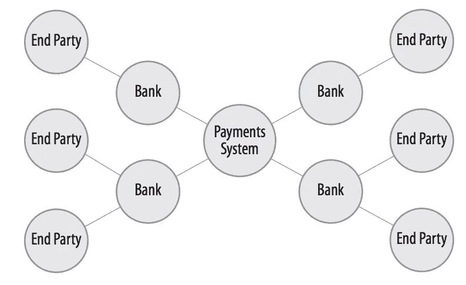
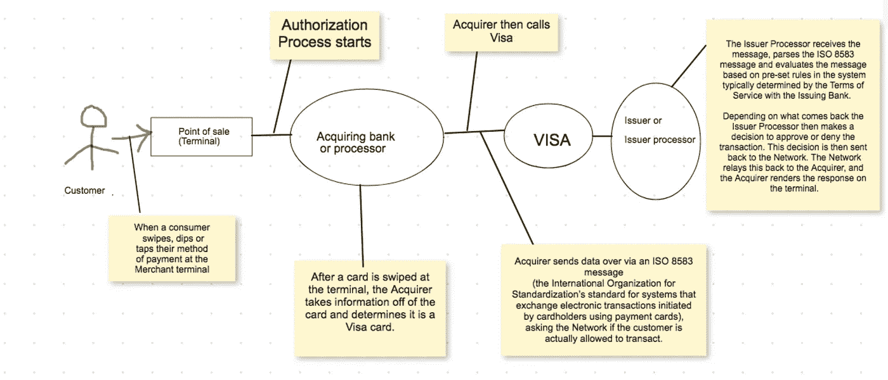

# 揭秘支付生态系统

> 原文：<https://medium.datadriveninvestor.com/payment-ecosystem-demystified-beaa08d85959?source=collection_archive---------0----------------------->

[**Business Insider Intelligence**](https://www.businessinsider.in/THE-PAYMENTS-ECOSYSTEM-Everything-you-need-to-know-about-the-key-players-and-trends-in-the-payments-industry/articleshow/50953430.cms)

## 支付生态系统从哪里开始？

支付生态系统总是从那些想从其他人(比如商家)那里买东西的人开始

## 业务通常是如何发生的？

*   [砖头](https://en.wikipedia.org/wiki/Brick_and_mortar)**——**像[“麦当劳的 34492 家餐厅:它们在哪里？”](https://www.theguardian.com/news/datablog/2013/jul/17/mcdonalds-restaurants-where-are-they)
*   在线购物网站——如旅游、美食、娱乐、购物
*   电子商务——比如——亚马逊、易贝、阿里巴巴、Flipkart——参见——[https://www.marketing91.com/amazon-competitors/](https://www.marketing91.com/amazon-competitors/)
*   移动商务—类似—网上银行、账单支付—见—[https://www.investopedia.com/terms/m/mobile-commerce.asp](https://www.investopedia.com/terms/m/mobile-commerce.asp)
*   社交商务——比如脸书、watsapp

所以基本上我们有两种方式在线上和线下做生意。网上商务正变得越来越流行。

*来源—*[*https://www . statista . com/statistics/534123/e-commerce-share-of-retail-sales-world wide/*](https://www.statista.com/statistics/534123/e-commerce-share-of-retail-sales-worldwide/)

## 商家/企业接受付款有哪些不同的选择？

*   现金，支票
*   信用卡— *后付*
*   借记卡— *立即支付*
*   预付卡或礼品卡— *在*之前支付
*   手机钱包——Apple pay、Android pay、Samsung pay、Paytm、支付宝、微信支付

**截至 2017 年 3 月全球网上购物者的首选支付方式**

**source- © Statista 2018**

## 有哪些付款类别？

*   现金，支票
*   卡片存在
*   卡不存在

## 什么是不同类型的无卡支付(CNP)和 CP 交易支付？

*   远程支付——例如电子商务和移动商务
*   近距离支付(也称为非接触式支付)——二维码支付(Paytm 支付宝)、基于 NFC 的支付(Apple pay、Samsung pay、Android pay)
*   应用内支付(IAP)——应用内购买是指在[移动应用](https://www.webopedia.com/TERM/M/mobile_application.html)内进行的购买。

苹果的[使用 Apple Pay 入门](https://developer.apple.com/apple-pay/Getting-Started-with-Apple-Pay.pdf)参考文档以如下方式区分了 IAP 和 Apple Pay:

> 理解 Apple Pay 和应用内购买的区别很重要。使用 Apple Pay 销售杂货、服装和电器等实物商品。还可以使用 Apple Pay 购买服务，如俱乐部会员资格、**酒店预订和活动门票**。另一方面，使用应用内购买来销售虚拟商品，如应用的优质内容，以及数字内容的**订阅**。[着重号后加]

参考—[https://www . macworld . com/article/3050390/IOs/could-apple-pay-clean-the-up-in-app-purchase-mess . html](https://www.macworld.com/article/3050390/ios/could-apple-pay-clean-up-the-in-app-purchase-mess.html)

## 什么是拉式支付和推式支付？

**基于推送的支付**

> 使用推送方法，消费者将其资金“推送”到支付提供商的在线账户。支付提供商然后通过安全通道将这些资金传输给商家。这种方法的好处是双重的，因为商家从不接收消费者的银行账户或信用卡信息，并且消费者不必提供这些信息。

**拉式支付**

> 大多数 ACH 支付提供商都使用拉方法。本质上，支付提供商在线存储消费者的银行账户信息；然后，当消费者进行购买时，资金从他们的银行账户中被“取出”并传送给商家。

*来源——在线支付安全和欺诈防范要点——David Montague*

## 支付系统模型是什么——开环和闭环？

**开环系统**

***开环支付系统依靠中介(通常是银行)来连接终端方(例如消费者或商家)。***

> 开环结构的优势在于，它允许支付系统快速扩展。随着中介加入支付系统，参与支付系统的其他中介可以立即访问他们的所有终端客户。

## 开环支付系统中的其他术语

> 当交易双方的银行中介相同时，就发生了内部交易。根据支付系统的不同，交易可能会留在银行内部(例如，永远不会提交给票据交换所或“中心”进行交换)，在这种情况下，银行通过内部转账结算交易。在其他系统中，与普通的“非本行”交易一样，本行交易通过系统并返回银行。美国银行的日益集中正在增加“美国人”交易的百分比。

**闭环系统**

闭环支付系统在没有中介的情况下运行。终端方与支付系统有直接关系。 ***最初的美国运通和 Discover 系统，以及专有卡系统(例如，仅在梅西百货接受的梅西信用卡)都是闭环系统的例子。***

> PayPal 或 Western Union 等支付服务提供商运营闭环系统。但重要的是要注意到，这些供应商本身是开环系统的用户，通常是在聚合的基础上。他们使用开环系统为发送方的交易提供资金和/或向接收方交付付款

来源— [Glenbrook Partners](http://glenbrook.com/wp-content/uploads/2017/09/Payments-Systems-Overview-Third-Edition.pdf)

## 支付交易中涉及哪些不同的参与者？

**发卡行/发卡银行** —历史上人们(买方/卖方)会使用现金，但现在越来越多的人开始用信用卡、借记卡或预付卡支付。这些卡通常由发行商或发行银行发行。

**商家—** 这些卡没有用，除非商家愿意收。

**收单机构—** 为了接受卡，商家需要一个终端。终端由收单机构或网关提供。收购方的背后永远是接收资金的商业银行。

**网络** —传输协议或“rails”由 Visa 等网络管理。

Source- [https://community.developer.visa.com/t5/Developer-Tools/A-Detailed-Look-at-the-Payments-Ecosystem-from-Visa-Payment/ba-p/7463](https://community.developer.visa.com/t5/Developer-Tools/A-Detailed-Look-at-the-Payments-Ecosystem-from-Visa-Payment/ba-p/7463)

**ISO/MSPs** —

根据[https://national processing . com/blog/understanding-registered-isomsps/](https://nationalprocessing.com/blog/understanding-registered-isomsps/)

> ISO 是*独立销售组织*的缩写，是一个描述非银行的个人或组织(信用卡行业协会成员)的术语。但是，他们确实与不同的成员银行建立了信用卡关系。MSP 或*会员服务提供商*不是信用卡协会会员，而是由信用卡公司(万事达卡、维萨卡等)注册的。)并能向其他会员提供节目服务。请记住，ISO 和 MSP 不是银行。

**商业银行** —

> 商家账户是一种银行账户，允许商家以多种方式接受付款，通常是借记卡或信用卡。根据承兑人和商户收单银行之间的协议建立商户账户，用于支付卡交易的结算。

**支付网关—**

> 一个[支付网关](https://en.wikipedia.org/wiki/Payment_gateway)是一个电子商务服务，授权电子商务和在线零售商支付。它相当于位于大多数零售店的物理 POS(销售点)终端。

## 结论

这篇文章试图帮助初学者理解支付生态系统背后的基本系统。然而，还有更多需要学习和探索。例如，Visa，MasterCard，Paypal 这些公司是如何赚钱的。什么是移动领域的新技术和创新。我会试着再写一篇文章来解释这一部分。

继续学习！