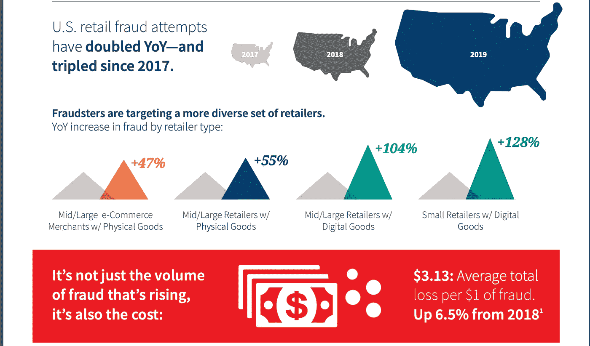

# 支付风险和欺诈-揭秘

> 原文：<https://medium.datadriveninvestor.com/payment-risk-and-fraud-demystified-2df07d43ce96?source=collection_archive---------0----------------------->

## 了解欺诈领域的原因、内容和方式

## 这个故事的目标

✿定义欺诈和支付风险，以及“谁”会受到影响？

✿支付风险和欺诈—有什么区别！

✿欺诈防范工具和技术

✿创新发生在这个领域

所以让我们开始吧！

 [## 分散金融的出现|数据驱动的投资者

### 当前的全球金融体系为拥有资源、知识和财富的人创造了巨大的财富

www.datadriveninvestor.com](https://www.datadriveninvestor.com/2019/03/14/the-emergence-of-decentralized-finance/) 

## 为什么我们都应该意识到数字支付的风险和欺诈！

**持卡人故事** ☛

我最近收到了一封电子邮件和一个金融机构的电话，通知我他们将向我发放一张新的信用卡(替换现有的信用卡),当我问你为什么要这样做时，他们说他们注意到我的帐户上有“一些可疑的欺诈活动”,他们认为替换信用卡可以防止这种情况。

**银行账户持有人的故事** ☛

我的朋友最近收到一条信息提示，一些金额被从帐户中扣除，他不知道这是怎么发生的！！！

**企业主和商人的故事** ☛

> 网上商家非常清楚，欺诈在很多方面让他们付出了代价——退款、误报、结账时产生的摩擦，这些都可能导致销售损失。[来源](https://www.pymnts.com/news/security-and-risk/2016/merchants-fraud-costs/)

**金融机构的一面之词** ☛

[根据](https://www.ibm.com/blogs/insights-on-business/banking/how-do-you-solve-a-48-billion-payment-fraud-problem/)IBM 商业价值研究所(IBV)对 500 名银行高管的研究，**许多传统欺诈系统被认为难以适应新的、更快的和不断变化的跨渠道威胁。** 81%的受访者表示，发现新模式需要四周以上的时间，然后再花四周时间调整评分引擎。

**到目前为止，您应该已经了解到数字支付欺诈影响了从消费者到商家再到金融机构的每一个人！！**

为了防止这种情况，我们可以做的第一件事就是让自己意识到支付欺诈和风险生态系统。认识它，理解它，因为它和钱打交道！

## 支付风险和欺诈领域的术语！

我假设您了解支付生态系统，并理解卡存在和卡不存在的情况。如果没有， [**看我的故事学习。**](https://medium.com/datadriveninvestor/payment-ecosystem-demystified-beaa08d85959)

⫸ **信用卡测试欺诈—** 根据调查，这是最常见的欺诈行为。

> 当有人购买或获得被盗的信用卡号码时，他们需要确定信用卡是否仍然有效，方法是在网上进行小额购买，然后检查响应以查看信用卡是否被批准和/或 AVS(地址验证服务)和 CVV(信用卡验证值)响应是否匹配，他们能够“测试”信用卡信息以进行确认。通常，他们使用能够一次运行**数千** **交易**的机器人或脚本。成功的卡然后被用于在各种在线零售商处进行大额欺诈性购买。[来源](https://blog.gotnpayments.com/card-testing-what-you-need-to-know)

⫸ **退款**——当消费者通过他们的发卡银行说他们没有下订单或者他们没有得到他们应该得到的东西时，就会发生这种情况。

⫸ **误报** —客户订单因欺诈问题被防欺诈工具错误拒绝。

⫸ **人工审核** —

> *手动审查是一种技术，可以在内部执行，也可以外包给第三方供应商或由第三方供应商管理。在任一情况下，工作人员对订单进行人工检查，以确定身份和交易的真实性，从而确定哪些订单是欺诈性的。通常情况下，最佳(最低风险)和最差(最高风险)交易会被自动接受或拒绝，人工审查是一种尝试和转换所有其他订单尝试的方法，在这种情况下，商家不确定，需要仔细查看。* [*来源*](http://fraudpractice.com/gl-manual.html)

⫸ **智能代理—**

> 与实体(如信用卡或商户)相关的基于人工智能的智能代理技术在**实时**中从每笔交易中学习，并随着时间的推移建立其特定和独特的行为。[来源](https://brighterion.com/smart-agents-technology/)

⫸ **决策规则引擎和风险评分—**

> *规则引擎是一个中间件应用程序，允许创建用于管理欺诈的规则并对其进行优先级排序。这些引擎允许商家创建规则，这些规则将在订单到达时进行评估。规则引擎可以有许多不同的名称，例如“决策软件”、“管理软件”或“订单管理”大多数支付、CRM 和订单管理系统都有一些构建和应用规则的能力。——*[*来源*](http://www.fraudpractice.com/gl-rulesengine.html)

例如，规则可能会说:

—如果交易金额超过“x ”,则拒绝交易。

—如果同一张卡上连续发生 3 笔相同金额的交易，则认为是欺诈交易。

> 商家能够覆盖该工具中设置的欺诈规则。例如，在销售预期较高的旺季，商家可能想要覆盖被标记为欺诈的交易。为用户提供更好的客户体验。

⫸ **监督学习**——这是基于历史数据。

> 监督学习算法分析训练数据并产生推断函数(预测因子)，该推断函数可用于映射新的示例。[来源](https://en.wikipedia.org/wiki/Supervised_learning)

**这方面的例子是数据挖掘和商业规则系统**

⫸ **无监督学习**——这里没有历史数据，是基于未经训练的数据。

> **异常检测**可以自动发现数据集中的异常数据点。**这有助于查明欺诈交易**，发现硬件故障，或识别数据输入过程中人为错误导致的异常值。[来源](https://www.datarobot.com/wiki/unsupervised-machine-learning/)

> 不良行为者不断改变他们的策略，以寻找现有安全系统中的漏洞和弱点。与数据挖掘或 BRMS 等监督学习系统相比，人工智能更适合阻止攻击和欺诈交易，这为金融机构及其合作伙伴在打击欺诈的斗争中利用强大的人工智能工具指明了一个开放的机会。
> 
> **AI-创新-剧本 _ 2019 年 6 月**

## 因此，下一个问题是它的成本

> 根据 Juniper Research 的研究，在线和移动支付欺诈正受到身份和支付信息被盗的推动，这些信息是通过数据泄露的持续流行而被窃取的。该公司估计，今年网上支付欺诈造成的损失将超过 220 亿美元，到 2023 年可能高达 480 亿美元。[来源](https://www.threatmetrix.com/digital-identity-blog/payment-fraud/online-payment-fraud-trends-8-predictions-2019/)

[https://risk.lexisnexis.com/insights-resources/infographic/2019-true-cost-of-fraud-retail-edition](https://risk.lexisnexis.com/insights-resources/infographic/2019-true-cost-of-fraud-retail-edition)

虽然技术正在帮助商家通过新的渠道轻松、快速地开展业务，但由于支付风险和 fraud❗，也给他们带来了成本

## 现在让我们了解什么是支付风险和欺诈

在典型的商家和消费者之间的现金交易中，欺诈发生的几率较小，因为资金流动发生在双方之间。这意味着存在低支付**风险**。

在网上信用卡交易中，除了商家和消费者，还有许多其他实体参与其中，在这种情况下，资金流动可能有风险，因为存在很高的**欺诈的可能性。因此，在这种情况下，支付交易处于高风险状态。**

因此，这完全取决于公司的业务和政策，风险越高，需要的欺诈防范工具就越多。

**可用于验证用户身份的信息越多，支付的风险就越小。**

## 欺诈是如何发生的？

> 我们制造欺诈的能力已经超过了我们发现欺诈的能力。
> 
> **阿尔·帕西诺**

欺诈者可以是个人或大型组织的一部分，他们会通过恶意软件、黑客或从外部来源购买数据的某种方式不断获取数据，然后验证数据，并试图预测特定个人的复杂身份。这可以导致**身份接管！！**

然后，欺诈者可以购买这些被盗的身份。这最终导致欺诈！

欺诈还有其他方式，即。

⫸ **商务电子邮件泄露**

⫸ **拒绝服务**

⫸ **网络钓鱼/欺骗**

⫸ **勒索软件**

⫸ **社会工程**

## 目前有哪些打击欺诈的解决方案？

在**卡赠送交易**的情况下，除了退款或订单处理之外，商家不必承担太多成本。在这种情况下，信用卡协会保护商家免受欺诈。在这里，可以通过销售点终端立即验证/认证卡及其身份

但是……随着网上商务的日益普及，商家很难不在网上开展业务。最终，他们的销售额随着网络的出现而增加。同时，商家必须确保他们的基础设施是安全的，欺诈发生的可能性更小。

> 研究表明，网上诈骗的比率大约是信用卡诈骗的七倍。一些独立分析师的估计高达 12 倍。

现在网上商家可以使用**防欺诈工具**来帮助他们了解订单是否有风险。这些工具将基于规则，这些规则将针对每种商户类型并根据其业务模型进行配置。有时，商家愿意在被标记为有风险的订单上冒一些风险。这样做是为了让商家能够给出良好的客户体验，建立忠实的客户群。

还有其他解决方案，如**多因素认证**，这带来了结账过程中的摩擦，但在某种程度上帮助商家防止欺诈。

> “我们给出了太多的生物特征数据。如果一个坏人想要你的生物特征数据，请记住这一点:他不需要你的实际指纹，只需要代表你指纹的数据。这将是独一无二的，独一无二的。”老麦克·穆斯卡特。信息安全经理，斯奈德-兰斯。

## **下一步是什么！通过技术创新！**

借助 AI(人工智能)和 ML(机器学习)技术，有些公司能够建立基于 ML 的模型，这种模型是通过收集有关用户物理属性、数字属性和行为模式的数据来建立的，以便可以验证身份并防止欺诈。

大多数公司关注的基于监督和非监督学习(机器学习)的模型可以带来创新！！

> “区块链技术对商业支付领域有着广泛的影响，从加快结算到保护跨境交易，”道明银行(TD Bank)企业产品和服务主管里克伯克(Rick Burke)表示。[来源](https://www.finextra.com/pressarticle/77223/td-bank-treasury-professionals-anticipate-benefits-from-blockchain/wholesale)

## 结论

支付欺诈非常复杂，因为它涉及快速变化的行为、模式和大规模交易。虽然打击欺诈的技术创新层出不穷，但对于在线商家来说，更好地意识到网络安全并使用 ML，Automation 构建强大的技术基础设施非常重要。

这肯定会在某种程度上防止欺诈。