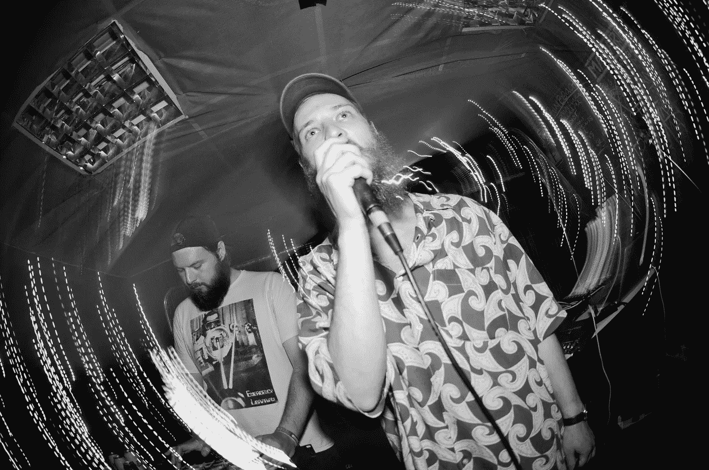
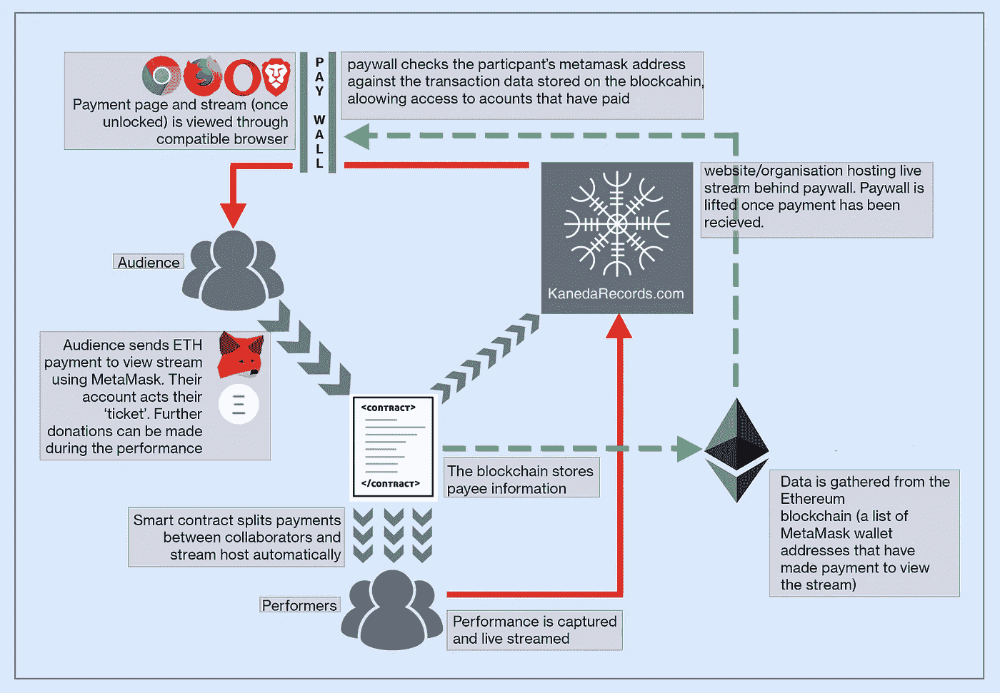

# 朋克的 PayPal:DIY 音乐的开源资金

> 原文：<https://medium.datadriveninvestor.com/paypal-for-punks-opensource-money-for-diy-music-d9021ffe9ec?source=collection_archive---------16----------------------->

# 加密货币如何帮助独立艺术家保留更大份额的收入，并找到直接联系粉丝的新方法

[Badger](https://theartfulbadger.bandcamp.com/) at a [Kaneda Records](https://www.facebook.com/kanedarecords/) night (yours truly on the left), doing it the old fashioned face-to-face way… ([photo: Johnny Haynes](https://www.instagram.com/blindjohnny/))

不管你归咎于哪里，在大多数层面上，靠音乐谋生越来越难了。当区块链抬起它迷人的头时，它被一些人吹捧为提供了解决方案，而且肯定有有利的应用。但同样真实的是，有很多牵强的说法和一厢情愿的想法。然而，在大肆宣传中有很多希望。

在随后的一系列软件、初创企业和智库试图将这一新技术应用于音乐并改善收入流的过程中，版权管理数据库、听众数据挖掘和基于音乐的加密货币等都得到了广泛的应用。等等。不过，老实说，作为博士研究的一部分，经过 18 个月的努力，我不得不大胆地说，与他们试图取代的现有机构相比，在提高艺术家的报酬方面，这些几乎都不会取得有意义的成果。这些平台和方案通常过于复杂，并且它们的成功常常依赖于高度乐观的场景，即完全区块链替换已建立并长期发展的(并且大部分功能性的)现有音乐经济基础设施。他们假设完全区块链饱和和采用，这在这一点上是遥远的，如果在所有可行的。更不用说一些提供的解决方案所显示的对音乐消费和制作的基本缺乏理解，以及对于绝大多数听众(和艺术家)来说它们目前太难使用的事实。他们也倾向于支持去中心化，同时他们自己采取了一种重新中心化的力量的形式，并作为他们试图消除的中间人。

要理解区块链如何改进，我们需要考虑现有的音乐产业和商业结构。我认为，音乐收入下降的根本原因主要不是基础设施陈旧、演出版权组织或贪婪的唱片公司和出版商的失败，就像区块链音乐初创公司经常假设的那样。而是与听众的消费习惯和录制音乐的文化贬值有关的更广泛的问题集合。这在很大程度上是由于数字文件(及其共享)的激增以及从所有权到访问文化的转移(流媒体— [伯克利音乐学院，2015](https://www.berklee.edu/sites/default/files/Fair%20Music%20-%20Transparency%20and%20Payment%20Flows%20in%20the%20Music%20Industry.pdf) )导致随后的价值转移，从录制的音乐转向现场音乐(大卫，2010，p7 *点对点和音乐产业*)。这是在总体上更加不确定或不断变化的经济中设定的。初创企业经常提到的基础设施不平等和失败只会让问题变得更加复杂，取代区块链，重新开始不会自动为艺术家带来巨大的净收益，它可能会在新的媒体中延续现有的问题。如前所述，只有当整个世界运行在一个区块链上时，他们的目标才能成功。这在很大程度上是因为区块链本身仍然容易出错，就像现有的知识产权管理系统一样，在它不可避免地要与“现实世界”对接的地方，仍然依赖于人类的行动。简而言之，对于境况不佳的创意产业来说，这并不是什么灵丹妙药。

然而，如果应用于正确的领域，主要是我认为的支付方法，以一种补充已建立的实践的方式，它可以通过降低成本和提高效率产生一些主要的好处，为已建立的和有效的方法提供改进。

看待它的最佳方式是像 PayPal 一样，但更快，交易费用(通常)低得多(也是由买方而不是卖方支付)，并且具有自动管理资金的能力。所有层面的音乐商务现在都建立在微交易的基础上([伯克利音乐学院，2015](https://www.berklee.edu/sites/default/files/Fair%20Music%20-%20Transparency%20and%20Payment%20Flows%20in%20the%20Music%20Industry.pdf) )，但依赖于第三方卡支付处理器和平台，它们都从(已经微薄的)蛋糕中分得一杯羹，从而减少了艺术家的份额，这尤其影响到那些收入较低且没有大型唱片公司投资支持的 DIY 艺术家。任何熟悉使用 PayPal 的人都会知道依赖微支付的成本有多高。更不用说音乐机构内部和从业者自身处理如此多小额支付所需的漫长会计流程。这就是区块链可以提供一个有意义的解决方案的地方:首先是因为这些更低的费用和更快的处理时间。其次，自动化(以智能合同的形式)意味着收到的付款可以自动分配并支付给相关合作者(在唱片公司将许多小额版税支付给乐队不同成员的例子中特别有用)。第三，也是我最感兴趣的是它的去中心化和开源性质:也就是说，任何人，只要有一点研究和一些网页设计知识，就可以建立自己的支付平台，并从他们的网站安全地接收支付，几乎不需要额外的费用。与使用数字商店(Spotify、Itunes 等)或现有的直接面向粉丝的平台(如 Bandcamp)相比，这也提供了一种绕过分销商费用的途径，如果加上支付处理费，通常相当于总支付额的 20%以下。

对我来说，这代表了真正的去中心化，我们应该把区块链视为艺术家直接向粉丝销售的开源方式——我已经把它当成朋克的贝宝了。我不认为这是一种完全的系统性替代，而是一种补充方法，可以为所有人带来一些好处，但对 DIY 艺术家和任何处理数字产品和微支付并定期计算和分配版税支付的组织(如唱片公司)来说，尤其是对现有音乐行业结构服务不佳的 DIY 艺术家。对于音乐制作人来说，这是一个前所未有的机会，从资本主义的机制中抓住商业手段。

关于这方面的一个例子，请访问我合作经营的唱片公司:[金田唱片](http://www.kanedarecords.com)，在那里我建立了一个基于元掩码的以太坊[加密货币音乐下载商店](https://www.kanedarecords.com/crypto-store)和我们新的加密货币子标签 [Linebreak 唱片](http://www.linebreakrecords.com)。如果你想知道如何开始设置这样的东西，看看这个视频[如何在你的网站中集成 MetaMask](https://www.youtube.com/watch?v=ZQVweC72qJI) 。

下载和流媒体等数字产品似乎是这个数字市场的合理选择。但是我们还能通过什么其他方式来销售音乐呢？表演直播呢？正如我之前提到的，在经济和文化背景下，随着录制音乐的价值下降，现场音乐越来越受到重视，这是一个明确的趋势。在去年与 [Kaneda Records](http://www.kanedarecords.com) 成功组织了一些免费的直播虚拟俱乐部之夜后(发现这是一种接触新朋友的令人惊讶的好方法)，我们想测试一个使用加密货币直接向艺术家和组织者支付观看直播表演的系统。因此，我们已经组织了一场[免费观看区块链试播的现场直播](https://www.facebook.com/events/551907045290696/)与[盆栽狼](https://www.facebook.com/thepottedwolf/)的联合演出，由[獾](https://theartfulbadger.bandcamp.com/)、[伯特·韦索](https://bertverso.bandcamp.com/)和[斯夸姆斯](https://realseshrecords.bandcamp.com/album/peace-lover)表演，以在今年晚些时候我们继续“付费”直播之前检验这个想法。这是通过使用免费获得加密货币“令牌”(Rinkeby 测试网络硬币)来代替支付。区块链记录购票者，允许他们访问流媒体，并在销售时立即在代表艺术家和主持人的帐户之间分配代币。这个项目希望证明 DIY 艺术家可以建立自己的区块链支付方式，真正实现经济去中心化。有关试用的更多信息以及如何观看视频流的详细信息，请阅读以下部分。

# 关于试用加密直播

Structure of the trial blockchain ticketed live stream

该活动将采取免费观看 3 位艺术家和乐队的售票直播音乐表演的形式，可通过金田的加密子标签[网站(Linebreakrecords.com/livestream1)](http://www.linebreakrecords.com/livestream1)上的播放器观看该流。

该流使用以太坊 Rinkeby Testnet 硬币(免费)出票，这意味着任何安装了 Metamask wallet 和兼容浏览器(Chrome、Firefox、Opera 或 Brave)并连接到 Rinkeby 测试网络并拥有少量 Testnet 硬币的人都可以免费查看。可以通过脸书信使从[流主机](https://www.facebook.com/kanedarecords/)或者从 [Rinkeby 水龙头](https://faucet.rinkeby.io/)请求硬币。

一旦参与的观众成员购买了门票(使用 Rinkeby 测试网络硬币)，门票“费用”将通过智能合同自动分配给代表表演艺术家和流媒体主持人的钱包，作为自动化智能合同支付处理的真实应用的模拟。一旦收到“付款”,参与者的元掩码钱包将成为他们的“护照”或“门票”:只要他们登录到元掩码帐户并进行有效付款，他们就可以在访问流页面时访问流内容。可以通过[流页面](http://www.linebreakrecords.com/livestream1/)提前付款(当然，流只有在上线后才可见)。

如果您不确定这意味着什么，请观看下面的视频或阅读分步指南。

# 如何参与和查看流

观看此视频指南，了解如何参与和观看视频流:

并遵循以下步骤:

1.在兼容的浏览器(Chrome，Firefox，Opera，Brave)中安装 MetaMask 插件。在谷歌 Play 商店上可以找到:[https://chrome . Google . com/web store/detail/meta mask/nkbihfbeogaeoaehlefnkodbefgpgknn](https://chrome.google.com/webstore/detail/metamask/nkbihfbeogaeaoehlefnkodbefgpgknn)

2.将 MetaMask wallet 连接到 Rinkeby 测试网络(打开 wallet，单击网络下拉菜单，选择“Rinkeby 测试网络”)

3.请求测试网络币(免费)。要么参观活动，给主办方发消息。[事件:https://www.facebook.com/events/551907045290696/](https://www.facebook.com/events/551907045290696/)

或者

在此向林克比水龙头(高级，需要社交媒体认证)申请资金:[https://faucet.rinkeby.io/](https://faucet.rinkeby.io/)

4.访问流页面:[www.linebreakrecords.com/livestream1/](http://www.linebreakrecords.com/livestream1/)

5.使用 Rinkeby Test Net coins 购买门票(点击“使用 MetaMask 点击购买”)。等待事务完成并刷新流页面。

6.按“检查元掩码”访问 stream(必须登录购买门票的帐户)并在 2019 年 5 月 4 日收听。门票可以提前购买，不会过期

这个项目是与[《盆栽的狼》(媒体制作)](https://www.facebook.com/thepottedwolf/)和 [Linebreak Records](https://www.facebook.com/linebreakrecords/) 合作组织的。请将自己标记为参加[脸书活动](https://www.facebook.com/events/551907045290696/)，以便与公告保持同步并讨论项目。

# 关于作者

我是一名拥有超过 10 年经验的音乐人( [ako](https://ako0.bandcamp.com/) 、[獾](https://theartfulbadger.bandcamp.com/)和[陵墓](https://mausoleums.bandcamp.com/))、唱片公司创始人([金田唱片](http://www.kanedarecords.com))和推广人([北方电气节](https://www.facebook.com/N.E.FESTIVAL/)等等)。我目前是桑德兰大学的一名博士生，正在研究 DIY 音乐家和大型音乐组织的区块链应用程序，这是 NPIF/AHRC 与塞奇盖茨黑德合作资助的博士项目的一部分。