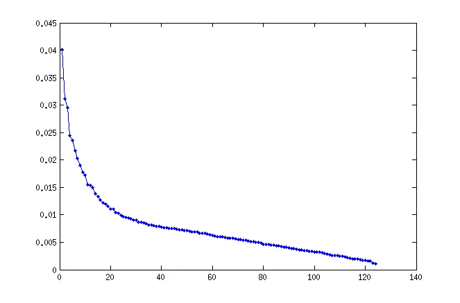

# PCA:特征值和向量计算

> 原文：<https://medium.datadriveninvestor.com/pca-eigenvalue-and-eigenvector-1a854cd6e186?source=collection_archive---------9----------------------->

## **PCA —计算特征值和特征向量&理解**

> PCA 代表主成分分析。它有助于降维或特征工程。

P CA 是机器学习中非常重要的概念。因为机器学习依赖于数据，而模型的成功也依赖于数据。在当今世界，我们有丰富的数据，我们不能直接将所有数据输入模型。拥有大量的独立列会变得很麻烦，并且可能是训练数据中的冗余特征。必须根据专家的建议或你对数据的了解来降低这些特征。主成分分析作为救助者从数据中学习，帮助我们在给定的数据中找到最重要的独立特征。简单来说，它将为我们提供整个数据的真实代表。这就像 MLA 由特定区域的公众投票代表整个区域。类似地，PCA 认为重要的特征告诉我们它代表了整个数据的多少%。让我们探索了解 PCA 的内部工作原理。

## 下面是特征值和特征向量的 2*2 矩阵的计算:

起始矩阵 A= {2，6} {13，9}

步骤 1 : Lamba I = Lambda 其中 I 是单位矩阵{1，0}{0，1}。所以λ乘以 I 得到{λ，0} {0，λ}

第二步:计算矩阵和λI 的减法，我们将得到:{ 2-λ，6} {13，9-λ}

步骤 3:计算步骤 2 的结式矩阵的行列式。我们将得到λ-11 Lambda+60 的平方

步骤 4:假设步骤 3 中的等式等于零，并计算λ的值。解上面的二次方程，我们会得到 Lambda = 15，-4。这两个值是给定矩阵的特征值。

步骤 5:需要计算相应特征值的特征向量。在步骤 2 等式中输入λ= 15。输出将是{-13，6} {13，6}

第六步:用 x 的平均值乘第五步矩阵，并认为它等于 0。因此，{-13，6}{13，6} * {x1，x2} = 0。对此进行计算，我们将得到等式:-13x1+6x2 =0

第七步:根据第六步的结果方程，我们可以得到 x1 = (6/13) x2。如果我们假设 x2=13，x1 就会变成 6。或者，取 x1 = 0.46 x2 为[6/13=0.46]。在这种情况下，x2 =1，x1 = 0.46。

因此，特征向量将是{6，13}或{0.46，1}。两者是一样的。类似地，保持λ=-4，重复从步骤 5 开始的步骤。结果将是另一个特征向量。这是求特征值和特征向量的 2*2 矩阵计算。

PCA Plot example— representing based on eigenvalues

PCA 是降维中臭名昭著的东西之一。另一种是奇异值分解降维。这里，我们了解了 PCA，以及它实际上是如何计算出特征值和特征向量的。主成分分析间接能够为你提供能够代表整个数据集的减少的维度。根据问题陈述或您的要求，选择维度的百分比可能会有所不同。当然，肘形曲线可以帮助你决定哪些维度可以代表数据集的最大百分比。我希望这将很好地概述 PCA 的工作，并使编码变得非常容易。**快乐学习编码！**