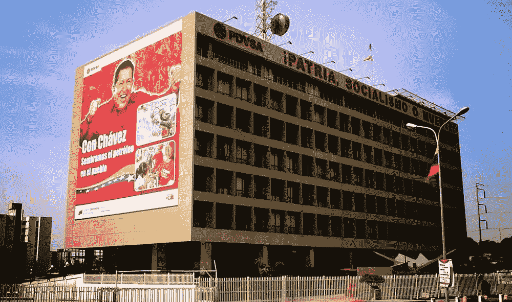

# PDVSA 不投资科技

> 原文：<https://medium.datadriveninvestor.com/pdvsa-not-investing-in-tech-924ed8ec206b?source=collection_archive---------19----------------------->

***作者延斯·埃里克·古尔德
日报员工***

***2005 年 6 月 1 日***

委内瑞拉国家石油公司(Petroleos de Venezuela)前总裁安德烈斯·索萨·皮耶特里(Andres Sosa Pietri)周三告诉委内瑞拉日报，委内瑞拉石油产量明显下降是因为缺乏投资来升级 PDVSA 的技术。Sosa Pietri 在一次电话采访中说:“不仅仅是委内瑞拉，世界其他地方的产量都在下降，这并不令我感到惊讶，因为我们没有进行必要的投资。”。他补充说，这种投资对于提高产量和维持产量都是必要的。
这位 PDVSA 前总统还表示，现任政府正在放弃增加委内瑞拉在全球石油市场份额的努力，这与索萨·皮耶特里(Sosa Pietri)表示他在担任公司总裁期间所奉行的政策形成鲜明对比。

 [## 另一场精心策划的全球经济危机正在逼近？如果我们的数据经济可以帮助它，就不会了-数据…

### 我们的 DApp 的开发，称为 DECENTR，目前正与我们的 R&D 同步进行，作为我们即将到来的…

www.datadriveninvestor.com](https://www.datadriveninvestor.com/2019/03/06/another-engineered-global-economic-crisis-looming-not-if-our-data-economy-can-help-it/) 

Sosa Pietri 的评论是在他周三早上出现在国民议会特别委员会面前之后发表的，该委员会的成立是为了调查与外国石油公司的经营协议和战略联盟。
索萨·皮耶特里说，PDVSA 前总统路易斯·久斯蒂、前能源和石油部长埃德温·阿里埃塔和温贝托·卡尔德龙·贝尔蒂原定出席，但他们没有收到委员会主席罗德里戈·卡贝萨斯发来的新闻稿，因此没有出席。
Sosa Pietri 还证实，他任职期间购买的炼油厂没有一笔是由 PDVSA 或委内瑞拉政府资助的。相反，比如说，Citgo refineries 公司的资金来自 PDVSA 公司在美国的炼油和销售子公司。
“40 亿美元离开这个国家是假的，”皮耶特里·索萨告诉委员会。"我们没有损害委内瑞拉石油公司或委内瑞拉国家的财务."他后来澄清说，委员会没有指控他使用国家资金。1992 年离开 PDVSA 任期的 Pietri Sosa 说，委员会找他是因为他的政府“试图改变石油政策”,增加国家在世界石油生产中的份额。他推动了 20 世纪 90 年代的“开放”时期，与外国石油公司签署了 32 项运营协议。他说，由于委内瑞拉拥有西半球最大的石油储藏——包括在法加德尔奥里诺科的重质原油——把这些石油留在地下是“完全荒谬的”他补充说，这个曾经生产超过伊朗和沙特阿拉伯总和的国家，不应该让中东国家进入它的市场。他说，如果委内瑞拉保持其市场份额——1957 年占世界石油的 15%——它现在每天可以生产 1100 万桶石油，而不是现在的 260 万桶。这位前总统拒绝对能源和石油部长拉斐尔·拉米雷斯最近的声明发表评论，称这些运营协议“本质上是反国家的”，可能是“非法的”国营的玻利瓦尔通讯社(ABN)报道，委内瑞拉石油委员会前主席 Hugo Hernandez Rafalli 周三告诉记者，“apertura”对委内瑞拉没有好处，因为外国公司不符合委内瑞拉的利益，并拒绝该国私营部门的参与。埃尔南德斯·拉法利说:“跨国公司来了，建了工厂，财富留给了其他国家，就业结束了。
Pietri Sosa 表示，他没有看到 Hernandez Rafalli 的评论，但公司有权在支付相关税款和版税后提取利润。“你做生意不是为了把资金投入黑洞，”Pietri Sosa 说。“你做生意是为了盈利。”
Pietri Sosa 还告诉委员会，他反对 2002 年末导致石油工业停顿的全国石油罢工，并努力阻止罢工。