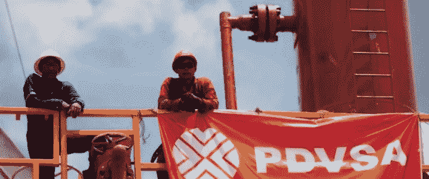

# PDVSA 产量之谜

> 原文：<https://medium.datadriveninvestor.com/pdvsa-output-mystery-d04fc9a9b146?source=collection_archive---------9----------------------->

这是我 2005 年为加拉加斯《每日日报》撰写的一系列转载文章的一部分。

**托罗·哈迪:“不是国际能源署就是政府在撒谎”**

**2005 年 5 月 9 日**

PDVSA 国家石油公司前董事会成员 José Toro Hardy 称，政府报告的石油产量比国际能源机构发布的报告高出 50%以上。

“要么是国际能源机构在撒谎，要么是政府在撒谎，”托罗·哈迪在接受《每日日报》的电话采访时说。

Toro Hardy 说，国际石油组织测得委内瑞拉 3 月份的石油日产量为 216 万桶，而政府称日产量为 330 万桶。

委内瑞拉总统乌戈查韦斯(Hugo Chávez)上周二承认，该国石油日产量较预期下降了 10 万桶。

本周，委内瑞拉人试图找出原因。

据委内瑞拉联合电台报道，反对党委内瑞拉工程党(Proyecto Venezuela)的代表 Vestalia Araujo 将于周二要求国民议会质询能源和石油部长拉斐尔·拉米雷斯(Rafael Ramírez)关于 PDVSA 违规和腐败的持续指控。

 [## 忘记石油吧，水是未来。-数据驱动型投资者

### 我们不会耗尽燃料的替代品。能源行业曾经是投资者的荣耀，无论…

www.datadriveninvestor.com](https://www.datadriveninvestor.com/2018/11/14/forget-about-oil-water-is-the-future/) 

副总统 José Vicente Rangel 周一表示,“国际和国内因素”正在渗透国家石油公司。

然而，国民议会能源和矿产委员会副主席 Julio Montoya 辩称，该公司存在违规和腐败行为，坚称 PDVSA 的实际收入与其报告的产量之间存在差距。

据联合电台报道，蒙托亚周一表示，如果石油行业的产量达到政府宣布的水平，委内瑞拉的国家预算将增加一倍。他说，这就是为什么政府想要利用委内瑞拉央行的国际储备。

“这不仅被证明和承认[PDVSA]生产的比他们说的少，而且也被证明他们接受来自 PDVSA 的美元，有超过 26 起腐败案件，226 起违规案件，PDVSA 没有解释，只是归咎于中央情报局。”

据国家玻利瓦尔通讯社(ABN)报道，副总统周一表示，“反国家因素”正试图渗透和破坏该国的石油生产。兰格尔没有具体说明这种威胁的来源。

兰格尔周一在西蒙·玻利瓦尔国际机场说，“委内瑞拉政府必须以明确和坚决的方式面对笼罩在国家石油行业头上的新威胁，该行业正试图利用不正当的机制来影响国家经济”。

兰格尔将这种威胁称为“第二次攻击”，将 2002 年的全国石油罢工称为第一次，并补充说，当前的威胁“可能不具有侵略性或相同的特征。”

查韦斯总统上周三表示，政府已经“发现”该国西部针对 PDVSA 的破坏活动，导致石油产量减少。尽管有传言说 PDVSA 总统拉斐尔·拉米雷斯可能会失去他的工作，查韦斯在周一表示了他对拉米雷斯的支持。

据美联社(Associated Press)报道，查韦斯周日表示:“这场运动的目标是试图给石油部长和 PDVSA 总统……以及目前正在紧张工作并得到我全力支持的 PDVSA 执行委员会蒙上阴影。”。

据联合电台报道，前国防部长劳尔·萨拉查周一表示，他不认为美国中央情报局是该行业问题的幕后黑手。他表示希望政府重组公司的管理层，而不是强调所谓的外部威胁。

“我们应该记住，石油行业是这个国家鸡蛋中的母鸡，国民经济和发展都围绕着它。因此，他们应该从管理和操作的角度努力思考、小心、考虑，并给予[PDVSA]能力。

据联合电台报道，蒙托亚说，他试图展示石油工业管理的“不合理性”。他提到了马拉开波湖 200 口油井的关闭和 Prisa 项目，该项目的钻探目前已经瘫痪。

蒙托亚说:“无政府状态如此严重，以至于他们无法掩盖他们在管理该行业方面的偏差。”。

Toro Hardy 说，官方产量数字很难确定，因为 PDVSA 多年来没有公布年度报告，也没有向美国证券交易委员会提交报告。