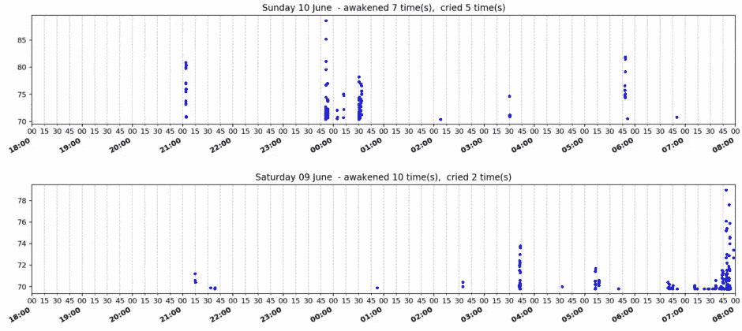
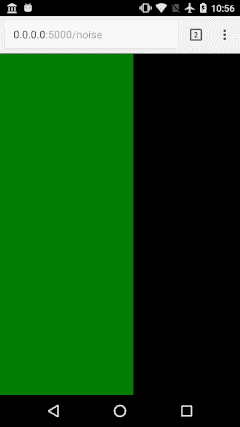
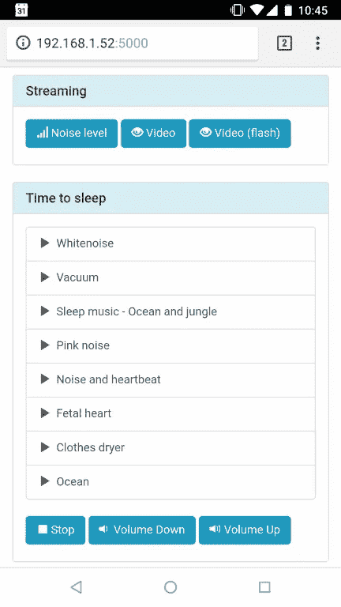
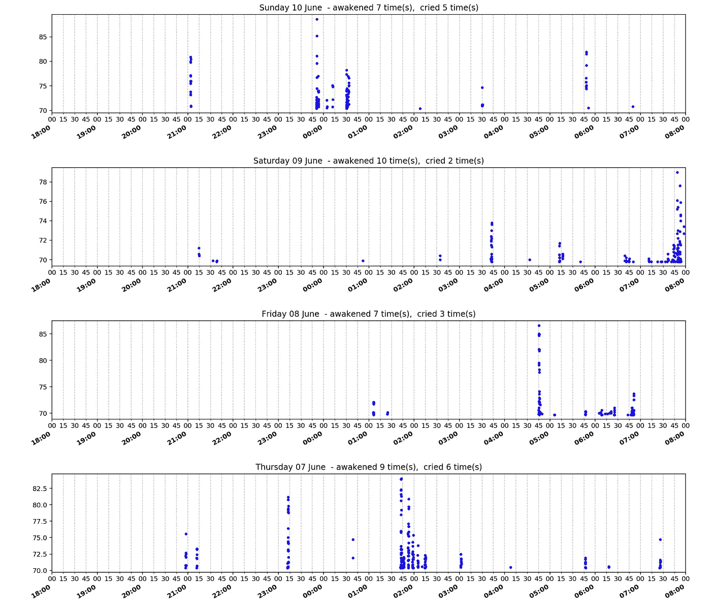

# 由于为人父母，窥视 Android 开发世界和机器学习

> 原文：<https://medium.datadriveninvestor.com/peeking-into-the-android-development-world-and-machine-learning-thanks-to-parenthood-10c4b6cef72?source=collection_archive---------6----------------------->



# 摘要

在这篇文章中，我将分享我的第一次 Android 开发经历，描述一些我一路走来的实用捷径。在机器学习方面，老实说，在我可以开始探索相关性和算法之前，我的项目就用完了预算(阅读:个人时间)，所以你不会在这里找到有趣的见解。尽管如此，最终我还是设法用 Jupyter 笔记本建立了一个数据处理管道，并且我证实了更有经验的人所说的:数据清理和准备 [*所需的投资不应该被低估！*](https://www.forbes.com/sites/gilpress/2016/03/23/data-preparation-most-time-consuming-least-enjoyable-data-science-task-survey-says) *。*

> *警告:这里的目标是分享我的经历和思考过程。你不会找到一个代码完整的 Github 回购。如果您仅对 Jupyter 管道感兴趣，请随意跳到最后一部分。*

# 背景历史

在我们第一个孩子出生前的几个月，我考虑买一个婴儿监视器，它有一系列非常特殊的要求:

**必备:**

*   声级监控。液位计应该非常明显，也就是说，即使我戴着耳机，没有直接看着主机，我也可以放在桌子上注意到它。
*   声音监控可根据房间内的噪音水平进行调节(例如，如果有背景白噪音)。

让我向您展示最终产品，解释我所寻求的体验:



Sound level monitoring as seen from the client unit

**希望拥有:**

*   相机流(不需要红外)。
*   播放录音的可能性(白噪音，最喜欢的摇篮曲等。).
*   主要功能可以远程触发。
*   一些收集关于醒来和哭泣事件的统计数据。理想情况下，用频谱分析来检测哭声，只记录那些时间段。

我审查的大多数专用婴儿监视器基本上是相同的，没有一个检查所有的标记。因此，我继续在移动应用领域进行搜索，认为手机硬件为这类应用提供了一个很好的平台。虽然手机确实不能提供夜视功能，但这并不是我所担心的(如果你真的真的需要它，有黑客可以获得它，例如，有些手机可以移除相机滤镜并添加红外 led)。

不幸的是，我很失望。我不是在责怪应用开发者。问题出在我身上:我有一套非常具体的要求，很难满足。

# 机器人跳水

所以，我决定一头扎进手机 app 开发的奇葩里。我选择 Android 是因为我熟悉 Java，并且我有一些旧的(但仍然相当不错的)Android 手机。因为我的时间投入相当有限，所以我简化了几件事:

*   我决定只编码最重要的需求:声音监控。如果这是一个成功，我会继续与其他功能。
*   我真的很想尝试 Kotlin，但为了最大限度地减少学习瓶颈，我还是选择了 Java。一步一步来。
*   我选择跳过任何与应用发布相关的东西，因为我会为自己开发一些东西，不必担心诸如生产与调试版本、遥测、谷歌应用商店规则等问题。
*   我针对的是单一设备:Moto G，Android 6.0。几年前我得到了这款手机，它的电池寿命和性能仍然让我惊叹。

免责声明:我将在这篇文章中分享一些代码，只是为了让你知道我做了什么。不要认为它已经可以生产了！我有意识地走捷径，因为我需要在创纪录的时间内为我自己建造这个。如果我必须专业地编写代码，有些事情我会做得不同。

# **故事 0:建筑与基础**

我选择将应用程序构建为 web 服务器，从而使用 HTTP 来显示信息和接收命令。这样，Android 手机将成为婴儿单元，而任何其他连接到我家 Wi-Fi 的具有浏览功能的设备都可能成为潜在的父母单元。下面的截图显示了成品:



Final UI as seen from clients

编码前的第一步是检查 Github 中的库管理列表，了解推荐的工具、框架和最佳实践:

*   在 Android 中，与我习惯的后端/服务开发工作相比，JAR 重量和兼容性非常重要。
*   我选择了[木材](https://github.com/JakeWharton/timber)伐木。
*   UI 的普通代码很难，所以有很好的框架来帮助你进行 UI 绑定。然而，我的应用程序没有在设备上使用 UI 的计划(只有后台服务所需的最低限度的实时通知，可能还有一两个启动/停止服务的按钮)。因此，我决定使用普通的 UI 代码。
*   遥测和监控:我最初的计划不包括它，但是编写一个 Timber 适配器将错误发送到 [Loggly](https://www.loggly.com/) 真的很简单，所以我这样做是为了在线跟踪任何错误(也有电子邮件提醒)。
*   [RxJava](https://github.com/ReactiveX/RxJava) :强烈推荐，尤其是处理 UI 和非 UI 线程之间的任务。我熟悉[项目反应堆](https://projectreactor.io/)(我强烈推荐)，所以我很想使用它。然而，我不确定我的应用程序的复杂性是否值得，所以我从普通代码开始，并决定不时地重新审视这个决定。

# **故事 1: Web 服务器选择**

这应该很简单，因为有很多很多的 web 框架，对吗？...错了…对于声音监控，我需要将数据从服务器传输到客户机，但是许多框架只支持简单的同步请求/响应模型。最初，Websockets 看起来是一个不错的选择，所以这缩小了研究范围。然而，在从事这项工作时，我意识到一种更老的技术更简单，更适合我的需要:[服务器端事件](https://developer.mozilla.org/en-US/docs/Web/API/Server-sent_events/Using_server-sent_events)。

# 故事 1b: SSE 和一个自定义的 HTTP 服务器代码来拯救。

我使用的浏览器本身就支持 SSE。不幸的是，我找不到一个既能支持 SSE 又能暴露低级抽象的 Android web 框架，我可以轻松地插入它来实现我所需要的。信不信由你，更简单的事情是在套接字上实现我自己的 HTTP 服务器。对于这个项目，我知道这是一个非常小且短命的个人应用程序，拥有一个简单的[行走骨架](http://wiki.c2.com/?WalkingSkeleton)很有意义，我可以尽快详细说明。

# 故事 2:声级监控和远程命令

事件流是通过发布者/订阅者模型完成的:一个线程处理从 `AudioRecorder`读取 PCM 数据并发布读取缓冲区中看到的最大值，而另一个线程监听这些值并将数据推送到 TCP 套接字。
在 UI 端，静态 HTML 只有一个 HTML5 米标签，使用了所有可用的屏幕空间。背景是黑色的，随着声音的增加，它将逐渐被绿色填充。超过某个阈值时，它将变为红色。还有一个滑块来调整灵敏度。

HTML 页面非常小:

*   内联 Javascript 用于订阅 SSE 事件流，并在每次收到事件时更新局部变量。
*   另一个函数计划每 200 毫秒运行一次，以选取最新的值，并使用 jQuery 在仪表 UI 元素上进行平滑转换。需要转场来避免突然的跳跃，并模拟实时流的感觉。
*   [NoSleep.js](https://github.com/richtr/NoSleep.js) 用于防止屏幕进入睡眠模式。

Sound meter source code

Server code streaming sound level to clients using SSE

# 故事 3:相机流

噪音监控效果很好，所以我冒险进入相机流。我天真地认为，HTML5 视频元素的最新进展与 Android 中强大的摄像头 API 相结合，可以让我用几行代码就能播放视频。不是真的。我不会详细介绍我研究过的所有东西，而是直接跳到我最终使用的东西。在你继续阅读之前，请注意:我的目标是最大限度地减少编码时间，根据需要权衡其他变量:我没有太多的时间做副业，而且我有一个非常艰难的最后期限！对我来说，因为这意味着在有大量未使用带宽的家庭 Wi-Fi 上运行，我有一个可以利用的优势。又一次，一项非常古老而简单的技术拯救了我们。

# 故事 3b:使用多部分/x 混合替换的摄像机流。

事实证明，只需将高清相机预览捕捉为 JPEG 图像，并使用“多部分/x-混合-替换”来替换每个静止图像，以尽可能快的速度将它们一个接一个地推送到 HTML 浏览器，这真的很简单。当然，这意味着带宽使用率高，帧速率低，但仍然非常有用。此外，如果您考虑到进行相机预览的代码大约有 100 行，而通过 TCP 通道推送这些字节的代码(也是手动处理 HTML 协议细节)只有大约 60 行……成本/收益比就变得非常有趣了。当我可以用超级便宜和简单的替代方案来实现目标时，我喜欢这样，我可以在以后用更高级的版本来切换，而不用重新架构整个项目。

*Capturing camera frames*

Sending frames to the web browser

# 故事 4:播放录音，远程触发。

下一个特性只需要添加代码来列出目录内容、查找 MP3 文件，并生成一个带有基本回放控制(音量增大/减小、开始、停止)的 HTML 引导页面。

# 故事 5:声音记录和哭泣模式数据分析。

我充满信心，决定采取最雄心勃勃的目标，这也将给我带来在机器学习和数据分析方面成长的乐趣。因为麦克风已经被使用了，如果有家长使用声音监控功能，我就不能开始录音。我通过升级噪声监控级别代码解决了这个问题:它不是通过`AudioRecord`处理原始 PCM 数据，而是使用`MediaRecorder`记录音频流。我选择了 AWR-WB 格式，因为它在压缩(这很重要，因为我计划保留几个月的数据)和只保留我感兴趣的声音频谱(例如，典型的婴儿哭声频谱，对更高或更低的频带不感兴趣)之间提供了一个很好的折衷。使用`recorder.getMaxAmplitude()`向任何 SSE 听众报告噪音水平。如果启用了后台记录，则流被保存到滚动的 3GPP 文件中。如果没有，就直接甩给`/dev/null`。

# 故事 5b:不愉快的惊喜…失败？

起初一切正常，但我开始遇到麻烦:当录音开始时，背景噪音播放突然停止。我尝试使用不同的播放应用程序来播放声音，而使用我的只是记录东西，但这也失败了。唯一稍微好一点的是 Google Play music，它设法检测到播放停止，并在几秒钟后继续播放，但只是有时。一些研究显示，其他拥有完全相同手机(Moto G 2014)的人抱怨背景音乐在内存压力下停止，可能是因为激进的进程调度或优先级。我仔细检查了我的应用程序是否做了“正确的”事情以避免被杀死(例如，持续通知、编码为服务等)。)，但问题还在继续。

# 故事 5c:更简单的版本

我回滚了更改，并下载了一个应用程序，只记录 CSV 文件中的音量。这消除了通过频谱分析进行哭闹检测的可能性，但是，考虑到我们的宝宝开始哭闹时的声音峰值相当高，识别相关数据点是很容易的。不幸的是，该应用程序后来被更新，增加了新奇的功能，尽管也是一个持久的服务，但它被积极地扼杀了(但不是我的应用程序，它更小)。因为它是开源的，我考虑过自己构建以前的版本，但最终，我只是在我的应用程序中编写了 CSV 记录功能，只需要向已发布的 PCM max 值流添加一个新订户。

# 故事六:数据分析，终于！

然后，我使用 Jupyter 笔记本建立了一个数据处理管道。数据通过 FTP(由另一个应用程序提供的服务器)提取、处理，并最终每天显示出来，以寻找模式:



我太害羞了，不敢分享我在最后期限的最后几天拼命写的幼稚代码…但我会分享一些决定，由于我在声音处理方面缺乏经验，我不完全确定这些决定是否正确，但仍然帮助我进步和学习:

*   录制视频的安卓手机和婴儿床之间的距离并不总是一样的。还有，有些晚上我们玩粉红噪音。这意味着数据需要标准化。解决方案:我已经把`pandas.DataFrame.quantile`和`q=0.995`一起用了。经过一些实验后，这个阈值被证明可以很准确地过滤噪声，只保留感兴趣的数据点。
*   为了计算醒来的时间，我需要一种方法来区分两个数据点何时属于同一哭泣期。我无法在固定窗口中划分时间，因为两个数据点非常接近，但在不同的窗口中，会被错误地处理为两个哭泣周期。我用这段代码解决了这个问题:

```
def compute_awaken_times(dataframe):
    df = dataframe.reset_index()
    # Compute time difference between rows 
    r = df.when.diff()
    # Transform to booleans, 
    # where True means more than 15' of separation between points.
    r = (r > pd.Timedelta('15 minutes'))
    # Coerce to int and sum (i.e. count the times 
    # we saw data points separated by more than 15')
    r = r.astype(int).cumsum()
    # Pick last value (final sum) and add one 
    # to include the initial period.
    r = r.iloc[-1] + 1
    return r
```

# 结束了

我最初的计划是用这个来探索喂食时间、当天吃的食物、午睡的数量和持续时间等可能的相关性。，因为我在另一个支持 CSV 导出的 Android 应用程序中跟踪了所有这些数据。所有这些，都是为了回答一个非常重要的问题:

> 我们能做些什么来减少夜间醒来的次数，并获得更多的睡眠？…

***我找到答案了吗？….***

…不。一个不断学习、适应、改变的婴儿不是一个稳定的测试对象。[好奇周](https://www.thewonderweeks.com/)，长牙，感冒，习惯固体食物等。举例来说，有些事件(有些是完全不可预测的)会打扰宝宝的休息，因此会弄乱您的数据。说实话，我事先就知道这些，但还是想有个理由(读作:借口)去学点安卓、机器学习、数据分析、Python 的东西。不幸的是，一旦数据处理完成，我得到了漂亮的工作图，我从事辅助项目的时间就大大减少了，我停止了对机器学习的投资，就在真正的乐趣即将开始的时候。然而，由于这个倡议，我买了很多书(超过十本！).如果你想要一个推荐，[用 Scikit-Learn 和 TensorFlow](https://www.amazon.com/dp/B06XNKV5TS/ref=pe_385040_118058080_TE_M1DP) 进行机器学习是目前为止最好的一个。

我相信未来会给机器学习带来更多的成长机会。