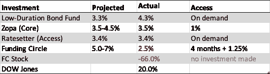
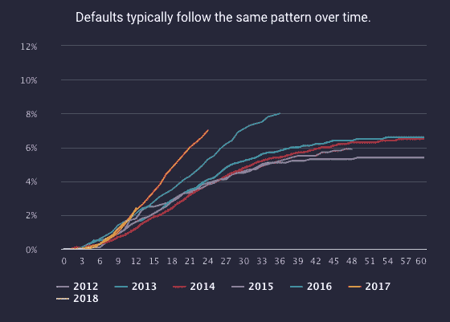
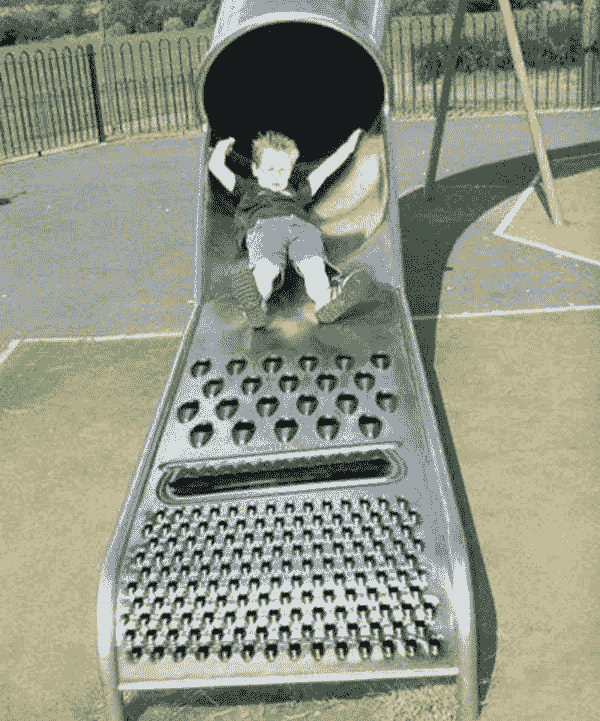

# 同行 2 同行贷款融资圈继续令人失望

> 原文：<https://medium.datadriveninvestor.com/peer-2-peer-lender-funding-circle-continues-to-disappoint-563da6092e0?source=collection_archive---------0----------------------->

贷方的加州旅馆有一项工作要做——信用评分。有多难？

© 2019 Russell Anderson

原第 19 条 2019 年 11 月。

【2020 年 4 月 9 日更新:自最初发布以来，FC 的股票又下跌了令人瞠目的 70%。FC 暂停了他们的二级市场，进一步惩罚了现有投资者。

我们大多数人都对银行账户的实际净负利率感到沮丧。在最近良性的经济环境中，一个安全的存钱方式*是*个人对个人的借贷。在主要的 P2P 贷款机构中，资金圈脱颖而出，但不是一种好的方式。它有最高的预计回报和最低的*实际*回报(表 1)。在最温和的经济衰退下，明年的回报率很容易变成负数。FC 贷款的二级市场已经枯竭，其股价也大幅下跌。因此，把你的钱从资金圈里拿出来几乎是不可能的。如果你已经投资了 Funding Circle，感觉自己在布莱顿买了一套分时度假的房子，你并不孤单。

Table 1: Not the worst investment in 2019 (YTD), but close. The authors’ investment returns in his “Low-Risk” portfolio, which did not include Funding Circle stock… fortunately.

**信用风险【误】管理**

信用风险不是火箭科学。统计信用评分可以追溯到 20 世纪 60 年代。事实上，在国防工业之外，它是数据科学早期成功的教科书范例。诚然，商业风险比消费者风险复杂得多，只有少数金融服务公司在这方面表现出色。小企业的基本面和财务模型是高度多样化的(例如，将维修服务与零售杂货店进行对比)。影响业务绩效的因素包括竞争、需求甚至天气。市场的新进入者处于明显的劣势，因为他们缺乏建立高性能风险模型所需的历史贷款量和性能历史。

可以说，金融危机不是银行不知道如何对贷款进行评分的结果，而是前所未有地转向不良信贷政策(忍者贷款，房地产市场高峰期零首付，等等)。)，被毫无头绪的二级市场搞得不知所措。融资圈再次上演了似曾相识的一幕，其坏账率在过去两年翻了一番(图 1)。他们有很多借口，包括英国退出欧盟。

**Figure 1: Deja vu, all over again.** Funding Circle default rates doubled in 2 years (Updated 5 March 2020)

对于这种突然的性能下降有几种可能的解释。第一直觉是责怪预测模型。然而，模型退化不太可能，因为信用风险评分的关键驱动因素往往随着时间的推移而相当稳定。(如前所述，模型质量可能存在问题。)第二种解释(FC 的最爱)是外部环境的变化，比如经济衰退或英国退出欧盟。同样，这不太可能，因为没有一家竞争的 P2P 贷款机构经历过“2016-2018 年英国衰退”。FC 解释说，他们 2016 年的贷款经历了“逆风”将不得不发明新的隐喻来解释它们在 2017 年和 2018 年的表现(海啸？).另一种解释有点深奥。高达 20%的信贷损失可能是第一方欺诈(CIFAS)，这种欺诈直接通过催收来核销。简单的信用风险模型通常对“爆发式”欺诈或信用滥用视而不见，欺诈者有一种找到并锁定不老练的贷款人的神秘本领。但是，最简单和最有可能的解释是，FC 在 2016 年左右对*信贷政策*进行了重大调整——要么改变向高风险申请人发放贷款的组合，要么改变各种贷款的风险阈值，以在 IPO 之前增加贷款量。

 [## 算法交易的机器学习|数据驱动的投资者

### 当你的一个朋友在脸书上传你的新海滩照，平台建议给你的脸加上标签，这是…

www.datadriveninvestor.com](https://www.datadriveninvestor.com/2019/01/30/machine-learning-for-stock-market-investing/) 

其他令人困惑的问题也可能在起作用。FC 有部分透明度，包括一个令人困惑的电子表格，当贷款变坏时，它会删除原始信用评分。我的贷款有 40%被“降级”或违约；都没有升级。可能，他们不监控信贷质量。其结果是“不良消耗”，即随着企业建立更好的信用，良好的贷款提前还清。

**客服**

我的经历远非独一无二。Funding Circle 的 Trustpilot 评分为 4.1 星，但这是一个多年平均值，主要针对借款人，而不是贷款人。一个“四”听起来不坏，但它大大低于他们更成熟和稳定的竞争对手 Zopa (4.9)和 RateSetter (4.7)。借款人的一个审查特点:*容易，非官僚。拿了钱就跑。5 颗星。”*出借人点评特征:“*我已经投了资金圈，出不去了！:( !*”

就其本身而言，Funding Circle 勤奋地用客服 bromides 回复每一个负面评论(“我们感谢你的关注……”和“我们承认无法快速获得资金可能会让投资者感到沮丧”)，迂腐的不回答(“出售贷款的时间将因供求而异”)，以及嘲讽不相关的问题(“2019 年获得的贷款预计回报率为 5-7%”)。我在 Trustpilot 上找不到任何声称回报率为 4%的贷款人评论，这让我的故事成为仅有的“成功”故事之一。

**Figure 2: Funding Circle’s process for selling off loans: 1\. Push button 2\. Wait 120–140 days 3\. Watch the losses pile up 4\. Pay FC 1.25% to take it off your hands**

**展望**

出售融资圈贷款的等待期现在是 140 天，每天增加 1 天，因为他们的债务没有买家[1，2]。我是幸运者之一，在过去的 6 个月里，我减持了 50%的股份。2019 年 12 月 2 日，Funding Circle 推出了一项新的“计划”，贷款人可以以 1.25%的折扣出售贷款部分，这在一定程度上提高了提款率。这意味着人们可能期望在一两年内收回 98.75%的 T2 非违约贷款。*晨星*似乎嘲笑 FC 贷款人的这一惨败(“资金圈**业余贷款人**面临更长的等待套现”[1])。FC 坚持说，由于去年的首次公开募股，它是有偿付能力的，而且资本非常充足。提供这笔资金的不幸投资者眼睁睁地看着自己的股票下跌超过 75%，跌至 80 便士[2，3]。总的来说，1.25%的回报率可能是你在融资圈里能做的最好的投资。这让你想知道谁是这里的“业余爱好者”。

*Russell Anderson(交易分析咨询总监)在金融服务、零售和电子商务行业开发数据科学解决方案方面拥有超过 25 年的经验。2005 年至 2008 年，他担任 HBOS 零售决策科学主管。他还曾担任多家著名分析公司的科学顾问，包括 IBM、KPMG、Opera Solutions、Tesco Bank、HCL、HNC Software、Mastercard Europe、JP Morgan Chase 和 Lloyds Banking Group。他拥有加州大学生物工程博士学位，发表了 30 多篇科学论文，并拥有多项商业预测解决方案专利。*

欢迎提问/评论:anderson.transactionanalytics@outlook.com

更多讨论可以在 P2P 论坛中找到:

 [## 首页| P2P 独立论坛

### 免责声明本论坛与任何监管机构或行业团体无关。内含物、位置或…

p2pindependentforum.com](http://p2pindependentforum.com/) 

[1]资金圈业余放贷者面临更长时间的套现等待。*晨星*，2019 年 9 月 3 日

 [## 资金圈业余放贷者面临更长时间等待套现

### 欢迎来到新 morningstar.co.uk！了解更多变化以及我们的新功能如何帮助您的投资…

www.morningstar.co.uk](https://www.morningstar.co.uk/uk/news/AN_1567515223928004100/funding-circle-amateur-lenders-facing-longer-waits-to-cash-out.aspx) 

[2]Nicolas Megaw，资金圈寻求缓解对撤军延迟的担忧。*金融时报*，2019 年 10 月 11 日

[3]克里斯·休斯(2020 年 1 月)。伦敦最差 IPO 奖有了新的竞争者。彭博。[https://finance . Yahoo . com/news/londons-worst-IPO-award-竞争者-125705422.html](https://finance.yahoo.com/news/londons-worst-ipo-award-contender-125705422.html)