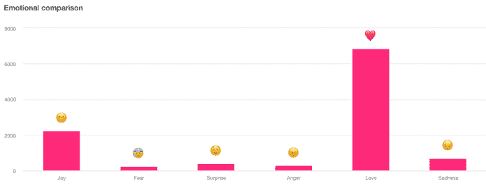
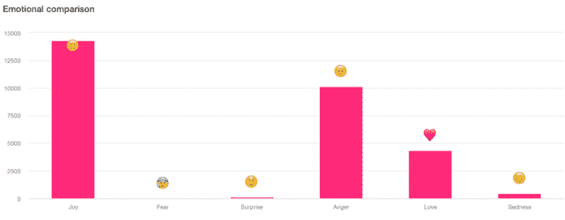
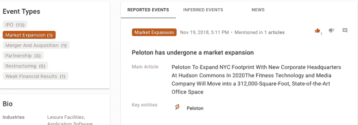
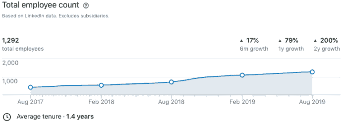
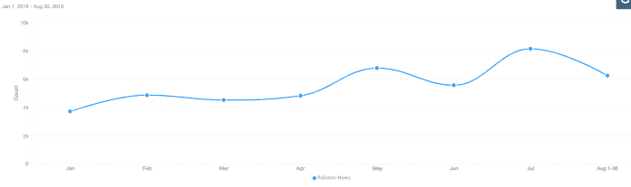

# Peloton IPO:投资者应该考虑的一些因素

> 原文：<https://medium.datadriveninvestor.com/peloton-ipo-some-factors-investors-should-consider-3a123fe5d01c?source=collection_archive---------16----------------------->

8 月下旬，联网自行车和跑步机公司 Peloton——被称为“运动界的网飞”——提交了上市文件。

他们的商业模式基于硬件销售和持续订阅的结合:他们的社区成员一次性购买 2220 美元到 4295 美元的自行车或跑步机，然后每月支付 39 美元访问其直播和点播内容库。

 [## 分散金融的出现|数据驱动的投资者

### 当前的全球金融体系为拥有资源、知识和财富的人创造了巨大的财富

www.datadriveninvestor.com](https://www.datadriveninvestor.com/2019/03/14/the-emergence-of-decentralized-finance/) 

据该公司首席执行官约翰·福利(John Foley)称，“Peloton 出售快乐”——亏本出售。

Peloton 报告 2019 财年总收入为 9.15 亿美元，比上年增长 110%。然而，其 2019 年的亏损为 2.457 亿美元，大大高于上一年报告的 4790 万美元的亏损。

# 那么 Peloton 股票是一个好的投资吗？

Meltwater 的数据显示了 Peloton 在 IPO 之前的一些积极迹象，也标志着投资者应该注意的一些潜在问题。

# 快乐的感觉

从人们在社交媒体上使用的语言来看，人们对 Peloton 品牌感觉很好。

Meltwater 对脸书、Twitter、Instagram、博客、论坛、评论和文章评论中提到 Peloton 的社交媒体进行了 90 天的“情绪比较”分析，结果非常积极:

大多数帖子包含“爱”这样的词，很少有人表示愤怒或失望。

相比之下，奢侈健身品牌 Equinox 在过去三个月中引发了复杂的感受:

许多用户在他们的帖子中包含愤怒的语言，以回应 Equinox 的董事长[为唐纳德·特朗普举办了](https://www.datadriveninvestor.com/glossary/hosting/)场奢华的筹款活动，这导致人们呼吁抵制该公司的豪华健身房。

人们喜欢 Peloton 这个品牌，这一点很重要。他们能卖的 2000 美元的自行车就这么多。他们长期成功的秘诀是留住他们数字内容的订户，这样他们获得的每个新客户都会随着时间的推移继续为公司带来收入。

所以“销售快乐”这件事实际上非常重要——如果他们的顾客保持快乐，那么他们的长期收入就有保障。

# 早期积极指标

甚至在 Peloton 公布他们的数据之前，从[的替代数据](https://www.datadriveninvestor.com/alternative-data/)中可以清楚地看到，他们正在经历增长。

Meltwater 的 [Signals](https://fairhair.ai/solutions/signals) 工具使用[机器学习](https://www.datadriveninvestor.com/glossary/machine-learning/)算法来寻找在线数据中的领先指标，该工具在 11 月份的一份新闻稿中指出，Peloton 正在搬进一个更大的办公空间，这表明员工人数有所增加:

LinkedIn 的数据证实了这一点，该数据显示 Peloton 的员工数量同比大幅增长:

另一个表明真正积极势头的事实是，自 2019 年初以来，Meltwater 对该公司的压力稳步增加。

# 那么有什么问题呢？

融水的[信号](https://fairhair.ai/solutions/signals)产品旨在找到“大海捞针”，并标记出一两篇从投资角度来看可能很重要的文章。

以下是算法强调的三个有问题的信号:

*诉讼*——Peloton 因非法播放音乐被[起诉](https://www.cnbc.com/2019/03/19/peloton-hit-with-150-million-suit-for-using-songs-by-drake-lady-gaga.html)。这可能会成为一个大问题。当该公司试图使用翻唱歌曲而不是原创歌曲进行训练时，Peloton 社区成员并不高兴。如果 Peloton 不能找到合法使用原创音乐的方法，它就有可能失去重要的长期订户，或者在已经不断增加的损失上增加巨额罚款。

*供应链风险* — Signals 标记了这篇[文章](https://qz.com/1696870/pelotons-ipo-filing-is-a-roundup-of-every-risky-tech-startup-trend/)，这篇文章清晰地解释了 Peloton 的供应链风险。从本质上来说，该公司还没有大到足以拥有苹果或谷歌对其供应商的议价能力，上市后可能很难生产出合适数量的自行车和跑步机。

*ESG 关注(高管薪酬)* — Peloton 似乎[向两位高管支付了相当多的薪酬](https://www.businessinsider.com/poleton-ceo-john-foley-pay-salary-2019-8?r=US&IR=T)(显然是 2140 万美元)。投资者应该看看 Peloton 的竞争对手，看看这在他们的行业中是否正常——如果不是，这可能是治理不善的迹象。

# Peloton 损失这么多钱是怎么回事？

这本身并不一定是一个问题。

硅谷有公司在盈利前上市的先例——例如，脸书和亚马逊在建立市场主导地位时亏损多年。

这个想法是，你让人们上瘾，然后一旦你有了忠实的客户群，你就可以通过引入广告或亚马逊 Prime 这样的优质服务来赚钱。

这并不总是有效的。优步一直表示，它的目标是变得像水一样不可或缺，然后它将开始向人们收取更多或更少的司机工资，以实现盈利。当你经历了几年糟糕的公关后，这个计划会适得其反，人们会觉得不够忠诚而不会转向更便宜的竞争对手。

因此，也许 Peloton 的问题如下:该公司是脸书还是亚马逊，有潜力建立如此忠诚的追随者，以至于其客户愿意支付 4000 美元而不是 2000 美元，或 100 美元/月而不是 39 美元/月的自行车？

很有可能。

爱 Peloton 的人真的真的爱 Peloton。例如，梅尔沃特公司 Fairhair 的执行董事 Leor Distenfeld。 [ai](https://www.datadriveninvestor.com/glossary/artificial-intelligence/) ，是一个产品迷。她觉得教练很棒，自行车质量很好，她喜欢有无穷无尽的内容这一事实。她说，你可以像去上课一样得到很好的和激励性的锻炼，但只需要一半的时间，而且没有交通和停车的麻烦。

实际上，该公司的目标高端客户可能比每月 39 美元付出更多，特别是如果这项服务取代了健身房会员的费用。

只要 Peloton 解决其音乐许可问题，并设法避免重大公关丑闻，该公司及其投资者就可以一帆风顺。