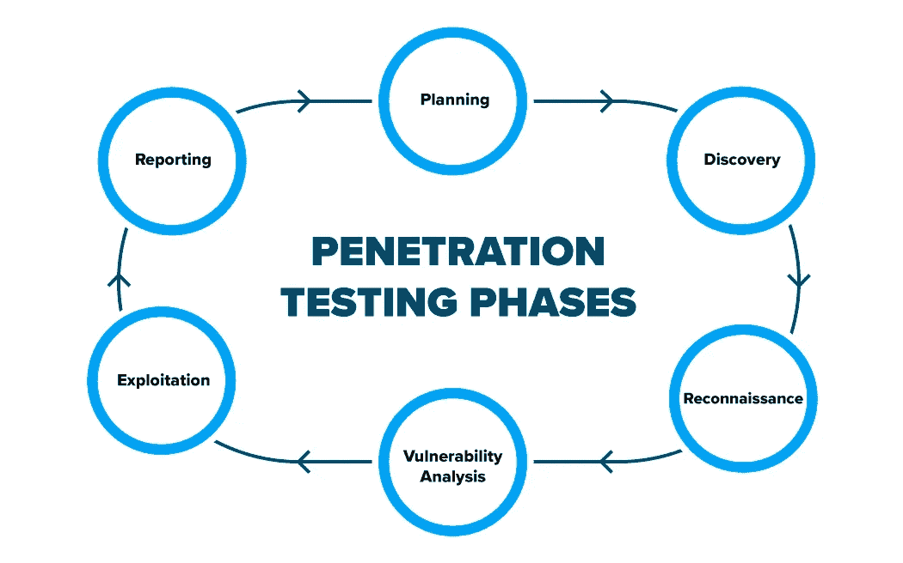

# 渗透测试:从黑客的天堂拯救你的企业

> 原文：<https://medium.datadriveninvestor.com/penetration-testing-save-your-business-from-a-hackers-paradise-cygnet-e283852cc807?source=collection_archive---------2----------------------->

**数据泄露浪潮继续摧毁着世界各地的企业。**

[T-Mobile](https://techcrunch.com/2019/11/22/more-than-1-million-t-mobile-customers-exposed-by-breach/) ，总部位于美国，是世界上最大的无线网络运营商之一，经历了一次大规模数据泄露，影响了其 100 多万客户。他们的个人数据暴露给了一个恶意的行为者。此次入侵是由于未经授权访问系统以获取客户个人信息造成的。

这给所有企业敲响了警钟，促使他们将[网络安全作为他们的最高优先级](https://www.cygnet-infotech.com/blog/4-ways-emerging-technologies-are-transforming-cyber-security)。原因是应用程序或系统通过脆弱的网络连接，加密和认证中的缺陷，以及网站污损增加了网络攻击的范围。

**然而，这个百万美元的问题是:**

我们是否采取了足够的预防措施来保护我们的知识产权和敏感数据？

需要解决日益增长的安全漏洞和恶意攻击的可能性，以确保您的应用程序是安全的。企业必须保护其复杂的 IT 环境，同时确保产品和服务的高质量交付。这就是漏洞评估和渗透测试(VAPT)的用武之地。

**VAPT —应对新时代的安全测试挑战**

漏洞评估是寻找一扇未上锁的门的艺术。它有助于根据一段时间内的严重程度来识别和分配尽可能多的安全缺陷的严重程度。漏洞评估为企业提供了关于其环境中被忽略的漏洞的知识，以便他们能够制定及时的风险缓解策略。

 [## 数据科学和软件工程哪个更有前途？数据驱动的投资者

### 大约一个月前，当我坐在咖啡馆里为一个客户开发网站时，我发现了这个女人…

www.datadriveninvestor.com](https://www.datadriveninvestor.com/2019/01/23/which-is-more-promising-data-science-or-software-engineering/) 

渗透测试遵循彻底的漏洞评估。它涉及对 It 应用程序、操作系统、服务器、URL 等的主动和被动分析。识别和利用安全漏洞。

渗透测试的目的有两个:首先，识别和利用网络和应用程序中的缺点和漏洞。第二，它应提供补救建议和指导，以减少此类缺陷的影响。

**渗透测试是一个“盒子聪明”**

渗透测试有三种主要方法:白盒、黑盒和灰盒。

**小天鹅的渗透测试方法**

我们使用六阶段方法执行渗透测试，如下所述。

**发现**

1.  这是使用各种技术和非技术手段识别目标企业及其系统信息的实际过程。进一步分类为:

**足迹阶段**:渗透测试人员利用这一阶段识别各种漏洞，探索相关信息的各个可能方面，如 IT 设置详情、设备配置、搜索互联网、查询各种公共存储库(whois 数据库、域名注册商、邮件列表等。)可能泄露目标企业的详细信息。
通过使用 RPA 编写定制脚本或开发软件机器人来自动搜索信息，上述许多程序都可以实现自动化，而无需手动操作。

*   **扫描和枚举阶段:**该阶段包括识别活动系统、发现的开放/过滤端口、在这些端口上运行的服务、映射路由器/防火墙规则、识别操作系统细节、网络路径发现等。对目标系统进行大量主动探测。

**举报**

在此阶段，将记录在上述步骤中执行的整个活动，以确保目标企业了解其当前服务器/应用程序/配置/网络中可能影响其整体业务的技术和安全风险的所有方面。

报告包含的必要内容有:

*   行动纲要
*   详细调查结果
*   使用的工具和方法
*   发现的漏洞的风险级别
*   业务影响
*   补救步骤
*   结论

**VAPT 是安全测试的标准**

漏洞和渗透测试正以闪电般的速度赶上全球企业。这两个重要的测试提供了威胁的整体视图，同时锁定了漏洞的范围。

**避免授权访问**

测试您当前的安全状态可以在受控的情况下暴露安全漏洞。它让您清楚地了解您在威胁环境中所处的位置，并在黑客利用它们之前有效地解决问题。

**受控基础设施**

随着技术的进步和业务需求的增长，技术基础设施变得越来越复杂。您可能会发现很难管理分布式系统架构，或者可能无法确保安全检查以正确的方式实现。VAPT 可以帮助您测试您的安全安排，并确定改进措施。

**监控下的安全**

渗透测试是测试您的安全实现的理想方式，它让您了解几乎所有的技术安全弱点，并为您提供克服这些弱点的信息和解决方案。

**扎实的风险管理**

每个渗透测试可以解决您的业务风险，允许确定实施新技术、完整性和推出新的基于 web 的业务服务的安全影响。

**保护您的业务**

渗透测试可能会对你的品牌声誉和财务影响产生巨大的潜在影响。它可以大大降低数据泄露的风险，提高安全性，从而保护您的企业和客户的信心。

有效的渗透测试需要努力保护系统和避免 IT 基础设施入侵。我们实施灵活的自动化测试方法来优化安全性和最大化应用程序性能。今天就致电+1–609–245–0971 或 inquiry@cygnetinfotech.com[与小天鹅的专家取得联系，了解更多信息。](mailto:inquiry@cygnetinfotech.com)

***原载于***[***https://www.cygnet-infotech.com***](https://www.cygnet-infotech.com/blog/penetration-testing-save-your-business-from-hackers-paradise)***。***