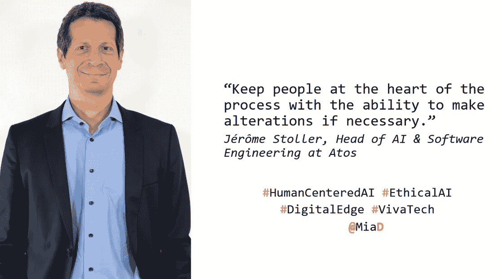
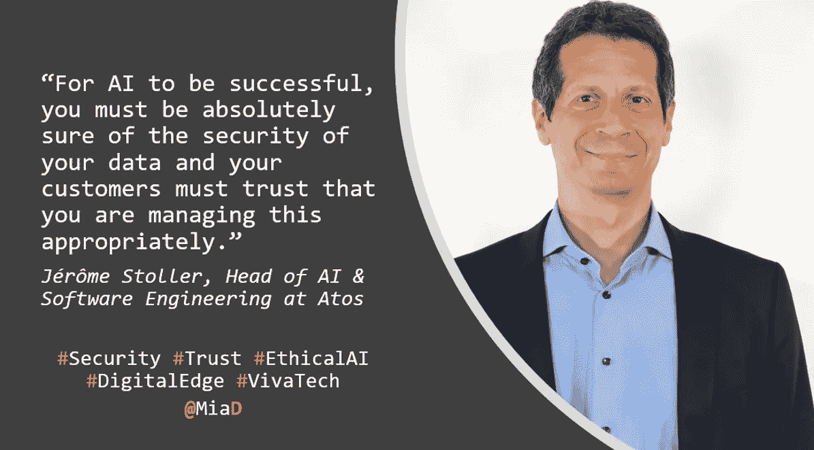

# 人应该是人工智能设计过程的核心

> 原文：<https://medium.datadriveninvestor.com/people-should-be-at-the-heart-of-ai-design-process-93b6903a5227?source=collection_archive---------5----------------------->

Source: Atos

在最近的一篇帖子中，我[分享了](https://becominghuman.ai/coeforethicalai-81f6476cb282)为什么大公司为了跟上人工智能创新的步伐而采取大胆的方法来实现道德人工智能是一项战略要务。这是一系列关于企业人工智能(AI)的文章中的第二篇，它深入研究了全球公司目前如何将道德整合到他们的人工智能项目、流程、产品、基础设施甚至文化中。

[以下是链接到 [**博客文章#1**](https://medium.com/p/68b735728d53) [**“欢迎来到道德消费者时代”**](https://medium.com/@miad/welcome-to-the-age-of-the-ethical-consumer-68b735728d53) ，以防你错过]

我利用受邀参加在巴黎与 viva tech 同处一地的 Atos technology days 的机会，采访了 Atos 人工智能软件工程主管杰罗姆·斯托勒(jérme Stoller)，了解人工智能采用的障碍，更重要的是，伦理如何才能跟上人工智能的加速采用？

 [## 模式和机器人:一个复杂的现实数据驱动的投资者

### 哈耶克的名著《复杂现象理论》(哈耶克，1964)深入探讨了复杂性的话题，并断言…

www.datadriveninvestor.com](https://www.datadriveninvestor.com/2019/03/04/patterns-and-robotics-a-complex-reality/) 

随着全球公司竞相采用人工智能，他们必须停下来考虑人工智能的目标。斯托勒警告说，不要让算法偏见渗入他们的人工智能系统，确保一开始的多样性将防止道德盲点。他强调，人是人工智能设计过程中不可或缺的一部分，可以确保系统不会有偏见。

下面是我们问答的更多内容。

**Mia Dand:什么是认知数据中心？**

杰罗姆·斯托勒:认知数据中心是一种工具，旨在提高数据中心的整体效率。它构建了数据中心“正常”行为的模型，然后根据对 It 设备和机器数据的实时分析，能够预测潜在的问题。这意味着您可以防患于未然，从而提高性能并减少停机时间。

认知数据中心接收来自网络、存储、服务器、应用、冷却和能耗的数据。它实时分析所有事件，显示带有预测的重要图表，并与置信度评级相关联，显示数据中心的潜在停机和受影响元素。

MD:在企业中采用人工智能有哪些障碍？

**JS:** 为了让人工智能获得成功，我们认为你需要具备四个关键要素。第一个是商业案例——你希望人工智能解决什么问题？第二是数据的可用性——没有数据，人工智能就无法工作，你需要确保可访问、可操作的数据(具有足够的深度和历史)可用。然后，当然，你需要有相关的基础设施，有足够的计算能力。第四是安全性—您必须绝对确定您的数据的安全性，并且您的客户必须相信您对此管理得当。这些都不是不可克服的，但它们都是成功采用人工智能的必要条件。

**MD:量子计算将如何改变 HPC(高性能计算)？**

我们相信量子计算不会取代今天的计算机。相反，当该技术可用时，我们确信它将被用作加速器，用于一些特定的工作负载，符合量子加速的条件。就像 GPU 或 FPGAs 已经是一些工作负载的加速器一样，通用 CPU 相比之下处理起来很慢。

**MD:公司应该如何将伦理融入到加速采用人工智能的过程中？**

他们必须做的第一件事是准确理解他们希望人工智能做什么，以及他们希望它解决的问题。这必须是具体的和确定的。这样，他们也会理解其更广泛的影响。他们必须小心翼翼地构建不带偏见的算法，这意味着在设计阶段要考虑多样性。他们还必须确保人在人工智能的运行中发挥核心作用，并在必要时让人们处于过程的核心，并有能力做出改变。

就这样。

请继续关注，我将继续穿过所有的宣传和行话，为您带来企业公司如何确保人工智能在他们的组织中得到道德部署的内幕消息。给我发推特 [@MiaD](https://twitter.com/miad) 或者在下面留下评论，因为我很想听听你们的人工智能试验和磨难！

**关于作者:**

Mia Dand 是一名战略数字营销领导者和热情的技术多样性倡导者，在为谷歌、惠普、易贝、赛门铁克等全球公司构建以客户为中心的项目方面拥有丰富的经验。Mia 的独特专长是在业务、数据、治理和技术的关键交叉领域领导复杂的跨职能项目。作为 Lighthouse3 的首席执行官，Mia 擅长识别关键的行业趋势，并指导 5000 强公司负责任地采用新的&新兴技术，如人工智能，以取得成功的业务成果。Mia 还是《人工智能伦理中的 100 位杰出女性》**的作者，这是一份权威指南，旨在帮助全球组织招募更多有才华的女性，并在这一领域赋予更多不同的声音。你可以在*[***Twitter***](https://twitter.com/MiaD)*或者*[***LinkedIn***](https://www.linkedin.com/in/miadand/)*上和她联系。**