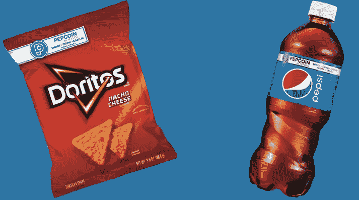

# 百事可乐币不是密码

> 原文：<https://medium.datadriveninvestor.com/pepsicoin-is-not-a-crypto-6ee02e036d9a?source=collection_archive---------12----------------------->

Source: Pepsi

总部位于美国的食品、零食和饮料品牌百事可乐推出了 PepCoin。所谓的“硬币”使其消费者在购买零食和饮料时能够获得 10%的返现。虽然这个名字和标志看起来像是试图赶上加密货币的潮流，但 PepCoin 与此无关。这只是一个返现忠诚度计划，使用 [Venmo](https://venmo.com/) 和 [PayPal](https://www.paypal.com/us/home) 为购买百事产品的移动用户提供奖励。

为了获得现金回馈，消费者扫描饮料瓶或零食袋顶部盖子上的代码，PepCoins 就会被添加到他们的帐户中。当金额达到 2.00 美元时，消费者可以通过 Venmo 或 PayPal 帐户消费。百事可乐声称，人们购买 60 多种饮料和小吃可以获得奖励，包括奇多、激浪、Aquafina、Doritos 和荷叶边。然而，如果消费者在 120 天内没有通过扫描产品来充值，那么他们将被收费。一个人每天可以扫描的商品数量也有限制——三种饮料和三种零食，但这是一种“sop ”,以避免对百事鼓励人们食用和饮用其咸/含糖产品的批评吗？

 [## Azbit 旨在连接传统金融和加密货币|数据驱动的投资者

### Azbit 是下一个提供交易平台的加密项目，该平台提供保证金和算法交易。一样多…

www.datadriveninvestor.com](https://www.datadriveninvestor.com/2019/03/20/azbit-aims-to-connect-traditional-finance-and-cryptocurrency/) 

看看其他品牌是否会像 PepsiCoin 一样发布数字忠诚度计划，或者他们会决定使用区块链技术并发布加密货币，这将是一件有趣的事情。如果要避免脸书和其他数据收集技术巨头所面临的挑战，百事可乐还需要确保其收集的关于消费者的任何有价值的数据都是安全的。

理想情况下，奖励计划需要有一定程度的互操作性，即能够与其他公司的奖励计划结合使用。否则，消费者将积累大量无意义的低价值数字硬币，因此没有动力购买奖励计划发行者鼓励他们购买的产品。