# 感知机学习模型

> 原文：<https://medium.datadriveninvestor.com/perceptron-learning-model-5918dd2ddbd9?source=collection_archive---------6----------------------->

这篇文章将讨论由[明斯基和 Papert](http://science.sciencemag.org/content/165/3895/780) 在 1969 年提出的著名的*感知器神经元*。这是我之前关于 [MP 神经元模型](https://medium.com/@narmadhahandi/mcculloch-pitts-neuron-first-computational-model-of-a-biological-neuron-c08c85b74997)的帖子的后续。这里对感知器模型的研究将与 MP 神经元进行比较，以了解它如何优于 MP 神经元，以及感知器模型本身的局限性。

首先，我们将快速回顾一下 MP neuron 的问题是什么，感知器是否解决了 MP neuron 的所有限制，以及感知器的元素如何适应与我之前的文章[相关的“机器学习的罐子”,那么，什么是机器学习？](https://medium.com/@narmadhahandi/so-what-is-machine-learning-fbcf525c3f2c)”

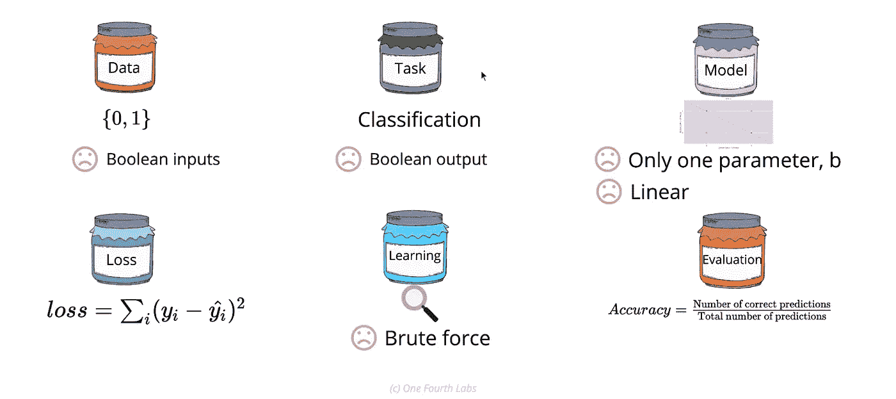

Limitations of MP Neuron model

我们可以从上图中看到悲伤的笑脸，MP 神经元模型的局限性。感知器克服了一些限制，但不是全部。

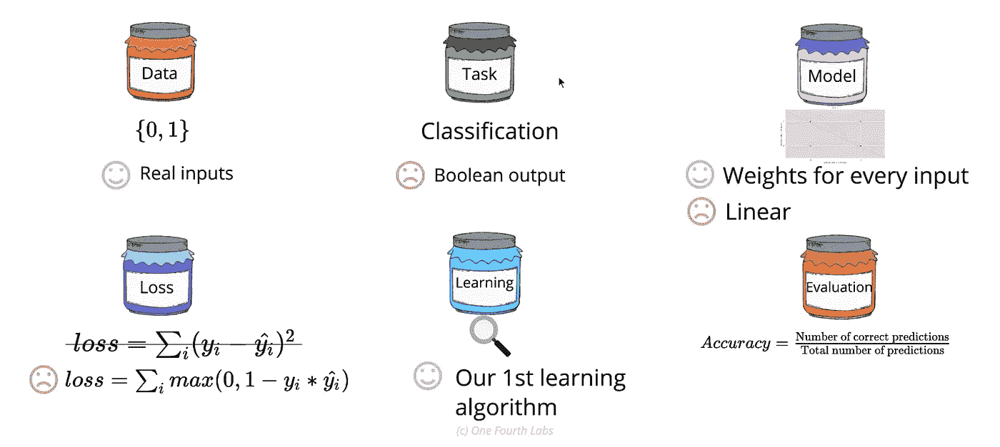

Perceptron overcomes some of the limitations of the MP Neuron.

现在让我们试着根据*“6 罐机器学习”来理解感知器模型。*

# 1.数据和任务:

感知器模型的一个主要优点是，它可以处理实值输入(这使得它更加有用和通用)和布尔值，而不像 MP 神经元模型只能处理布尔输入。

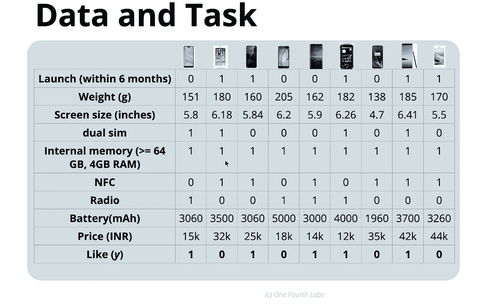

Input for Perceptron which can deal with both boolean and Real-valued inputs.

从上表中，我们可以清楚地看到，各种投入的规模是不同的。如果要使用上表中的信息构建模型，很可能会构建一个有偏差的模型，因为各种输入的比例是以一、十…千为单位的。因此，数据不能按原样使用。我们的第一步是标准化数据，这将在*“数据准备”*部分完成。

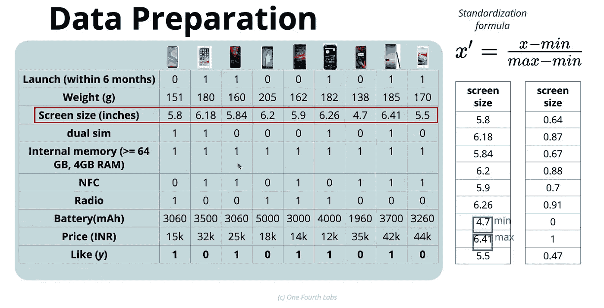

Standardize the Real inputs using the x` formula

一旦对数据中的所有真实输入进行了标准化，该表将如下所示。

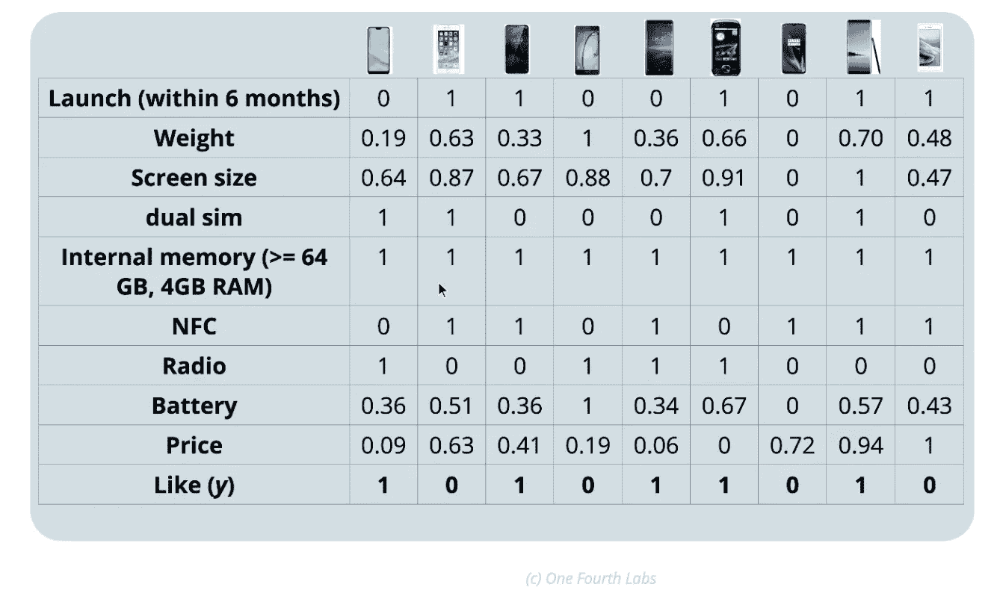

对于上述实数和布尔输入，感知器模型的输出仍然是布尔的。*任务*仍然是一个 ***二进制分类*** 任务。

# 2.模型功能:

感知器模型部分类似于 MP 神经元模型，除了一些不同之处。为了定义一个模型，我们必须知道以下细节。,

1.有哪些参数(阈值)？

2.可能的输入是什么？

3.产量是多少？

4.模型功能是什么？

***参数*** —多个参数，因为权重与每个输入相关联(权重— *w0，w1，w2，w3…wn* ，阈值—*‘b’*)

***输入—*** 可以是实数和/或布尔值

***输出—*** 只能是布尔型。

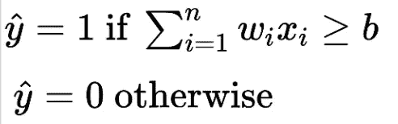

Perceptron model function

***模型函数—*** 函数与 MP 神经元模型非常相似，如果加权和大于或等于阈值，则输出为*‘1’*，如果加权和小于阈值，则输出为*‘0’*。于是在 2-D 中，模型函数定义了一条线***(w1x1+w2x 2—b = 0)***，将正输入点和负输入点分开。

# 3.损失函数:

准备好数据、任务和模型后，我们可以看到感知器模型的损失函数是什么样的。感知器损失函数是感知器模型特有的，当输出为布尔时，它非常类似于平方误差损失函数，除了表示是唯一的。它告诉模型需要做一些修正。

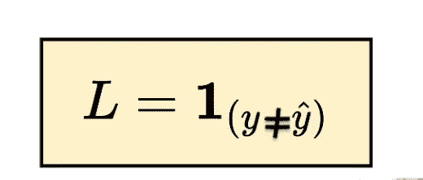

损失函数由指示变量定义，并带有与之相关联的条件。只要条件为真，损失函数就等于指示变量。

# 4.学习算法:

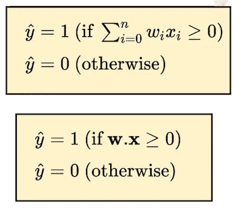

基本上，学习算法使用损失函数从数据中学习输入和输出之间的关系。通用感知器学习算法看起来就像上面“模型函数”主题中提到的算法。重新整理方程，我们可以认为如左图所示，其中 *w0=-b* 和 *x0=1。*

当所有输入被模型正确分类为正输入和负输入时，收敛发生。我们有一个阈值—*‘b’*和权重—*‘w0，w1，w2，…wn’*作为参数，这些参数可以按照下面的算法进行修改，以找到要分类的输入的正确拟合。

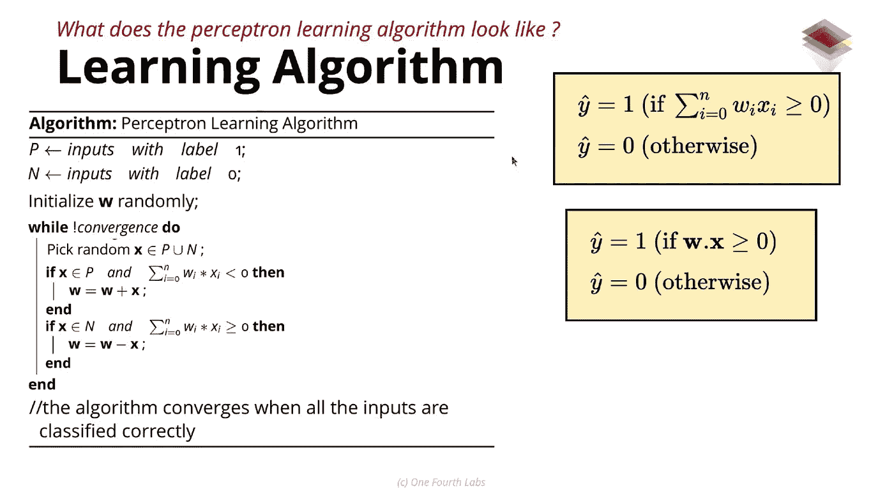

这次更新背后的直觉是什么？为什么我觉得有用？更新 w=w+x 或 w=w-x 如何工作？这怎么几何解释？

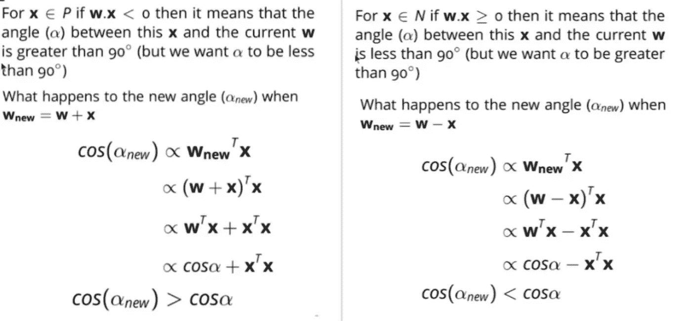

再次重申，我们必须找到一个模型，可以将积极的投入和消极的投入分开。但是我们试图找到的拟合是线性拟合。在二维空间中，这是一条线。根据输入的不同，一条线不能总是划分正负点。可能有这样的情况，正负点非常接近，一条线不能将它们分开。所以感知器模型只有在数据是线性可分的情况下才能工作。一个定理证明反之亦然，即， ***“如果正负点是线性可分的，那么用有限步数感知器算法就会收敛”。***

# 5.估价

我们有训练数据集、定义的输入和输出、设计感知器模型的损失函数。现在我们必须用测试数据集来评估模型。我们有 4 个不同手机的测试数据集，我们必须评估损失并计算准确性。

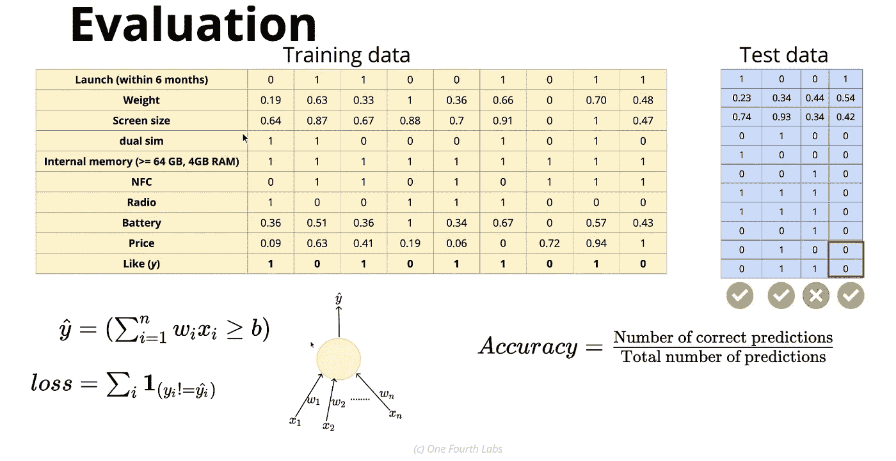

精确度由上图中的公式给出。从上面的公式，我们可以说准确率是 75%。

# 感知器模型的几何解释；

感知器模型是关于寻找正负输入之间的线性分离。在这里，在这种情况下，我们有 2 个参数，它们可以以线性分离的方式进行调整——每个输入的阈值*‘b’*和权重*‘Wi’*。与 MP 神经元模型不同，阈值“b”可以取连续值。另一个优点是，可以通过调整输入的权重来改变线的斜率，以实现线性分离。与 MP 神经元相比，我们有更好的自由度来寻找线性拟合。

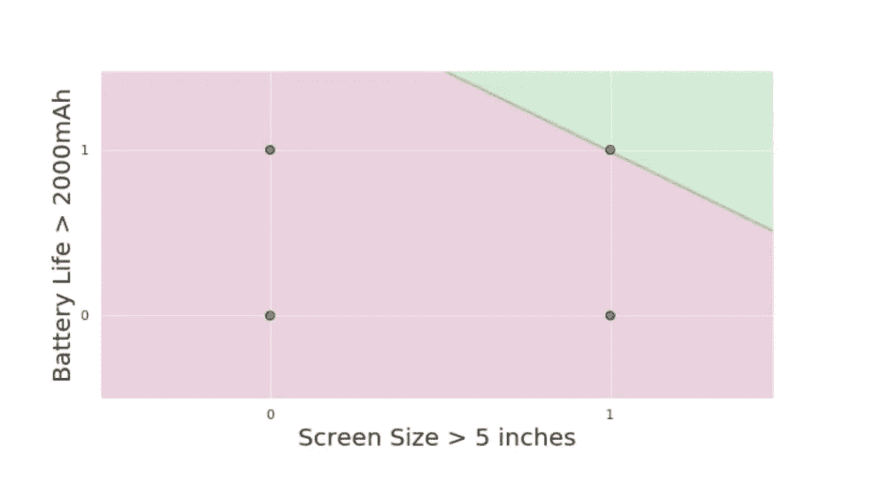

但是这种自由是不够的。比方说，在左图中，我们有用绿点表示的正点和用红点表示的负点。在这种情况下，我们不能线性地分离这些点。所以感知器模型无法解决这种情况。这是感知器模型的局限性之一。

这篇博客给出了感知器模型是如何设计的一幅大图。如果我错了，请随时指出。