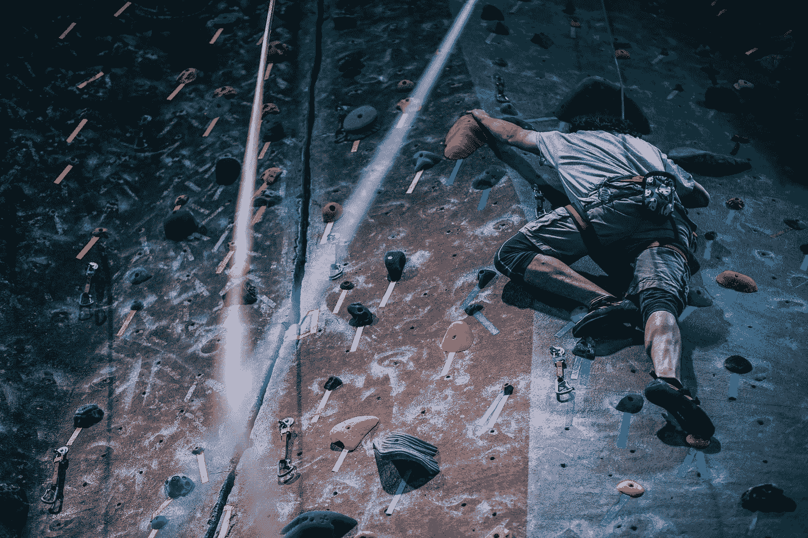

# 完善你的手艺——学习基础知识。指甲钳测试。

> 原文：<https://medium.datadriveninvestor.com/perfecting-your-craft-learn-the-basics-the-nailclipper-test-f290cb6c68f5?source=collection_archive---------5----------------------->

“Athletes climb rock wall and use ropes and grip rocks” by [Fancycrave](https://unsplash.com/@fancycrave?utm_source=medium&utm_medium=referral) on [Unsplash](https://unsplash.com?utm_source=medium&utm_medium=referral)

我在采访人们时使用的最奇怪的方法之一是给他们我称之为指甲钳测试。

任务很简单，候选人会得到一把高质量的指甲钳和一根伞骨。

他们的任务是简单地写下使用这两种物品的尽可能多的用途。

候选人几乎总是从生存方法开始，这是他们在紧急情况下可能想到的最常见的用法。候选人期望产生最有创造性的方法和最高的使用次数是最终目标。

不是的。

从抓钩到安全钳；他们几乎总是失败。

列出指甲钳最明显用途的任务；除非你天生没有，否则就是修剪指甲。

那么，为什么这如此重要呢？

让我带你回到我认为完善任何你想学的手艺的最关键的部分——最基础的，真正无聊的东西。

还记得你第一次想学开车，希望能在废弃的停车场做甜甜圈吗？

甚至去最近的射击场打几枪。

或者从飞机上跳下来，试图通过高空跳伞来提高你体内的肾上腺素水平？

很可能你对跳伞基础知识的重视程度并没有前两个例子那么高。

完善任何手艺的简单方法是建立正确的肌肉记忆、正确的道德、正确的控制——这样当一个人进入精通艺术的领域时；基本就变成了自然本能。

我记得当我第一次试图学习如何驾驶时；坐在副驾驶座上，听老师解释所有的安全措施，这是一个令人生畏又无聊的过程。

想第一次尝试打靶，但不得不坐着听几个小时的胡言乱语，比如如何清理你的武器，如何在手指不放在扳机上的情况下拔出武器。

所有这些东西都很无聊，但却非常重要。

这是人类的本能，想要跳出船，快速前进到有趣的东西，所有的漂移和扔在你的车周围的轨道，或烧坏你的车的离合器给人留下一个糟糕的倦怠。

你猜怎么着？

所有那些东西其实都没那么重要。

没有比这更明显的了，当一个人为了更危险的任务而训练时，花在基础训练上的时间的重要性。

比如训练成为宇航员或者加入一级方程式赛车。

无聊的东西让大师变得伟大。

无聊的东西是通向完美的东西。

作为一个孩子，我们目睹父母做最基本的事情，并通过纯粹的观察了解他们——在以后的生活中发现我们的习惯与父母的多么相似。

一位工程师曾经向我解释说，当 F1 赛车在赛道上出现故障时，车手几乎总是会进来抱怨赛车。这项工作最重要的部分就是隔离问题。

以及在不了解基础知识的情况下孤立问题几乎是不可能的。

当然，人们可能会立刻想要投入到更严重、更复杂的催化剂中。

但有时解决方案是最明显、最简单的。

这就是为什么我总是训练人们把注意力集中在无聊的事情上，不管它看起来有多困难和令人麻木。练习，练习，练习。

如果你想成为一名优秀的射手，首先要学会如何拔出你的武器超过一千次。

如果你希望努力成为最好的车手，并进入竞争激烈的赛车世界，学习如何掌握车轮和步法。

正是这些基础知识决定了一个人在开始从事更复杂的工作时，在一门手艺上的熟练程度。高速抄近路，适时刹车，预见后座力并重新调整视线，跳伞时记得打开降落伞。

如果你多花几个小时进行基础训练，你会惊讶于你能学到多少东西。

向大师们看齐；艾尔顿·塞纳、沃伦·巴菲特、斯蒂芬·金..仅举几个例子。

他们不仅仅是通过跳入公式 1、高风险交易或文学而成为大师。

他们每天花无数的时间，学习如何驾驶卡丁车，学习消费者习惯并评估他们的选择，每天写 1000 个单词。

在尝试所有复杂有趣的事情之前，先学会喜欢无聊的事情。

因为是那些枯燥的东西，基础，导致了一个强大的基础；一个具体的目标——能够承受最糟糕的情况，并有勇气和信心渴望对未知有更多的了解。