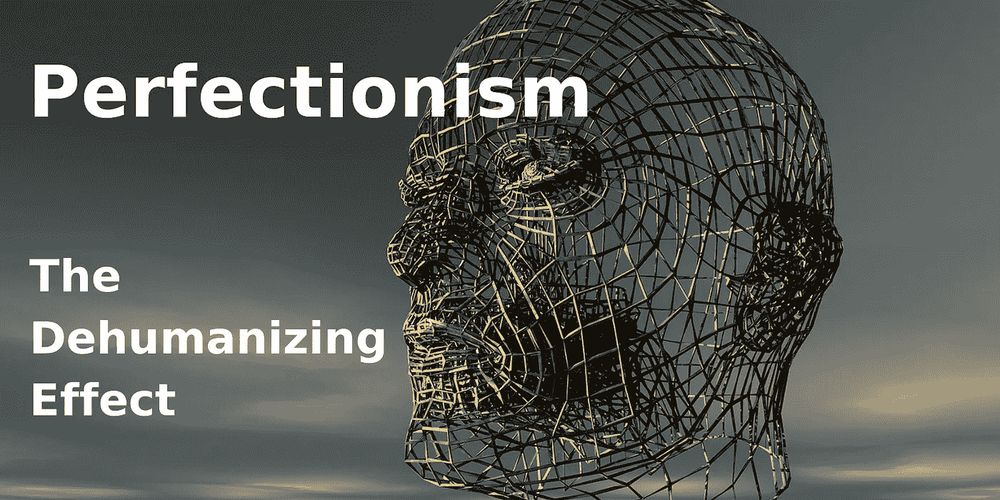
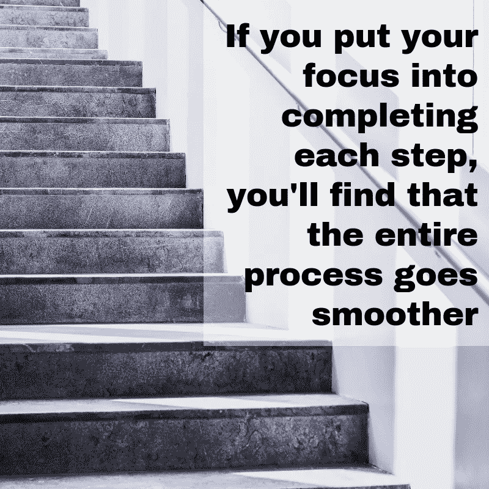
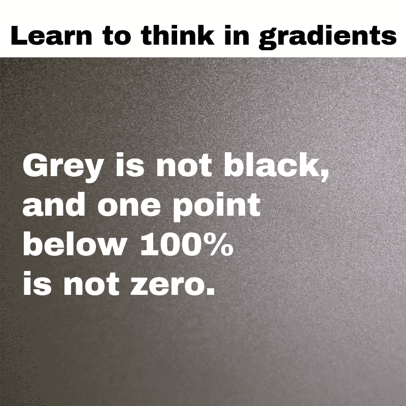

# 完美主义:去人性化的效果

> 原文：<https://medium.datadriveninvestor.com/perfectionism-the-dehumanizing-effect-a502a4c97c66?source=collection_archive---------3----------------------->

***All-or-nothing thinking is unproductive because it only allows for two possibilities. But the reality isn’t binary. Computers rely on binary reasoning, but that’s because computers lack the ability to feel.***

***打破模式的 4 步指南***

完美主义者努力在他们做的每件事上都做到最好，这不一定是件坏事。许多完美主义者在他们的领域表现出色。但这并不意味着这种性格特征没有缺点。

> **当一个小挫折感觉像一个重大的个人失败时，完美主义就成了一种负担。**

完美主义者可能会用他们知道不切实际的标准来要求自己或他人。如果你的完美主义妨碍了你建立或维持人际关系的能力，你可以采取一些措施来摆脱它。

 [## 为什么包容性财富指数比 GDP 更能衡量社会进步？-数据驱动…

### 你不需要成为一个经济奇才或金融大师就能知道 GDP 的定义。即使你从未拿过 ECON 奖…

www.datadriveninvestor.com](https://www.datadriveninvestor.com/2019/03/08/why-inclusive-wealth-index-is-a-better-measure-of-societal-progress-than-gdp/) 

**完美主义与渴望伟大**

任何博物馆都没有完美的艺术品。每幅名画都有许多瑕疵，只有训练有素的眼睛才能发现。

《蒙娜丽莎》是一件伟大的艺术品，但是如果你用 X 射线荧光光谱来观察它，你会发现这幅画是由 40 多层颜料组成的。如果达·芬奇的作品远远超出了第四十件外套，他可能会失去他的画作所熟知的人类表达的微妙之处。

完美主义者倾向于过分关注哪怕是最微小的缺陷。如果你把注意力放在你不能完美完成的事情上，你可能最终会一事无成。你会拖延太久，最终产品会不合格。

你看到完美主义是如何成为自我实现的预言的吗？

***承认完美是无法达到的。*** 相反，向往伟大。

实施这些策略，克服你对完美的执念:

1.  **分解一下。**

不要把你的项目想象成一个完美的整体，试着把它看做一系列设计良好、环环相扣的部分。

如果你专注于完成每一步，你会发现整个过程会更顺利。 ***停止担心结果。*** 反而专注于一个又一个的任务。

你一步一步地爬一段楼梯。不要期望马上胜利。把你的注意力集中在手头的任务上，你就能创造前进的动力。你将会有更少的时间来审视整个项目，因为你将会沉浸在当下。

如果你发现自己对单个步骤感到压力，把你的任务分成小块。不急不躁的完成下一个动作。如果你一步一步来，你会一点一点地完成一个大项目，而不会纠结于它是否完美。

**2。给别人一个喘息的机会。**

如果你发现自己把自己的完美主义强加给别人，停下来问问为什么。意识到别人不需要按照你的标准生活是很有帮助的。

你给别人越多的懈怠，你就越容易对自己。每个人都有独特的技能和天赋。请记住，你的朋友、家人和爱人在很多事情上比你做得更好。然而，你也有可能在你的同龄人难以胜任的领域表现出色。

当你要求你的朋友在他们缺乏信心的技能方面达到你的水平时，他们可能会感到被控制了。记住，我们的不完美使我们成为人类。

**3。分层次思考。**

你可以用一个强有力的技巧来宣称你应该得到的生活，那就是学会梯度思考。

灰不黑，100%以下一分不为零。到最后，只有你自己知道你在一个项目中投入了多少工作。做你自己的权威，如果你真的做了，祝贺你自己的努力。

> 全有或全无的思维是无益的，因为它只允许两种可能性。但是现实并不是二元的。计算机依靠二进制推理，但那是因为计算机缺乏感觉能力。

你的失误会让你学到更多，成长更多。 现实不是一个非此即彼的命题。

**4。拥抱你的幽默感。没有什么比健康的幽默感更能化解完美主义了。 ***培养自嘲的能力，开始超越单一的观点去看问题。*****

如果你能发现失败中的幽默，你就能客观地分析它，并从中吸取教训。

生活并不完美，你也一样。给自己允许，放下你的完美主义方式。今天就采取行动，利用这些建议给你的生活带来可衡量的变化。你会很高兴你做到了。

**最后一句话**

完美主义需要我们很多人；夺走了我们的梦想、希望、自尊、自由，当然还有我们的时间。我可以清楚地看到，在这个时代，成为一个“完美主义者”更像是一种强大的、自给自足的特征。但是，事实是，成为一个完美主义者也是焦虑、攀比和抑郁的原因。

缺乏自由挤压了人类。