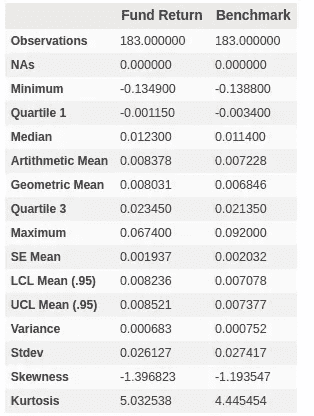
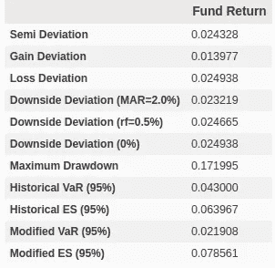
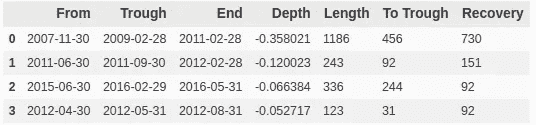
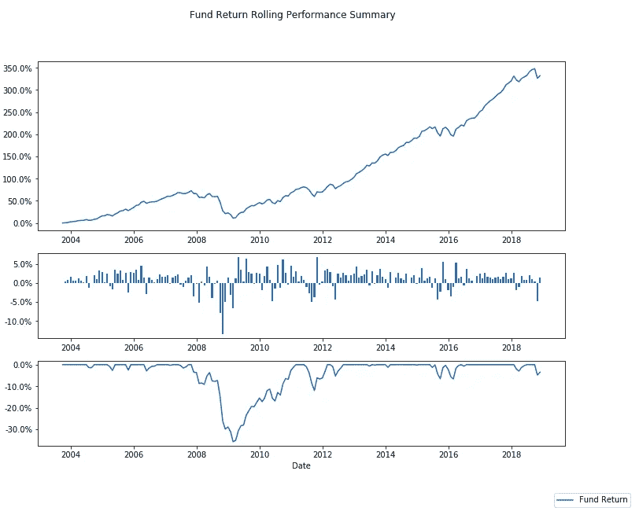
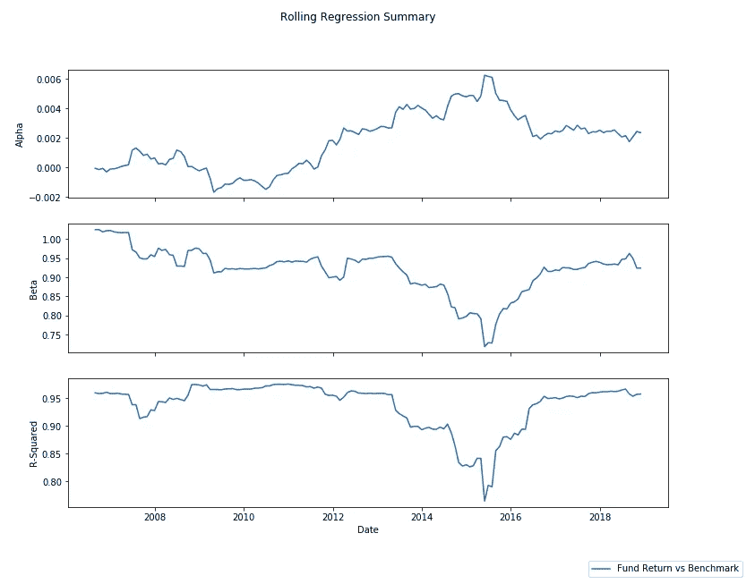

# 性能分析

> 原文：<https://medium.datadriveninvestor.com/performance-analytics-b154e555da73?source=collection_archive---------6----------------------->

[](http://www.track.datadriveninvestor.com/1B9E)

我已经开始将一个 R 项目 PerformanceAnalytics 移植到 python 上。虽然还处于初级阶段，但我觉得已经有足够的东西对人们有用了。此外，在我的第一个主要开源项目上，眼睛/助手越多越好。

安装很容易

```
pip install PerformanceAnalytics
```

从这里开始，要访问所有的统计数据，只需将模块导入到 python 脚本中

```
import performanceanalytics.statistics as pas
```

对于本文的其余部分，我将使用新西兰退休金基金的业绩历史，因为他们很好地提供每月回报

```
#this is boring, but its useful to makesure it works
#volatility
pas.vol(fund_data)
    0.0261270427672409#beta
pas.beta(fund_data,bmark_data)
    0.9288176684508153#modliglini ratio
pas.modigliani_ratio(fund_data,bmark_data,.01)
    0.00845445149918366
```

内置了以下统计数据:波动性、贝塔系数、风险值、修正风险值、条件风险值、最大提取、特雷诺比率、夏普比率、信息比率、跟踪误差、主动溢价、莫迪利亚尼比率、超额风险值、条件夏普比率、欧米伽比率、索提诺比率、卡帕三比率、损益比率、上升潜力比率、卡尔马比率、斯特林比率、伯克比率、相关性和资本资产定价模型

然而，以我的拙见，最初的 R 包和这个 Python 包最好的部分是动态创建表格和图像的能力。例如，如果你想要一个好的概览，你需要做的就是

```
import performanceanalytics.table.table as pat
pat.stats_table(nz_data, manager_col=0, other_cols=[2])
```



或者你可能只关心基金的下跌数据

```
pat.create_downside_table(nz_data,0)
```



也许你想看到提款，请注意-.03 是微不足道的提款限额，换句话说，低于这个水平的提款将不计算在内

```
pat.drawdown_table(nz_data['Fund Return'], -.03)
```



该软件包带有一些内置图表，这里是一个很好的概述



或者滚动 36 个月回归图



包裹里还有很多。我创建了一个[要点](https://gist.github.com/justthetips/ff777cb95cc5d26c22f01e6e723c6d6e)来展示如何做所有这些，代码驻留在 [GitHub](https://github.com/justthetips/PerformanceAnalytics) 上。我鼓励、希望、恳求你们看一看，尽你们所能帮助我们