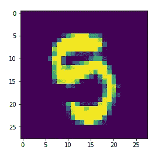
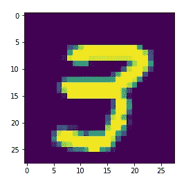
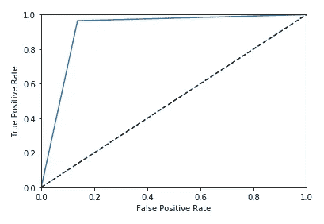

# 分类的性能测量

> 原文：<https://medium.datadriveninvestor.com/performance-measurement-for-classification-5a4ee24ac654?source=collection_archive---------8----------------------->


大家好。这是我关于数据科学和机器学习的第二篇文章。这篇文章是关于使用机器学习解决分类问题时的性能测量。

那么首先，什么是分类问题。非常简单，它只是将数据集分类成数据类。这意味着我们必须预测一组特定的输入属于哪一类。例如，我们得到一组包括猫、狗和兔子的图像。任务是预测输入图像属于哪种动物。

对于任何问题来说，性能测量都是非常关键的一步，因为这将告诉我们，模型给出的结果有多准确。为了了解性能测量，让我们来看一个数字识别的分类问题。

[](https://www.datadriveninvestor.com/2020/02/19/five-data-science-and-machine-learning-trends-that-will-define-job-prospects-in-2020/) [## 将定义 2020 年就业前景的五大数据科学和机器学习趋势|数据驱动…

### 数据科学和 ML 是 2019 年最受关注的趋势之一，毫无疑问，它们将继续发展…

www.datadriveninvestor.com](https://www.datadriveninvestor.com/2020/02/19/five-data-science-and-machine-learning-trends-that-will-define-job-prospects-in-2020/) 

在继续之前，我想分享一下 iSrajan 社区。除了这个博客，你还可以关注以下平台-

所以让我们从代码开始。

导入所需的库 numpy、pandas、matplotlib。

```
>>> import numpy as np
>>> import pandas as pd
>>> import matplotlib.pyplot as plt
>>> from sklearn.linear_model import SGDClassifier>>> #Cross Validation
>>> from sklearn.base import clone
>>> from sklearn.model_selection import cross_val_score>>> #Confusion Matrix
>>> from sklearn.metrics import confusion_matrix>>> #Precision and Recall
>>> from sklearn.metrics import precision_score, recall_score, f1_score>>> #ROC Curve
>>> from sklearn.metrics import roc_curve, roc_auc_score
```

我们拥有的数据集包括两个 csv 文件，train.csv 和 test.csv。让我们将它们加载到 pandas 数据帧中。

```
>>> train = pd.read_csv('train.csv')
>>> test = pd.read_csv('test.csv')
```

让我们检查数据集中的行数和列数。

```
>>> train.shape(42000, 785)
```

训练数据集有 42000 行和 785 列。

```
>>> test.shape(28000, 784)
```

测试数据集有 28000 行和 784 列。测试数据集比定型数据集少一列，因为它没有标注(真值)要素列。

```
>>> y = train['label']
>>> del(train['label'])
>>> X = train
```

现在，y 包含“标签”值，X 包含所有特征列的剩余部分。

让我们从数据集 X 中随机抽取一个图像，并验证该图像是否代表该数字的真实值。

```
>>> some_image = X.values[36001]
>>> some_image_reshape = some_image.reshape(28,28)>>> plt.imshow(some_image_reshape)
```



```
>>> y.values[36001]5
```

所以，是的。我们可以清楚地看到图像中的数字是 5，真实值也是 5。

初始化随机梯度分类器。

```
>>> clf = SGDClassifier(random_state=42)
```

建立模型。

```
>>> clf.fit(X,y)SGDClassifier(alpha=0.0001, average=False, class_weight=None,
early_stopping=False, epsilon=0.1, eta0=0.0, fit_intercept=True,
l1_ratio=0.15, learning_rate='optimal', loss='hinge', max_iter=None,
n_iter=None, n_iter_no_change=5, n_jobs=None, penalty='l2',
power_t=0.5, random_state=42, shuffle=True, tol=None,
validation_fraction=0.1, verbose=0, warm_start=False)
```

预测结果。

```
>>> y_pred = clf.predict(X)
```

让我们测试任何随机图像。

```
>>> plt.imshow(X.values[2000].reshape(28,28))
```



```
>>> y.values[2000]
```

太好了。我们的分类器已经做了正确的预测。

我们可以清楚地看到，图像中的数字是 3，我们的模型也预测了 3，这是正确的。但是只检查一个值并不能告诉我们任何关于模型准确性的信息。让我们来看看一个分类模型的性能测量方法。

# 交互效度分析

在这种方法中，我们通过在数据集的子集上测试模型的准确性来测试模型的性能。

```
>>> cross_val_score(clf, X, y, cv=3, scoring="accuracy")array([0.86418166, 0.86555222, 0.88841263])
```

上面的数组给出了模型在数据集的三个子集上运行时的准确性。

当数据集有偏差时，这种性能测量技术不能给出令人满意的结果。如果数据集包含一个非常频繁的类，那么在这种情况下，这种性能测量就不能很好地工作。

让我们来看下一个性能测量，即混淆矩阵。

# 混淆矩阵

混淆矩阵是衡量分类器性能的更好方法。总体思路是计算分类器混淆 A 类和 b 类图像的次数。例如，在上述问题中，它将计算分类器混淆 5 的图像和 3 的图像的次数。为了知道混淆的次数，我们将到达第 5 行和第 3 列。单元格的值给出了计数。

```
>>> confusion_matrix(y, y_pred)array([[4075,    0,    2,    6,   12,   10,   14,    1,    3,    9],
       [   0, 4587,    4,   32,    9,    7,    4,    2,   30,    9],
       [ 103,   70, 2967,  600,  127,   66,   88,   64,   49,   43],
       [  28,   19,   28, 3995,   16,  125,   10,   19,   15,   96],
       [  17,   17,    1,    3, 3909,    8,   11,    3,    4,   99],
       [  86,   23,    8,  197,   77, 3276,   48,    6,   24,   50],
       [  42,   16,    6,    8,   57,  131, 3870,    1,    4,    2],
       [  24,   17,   26,   33,  131,   15,    2, 3768,    5,  380],
       [  59,  139,   15,  406,  258,  966,   17,   15, 1987,  201],
       [  38,   12,    2,   64,  345,   42,    0,   44,    4, 3637]])
```

上面的代码返回了这种计数的矩阵。混淆矩阵中的每一行代表实际类别，每一列代表预测类别。

接下来我们来看下一个性能测量技术，即精度和召回率。

# 精确度和召回率

在研究这个之前，我们先了解一些基本的术语。

让我们举一个二元分类器的例子，它预测一个数字是否是 5。

**真阳性(TP)** -这是一组为真的输入(它们是 5)，并且分类器也做了正确的预测(分类器预测它们是 5)。

**真阴性(TN)** -这是一组错误的输入(它们不是 5)，但分类器预测它们是真的(分类器预测它们是 5)。

**假阳性(FP)** -这是一组为真(它们是 5)但分类器预测它们为假(分类器预测它们不是 5)的输入。

**假阴性(FN)** -这是一组错误的输入(它们不是 5)，并且分类器也预测它们是错误的(分类器预测它们不是 5)。

精度定义为:**精度= TP/(TP + FP)**

召回定义为:**召回= TP/(TP + FN)**

```
>>> precision_score(y, y_pred, average=None)array([0.9112254 , 0.93612245, 0.96992481, 0.74756737, 0.7911354 ,
       0.70512269, 0.95226378, 0.96048942, 0.93505882, 0.80357932])
```

上面的函数返回每个类的精度分数，范围从 0 到 9。必须指定值为 None 的参数 average，因为这里的问题是多类问题，默认情况下，该函数仅在二分类的情况下有效。

```
>>> recall_score(y, y_pred, average=None)array([0.98620523, 0.9792912 , 0.71031841, 0.91817973, 0.95997053,
       0.86324111, 0.93546048, 0.85616905, 0.4890475 , 0.86843362])
```

上面的函数返回从 0 到 9 的每个类的回忆分数。

**f1 = 2/(1/精度+1/召回)**

```
>>> f1_score(y, y_pred, average=None)array([0.94723384, 0.95722037, 0.82006633, 0.82413615, 0.86741374,
       0.77621135, 0.94378734, 0.90533397, 0.64221073, 0.83474868])
```

上面的函数返回从 0 到 9 的每个类的 f1_scores。

现在让我们看看下一个绩效衡量指标，即 ROC 曲线。

# ROC 曲线(接收机工作特性)

ROC 曲线方法仅适用于二元分类器，它绘制了真阳性率与假阳性率之间的曲线。

因为它只对二进制分类器有效，所以我们取两个列表 y_5，如果 y 中相应的数字是 5，它将包含 1，如果不是 5，它将包含 0。类似地，这适用于 y_pred_5，它将包含与 y_pred 中的数字相对应的 1 或 0，无论它是否为 5。

```
>>> y_5 = []
>>> for a in y:
>>>     if a == 5:
>>>         y_5.append(0)
>>>     else:
>>>         y_5.append(1)>>> y_pred_5 = []
>>> for a in y_pred:
>>>     if a == 5:
>>>         y_pred_5.append(0)
>>>     else:
>>>         y_pred_5.append(1)>>> fpr, tpr, thresholds = roc_curve(y_5, y_pred_5)
```

**fpr:** 假阳性率

**tpr:** 真阳性率

使用 Matplotlib 绘制 FPR vs TPR

```
>>> plt.plot(fpr, tpr, label=None)
>>> plt.plot([0,1], [0,1], 'k--')
>>> plt.axis([0,1,0,1])
>>> plt.xlabel('False Positive Rate')
>>> plt.ylabel('True Positive Rate')
>>> plt.show()
```



ROC 曲线下的面积给出了分类器的准确度。完美的分类器将具有等于 1 的面积，而纯粹随机的分类器将具有等于 0.5 的面积。

```
>>> roc_auc_score(y_5,y_pred_5)0.9136909629919309
```

上面给出了上述分类器的 ROC AUC 评分。

希望你喜欢这篇文章。请在下面的评论区分享您的宝贵反馈。