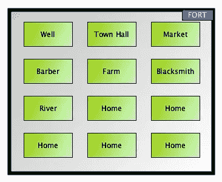
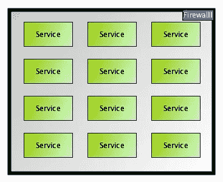
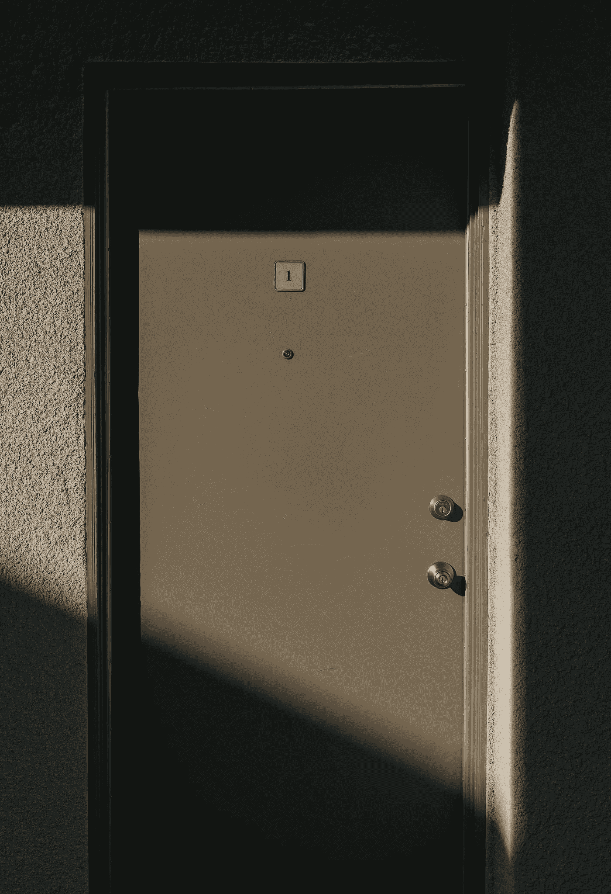
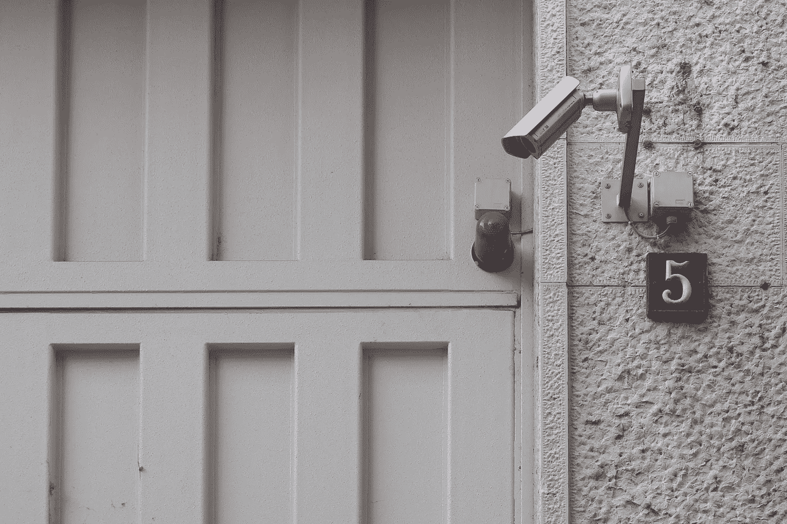

# 周界与资产安全

> 原文：<https://medium.datadriveninvestor.com/perimeter-vs-asset-security-2af77b67f006?source=collection_archive---------5----------------------->

# 背景

在 IT 行业工作多年，我们已经听过很多次了，我们有防火墙，因此我们是安全的。

然而，数据窃贼的威胁仍在不断增加。

你可以在这里找到一份年度报告

 [## 2019 年数据泄露调查报告

### 威胁是真实的，袭击者有动机。但是在他们和你的组织的数据之间有一些障碍:你和…

enterprise.verizon.com](https://enterprise.verizon.com/en-gb/resources/reports/dbir/) 

安全是最重要的。是的，这是必然的。此外，确切地“如何”考虑和实现安全方面也很重要。

# 周边安全

Torna Fort, Maharashtra, India — Photo by [Sachin Tandale](https://unsplash.com/@sachintandale?utm_source=unsplash&utm_medium=referral&utm_content=creditCopyText) on [Unsplash](https://unsplash.com/s/photos/fort-india?utm_source=unsplash&utm_medium=referral&utm_content=creditCopyText)

我出生在印度马哈拉施特拉邦的孟买，并在那里长大。上图是马哈拉施特拉邦的托尔纳堡，它是马哈拉施特拉邦众多美丽地方之一。

你可以在这里了解更多。

 [## 托尔纳堡

### 托尔纳堡，也被称为普拉昌达加，是一个位于印度马哈拉施特拉邦浦那区的大型堡垒…

en.wikipedia.org](https://en.wikipedia.org/wiki/Torna_Fort) 

## 堡垒墙安全又名周边安全

Concept Fort

Fort Security 类似于今天的应用程序边界安全，即防火墙。一些方面可以通过适当的验证。

然而，一旦他们通过，他们就可以免费使用大部分资源。在过去，人们“信守诺言”是大多数人文化价值观的一个可敬的方面。

 [## 网络安全非营利组织帮助中小企业打击网络犯罪|数据驱动的投资者

### 一个名为全球网络联盟(GCA)的非营利组织发誓要改善…

www.datadriveninvestor.com](https://www.datadriveninvestor.com/2019/02/22/cybersecurity-non-profit-to-help-smes-fight-against-cybercrime/) 

不打招呼就攻击任何人被认为是不光彩的。攻击那些没有自卫手段的人也被认为是不光彩的。

因此，许多堡垒都有巨大的围墙作为外围安全，但是里面的生活是建立在信任的基础上的，而且这种做法在很多代都有效。

# 资产安全

## 什么是资产？

我认为资产是我们在任何环境中使用的所有服务。上面的堡垒背景我们有资产，像井，市政厅，市场，理发店，农场，铁匠，河流，家和潜在的更多。

IT Assets

对于 IT 资产，一个方面是硬件本身，但是，让我们假设我们的硬件是安全的。从应用的角度来看，我们有很多服务，比如操作系统服务、网络服务、应用服务、数据服务等等。

## 为什么什么都不信？

“可敬的行为准则”和价值体系的时代已经过去了。

我们不能假定生产中“信任任何东西”的默认级别。此外，在当今世界，我们不能仅仅依赖防火墙作为一种威慑。

如果我们让一个进程(它可能通过也可能没有通过防火墙)为所欲为，我们将面临数据泄露甚至更糟的风险。

## 公共安全又名网络安全

Photo by [Enrique Alarcon](https://unsplash.com/@qikealarcon?utm_source=unsplash&utm_medium=referral&utm_content=creditCopyText) on [Unsplash](https://unsplash.com/?utm_source=unsplash&utm_medium=referral&utm_content=creditCopyText)

在敏感地点周围进行监视有助于检查任何可疑活动。

同样，网络安全有助于检测任何异常行为并发出自动警报。

## 门锁又名服务级安全

Photo by [MARK ADRIANE](https://unsplash.com/@markadriane?utm_source=unsplash&utm_medium=referral&utm_content=creditCopyText) on [Unsplash](https://unsplash.com/?utm_source=unsplash&utm_medium=referral&utm_content=creditCopyText)

门锁有助于防止未经授权的人控制住宅或任何地方。

类似地，每个服务都需要服务级别的安全性，以帮助防止未经授权的进程获得对服务的控制。

## 一直监控服务

Photo by [Josh Shaw](https://unsplash.com/@joshshaw__?utm_source=unsplash&utm_medium=referral&utm_content=creditCopyText) on [Unsplash](https://unsplash.com/s/photos/door-camera?utm_source=unsplash&utm_medium=referral&utm_content=creditCopyText)

门锁可以被破解，因此并不安全。因此，监视有助于阻止潜在的强盗。

同样，服务级别的安全性也可能被破坏，因此也不是万无一失的。因此，在今天，始终监控服务是一种“需要”。任何可疑活动都需要发出自动警报。

# 结论

在开发应用程序时，我们不要将安全性视为最后考虑的方面。

让我们从一开始就把它烤熟。

你认为实现这一目标的最佳途径是什么？请在评论区告诉我们。