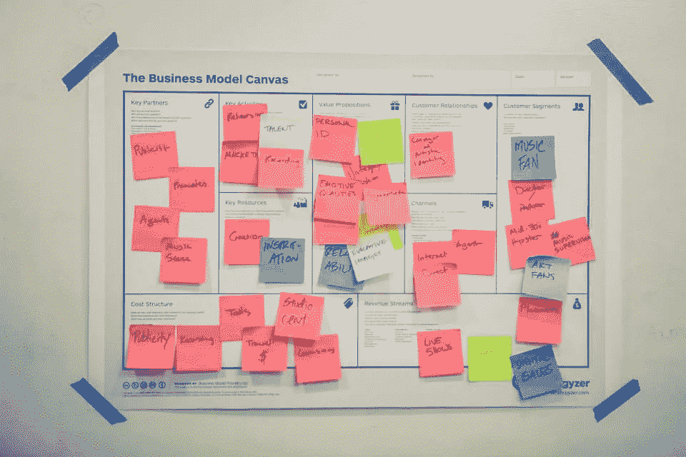
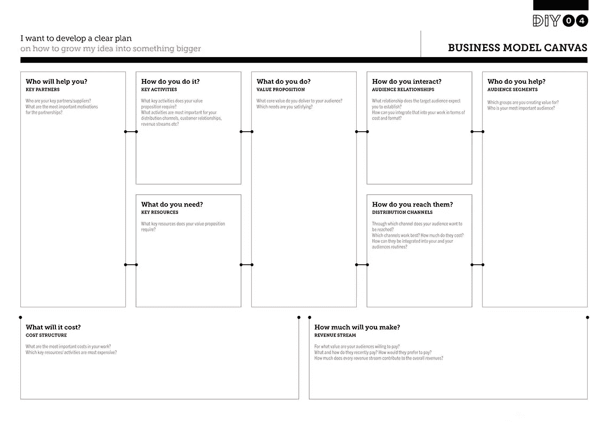

# 商业模式画布的额外津贴

> 原文：<https://medium.datadriveninvestor.com/perks-of-the-business-model-canvas-fc3ed0219874?source=collection_archive---------9----------------------->

The business canvas in process.

业务模型画布是描述、可视化、评估和更改业务模型的常用工具。它描述了组织流程，展示了组织如何创造、交付和获取价值。商业模式画布是由 Alexander Osterwalder 创建的，它是一个一页的概述，既预览了公司正在做或想要做的事情，也显示了他们将如何去做。该模型通过列出最重要的活动和潜在行动所涉及的挑战以及它们之间的相互关系，实现了关于管理和战略的结构化对话。商业画布是有益的，因为它的视觉格式和机会，听取其他人的想法，并建立在它的基础上。这个概念对现有企业以及新组织和初创企业都有帮助。已经存在的业务可以开发新的计划并发现机会，同时变得更有效率。创业公司可以用它来提前计划和发展他们的业务。

Plain business canvas example.

这一切都是从一张空白的画布和一张写有关键字的便笺开始的。在这项活动中，便笺很有用，因为当您将便笺放入画布中的每个构建模块时，您可以四处移动想法。为了做到这一点，将每个想法写在单独的便笺条上是很重要的。另一个有助于额外组织的工具是对与特定客户群相关的元素进行颜色编码。

 [## 在创业之旅中，拥抱学习数据驱动的投资者

### 好像建立一个数百万美元的公司还不够困难，企业家必须额外照顾他们的…

www.datadriveninvestor.com](https://www.datadriveninvestor.com/2018/10/16/on-the-entrepreneurial-trek-embrace-the-learning/) 

商业模式画布可以应用于现有公司的主要竞争对手。这将允许从竞争中学习经验。获得的信息有助于了解客户想要什么以及他们把钱花在哪里。所有这些都将使公司的目标受众需求和他们对行业的期望更加清晰。结合这一点，该公司可以得出结论，并深入了解其他企业如何运作以及他们如何在市场上创造自己的空间的重要信息。

为一幅商业画布进行头脑风暴通常需要 40-60 分钟，之后的回顾是一个重要的方面。退后一步，检查每个客户群是否都与价值主张和收入流相关联，这一点至关重要。最终的画布应该在左侧支持画布的右侧的一切，其余的便签应该被删除。

业务模型画布是一个很好的工具，可以帮助公司以直观的方式理解业务模型。使用这种画布的好处是对客户的洞察，通过不同渠道提供的价值主张的细节以及公司赚钱的方式。

参考资料:

商业模型画布:帮助你理解商业模型的工具。(未注明)。检索自[https://www . business models Inc . com/about-BMI/tools/business-model-canvas/](https://www.businessmodelsinc.com/about-bmi/tools/business-model-canvas/)

商业模式画布。(2016 年 12 月 01 日)。从 https://diytoolkit.org/tools/business-model-canvas/[取回](https://diytoolkit.org/tools/business-model-canvas/)