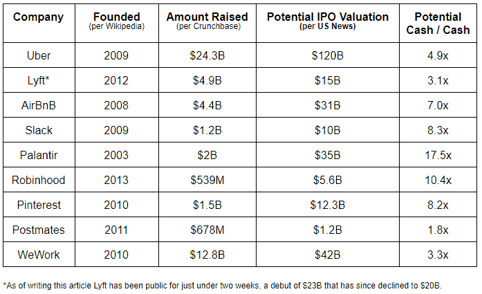
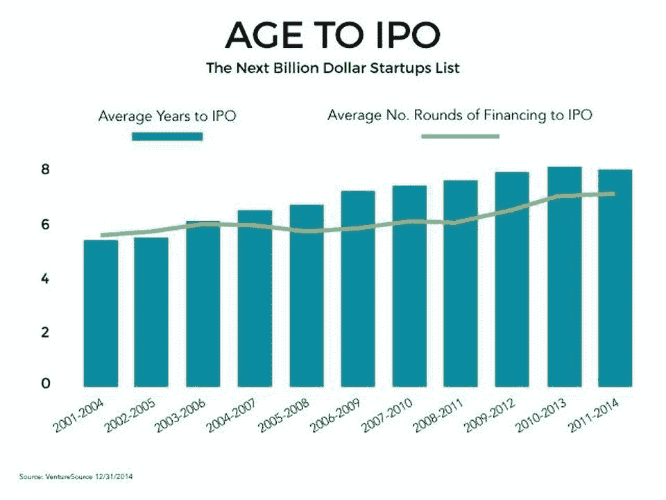
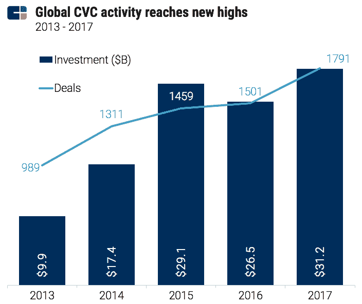

# 永久资本——风投们应该学会停止担忧，热爱更长的路吗？

> 原文：<https://medium.datadriveninvestor.com/permanent-capital-should-vcs-learn-to-stop-worrying-and-love-the-longer-roads-1f86cb18d31c?source=collection_archive---------7----------------------->

永久资本是对基础工具的无限期投资。这在上市股票中很常见，伯克希尔哈撒韦公司就是一个例子，该公司相信买入并无限期持有股票。风险投资本质上是以 7-10 年为投资期限的，这是一种诅咒，但这种情况最近发生了变化，主要是由企业家推动的。

一直保持私有状态，同时继续筹集越来越多资金的独角兽企业的激增就是这一趋势的象征。让我们来分析一下 2019 年科技公司 IPO 的大丰收，一些最大的巨头预计将最终上市:

平均而言，这些公司已经存在了 10 年，也就是说，处于风险资本历来优化的极限。他们中的大多数人在旅程中筹集了数十亿美元，有时他们可能不需要现金。这就引出了三个关键问题。

 [## 金融科技初创公司正在扰乱世界各地的银行业-数据驱动的投资者

### 传统的实体银行从未真正从金融危机后遭受的重大挫折中恢复过来…

www.datadriveninvestor.com](https://www.datadriveninvestor.com/2018/10/20/fintech-startups-are-disrupting-the-banking-industry-around-the-world/) 

我们是否看到了一种新型风险投资的兴起？

它没有正式名称，但假设我们称之为夹层资本，即在后期阶段为股权支付大量现金。十年前，DST 曾以此为名进行投资，如今，软银可能是这个名字的缩影，老虎环球(Tiger Global)和富达(Fidelity)等知名企业也紧随其后。不仅是成熟的大型投资者，像社会资本 Hedosophia 这样的新兴投资者也考虑了这一策略，尽管在那种情况下，他们自己也有[的巨大障碍](https://spacinsider.com/2018/09/11/rumors-of-big-time-trouble-for-social-capital-hedosophia/)。我们是否会看到一种新型资产类别的出现，将在很大程度上取决于永久风险投资公司的这些首批海报儿童今年的表现，这就引出了下一个问题。

**2)风投如何适应初创公司保持更长时间的私有状态？**

数据明确表明，我们正看到创业之旅的延长。

需要注意的是，IPO 只占成功退出的个位数比例，这一数据不包括并购。尽管如此，IPO 是不成比例的赚钱工具，这意味着风险资本的运作方式必须不断转变。早期投资的基金，直到 B 轮，通常仍然可以将股票出售给其他基金以获得流动性。但是超过 B 轮的大型基金可能会发现自己处于无人区，他们在纸面上有升值，但没有支付给他们的有限合伙人的时间比以前长得多。

我们会看到更多的常青基金吗？

常青基金是那些在其整个生命周期中基本上按需获得资本的基金。你可以考虑像英特尔和三星 evergreen 这样的长期公司基金，因为假设公司定期为其基金活动投入足够的资金。在对冲基金、银行或捐赠基金中，也有类似的常青树表达方式，它们有时会为大部分(如果不是全部)风险投资基金提供资金。如果永久资本在这里，我们确实应该期待常青基金做得更好，因为他们将有更多耐心的有限合伙人。事实上，反映这一趋势的一个数据点是过去几年 CVCs 的增加。

这些是专注于实践见解的短文(我称之为 GL；dr —良好的长度；确实读过)。如果它们能让人们对某个话题产生足够的兴趣，从而进行更深入的探索，我会感到非常兴奋。这里表达的所有观点都是我自己的。如果这篇文章有对你有用的见解，请给个赞，任何想法请留言。