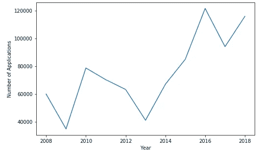
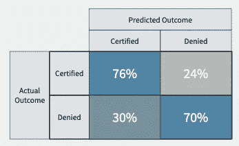
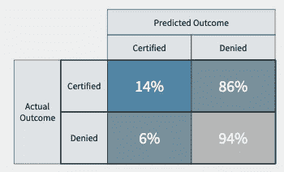
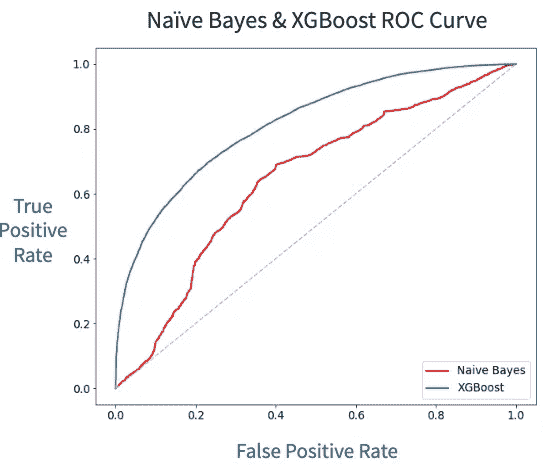
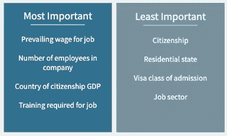
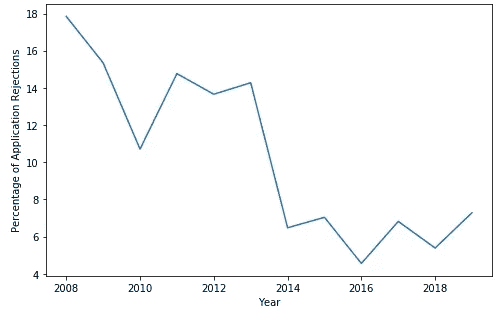
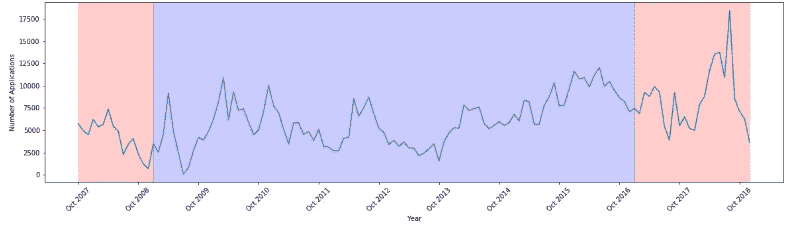
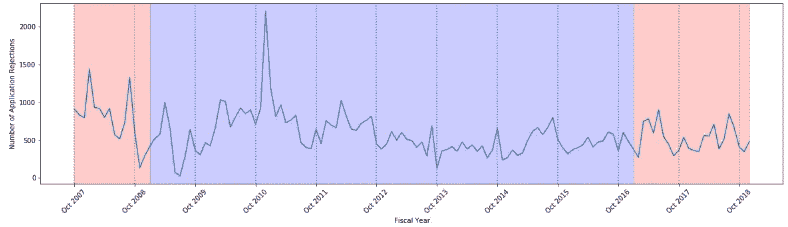

# 永久居住权——数据科学探索

> 原文：<https://medium.datadriveninvestor.com/permanent-residency-will-i-be-accepted-ed89fdb2c388?source=collection_archive---------4----------------------->

> 移民在美国是一个热门话题，但是数据科学如何评估移民过程并潜在地帮助你呢？

美国人口中有七分之一是移民，对于这些人中的许多人来说，永久居留权是希望留在美国的首要条件。作为一名正在办理永久居留手续*的英国公民，这是一个我非常热衷的话题。

The Immigrant’s Statue, New York City, NY

对于许多目前在美国就业的人来说， [**基于就业的永久居留权**](https://www.eahimmigration.com/practice-areas/for-employers/permanent-residence-through-employment) 是一个潜在的选择，如果他们想留在这个国家的话。然而，随着申请数量自 2008 年以来翻了一番，以及对移民相关案件的更严格审查，我想预测一个案件是否有可能被拒绝，并调查其潜在的决定因素。

 [## 成为数据科学家所需的 8 项技能——数据驱动型投资者

### 数字吓不倒你？没有什么比一张漂亮的 excel 表更令人满意的了？你会说几种语言…

www.datadriveninvestor.com](https://www.datadriveninvestor.com/2019/02/07/8-skills-you-need-to-become-a-data-scientist/) 

这可能有助于决定这个漫长的*(6 个月到几年)*和昂贵的*(可能是数千美元)*过程对雇主和/或申请人是否可行。

Number of Employment based Permanent Residency applications since 2008.

## 数据

我从劳工部关于 2008-2019 年个人申请的数据开始。我还纳入了申请人国籍和申请年份的经济数据，以分析这是否对整体申请有影响。申请数据集面临的最大挑战是，有许多标准可能与每个申请人都不相关。因此，数据集包含多个空值和要素，以解释它们是否有助于应用程序输出以及在建模过程中是否有用。

模型中使用的最终特征可以分为个人信息、雇主和就业状况、申请提交日期和申请人国籍的经济影响。总的来说，在对分类变量进行虚拟化后，有超过 500 个特征对应用结果有影响！

在原始数据集中，潜在的结果是“认证”、“拒绝”和“撤销”。我删除了“撤回”的申请，因为潜在的结果是未知的。这给我留下了近 85 万份申请。

## 模型建立的过程

我将这个项目视为一个分类问题，旨在预测申请是可能被“认证”还是“拒绝”。在建模过程中，我想要优化的误差指标是**准确度**(正确预测尽可能多的结果)和**精确度**(减少被错误预测为“已认证”的应用数量)。我认为这是“最糟糕的情况”——预测申请会被“认证”，但实际上却被拒绝了。

表现最好的模型是使用 XGBoost 算法，其表现为 73%的准确度和 69%的精确度。我选择使用 XGBoost，因为它旨在通过堆叠模型和迭代纠正前一个模型产生的错误来优化模型性能。我还使用 GridSearch 寻找最佳参数组合来调优 XGBoost 算法，以优化其准确度和精度。XGBoost 还具有评估特性重要性的能力。这一点尤为重要，因为我想调查哪些特性对应用程序的结果有重要影响，从而有可能对应用程序提出改进建议。

XGBoost Model Performance

我仍然知道“最坏的情况”，这是我在测试不同模型时考虑的事情。例如，我实现了一个朴素贝叶斯模型，因为我的数据集中有大量的要素，试图减少这种情况。虽然这成功地将错误预测的“拒绝”案例减少到了 6%，但是整体的准确性和精确度受到了严重的损害。这两个比例分别降至 54%和 52%。如下所示，虽然 94%的被拒绝的病例被正确预测，但是只有 14%的被认证的病例被正确预测。这很好地证明了不同的模型对数据的反应是不同的，以及结果会有很大的不同。

Naive Bayes Model Performance

## 比较模型性能

为了相互比较模型性能，我使用了 ROC 曲线和 AUC 分数。ROC 曲线显示了一个模型在减少“最坏情况”下的预测数量的同时优化正面预测数量的效果。由此，计算 0.5 和 1 之间的曲线面积(AUC)分数*(下图中的虚线表示 0.5 的分数)*。分数越接近 1，表明模型区分各个类别的能力越强。如下所示，XGBoost 的 ROC 曲线表明，它比朴素贝叶斯模型表现得更好，既提高了模型的真阳性率，又降低了最坏情况的可能性。这反映在 Naive Bayes 的 AUC 分数为 0.65，XGBoost 的 AUC 分数为 0.82。

ROC Curve for Naive Bayes and XGBoost Models

有了这种想法和评估特性重要性的能力，XGBoost 被确定为最终的和最容易解释的模型。

## 特征重要性

如上所述，我的原始数据集包含超过 500 个特征，因此我想隔离最重要的特征，以降低模型的复杂性和过度拟合的可能性。但是，XGBoost 算法生成的特性重要性有时会产生误导，这取决于使用了哪种重要性度量 *(* [*这么棒的一篇文章解释了为什么*](https://towardsdatascience.com/be-careful-when-interpreting-your-features-importance-in-xgboost-6e16132588e7) *)。考虑到这一点，我还使用了决策树模型来比较特性的重要性，并比较了两者之间的相似性。这让我对哪些特性对应用结果的影响最大和最小更有信心。通过比较功能重要性结果，我能够对每个功能进行排序，并对每个功能的重要性进行加权。*

Most and Least Important features determined by XGBoost & Decision Trees

最初，我想利用这些特性的重要性来建议对应用程序的潜在改进。然而，似乎很多这些特征对申请人来说是非常独特的，并且不容易被改变。从这两个模型中发现的最重要的特征大多与工作和雇主本身有关——特别是该工作的普遍工资和公司的规模。通过进一步的研究，我发现申请过程的一部分是雇主必须证明他们能够支付申请人通行的工资——因此，很多高工资要求的申请被拒绝了！

另一方面，该项目在永久居留申请过程中展示了一些积极的成果。与申请人本身有关的个人特征，如他们的国籍、他们居住的州和他们最初持有的美国签证，对模型的影响很小。这表明该过程不会歧视这些特性，这是我们真正希望的！

## 一段时间内的应用

这个项目的一个小问题是，由特性重要性的结果驱动的是随着时间的推移查看应用程序数据。我的第一个启示是，虽然申请数量增加了，但是申请被拒的百分比却从 2008 年的 18%下降到了 2018 年的 6%！这不是一个稳定的变化，因此很难解读这种情况是否可能在未来保持*(特别是注意到 2018 年后的增长)*。

Percentage of Application Rejections

随着这段时间美国政府的变化，我很想知道这是否有什么特别的影响。我对每张图表进行了颜色协调，以显示给药方式发生变化的时间。虽然申请数量有所增长，但从 2010 年开始，被拒的总数量基本保持不变，这反映在上面的被拒百分比图中。

Number of applications 2008–2019

Number of application rejections 2008–2019

这些图表中最重要的点是 2018 年 10 月前申请人数的下降和 2010 年 10 月后被拒人数的峰值。不幸的是，申请人和移民局之间对于是什么原因造成了这些异常情况缺乏透明度。

> 一个完整的 Jupyter 笔记本的项目分析代码可以在[这里](https://github.com/laurenlhoward14/permanent-residency)找到。

**我个人正在经历一个不同的获得美国永久居留权的途径，这个项目没有反映出来。*