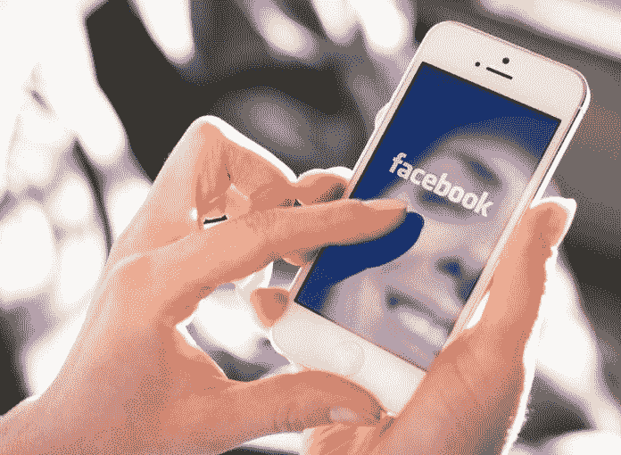

# 从长远来看，个人品牌会大获成功

> 原文：<https://medium.datadriveninvestor.com/personal-brands-strike-gold-in-the-long-run-4e8e563d5cdb?source=collection_archive---------4----------------------->

## 创建一个人物角色，这样你就知道在哪里进行营销

创造个人品牌是营销的基石，尤其是在互联网上。拥有一个人物角色决定了你应该在哪里以及在多大程度上努力。

除了是一名社会影响者，[伊恩·莫伊斯](https://twitter.com/imoyse)还是一名销售总监、云计算专家和公共演讲者。在帮助许多人建立了个人品牌之后，他和营销专家 [Madalyn Sklar](https://twitter.com/MadalynSklar) 着眼于品牌，从第一印象开始。

“一个个人品牌就是你的知名度和形象，”莫伊兹说。“就背景而言，我们谈论并专注于一个社交品牌。通常，这可以从已知的真实世界开始，然后转移到社交世界，反之亦然。

“社交让你走得更远，以一种前所未有的方式让你的专业领域为人所知，”他说。“技术实现了延伸。由你自己决定用不用。”

因此，有一个好的开端是很重要的。

 [## 计划者让社交媒体保持正轨|数据驱动的投资者

### 如果想达到并保持最高效率，忙碌的人会坚持使用系统。这是 Tweepsmap 和…背后的前提

www.datadriveninvestor.com](https://www.datadriveninvestor.com/2019/03/11/schedulers-keep-social-media-on-track/) 

“这是你的第一个数字印象，你的握手，你的‘这是我的时刻’，”莫伊斯说。“不在场也说明了一些问题——你无法控制人们的观点。

“社交媒体上有多少人在看谁在社交平台上看你？”他说。“第一批数字已经导致了现实世界的参与。”

Sklar 强调，个人品牌就是你如何推销自己。

“这是你如何向现实世界展示你和你的企业，”她说。“看看你的推特资料。它真实地反映了你的个人品牌吗？可能是时候进行审计了。”

个人品牌应该是强大的，强调积极的一面。

“在当今世界，你的社交品牌和个人资料是你给许多人的第一印象，”莫伊斯说。“你不会去参加面试或会议而不给人留下最好的印象。

“你的社交品牌 24/7 都在那里，无法控制谁会来看或者什么时候来看，”他说。“它需要代表你是谁，你代表什么，你希望别人如何看待你。”

# 你可以带着它

个人品牌也是便携的。

“无论你去哪里，它都会跟着你，”莫伊斯说。“是你的，不是你公司的。是*你的*品牌，你自己的。对乔布斯和客户来说，越来越重要的是他们判断你的标准，但却不告诉你。”

 [## 你的个人品牌告诉世界你的真正价值

### 成为负责你的信息的人

medium.com](https://medium.com/an-idea/your-personal-brand-tells-the-world-your-true-worth-65285d69cdbd) 

这就是为什么人们应该对自己的品牌负责。

“你控制你的信息，”Sklar 说。“你必须给人留下良好的第一印象。这是社交媒体的一切。

“你需要了解你的业务内外以及你的受众，”她说。“知道你在为谁服务，否则你会徒劳无功。

这导致在 Twitter 等社交平台上建立个人品牌。

“首先，定义你想因什么而出名——你的品牌形象或微生态位，”Moyse 说。“你知道什么，有专长或价值吗？理解你不能选择一个宽泛的主题。比如不要挑计算。那太笼统了。

“选择一个利基市场，如大数据、云、安全——理想情况下是一个微型利基市场，如金融股票、安全、软件即服务或客户关系管理，”他说。“建立一个社交或 twitter 品牌需要时间。走得更远需要更多时间。”

个人品牌的生死取决于他们的第一印象。

“从一个[好的强有力的简介](https://blog.markgrowth.com/make-your-entire-profile-your-best-side-ddf7ae75307a)，好的照片，强有力的文字和链接开始，”莫伊斯说。“先把基础打好。确保你的传记中有相同的图片，相同的名字或者很明显是同一个人。

“浏览他人，四处点击，找出你喜欢的部分作为你自己的想法的起点，”他说。"一致性和持久性是个人品牌的关键."

# 吸引大人物的磁铁

这可能会为你的品牌吸引重要的名字。

“一个目标是让在你的领域拥有大量追随者的有影响力的人向他们的观众分享你的内容，提到你，”Moyse 说。“如今，你在网上的个人资料是你对名片的第一印象。把它们都交联起来。”

 [## 影响力越来越大

### 寻找晋升机会和更深层次的关系

medium.com](https://medium.com/datadriveninvestor/winging-to-ever-greater-influence-8bc65070d4f7) 

他推荐了一些在 Twitter 上与其他人建立个人品牌的方法。

“跟随、倾听和参与是三个关键的咒语，”莫伊兹说。“这是为了正确的理由让正确的人注意到你。在你的影响范围内找到关键人物并追随他们。看看他们分享什么，喜欢什么。分享他们的相关内容。

“评论他人的内容，添加有用的有价值的见解和观点，参与对话，赢得被分享的权利，”他说。“如果你能创造引人入胜的原创内容、博客和播客，它们会给你的品牌带来价值。”

通过这种方式，Twitter 成为人们的谈资，将人们引向其他地方的博客、视频或图片等内容。

“接触播客、博客，提供你的内容，”莫伊兹说。他[引用了一条推文](https://twitter.com/agsocialmedia/status/1097608703866531840)，其中包括他使用另一个用户网站上发布的他的一个博客。

“倾听是你能做的最聪明的事情，”Sklar 说。“不要害怕跳进实时 Twitter 聊天，加入讨论。向你表示关心。讨人喜欢。这有很大的帮助。”

她创建了一个使用 Twitter 列表的指南，Sklar 称之为“在 Twitter 上联系和参与人们的超级有用的策略”

# 做个讨人喜欢的人

那些在社交媒体上的人应该关心被看到和听到，但最重要的是，被喜欢。每个人都想和自己喜欢的人做生意。

“你在寻求什么结果？仅仅是为了出名？成为公认的思想领袖？来获取线索？”莫伊塞说。“对我来说，这是一个意外，因为我对[云计算](https://www.datadriveninvestor.com/glossary/cloud-computing/)充满热情，因为云计算而闻名。社交销售现在也是我日常工作的一部分。

“成果包括亲自会见伟大的领袖和作家，现在*我已经开始为[甲骨文](https://www.datadriveninvestor.com/glossary/oracle/)、SAP 和 Sage 等网站施加社会影响、写博客等，”他说。“我还会受邀参加播客、演讲等活动。去找你所在领域的博客、播客之类的东西，让自己成为志愿者。”*

这些互动导致更大的事情。

“我从自己创作的内容中获得了很多灵感，”莫伊兹说。“像 [Perfect Podcast Guest](https://perfectpodcastguest.com/) 这样的网站很有用。你也可能和其他专家一起出现在[列表中](https://twitter.com/imoyse/status/1097509298350026752)，这将再次提升你的个人品牌并让你重新获得链接。

“我用的一个术语是招致——把你自己放在那里，它经常会招致另一个人来找你，”他说。“你投入和付出的越多，我发现你得到的就越多。Twitter 聊天是最好的例子。”

 [## 让你的品牌始终如一

### 旅行有助于创造伟大的内容

medium.com](https://medium.com/datadriveninvestor/make-your-brands-consistently-you-9abe44b6e75f) 

根据 Sklar 的说法，人们在个人品牌上犯的最大错误包括不一致，不坚持到底，不做你说过要做的事情。除此之外，莫伊兹还提到了懒惰和不一致。

“懒惰不是更新或拥有一张 20 年前的照片，不是让它吸引人或真实，”他说。“讲个故事:你是谁？不一致就是使用不同的图片、文字，让观众很难找到你。

“当我不得不寻找你的个人资料，并验证你就是我试图寻找的同一个人时，这让我很烦恼，”Moyse 说。“在他们首先获得回报之前，不愿意投资和付出。在你索取之前，你必须先付出

# 查看免费帮助者

他推荐了几个在 Twitter 上建立个人品牌的工具:

*   LinkedIn 或 [Twitter 网站](https://twitter.com/imoyse/status/1097509298350026752)是免费的，都是由 Moyse 建立的。
*   一个个性化的 URL 方法很简单，它让我更容易向人们推荐我的社交网站，并在这些领域获得搜索引擎优化。
*   尝试免费或低价的[照片探测器](https://www.photofeeler.com/)来检查哪张个人资料照片给人的印象最好。
*   尝试 [BrandYourself](https://brandyourself.com/) 免费或付费选项来分析你的社交存在和行动改进步骤。
*   试试[sumall](https://sumall.com/)——每周自动提醒，用图片显示谁是你在 Twitter 上最投入的观众。一个很好的例子就是[这里看到的](https://twitter.com/imoyse/status/1098145778286120960)。
*   看你分享的内容质量。在 [Fiverr](https://www.fiverr.com/) 以低廉的价格获得您自己的图像和视频。
*   检查张贴在[脸书](https://www.facebook.com/ian.moyse/posts/821641054845483)的 Moyse 示例。

Sklar 在 Twitter 上使用了许多有助于她个人品牌的工具: [Buffer](https://twitter.com/buffer) ， [Hootsuite](https://twitter.com/hootsuite) ， [AgoraPulse](https://twitter.com/Agorapulse) ， [TweetDeck](https://twitter.com/TweetDeck) ， [Canva](https://twitter.com/canva) 和 [Adobe Spark](https://twitter.com/AdobeSpark) 。

 [## 将消息传递到下一个级别

### 了解 messenger 营销和聊天机器人

chatbotslife.com](https://chatbotslife.com/take-a-message-to-the-next-level-25569825ebed) 

基本问题解决后，是时候将个人品牌提升到下一个层次了。

“打持久战，”莫伊斯说。“除非你撞得非常幸运，否则没有捷径可走。你必须建造。如果你没有立即获得成功，不要灰心丧气。坚持下去。调整，学习，坚持。我还在学习很多小技巧。看看别人怎么做。

“抄袭好的想法，”他说。“网络、推特和社交媒体是允许这种情况发生的一个很大的地方。写博客和使用视频，以及 Fiverr，通过制作有趣的东西来获得关注。”

莫伊塞和斯克拉尔继续在[脸书现场讨论](https://www.facebook.com/LearnWithMadalyn/videos/304914633548630/)中[交换](https://www.datadriveninvestor.com/glossary/exchange/)想法。

**关于作者**

吉姆·卡扎曼是拉戈金融服务公司的经理，曾在空军和联邦政府的公共事务部门工作。你可以在[推特](https://twitter.com/JKatzaman)、[脸书](https://www.facebook.com/jim.katzaman)和 [LinkedIn](https://www.linkedin.com/in/jim-katzaman-33641b21/) 上和他联系。

*原载于 2019 年 6 月 7 日*[*https://www.datadriveninvestor.com*](http://bit.ly/2EYvsKn)*。*