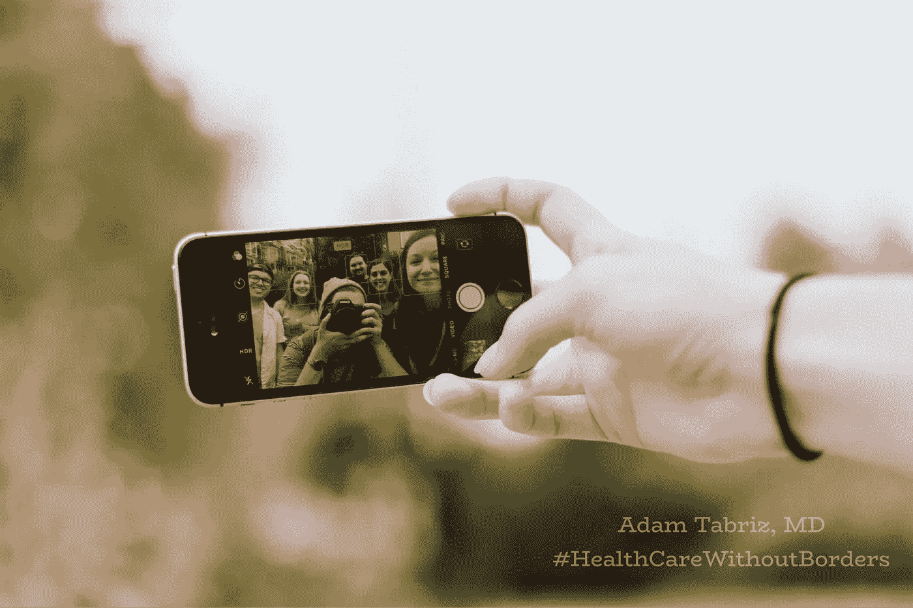

# 个性化医疗保健——千年的挑战，医疗保健任务没有取得胜利

> 原文：<https://medium.datadriveninvestor.com/personalized-healthcare-the-millennial-query-healthcare-mission-short-of-a-triumph-ba9ff66fdbd0?source=collection_archive---------3----------------------->

Millennial

我们都与本世纪前所未有的过渡生活方式有关。20 世纪到 21 世纪的几十年是技术、科学和信息列车的快车道。然而，占据头等舱座位的大多数乘客构成了日益增长的千禧一代人口。他们是本世纪超音速技术序列的最大驱动力。

各行各业都坚持不懈地努力跟上时代的步伐，只有医生例外。有些人可能会引用过去半个世纪我们在医疗保健领域取得的惊人成就来争辩。但是我必须断言，这些进步，尽管是可信的，仍然是通过非医生的技术掌握而取得的，没有经过最佳的医生验证努力。

无论是有意的，政治的，还是无意的，这都是一个离散讨论的问题，但我觉得有必要进一步阐述患者和医生在不断变化的医疗保健格局中的作用。

任何在 21 世纪上半叶步入成年的人表面上都精通技术，并依赖于技术必须提供的东西。人们可以合理地假设千禧一代比笔友更喜欢社交媒体。

 [## 大笔资金和尖端技术:人工智能/人工智能投资将如何革新医疗保健…

### 在过去几年人工智能(AI)和机器学习(ML)的显著发展中…

www.datadriveninvestor.com](https://www.datadriveninvestor.com/2018/03/22/big-money-and-cutting-edge-technology-how-investment-in-ai-ml-will-revolutionize-the-healthcare-industry/) 

自由千禧一代的态度主要适用于他们生活的各个方面，医疗保健也不例外。相反，婴儿潮一代对这种革命的适应有些分散和不一致。两代人之间的差距更大，因此医疗保健尤为重要。

当我们说话的时候，同一代的内科医生正在退休，婴儿潮一代的病人正在增加。从统计数据来看，千禧一代医生的比例无法跟上婴儿潮一代患者数量的增长，而后者仍保持着他们对健康和医疗保健服务的传统傲慢态度。

21 世纪医生的愿景仍然是维持希波克拉底式的个性化医疗，同时失去理智，迅速将神圣的临床判断转变为基于协议的僵化的企业算法患者护理。古代医生的个性化护理正在成为历史篇章的主题。

功利主义的人口健康模型是指责这种做法的动机之一。它是一个社区、国家、确定的地理边界或人口中的一组个人的健康结果，具有定义医疗保健使命的特定共享特征。群体健康也代表了界限分明的人群中结局的分散。

随着时间的推移，通过从个性化的希波克拉底医学转变为基于群体的集体方法，医学实践被迫适应功利主义的序曲。

向人口模型的转变支持了这样一种理论，即理想的医疗保健是其可交付产品的有用性的衍生物，医疗干预的目标应该是利益与风险之间最突出的平衡或对人类群体中大多数人来说最非凡的结果。

young generation

现代千年的个性化和群体医疗保健的感性经验是多种多样的，因为他们认为技术进步足以建立定制的医疗保健。带着同样的心态，量身定制的医学相当于[基因组学](https://link.medium.com/XA9cZ8hUQZ)。相反，真正的、个性化的医疗保健在战术上并不依赖技术。相反，它战略性地提高了运输效率，降低了服务成本。

[千禧一代对技术的信任和过度依赖](https://www.inman.com/2016/06/08/5-reasons-baby-boomers-are-tech-resistant/)表现在决策者或领导者更倾向于选择他们在特定责任领域的能力，而不是科学或技术知识。这与医生和婴儿潮时期出生的病人对技术的不信任形成鲜明对比。

> 但这必须改变！

就目前而言，我们必须讨论医疗保健系统内产生的真空，这种真空正在吸引错误的个性化医疗保健基础设施，是当今超级不稳定一代内极性的结果。

毫无疑问，目前的医疗保健倾向正朝着“一刀切”医学的方向快速发展。婴儿潮一代认为这是因为他们从最初的车站出发后一直在火车上，但千禧一代在寻找千篇一律的医疗保健吗？！- **然而，这项研究揭示了相反的情况。**

根据《福布斯》杂志最近一期的报道，千禧一代对他们现有的医疗体系有六个期望，这些期望必须符合他们的需求。

> **首先也是最重要的**——他们希望将个人医疗保健掌握在自己手中，不仅参与决策过程，而且成为对他们个人更有意义的事情的最终决策者。
> 
> **第二** -他们希望系统能够理解患者在任何门诊就诊前都要通过研究问题来做功课。
> 
> **第三** -他们期望门诊和医疗服务的透明度和预先成本估算。
> 
> **第四个**——年轻一代更喜欢那些能放在他们手掌里或能被电脑使用的东西。他们相信应用程序是与世界接轨的主要工具，包括医疗保健。
> 
> **第五个**——对于千禧一代来说，健康有着不同的含义。不生病不再是足够的选择。他们需要最好的，什么最适合他们的生活方式。
> 
> **第六** -越来越多的一代患者似乎以消费者的姿态处理医疗保健，就像任何其他商品一样，包括购买健康保险和医生服务。

虽然在美国公民中并不新鲜，但一种现象已经获得了前所未有的流行，并正在世界各国被采用，然而在那些功利主义人口健康已经大行其道的国家中。

千禧一代对医疗服务的挑战是对个性化医疗保健和消费主义的典型预测，因此促使并迫使医生通过帮助患者承受医疗保健领域的波动来领导这一转变。婴儿潮时期出生的医生运用他们的智慧，认为真正的个性化护理必须占据他们的领域，并努力解决关于什么是个性化医疗、保健、精确以及它们与基因组学有何不同的不断发展的误解。

> 年轻一代的现代态度导致他们对在当今破碎的医疗保健系统中接受医疗保健的方式非常不满。

因此，根据最近的一项调查，千禧一代和 X 一代分别只有 55 %和 67%的人有指定的初级保健医生。由于不满和想把自己的医疗保健掌握在自己手中的感觉，年轻一代更倾向于尝试替代模式，接受方便和负担得起的医疗保健。

总的来说，传统护理是当今患者所接受的。没有意识到目前的医疗服务计划只不过是百年人口医疗保健模式的公司化版本，它迫使医生改变今天的做法。

让我们不要忽视，每个病人都知道他们需要什么，但他们从错误的地方，出于错误的原因，以盛行的一代姿态接受护理。同时，值得理解的是，千禧一代日益增长的消费主义趋势是医疗保健变革的驱动力。这些因素包括对快速交付的期望、对在线评论等口碑营销的依赖、在承诺购买前在线查找疾病或商品、对诚信的期望和预先估计、由于高成本而想要推迟护理。事实上，对于非紧急的健康问题，千禧一代采纳网上健康建议的可能性是普通人的两倍，包括来自[社交媒体](https://getreferralmd.com/2014/12/medical-practices-social-media-content/)的建议。

在线搜索是权宜之计，前提是在没有与主治医生进行公开讨论的情况下，它们不会成为最终的决策发明。但是，面对对医疗信心的冷嘲热讽，轻信个人搜索结果是一个实际上更重要的问题的基础。患者期望的合法性得到了证实，人口健康使命得到了明确的界定，政府参与医疗保健的阶层非常明显，但政府正在尽一切努力将千年的要求变成现实吗？

此外，[千禧一代对医生和医疗保健的不信任日益膨胀，有力地表明政府未能承担起这一初始层。](https://www.mmm-online.com/home/channel/digital/survey-millennials-just-dont-trust-their-doctors/)

# 病人不信任医学的原因是多方面的

医生脱离医疗保健阶段、企业收购、技术官僚态度、过度依赖很少或没有目标验证的技术，以及安全监督。

政府的努力在满足市场需求方面起了反作用，因为医生不情愿地专注于符合错误解决方案的内部信息。与此同时，非临床实体享有接管医疗领域的特权。实际上，医生不应该担心报销纠纷或如何、多少、谁将为他们提供的服务报销。

在医患关系中，像“惊喜账单”这样的话题是多余的。相反，医生必须控制医疗技术业务和运营要求或社交媒体上共享的内容。从患者到医生，从政府到利益相关者，每个人都需要同意，光靠技术不足以满足患者的需求，因为医学不仅仅是支付系统、消费主义和保险。

# 决议在基层

尤其需要医生扮演婴儿潮一代拥抱技术的角色，教育新千年一代在协调患者、医生和技术之间的相互关系时，作为核心角色的人的因素的重要性，同时将医疗护理纳入患者自己的手中。

研究疾病，无论是在网上还是口头上，都是一种日常现象。每个医生在每次就诊时都应该欢迎它。对欣赏患者自我激励的排斥会给千禧年担忧清单中已经点燃的不信任火上浇油。病人可以接触到原始的、合法的和虚假的信息海洋。因此，为了病人的利益，医生帮助他们纠正和重新分类这些数据可能更明智。

前期成本估算和透明度非常重要。尽管如此，在如今的第三方支付协议、复杂的报销流程以及保险业对当前立法体系的巨大影响力下，只有基层才能帮助将透明度转向更好、更可持续的医疗体系。

技术已经发展成为一种生物，以确保价格透明性、有效性和数据在我们指尖的可访问性。尽管如此，医学科学还没有扩展到足以覆盖软件业的核心领域。在其业务需求、深度学习算法和数学函数方面，它确实缺乏道德失误。千禧一代想要很多应用。然而，如果医疗专家能够精确地验证这些设备背后的科学原理，那将会很有帮助。

> 不正确的工具落入坏人之手就像“未成年人手中的剑”一样危险。

是时候重新定义健康和福祉，以满足现代患者的期望了。千禧一代的健康不仅仅是避免疾病或治愈疾病。患者希望活得更长，保持活跃，保持年轻，看起来有吸引力，并茁壮成长。

现代公民的工作和未来前景依赖于保持至关重要的竞争力。对他们来说，购买健康保险与购买其他商品或服务没有什么不同。但是，21 世纪保险业内部的垄断和成本透明度不足、无法购买跨州保险，甚至短期购买，都只是与公平的市场竞争背道而驰。更多的数字选择，更多的零售诊所是我们医疗系统最次要的需求，因为它们可以在任何时间点实施——由谁或如何实施是有争议的。

大型企业竞相规划零售设施，但在物流方面却没有医生的参与。除了一些用户界面(UI)要求之外，医生在医疗技术等式中缺失或者不占据中心角色。

我不需要完全不同意作者在《福布斯》杂志上的评论，但我必须尊重地不同于医生对千禧年不信任的看法。不管属于哪一代，病人确实信任他们的医生。这是因为没有一个有逻辑推理能力的头脑正常的人会相信像健康和生命这样神圣的东西，如果没有特殊的关系或承诺由他们不重视的人照顾。

我相信病人已经对医疗系统失去了信心。这可能是作者的假设，不信任医疗保健实际上是不信任医生。今天的医疗保健绝不是关于医生的，因为它被企业功利主义无情地劫持了。毫不奇怪，诽谤医生已经成为第三方利益的必由之路。

千禧一代需要通过向每个行业的相应领域专家寻求专业帮助来找到合适的个性化护理；这包括医学专业。医疗保健领域的技术领导力必须纳入医学院课程。千禧一代医生必须在医疗格局变化的转折点上与千禧一代患者见面，利用婴儿潮一代医生的智慧为每个人提供个性化医疗保健。