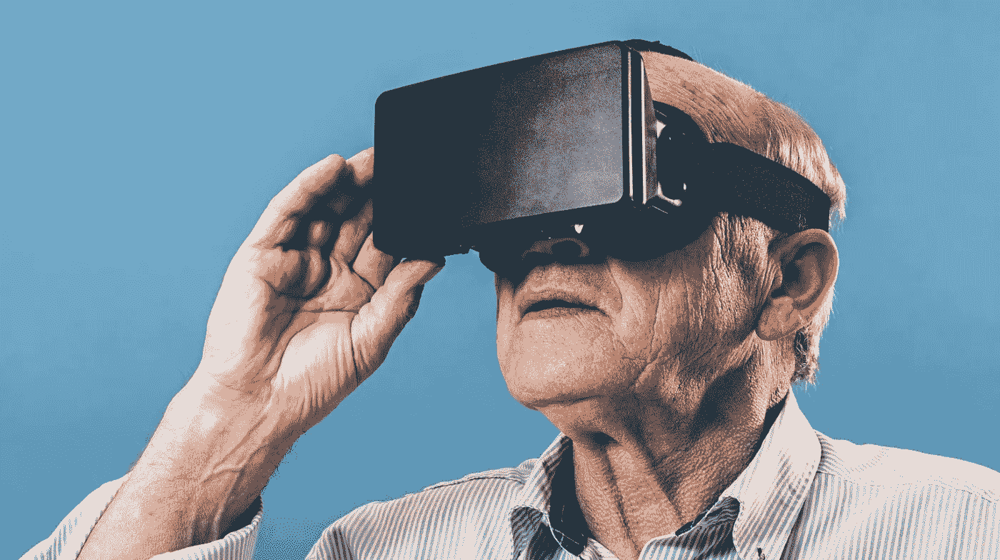
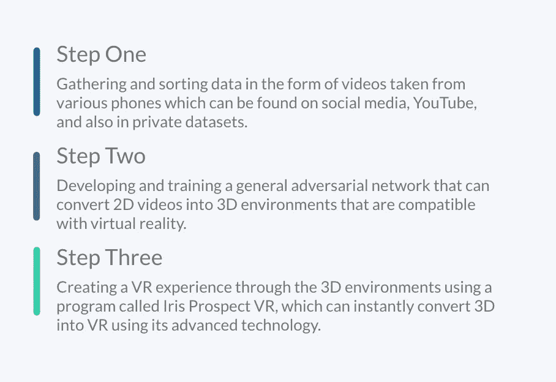
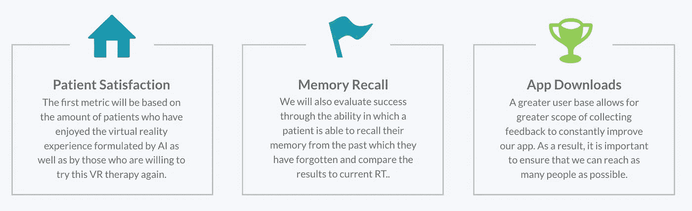

# 痴呆患者的个性化虚拟现实治疗

> 原文：<https://medium.datadriveninvestor.com/personalized-vr-therapy-for-patients-with-dementia-5768aa9650c7?source=collection_archive---------7----------------------->

## 利用人工智能和虚拟现实技术改善痴呆患者的回忆疗法

为什么痴呆症患者要*遭受*的*焦虑*？

为什么他们必须经历*创伤？*

为什么*1.52 亿人*需要经历这些？(到 2050 年)

更重要的是——为什么这 1.52 亿人的**家庭**要经历这些。

**这些**是我们需要问自己的问题。

在一次黑客马拉松中，我和我的团队( [Azim Jiwani](https://medium.com/u/ed39f4e5abbe?source=post_page-----5768aa9650c7--------------------------------) ， [Ayleen Farnood](https://medium.com/u/8b64ebec3a8e?source=post_page-----5768aa9650c7--------------------------------) )参加了 [The Knowledge Society](https://medium.com/u/58f6439cd07?source=post_page-----5768aa9650c7--------------------------------) ，我提出了使用个性化虚拟现实回忆疗法来治疗痴呆症的想法。在这次黑客马拉松之后，艾琳·法诺德和我决定采纳这个想法，并努力让它成为现实。因此，我们决定将我们的想法提交给谷歌人工智能社会公益基金，有可能获得高达$2M 的资金。让我给你分解一下我们的想法:

现状有三个主要问题:

## 问题 1:痴呆症很普遍

据世界卫生组织统计，世界上有 5000 万人患有痴呆症，到 2050 年，这一数字预计将增加到 1 . 52 亿。

这是一件大事，也是我们社会中日益严重的问题。

我们可能无法预防痴呆症，但我们可以利用指数技术为痴呆症患者找到治疗方法。

## 问题#2:有害症状

痴呆症是一个整体术语，描述与记忆力或其他思维能力下降相关的一组症状，严重到足以降低一个人进行日常活动的能力。不幸的是，它有许多副作用，如患者及其家人生活中的创伤、抑郁和全身不适。即使是唤起病人生活中的单一记忆也能极大地改善他们的心理健康和幸福。事实上，在帮助改善目前的治疗方面没有取得太多进展，这让我们的团队觉得这是一个做点什么的机会。

## **问题#3:治疗无效**

目前，痴呆症最常见的治疗方法之一是回忆疗法，这是一种展示一个人生活中常见物品以触发记忆的过程。然而，根据已完成的研究，这种疗法的大多数参与者认为这种疗法不够个性化，经常忽略触发记忆所必需的小细节。

> 只有 34%的人发现回忆疗法对他们的记忆回忆有持久的影响。

回到问题上来:

为什么痴呆症患者要*遭受*的*焦虑*？

为什么他们必须经历*创伤？*

为什么*1.52 亿人*需要经历这些？(到 2050 年)

更重要的是——为什么这 1.52 亿人的**家庭**要经历这些。

**这些**是我们需要问自己的问题。

答案是什么？

他们没有。未来 5 年内不会。在接下来的 5 年里，我们将使用人工智能和虚拟现实等技术来解决这个问题。

事实上，未来就在眼前——一家名为 Virtue 的初创公司创造了过去著名事件和地点的虚拟现实体验，作为一种回忆疗法的新方法，并看到近 80%的用户体验到了认知改善。

*等等……这不是已经在做了吗？是的——但是我们的想法更有效。*

我们的解决方案预计将使这一数字更接近 **100%** ，因为我们希望在人工智能的帮助下使用个人视频，以提供更加个性化和个性化的体验，这将更有效地触发记忆回忆。

## 我们的解决方案

我们希望将人工智能和虚拟现实的技术交叉起来，创建一种沉浸式的患者过去视频的 VR 体验。这将通过使用人工智能算法将手机中的 2D 视频转换为 3D 对象来实现，以创建一个虚拟现实环境。患者将能够使用一款应用程序，在谷歌 Cardboard 或 Daydream 耳机的帮助下，下载他们的个人视频，在虚拟现实中再次体验。

我们的解决方案有三个主要流程:

## 在我们的解决方案中使用人工智能

人工智能将加速上述过程，它将允许个人能够在短时间内体验他们自己的个人视频。人工智能模型，如一般的对抗性网络和递归神经网络，可以真实地训练模型，以创建准确的结果。我们也可以使用像 **Deep3D** 和 **Iris Prospect VR** 这样的程序来帮助这个过程。如果不使用人工智能，我们将无法在短时间内创建对 VR 体验至关重要的个性化 3D 环境。

## 数据？

> 是的，数据将成为推动我们解决方案的主要来源。其实是任何使用 AI 的事物背后的驱动力！

由于我们将使用个性化视频并将它们转换为虚拟现实，我们将需要用一个人生活中的许多日常时刻来训练我们的人工智能算法。我们需要从人们的手机拍摄的常规视频，以便训练模型能够将它们从 2D 转换到 3D 环境中。这些视频应该来自不同年份的不同类型的手机，这样我们就可以为算法使用各种各样的数据。这样，它将兼容尽可能多的不同形式的输入视频。

数据采集将非常简单，因为我们可以轻松使用手机视频的公共数据集，以及我们可以通过 Instagram、脸书和 Youtube 等社交媒体在网上找到的视频。这些将是我们的主要数据来源，因为我们需要各种各样的数据，以确保个人视频输入与人工智能模型兼容，这些数据(视频)是在人工智能模型上训练的。

## 评估成功和衡量影响

[Ayleen Farnood](https://medium.com/u/8b64ebec3a8e?source=post_page-----5768aa9650c7--------------------------------) 和我提出了评估我们成功的三个主要标准:

如果将这一解决方案公之于众，我们可以期待重大的利益和成果。

1.  **有效治疗:**我们的解决方案作为一种回忆疗法的新方法来减少记忆丧失。
2.  有价值的见解:这个项目可能为我们提供继续改善痴呆症治疗方法的见解。
3.  **改善心理健康:**许多痴呆症患者还患有心理健康不佳。虚拟现实既有助于记忆丧失，也有助于提高生活质量。
4.  **全球可用:**全世界的人都可以下载这款应用，任何人都可以轻松使用。

回到问题上来——这一解决方案会影响全球数百万人。如果这种解决方案成为现实，加拿大阿尔茨海默氏病协会等组织可能会发现使用我们的产品作为治疗方法来取代当前类型的回忆疗法的动机。

> 是时候改变我们对待痴呆症的方式了。

如果你喜欢这篇文章:

*   给我鼓掌
*   点击查看我的 LinkedIn 个人资料
*   查看我的个人网站[这里](http://www.amsalgilani.com)
*   看看我的完整作品集[这里](https://tks.life/profile/amsal.gilani)