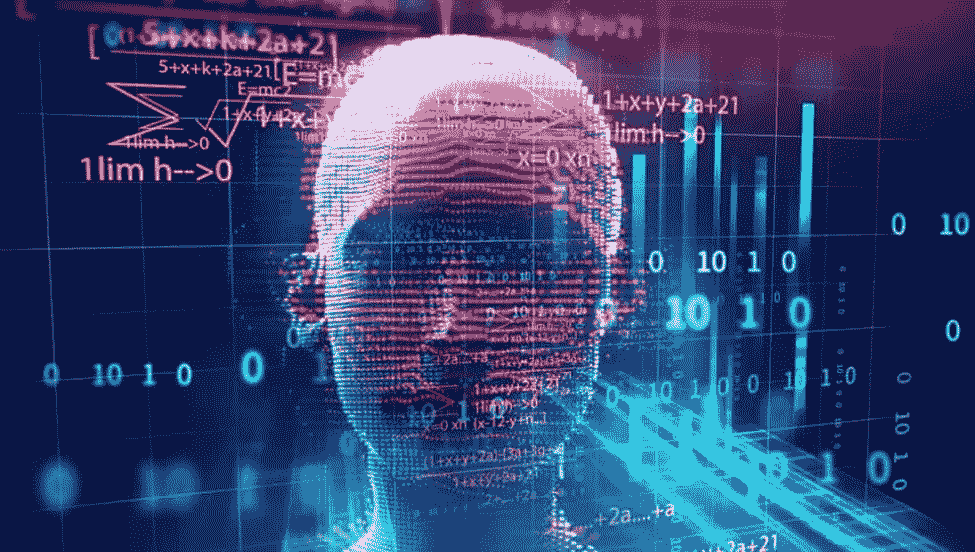

# 人工智能走向 2019 年的前景

> 原文：<https://medium.datadriveninvestor.com/perspectives-on-ai-heading-into-2019-f21ba402a136?source=collection_archive---------12----------------------->

我知道这不是突发新闻，但我终于抽出时间阅读了 2018 年 12 月版的《连线》(是的，我仍然喜欢印刷版)。这是一个有趣的问题，有一个封面主题和关于人工智能的文章——更少人工，更智能。

我对人工智能/人工智能有着浓厚的兴趣，去年我一直在为 IIoT space(https://lecida.com/——T2【莱西达】 )的人工智能领域的一家非常有前途的初创公司工作，我认为这个主题非常有代表性，我会推荐它作为阅读材料。我认为有几个关键因素值得分享。

**第一篇**出自费的文章/访谈，《机器中的人**》。她是过去十年人工智能许多进步背后的惊人力量，工作于神经科学和计算机科学的交叉领域。从普林斯顿大学的助理教授，到斯坦福大学人工智能实验室的教授兼主任，到谷歌云的首席人工智能科学家，再到去年 6 月唯一一位受邀在美国众议院科学、空间和技术委员会关于“人工智能——强大的力量带来巨大的责任”的听证会上发言的女性，她在该领域的成就可以说是首屈一指的。**

**飞飞是 ImageNet 背后的思想和能量，ImageNet 是一个人工智能工具集和数据库，它彻底改变了深度学习，是许多主要图像识别工具的背后。作为一名女性和来自中国的移民，她对人工智能领域目前的大多数研究人员都是白人男性这一事实尤为敏感。**

**作为听证会的最后一个发言人，她的信息可能不是委员会所期望的，但在我看来，是他们需要听到的。她以“人工智能一点也不做作”开头。它由人们激发，由人们创造，最重要的是，它影响着人们。这是一个强大的工具，我们才刚刚开始理解，这是一个深刻的责任。”**

**虽然一些非常杰出、强大(和男性)的技术领袖一直在警告未来人工智能可能成为对人类的生存威胁(就像《终结者》中的天网一样)，但飞飞更关心人工智能将如何影响人们工作和生活方式的近期问题。由于人工智能仍然在很大程度上受人类方向的指导，而这些人类中的大多数目前都是白人男性，所以关注点归结为“偏向于，偏向于”即使是最善意的研究人员和开发人员也无法避免他们的社会教养所固有的偏见。随着人工智能被应用于如此多影响人们的流程，从招聘和贷款申请的申请人筛选到用于“安全”和其他国家和公司政策监控的面部、图像和语音识别，很容易看到负面的社会影响。**

**重大失败或争议的例子已经存在。就在去年 10 月，亚马逊透露，他们也取消了自 2015 年以来一直在开发的人工智能招聘，因为它自学了对女性的偏见。这不能被视为人工智能技术本身的错误，而是所用算法和训练数据的错误。即使在飞飞在谷歌的任期内，该公司也受到了公众以及与 Project Maven 相关的员工的强烈抨击，该项目与美国国防部签订了一份合同，提供人工智能来解释视频图像，这些图像可用于针对无人机袭击。谷歌随后宣布不会续签 Maven 合同，并继续聘请 Shannon Vallor 担任谷歌云的咨询伦理学家。李曾支持对瓦勒的任命，并在国会听证会上引用她的话说，“没有独立的机器价值观。机器价值观就是人的价值观。”**

**飞飞的信息是，我们需要推动研究人员像伦理学家一样思考，他们以原则而不是利润为指导，并了解不同的背景。部分解决方案是试图鼓励和确保研究人员和开发人员社区的多样性。另一个是确保开发人工智能解决方案的公司采用明确的道德准则，并执行这些准则。让我们尽我们所能来实现这一目标！**

****第二个**来自卡尔·弗里斯顿的文章/采访，“**解释一切**的人。”弗里斯顿被认为是世界领先的神经科学家之一，是伦敦大学学院功能成像实验室的科学主任。他的早期工作为大脑成像开发了革命性的工具，使世界各地的研究人员能够更好地理解和绘制人脑的功能。自 2000 年以来，他发表了 1000 多篇学术论文，也是历史上最多产和被引用最多的学者之一。**

**那么，弗里斯顿和他的工作与 AI 有什么关系呢？事实证明，也许一切。在过去的十年里，他将大部分精力集中在发展“自由能源原则”上。然而，正如《连线》的文章所述，这一原理“难以理解得令人抓狂”事实上，有一个拥有 3000 多名粉丝的 Twitter 账户专门嘲笑其不透明性。**

**也许是我对物理和机械工程的背景和兴趣，也许是我自己的大脑处理信息和寻求逻辑的方式，但我相信我至少对弗里斯顿提出的东西有一个基本的了解，并在这里尝试总结一下。**

**第一个概念与生命的基本定义有关。要掌握这个概念，首先要了解熵的概念。从物理学中经典的热力学定义来看，熵是一个系统的状态度量，系统熵的变化是由其初始和最终状态决定的，系统趋向于向平衡的方向前进，或者说熵增加。热力学第二定律指出，对于孤立的系统，熵永远不会减少。实际上，虽然很少有真正孤立系统的例子。在状态变化过程中，熵可以转移到系统周围的环境中，但由于大多数状态变化是自发的或不可逆的，因此总体效果是宇宙中分散性的增加和熵的总体增加。**

**在统计力学中，熵是一个系统可能排列方式数量的度量，通常被认为是“无序”的度量(熵越高，无序程度越高)。从热力学和统计力学的观点来看，系统趋向于能量分散，导致熵增加。这就引出了自由熵的概念——在热力学中，这也被称为热力学势。自由熵(或类似的自由能)与系统从一种状态转变为另一种状态时熵的变化有关。如前所述，如果不施加额外的能量，大多数状态变化是不能直接逆转的。**

**这让我们回到了弗里斯顿的自由能原理及其对生命的定义。生命的每个部分，从一个单细胞到人脑，到一个人，到一个人类社会，都可以被认为是一个系统。生命的显著特征之一是自我保护。正如细胞保护自己免受病原体的攻击，大脑保护自己免受伤害，人类保护自己免受伤害，社会保护自己免受攻击。那么，如果生命被定义为一个以自我保护为“首要任务”的生物系统，我们如何以一种合乎逻辑的方式来描述它并应用数学模型呢？**

**在 Friston 看来，当生物系统从一个状态移动到下一个状态(从一个时间点移动到另一个时间点)时，从生物系统中释放的熵(能量)会降低系统的生存能力，因为它在不可逆的过程中固有地分散能量。所以，系统趋向于减少处于危险中的自由能，这是有道理的。根据 Friston 的说法，这可以通过最小化惊喜，或者用更合乎逻辑的术语来说，减少预测误差来实现。**

**人脑是一个异常复杂的生物系统，不断处理来自数十亿个传感器的输入，并试图分析数据、生成假设和计划行动。Friston 使用术语“主动推理”来帮助描述智能系统(如人类或人工智能)在导航环境时最小化预测误差或自由能的方式。当你的大脑做出预测，而你的传感器没有立即验证时，自由能可以通过两种方式最小化:你可以修改你的预测或假设，承认错误并更新模型，或者你可以采取行动影响模型并使预测成真。**

**如果我们将其与熵的统计力学模型进行比较，在该模型中，系统*可能处于的可能状态的数量是熵量的决定因素，通过最小化误差或可能的最终状态，我们减少了潜在的损失。这提供了一组定义明确的模型和方程，这些模型和方程不仅在统计力学中推导出来，而且在量子力学和信息论中的熵的相关定义中推导出来。事实证明，这些可以应用于开发一个可以在人工智能系统中使用的主动推理引擎。***

**目前大多数人工智能方法都基于神经网络概念，这些概念旨在模仿我们大脑处理数据的方式，但(还)无法匹配我们思考和从不完整数据中做出推断的方式。模式识别人工智能通常需要大量的数据，以及人类的指导来“标记”图像或其他工件，以告诉系统它们是什么。这些系统通常擅长做某些事情，但是当出现它们无法识别的数据时，它们可能会变得脆弱。深度学习神经网络允许系统基于对更大量数据的处理做出自己的结论，但通常仍需要人工验证，并且还会导致不合逻辑的(对人类而言)输出。强化学习人工智能最近在赢得游戏方面取得了巨大成功，如围棋、象棋和突围(你知道史蒂夫·乔布斯在雅达利时承担了开发突围的任务吗？)，并且不需要对大量数据进行人工标记，而是定义期望的结果，例如赢得游戏。这些系统通过迭代过程(游戏)和优化来学习，以达到预期的结果。然而，当面对规则(现实生活)的改变时，他们必须重新开始。**

**弗里斯顿和他的追随者认为，自由能原理、主动推理的应用以及相关熵方程的使用为人工智能提供了一条新的前进道路。我倾向于同意。**

**弗里斯顿热衷于自由能原理的另一个非常重要的应用，他认为它可以用于推进精神健康和大脑疾病的研究，以及修复精神分裂症等神经疾病。**

**— — — — — — — — — — — — — — — — — — — — — — — — — — — — — —**

**如果你已经做到了这一步，我为你鼓掌…我并不打算这篇文章这么长，但我在情感和智力上都投入了。如果我在解释弗里斯顿的自由能原理时失去了你，我希望至少我能分享费的信息。我很想讨论一下马尔科夫毯和自由能原理——也许在以后的文章中。**