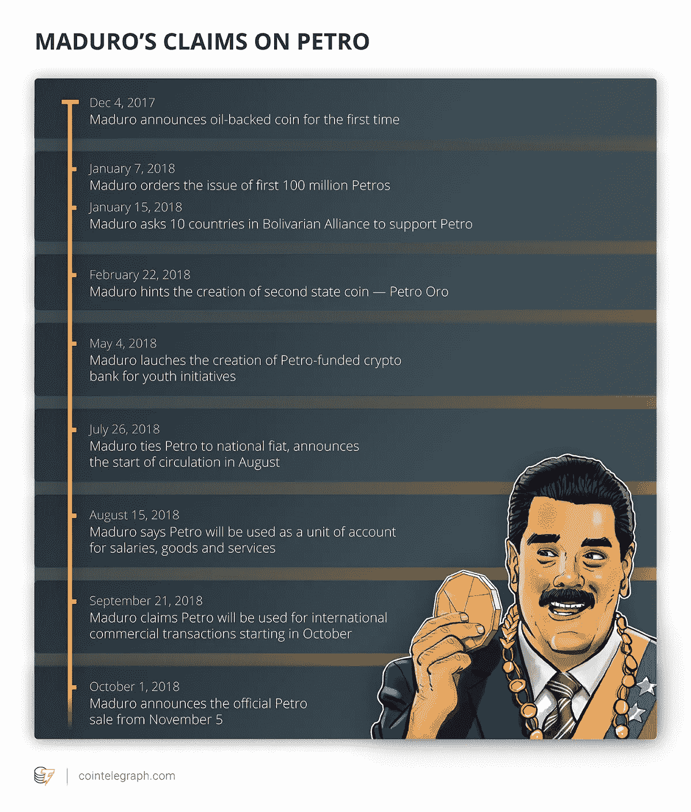

# Petro:委内瑞拉的新加密货币，它是如何运作的，为什么，解释。

> 原文：<https://medium.datadriveninvestor.com/petro-venezuelas-new-cryptocurrency-how-it-operates-and-why-explained-f0ac9f421b9d?source=collection_archive---------10----------------------->

委内瑞拉政府一直在开发一种名为 Petro 的石油支持的国家加密货币。这个新项目将允许委内瑞拉政府[出售](https://biditex.com/trade)他们的石油，以换取他们的石油加密货币，同时绕过美国施加的制裁。

委内瑞拉总统尼古拉斯·马杜罗称，该项目的目标是通过[加密货币](https://biditex.com/)接受新的支付形式，同时减少对美元的依赖。马杜罗说(粗略翻译后):

*“2019 年，我们计划用石油换原油，这样我们就能继续摆脱华盛顿精英使用的货币。”*

**马杜罗还表示:**

*“有必要推动一个平衡、公平、多元的货币体系，在这个体系中，美元作为交换货币进入，但不作为政治机制使用。”*

根据 Petro 官方 twitter 帐户发布的推文，Petro 将通过 coin 官方从该国财政部购买，或从委内瑞拉政府授权的其他六个加密交易所购买，Ancar、Amberes Coin、Afx Trade、Cave Blockchain、Cryptia 和 Criptolago。可以用[以太坊(ETH)](https://medium.com/@biditex/5-ethereum-based-products-market-cap-coins-smart-contract-3b69e0c2d592) 、[莱特币(LTC)](https://medium.com/datadriveninvestor/litecoin-oversimplified-a-beginners-guide-to-the-silver-coin-afdeca289e0c) 、[比特币(BTC)](https://medium.com/swlh/bitcoin-cash-oversimplified-beginners-guide-to-bitcoin-cash-52408d121c55) 和 Dash(破折号)购买币。然而，在这些加密货币中，目前只有比特币(BTC 和以太坊(ETH))可用。

马杜罗在 10 月 1 日的讲话中提到，国家硬币将由石油支持。此外，Petro 的全新白皮书指出，Petro 有 20%的黄金、20%的铁、10%的钻石和 50%的石油支持。

早在 2018 年 8 月，路透社发表的一份报告称，委内瑞拉没有石油存在的迹象，而《连线》杂志称委内瑞拉石油是“一个噱头”，旨在掩盖委内瑞拉政府未能从通货膨胀中复苏的事实。

***引文:***

*伯尔曼，A. (2019 年 1 月 19 日)。委内瑞拉正式开始向菲亚特出售有争议的石油硬币。https://coin telegraph . com/news/Venezuela-official-launched-sale-of-contractive-petro-coin-for-fiat-crypto*

*比特币| BTC。(2018 年 2 月 19 日)。https://www.cryptomoneytimes.com/bitcoin-btc/*

**、**、 [Biditex](https://medium.com/@biditex) 团队，每天发布有关其新闻的加密相关文章、每周市场回顾和信息性文章。

*如果您想了解更多，请访问 BIDITEX 页面并提出您的问题，关注我们的*[*Twitter*](https://twitter.com/biditex_com)*，* [*脸书*](https://www.facebook.com/biditex/) *，* [*中型*](https://medium.com/@biditex) *，* [*电报*](https://t.me/biditex%20%28edited%29) *等。投标变更用* [*投标变更用*](https://medium.com/@biditex/biditex.com) *。*