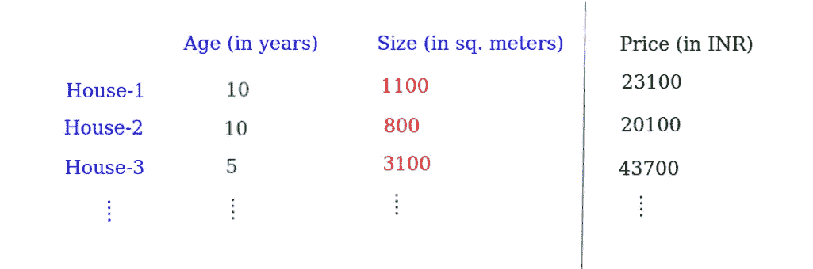
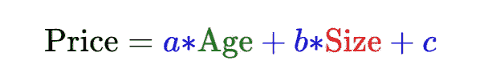
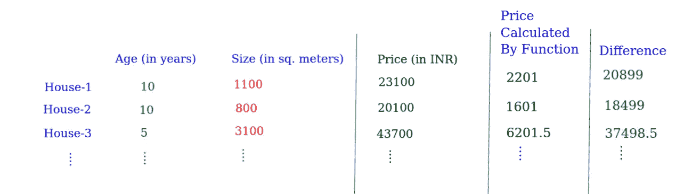
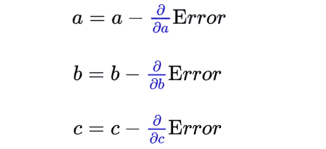
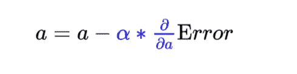
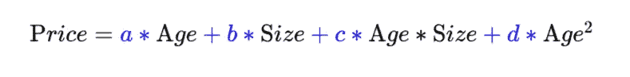
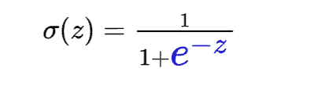
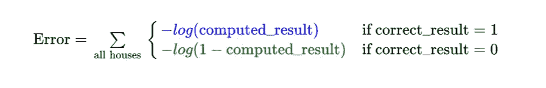

# 机器学习的哲学、科学和工程

> 原文：<https://medium.datadriveninvestor.com/philosophy-science-and-engineering-of-machine-learning-e9dc519ca31b?source=collection_archive---------12----------------------->

Photo by [Luca Baggio](https://unsplash.com/@luca42?utm_source=medium&utm_medium=referral) on [Unsplash](https://unsplash.com?utm_source=medium&utm_medium=referral)

我将首先从哲学开始，然后转到科学，然后是工程部分。

机器学习——当我们让别人认为机器在学习。
学习什么？—学习如何对某些特定问题给出正确答案。

# 机器学习的哲学:

机器真的在学习吗？或者说，机器真的可以学习吗？—这个没有满意的答案。学习，智力，意识，…；所有这些(抽象的)东西都是通过本身无法定义的生命过程介绍给我们的。试图以这样或那样的方式说服某人只是一种智力游戏。这个游戏很有趣，但就真实性而言毫无用处。试图(严肃地)从逻辑上(语言学上)处理这个问题会导致悖论、荒谬、困惑和存在主义危机。

机器学习的工作原理:

1.  普通哲学——任何东西(更准确地说，是形式恰当的问题的答案)都可以用计算来表示。
2.  数学哲学——任何函数(以及任何计算)都可以用多项式方程的形式来表示。

# 机器学习科学；

科学从一个问题开始。因此，首先你需要一个合适的问题，例如“10 年后我的房子会是多少钱?”？“机器学习的科学过程是这样的:-

1.  你需要一些你已经知道正确答案的数据(关于随机的*房子)。
2.  选择一个随机(数学)函数来计算你感兴趣的问题的答案。
3.  将此函数应用于您拥有的数据。你现在使用的函数会给出随机的结果，其中一些可能是正确的。
4.  计算你离你所拥有的数据的正确结果有多远。你选择的函数有多错？
5.  如果你得到了“令人满意的正确答案”,你就大功告成了。
6.  否则，稍微修改一下函数。
7.  转到步骤 3

*(注意:这个过程仅仅是关于机器学习的一种形式。*我们稍后会看到)

但是，这其中的科学在哪里呢？好像不太“科学”。

科学在于执行所有这些步骤的方法。机器学习科学涉及科学工具，如函数数学、微积分、线性代数、统计学、概率。嗯，只是这些学科的一些概念。这些工具在许多方面帮助了我们

1.  知道如何选择随机函数？
2.  知道如何计算你离正确答案有多远。(微积分+统计学？)
3.  知道如何朝正确的方向修改函数。(微积分)
4.  知道函数是否会达到令人满意的形式。(微积分)

# 机器学习工程；

这里的工程部分(一如既往)与科学和经验紧密结合。工程涉及这些方面:-

1.  决定你选择的函数的形状和类型。
2.  在函数中改变多少。
3.  发现自己走的方向是对的。
4.  知道如何执行整个程序并有效地完成工作。

# 机器学习的例子:

假设问题是:“10 年后我的房子会是什么价格？”

你需要收集哪些数据？一个必须的数据是:你所在地区、城市、地区、州或其他地方的房价。

你需要收集的其他东西/数据是关于影响房价的因素？

那些东西/因素是什么？
—谁知道；你必须尝试新事物。*(万物皆有联系，但有些东西联系更紧密)*。

可能是离工业的距离，可能是气候，可能是房屋覆盖的面积，可能是当地的经济状况，可能是住在附近的有影响力的人的数量，…

让我们给我们的机器一些基本的“智能”。让我们选择一个随机函数来回答这个问题。现在我们只需要两个因素:房子的大小，房子的年龄。

Data For Learning

让我们选择我们的功能是:-

Function for Learning

这是随机选择的函数形状。让我们随机给 a 和 b 赋值。假设 a=0.1，b=2.0

接下来计算房子的价格:房子-1，房子-2，房子-3，…

现在，为了找出这个函数偏离正确函数的程度，我们需要找出这个函数产生了多大的误差(错误)。

要计算有一个简单的方法:只需计算这个函数给出的价格与实际价格的差值。然后平方这些数字。然后取这些的平均值。

Calculate Error for Learning

取每个“差异”的平方→求这些差异的平均值。*(注意:这是计算误差的一种方法，不是唯一的方法)*

Function for calculating Error

现在，我们需要对原始函数进行修改，以便得到正确的函数。*注意:我们还没有改变函数的类型。我们将只是改变 a、b 和 c*

但是为了知道原始函数应该改变多少，我们需要微积分。我们将对函数进行修改，以尽可能使误差最小。

借助于微积分，我们知道如果我们对一个函数求导，结果是负的，它会把我们带到函数的最小可能值的方向。*(注意:这仅适用于某些类型的功能)*。

注意，误差函数依赖于 a、b 和 c。所以我们需要对每一个求导，然后全部改变。

Change The Function

再次计算误差，反复做这项工作，直到误差变得足够小。

最后，你会得到值 a、b 和 c，这将使原始函数成为“正确的函数”。

在很多方面，我们可以使用不同的数学工具来提高这个过程的效率。

我们可以通过使用一个常量值来控制它，从而提高变化的速度。举个例子，

Control the change in function

当我们发现我们方向正确但移动缓慢时，只需稍微增加 alpha ***的值，并小心翼翼地增加*** 。只要误差不断减小，你就是好的。

有可能我们遵循这一程序，但没有得到满意的结果。在这种情况下，我们需要改变我们最初选择的函数的类型/形状。

举个例子，

Different function

另一件要注意的事情是:当计算误差时，我们会发现计算价格和实际价格之间的差异。有些房子很大，有些很小。误差值非常大，对函数所做的更改将会非常慢，因为这一事实。在某种程度上，这些房子得到了突出，我们的程序更多地围绕这些房子，而不是所有的房子。我们关心的是相对差异，而不是每个房子的绝对差异。所以，我们要做的是:让房子的*尺寸*保持相同的比例。同样，对于*年龄*的房屋。有许多方法可以做到这一点。这个过程在技术上被称为“[特征缩放](https://en.wikipedia.org/wiki/Feature_scaling)”。

现在技术术语:尺寸、年龄以及你在函数中使用的任何东西都被称为 ***特征*** 。

我们选择的原始函数叫做 ***假设函数*** 。

变量 a、b、c 称为 ***参数*** 。

房屋的数据称为 ***训练数据*** 。修改参数使误差/成本最小化的过程称为 ***训练*** 或 ***模型拟合*** 。

计算误差的函数称为 ***代价函数*** 。如上所述使用导数最小化成本函数的过程/方法被称为*。*

*阿尔法被称为 ***学习率*** 。*

*使用上述函数和方法的整个程序称为 ***线性回归*** 。*

*如果把我们的问题从*“10 年后我的房子会是什么价格？”*到*“10 年后我的房子会卖到 2 万多印度卢比吗？”**

*现在使用和以前一样的函数是没有意义的，因为我们知道概率不能小于零或大于一。所以，我们需要一个用 0 到 1 之间的数字给出答案的函数。*

*有这样一个功能。这就是所谓的“ *sigmoid* 函数。*

**

*Sigmoid Function*

*因此，我们所做的是在我们用于 ***【价格】*** 的原始函数的基础上使用这个函数，即 z 被价格函数代替。*

*但是我们将使用不同的函数来查找误差/成本。*

*我们将采用*误差/成本函数*为:-*

**

*Cost Function*

*现在，我们重复同样的程序。找到这个误差/成本函数的导数，并修改参数(a，b，c ),直到我们达到满意的点。*

*显然，每当我们为*假设*和*成本*选择不同的函数时，我们就有了不同的机器学习*模型*。我们使用 Sigmoid 函数和 Log 函数的上述模型称为 ***逻辑回归*** 。*

****为什么我们选择不同的函数*** 来进行逻辑回归，为什么它会起作用(以及哪些函数不起作用)是一个理解其背后的数学的问题，我将在其他时间深入讨论。*

*当实际实现这些模型时，有时你会发现在你得到一个令人满意的函数后，它对于*训练数据*来说工作得太好了，但是当用它来计算真实世界中房屋的输出(*不包括在你的训练数据*中)时就很差了。这个问题技术上叫做 ***过拟合*** 。这个问题主要发生在参数数量巨大而训练数据数量较少的时候。*