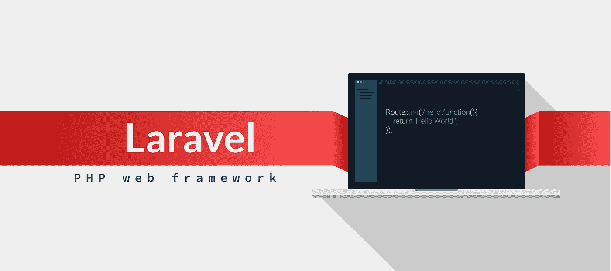

# PHP 框架:最佳框架对比列表

> 原文：<https://medium.datadriveninvestor.com/php-frameworks-best-framework-comparison-list-553fdbe072ed?source=collection_archive---------7----------------------->

不管你在构建什么，是一个简单的网站还是更复杂的东西，你都需要有业内最好的工具来完成工作。如果你的 PHP 框架构建合理，维护良好，它将为开发者提供他们需要的工具，使后端工作得更好，节省时间，并将相同的代码用于其他目的。在框架的帮助下，你将能够完成这项工作。

为了帮助您选择最适合您需求的框架，我们创建了一个顶级 PHP 框架比较列表:

# 拉勒韦尔

Laravel framework 在我们的最佳 PHP web 框架列表中名列前茅，因为它很受欢迎，并且能够使用 MVC 模式创建 web 应用程序。所有的版本都有很好的文档记录，这使得学习和快速构建应用程序变得相对容易。它有一个非常有效的模板引擎，可以完成各种任务，比如认证和缓存。

# Symfony

这个框架受到许多开发人员的喜爱和选择，因为它提供了许多可重用的组件和代码。如果你是为大企业设计 web app，Symfony 是这类项目的正确选择。它有一个很大的开发人员社区，可以提供技术支持，但是它也有大量的文档。然而，与 Laravel 不同的是，熟悉它需要相当长的时间，因此，如果您以前从未使用过它，请务必给自己一些时间。另外，如果你的项目依赖于模块化，Symfony 将是最好的选择。

 [## 2019 年最值得学习的编码语言——数据驱动的投资者

### 在我读大学的那几年，我跳过了很多次夜游去学习 Java，希望有一天它能帮助我在…

www.datadriveninvestor.com](https://www.datadriveninvestor.com/2019/02/21/best-coding-languages-to-learn-in-2019/) 

# 法尔孔

乍一看，这个框架似乎有点奇怪，因为源代码是用 c 编写的。PHP 框架的这种性能及其一流的速度使开发人员更喜欢 Phalcon 而不是其他广泛使用的框架。它资源不多，安装后只剩下少量文件，因此允许开发人员在需要时添加任何组件。这确实提供了一个平稳的开发过程，没有任何隐藏的陷阱。

# 燃料电池

当 FuelPHP 发布时，它就像一股清新的空气，因为它融合了 PHP 开发框架所能提供的最好的东西。MVC 架构及其更好的版本 HMVC 完全支持它。它是全栈式的，并提供模块化和可扩展性等特性。

# 阿维斯陀经注解

Zend 适合大型项目。它是按照敏捷方法学创建的，由于它的架构，开发人员可以专注于他们认为必要的组件。此外，它还附带了调试工具、拖放编辑器、加密编码工具和许多其他功能。因为它提供了如此多的好处，所以它一定会被列入 PHP 开发框架的列表中。

# PHPixie

并不是每个 PHP 框架都是为解决复杂问题而设计的。使用 PHPixie，你可以创建只读网站，比如社交网络和定制的网络应用。它像 FulePHP 一样使用 HMVC 模式，并使用可以单独使用的独立组件。它们都经过了彻底的测试，不需要太多的依赖。

# CakePHP

该框架在世纪初发布，目前仍在由社区进行完善。它提供快速构建和适当的类验证，使其成为定制网站开发的最佳选择之一。它是建立在 CRUD 框架之上的，这个框架使得构建外观精美、功能丰富的网站变得非常容易。它还包括良好的安全措施，具有跨站点加密保护、SQL 注入预防和其他安全功能。它还有一个庞大的用户社区，提供支持门户和高级支持。

# Yii2

如果你想知道 Yii 代表什么，它被解读为“是的，它是！”顾名思义，它很简单，但是它拥有比其他框架更好的加载技术。它是面向对象的，设计时避免了反复使用相同的软件模式。它的主要优点之一是类代码生成器，它有助于面向对象编程和快速原型开发。

# 微小的

这个框架受 Sinatra 的启发，非常适合创建不需要完整 PHP 框架的小型 web 应用程序。它有很棒的东西，比如 URL 路由、HTTP 缓存，对于创建 REST APIs 和应用程序非常有用。它很容易使用，而且由于它有很好的文档，初学者可以很快学会。

# 代码点火器

创建可伸缩 web 应用的可信框架。它使用简单，构建良好，几乎不需要用户配置。虽然 CodeIgniter 可能被视为一个 MVC 框架，但它并不完全基于这种架构:控制器是必要的，而模型和视图类则不是。话虽如此，这个框架最大的好处还是它的速度。它是所有具有数据库任务的框架中速度最快的。即使有这么多丰富的特性，它仍然很容易学习，这一点对于其他提供类似特性的框架(比如 Zend)来说就不一样了。

# 气氛

如果您正在创建一个非常简单的 web 应用程序，这是最好的选择。它拥有独立的解耦库。所有这些库都由用户社区保持更新。它最适合简单的应用程序，它有很好的功能，如配置系统，CLI 调度程序，日志实例和许多其他有用的东西。

# 飞行

这个微框架允许您管理一些日常任务，比如路由和类加载。开发人员可以设置变量，处理视图，添加过滤器，而不必先命名它们和许多其他功能。

# 梅杜

这个在列表中排在后面，因为它是一个抽象库，旨在增强开发过程。因为它是非常轻量级的，所以您可以很快学会它，并且可以很好地与一些更流行的框架 Laravel 和 Yii 一起工作。它支持简单和复杂的 SQL 查询、数据映射，并且不允许 SQL 注入。

# Pop PHP

一个经过全面测试的微框架，可以非常快速地创建 REST APIs 和应用。它也被称为“爆米花”,并提供了非常少量的基于网络的组件，但开发者可以根据情况添加它们。创建它是为了确保开发人员根据请求方法遵守路由规则。

# 无脂肪的

尽管这是一个微框架，但是它与列表中其他微框架的不同之处在于它包含了许多在 Laravel 和 CodeIgniter 中可以找到的有用特性。它支持 SQL 和 NoSQL 数据库，用它很容易创建 web 应用程序。虽然看起来它丰富的特性集需要全栈开发，但对于 PHP 开发人员来说，它仍然是一个很好的框架。

框架的选择最终将取决于你的项目，你有多少时间来创建它，你有可用的人才以及你的个人偏好。如果您手头有一个大型项目，那么性能最好的 PHP 开发框架是 Zend 和 Symfony。如果你的任务是创建拥有所有最新趋势和功能的令人瞠目结舌的网站，那么你应该选择 CakePHP。如果你对一个微框架感到满意，那么尝试使用无脂肪的，然后继续使用列表中的其他一些。

*最初发表于*[*sky well . software*](https://skywell.software/blog/php-frameworks-comparison-list/)*。*