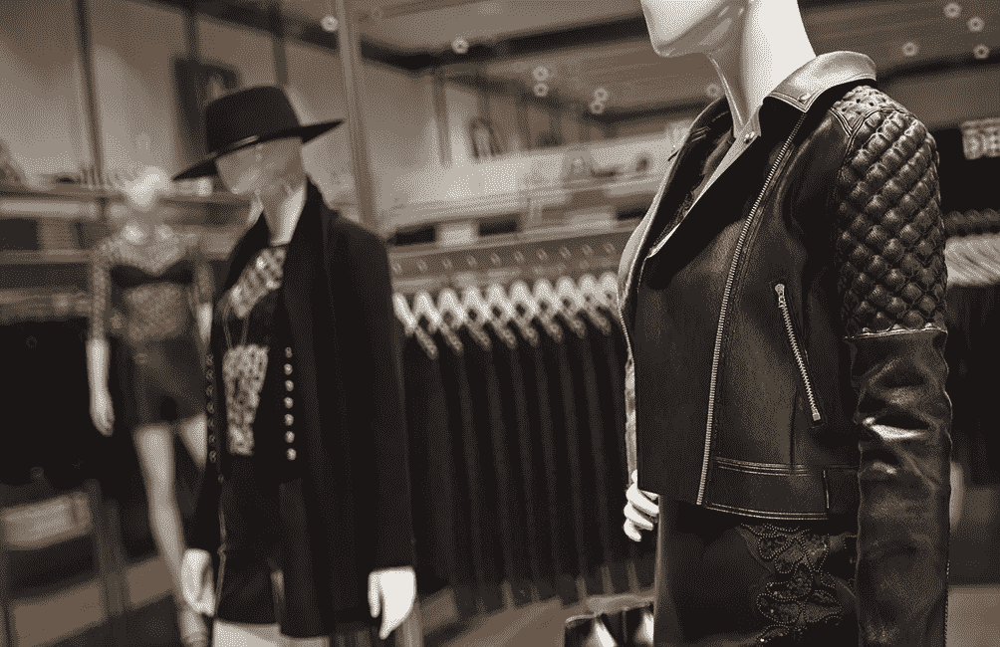
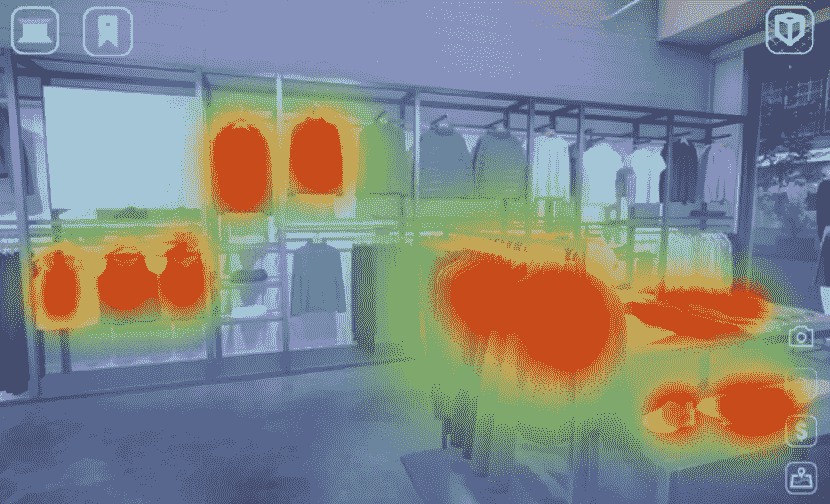
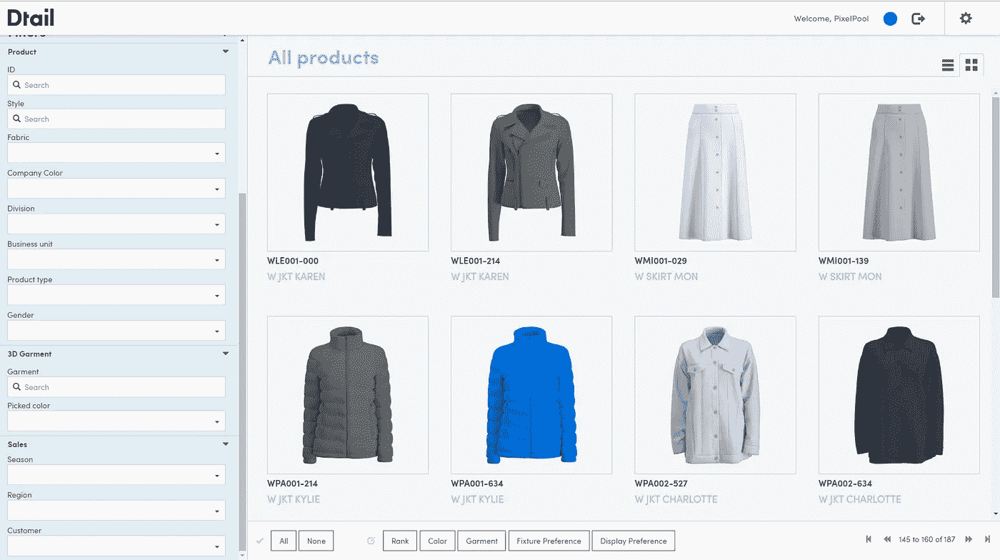
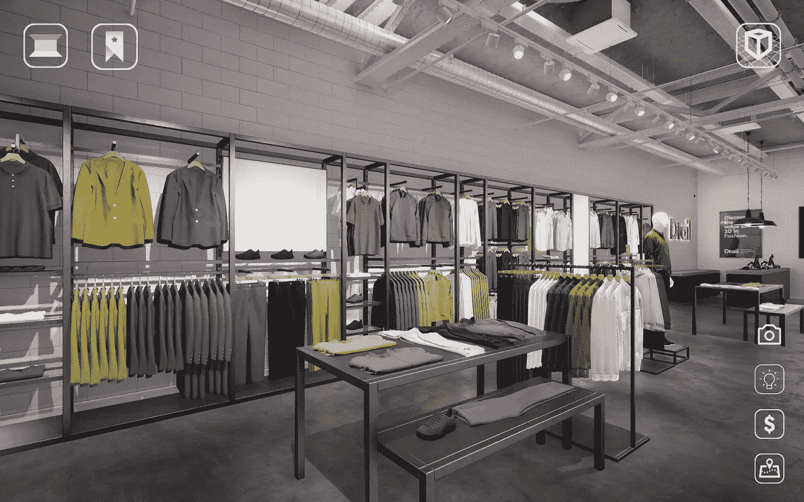
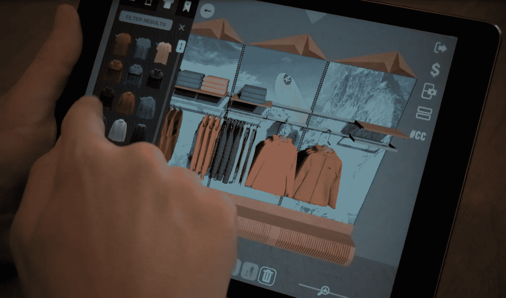

# 物理到数字:时尚产业的颠覆

> 原文：<https://medium.datadriveninvestor.com/physical-to-digital-disruption-in-the-fashion-industry-1a88be78a3a5?source=collection_archive---------0----------------------->

High quality 3D render, PixelPool

向消费者展示实物产品和样品时，3D 可视化和虚拟现实技术成为标准，尤其是在时尚行业的 B2B 环境中。让我们深入了解比我们今天认为的创新更进一步的技术和概念，并看看明天可能会发生什么。

众所周知，时尚界在采用创新方面落后于其他行业，尤其是服装行业的奢侈品行业，他们倾向于依赖纸笔、传统和遗产。他们没有意识到，用电脑代替铅笔并不会淡化工艺感，而是反映了一个公司的愿景、目的和适应水平。我们不再互相写信，而是使用视频电话和电子邮件进行交流，这是有原因的。

 [## 人工智能和虚拟现实的融合-你能期待什么|数据驱动的投资者

### 在技术领域，融合是合乎逻辑的一步。就在几十年前，你可能需要一个专门的…

www.datadriveninvestor.com](https://www.datadriveninvestor.com/2018/08/30/the-convergence-of-ai-rv-what-you-can-expect/) 

目前 23 岁或更年轻的人都被认为是真正的数字原住民。我们其余的人仅仅是数字移民，没有他们那么聪明。数字原住民出生在一个数字世界，他们在技术的包围中长大，从小就与技术互动，这使他们更好地了解他们周围的数字景观。这意味着年轻一代和下一代对他们购买的品牌有更高的期望。全球超过四分之一的人属于这一类别，数字适应和采用将比以往任何时候都更加重要。

幸运的是，越来越多的时尚品牌正在关注数字化和创新领域发生的事情。随着进一步的进步和创新，场景变得更加饱和，解决方案更加丰富和具有破坏性，所有这些都旨在显著改变品牌和消费者在各自领域的运作方式。

让我们深入了解比我们今天认为的创新更进一步的技术和概念，并看看明天有什么可能。添加和升级到“简单地”创建和设计三维服装。即将出现的技术可以使公司经得起未来考验，为他们提供竞争优势。销售自己的虚拟商店，虚拟现实焦点小组来衡量你的 3D 分类和你只能在虚拟空间穿的衣服。是时候进行从物理到数字的转变了。

**颠覆 1:沉浸式销售**

当新技术被发现和实现时，我们倾向于保守地开始。品牌创建 1:1 相同的商店环境和服装系列的虚拟副本。但这只是冰山一角。游戏引擎和 3D 软件可以让你创造挑战重力的环境，超越你最疯狂的梦想。一切皆有可能。

futuristic 3D animation in surreal setting, The Fabricant

那么，为什么我们仍然只创建现有商店环境的精确 3D 副本呢？为什么不创造一种能真正让客户刮目相看的客户体验呢？许多品牌已经在他们的 B2B 批发过程中利用虚拟 3D 商店环境，减少了实体模拟商店和实体样品。如果我们以耐克为例，当销售给 B2B 批发客户时，他们几乎完全摆脱了他们的实体，专门的模拟商店。你会发现大型电视屏幕显示互动的虚拟旗舰店，根据特定客户的确切需求进行销售，而不是通常的充满实体服装的实体固定装置。

随着网上购物的兴起，传统的实体店变得不那么重要了。更多的销售发生在网上，数字化和虚拟化。因此，让我们摆脱传统的销售服装的方式。或者事实上，甚至是传统的虚拟销售方式，让你的想象力自由驰骋。为什么你不想想象你的太阳镜收藏在巴西的海滩上，或者在地中海的游艇上？

一家知道如何让 3D 看起来更好的公司是数字时装屋(digital fashion house)，该公司是一家制作者，他们创作了逼真的高质量 3D 渲染和动画，展示了中空人体模特在你能想象到的任何地方穿着的高级时装。今年，他们甚至以高达 9500 美元的价格卖出了一件 3D 服装。请记住，这件衣服不能穿，不能摸，甚至不能看。当然，除非你正看着屏幕。如果这个概念看起来陌生或奇怪，问问任何一个 12 岁的孩子，他们是否曾经在他们最喜欢的视频游戏中的虚拟服装或所谓的“皮肤”上花过钱。可能会让你吃惊的是，很可能每个人都为他们的网络角色买了一件数码衣服。

目前最大的游戏之一，堡垒之夜，通过销售网络角色的虚拟服装、鞋子和配件赚取了数百万美元。意大利时装公司 Moschino 设计了一个服装系列，既可以在现实生活中穿着，也可以在流行的生活模拟视频游戏“模拟人生”中穿着。最新的时尚和游戏合作伙伴是各自行业中最大的两家公司——路易威登为英雄联盟电子竞技世界锦标赛设计了定制皮肤和奖杯外壳。

如今，为消费者提供符合他们期望的虚拟购买体验是必须的。这是因为，今天的消费者已经很好地连接到互联网，他们希望从他们购买的品牌那里得到同样的东西。

甚至奢侈时尚品牌现在也在探索利用 3D 可视化的可能性。聪明的品牌利用游戏引擎和 3D 软件提供的创意自由，以发挥他们的创造力和最疯狂的幻想。高级时装品牌创造的时装往往同时也是艺术。你如何恰当地想象一个从未创造过的、与世界各地时装秀上展示的服装的前卫外观和感觉相匹配的商店环境？像 Unreal 和 Unity 这样的引擎，或者像 3D studio Max 这样的软件，为创意人员提供了无限的可能性，来创建无视所有逻辑的商店环境，并充分捕捉品牌的创意天才。当时装业最传统、最保守的部门也在探索创新领域，发现数字化的可能性时，人们的情绪真的在转变。还记得我们认为我们不需要手机的时候吗？有时需要一段时间才能认识到某样东西的价值并接受它。

**颠覆 2:虚拟现实神经科学**

3D 和虚拟现实技术每年都在大步前进。如今无处不在的虚拟现实头戴设备正变得更加详细、强大和有能力。世界上最大的虚拟现实护目镜制造商 Oculus 最近推出了他们的最新型号 Oculus Quest。Quest 允许用户抛弃他们的控制器，使用他们的手。耳机外部的四个微型广角摄像头可以跟踪用户的手和环境，使任何外部传感器和操纵杆变得无关紧要和不必要——再次降低了虚拟现实的门槛。

另一家虚拟现实耳机制造商 HTC 凭借他们的新护目镜 HTC Vive Pro Eye 更进一步。Vive Pro 是第一款大众市场 VR 头戴设备，配有标准眼球追踪功能，为游戏设计工作室、公司和消费者开辟了一个充满可能性的世界。但是如果我们更进一步，将神经科学加入其中，会怎么样呢？

如果你可以给一个焦点小组的成员一个虚拟现实耳机，让他们在你的一个虚拟商店里自由活动，里面装满你的最新收藏，并跟踪他们在哪里看，走，以及大脑中触发了什么反应，会怎么样？例如，你确定你最新的衬衫，那种颜色最适合放在商店的那个位置吗？只要让一个顾客进来，看看你的商品会引起什么样的反应。将销售和营销数据与人类的纯情感数据相结合，应该是研究人员的梦想。

Virtual reality heatmap technology, applied in fully merchandised, interactive, 3D store environment. By Dtail.

在研究人类和啮齿动物的大脑时，虚拟现实的使用频率越来越高。目前，世界各地的神经科学实验室正在进行研究，旨在解开我们大脑的复杂性。将来，如果与大脑活动和反应相关的神经科学测量设备变得更容易获得，它将是准确和诚实地测量客户和同事反应的完美工具。这在所有阶段都会派上用场——无论是在一件服装的设计阶段，还是在为你最大的批发客户之一完善销售设置时。将神经科学与 3D 和虚拟现实相结合，确实是时尚界在不久的将来不能忽视的一个非常强大的组合。

**颠覆 3:人工智能营销**

无论你是想在优步搭车，还是想用谷歌地图找到某个地方，或者是坐在飞机上，人工智能(AI)今天都在我们身边。你知道吗，在一般的飞行中，只有七分钟是留给人类飞行员的。除了起飞和降落，自动驾驶仪还指引飞机到达目的地。如果我们把这种智慧投入到，比方说，你的营销工作中，会怎么样？

想象一下，你不再需要亲自推销一个完整的商店来了解什么有用，什么没用。比方说，通过设置算法的参数并点击一个按钮，你将会收到一个完全商业化的商店——数字的和三维的。您将能够在定制的虚拟环境中漫游、互动和调整。这听起来像是明天的创新，但它已经在这里了。

让我们来看看简化时装业销售流程所需的不同数字创新。

每一个时尚品牌从实体到数字的转变都有一个坚实的 3D 基础。构建服装的 3D 库是数字化工作流程的核心。采用能让你以 3D 方式设计系列的软件正变得势在必行，因为整个行业正从实物转向数字。制造商、供应商和时尚品牌都在向 3D 发展。有公司有经验和能力为你创建大容量的 3D 收藏和图书馆，但越来越多的时尚品牌选择在内部完成一切。

3D clothing library, Dtail

大多数开设时尚课程的时尚学校和大学都在课程中提供 3D 设计，甚至作为学士或硕士课程。大多数被介绍到就业市场的时装设计师都有 3D 背景，并准备开始为任何想要他们的时尚乐队工作。利用正在释放的年轻和渴望的专业人士的浪潮，帮助您的过渡或进一步帮助您的数字化。

当你的 3D 图书馆就位后，你就可以开始考虑商店环境了。游戏引擎，如 Unreal 或 Unity，通常用于创建商店的内部和外部。就像你的孩子在玩的电子游戏一样，一切都可以被操控。因此，无论你想要一个简单的方形零售空间，还是一个更加定制和实验性的环境，一切皆有可能。请注意，你的三维服装库，以及你的商店环境，包括夹具，都可以通用，以节省成本。特别是在开始的时候，当你的公司可能没有足够的预算来定制所有的东西时，拥有一个通用的 3D 服装库和商店环境可能是一个明智的举动。说服管理层和习惯 3D 需要时间。

到目前为止，对于早期采用者来说，这听起来应该很简单。3D 服装和商店环境的结合使得像耐克这样的公司能够完全数字化他们的 B2B 销售过程和营销工作。耐克很早就认识到了 3D 的价值，并全力以赴。他们现在已经完全改变了销售和商品的方式。现在，所有的一切都是数字化的，而不是充满新系列实物样品的实体模拟商店，手工销售以满足他们特定客户的需求。大型触摸屏显示互动虚拟商店环境，充满了他们最新的 3D 收藏。所有商品都被迅速数字化，以最好地满足他们个人账户的特定需求。不再有昂贵的实物样品，这是由公司内不同的团队争夺的夹具。清洁、可持续、快速、经济、面向未来。

Merchandised interactive 3D store environment, Dtail

现在是最精彩的部分——汽车销售。如果你可以将你的 3D 服装库上传到一个平台上，让你可以通过点击一个按钮来形成分类，自动销售整个数字商店，并以逼真的质量呈现，那会怎么样？无论你是在进行内部沟通，还是为你的批发账户创建模拟商店，或是推销你最新的全球系列，你附加在服装和系列上的数据越多，算法就越准确和有效。什么样的衣服应该折叠，什么颜色的夹克应该放在商店的前面，你的产品组合中有百分之多少需要运动服？将数据附加到你的算法或特定的服装上，请求商品环境，几秒钟内你就会得到逼真的虚拟商店环境。为最大的影响而推销。

**实施创新技术**

所有新技术和工作流程都需要在某个时候实施。一家公司越创新，由于经验和知识的原因，转型就越容易。当采用一项新的颠覆性技术时，有几个因素可以决定实施的成败。

基于由业内资深人士参加的焦点小组，由 PixelPool 主办，于 2019 年 6 月在纽约市 PI Apparel 举行。我们发现了品牌在公司实施创新时遇到的挑战。

从管理的角度来看，最重要的是认识到给员工时间学习的重要性。让自己熟悉新技术和软件不是一朝一夕的事。给你的员工必要的时间来了解新的实施。允许他们犯错，并做好试错的准备。这是学习和记忆信息的最好方法。

探索创新领域的时尚品牌的另一个常见误解是相信他们会找到一种工具来解决所有问题。时尚创新领域由众多供应商组成，他们都专注于您工作流程的不同领域。肯定有重叠，但你必须寻找正确的创新，迎合你的工作流程的每个部分的具体需求。随着 3D 厂商开始更加紧密地合作，考虑到未来的集成，让多个解决方案毫不费力地协同工作将变得更加容易。

Drag & drop 3D merchandising application, Dtail

这可能听起来违背直觉，但不要追求完美。还没有。时尚界对创新解决方案的认识和采用越来越多，并将带来更广泛、更廉价的产品。随着技术的进步，越来越多的时尚品牌加入创新行列，我们将会看到更具成本效益的解决方案随时可用。如今，大多数创新都被时尚行业的先锋大品牌所采用。为接下来的工作打下基础。最重要的是，作为一个最有可能刚刚涉足创新领域的品牌，预算会很紧张。就像生活中的其他事情一样，3D 渲染和技术也是如此——你付出的越多，你得到的就越多。我们不要忘记，大多数品牌都在关注 3D，以取代非视觉工具和流程。一个 3D 模型，无论质量如何，都已经是一个巨大的进步。有了经验、预算和知识，就会有更高的质量和更具体的创新。所以，不要让第一个 3D 模型看起来不真实的事实阻碍你。

最后，品牌不应该急于彻底检查他们的整个管道。逐步引入试点项目并加以实施，将会缓解这种转变。在使用其他工具或平台之前，先熟悉一种工具或平台。为创新打下坚实的基础将极大地有助于未来的努力。

**地平线**

整个行业正在慢慢转向以数字工作流为主，采用先进的创新和解决方案。节省时间、金钱和保持竞争力从未如此重要。致力于数字化时尚产业的创新公司比以往任何时候都多，总有一种解决方案适合您的工作流程。甚至像古驰和纪梵希这样的奢侈品牌也开始涉足创新领域。当即使是最保守和传统的时装公司也在寻求数字化时，你知道态度的改变即将到来。

开始您的创新之旅永远不会太迟，不要被众多不同的软件和解决方案所淹没。好好看看你当前的工作流程，看看你可以通过数字化改进哪些地方，以及你想从哪里开始。无论您是跨国公司还是精品风格的供应商，总有一款适合您。

时装业全面数字化发展的最后一大障碍是对透明度和知识共享的恐惧。守口如瓶是时尚界的一句谚语。现在想要创新的主要动机是保持领先——不仅是与竞争品牌，有时甚至是与一家公司的其他部门。如果没有人愿意伸出手来，携起手来，我们都留在我们自己的小岛上，减缓整个时尚产业的创新和可持续发展。幸运的是，有人试图扭转这一趋势。3D 零售联盟(3DRC)是一个很好的例子，它将全球零售商和品牌聚集在一起，进行合作，制定行业标准和分享知识。拥抱创新并释放其全部潜力是这个行业的责任。我们都同意，我们可以一起推动时尚产业向前发展，走向未来。