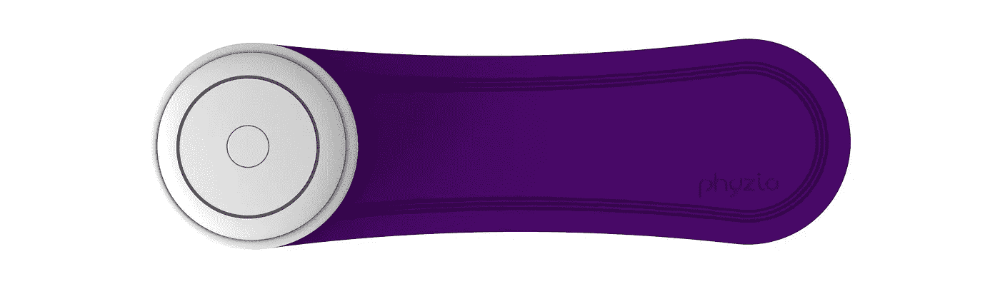

# Phyzio 为慢性疼痛患者带来家庭医疗保健

> 原文：<https://medium.datadriveninvestor.com/phyzio-brings-healthcare-at-home-for-chronic-pain-patients-8f61411b093f?source=collection_archive---------19----------------------->

由[Bhargav Srinivas Veriketi](https://www.phyzio.co/author/bhargav/)| 2019 年 3 月 6 日

10 个被诊断患有慢性 T2 病的人中有 6 个认为他们没有尽全力应对自己的病情。与此同时，67%的医疗保健提供者认为患者不确定他们的目标健康指标。75%的医生只是在一定程度上相信他们的病人真正了解了他们的现状和他们目前的健康状况。

大多数病人和他们的医生都认为病人对自己的病情缺乏信心。这次检查是由西方公司领导的；许多人可能知道他们过去的公司名称，Televox。

正如彼得·德鲁克(Peter Drucker)的名言，“你无法管理你不衡量的东西。”不知道一个人的量化目标健康目标包括健康素养和强迫患者参与，促使有问题的医疗保健结果。在一个以价值和人口为基础的健康管理世界里，这对于支付者、提供者和患者来说都是一个两难的选择。由于患者通过高免赔额和 HSA 面临更多的直接自付费用，这对个人来说是两倍的困难——无论是临床上还是金钱上。

被诊断患有慢性疼痛对病人来说是沉重的负担。West 发现，焦虑、沮丧、压力和抑郁是收到慢性疾病(如糖尿病、肥胖症、[充血性心力衰竭](https://www.mayoclinic.org/diseases-conditions/heart-failure/symptoms-causes/syc-20373142)或慢性阻塞性肺病)消息的个人的常见共病和反应。超过五分之一的患者经历睡眠困难，四分之一的患者感到精疲力竭。

对于热衷于改善其实践的医生来说，当涉及到慢性疼痛时，患者更有可能报告他们的状况不佳，因为他们不太可能了解自己的身体和健康。那么患者想要什么呢？根据 West Corporation 的调查，70%患有慢性疾病的人希望获得更多的资源/阿片类药物来控制他们的疼痛，91%的人表示需要疼痛控制方面的帮助- **不是在医生的办公室，而是在家里**。

患者希望获得更多的自我护理和支持:88%的慢性病患者希望获得一些疼痛管理方面的帮助，并相信这种治疗将对他们的整体健康产生巨大影响:

*   35%的人希望更好地了解如何改变不健康的行为
*   33%的人想要更个性化的治疗方案，
*   31%的人知道如何更好地管理他们的状况
*   定期检查很重要:54%的病人将两次或三次与医生的检查视为贵重物品。

大多数患有慢性疾病的患者会欢迎一种便携式疼痛缓解技术，该技术可以收集、通知并由患者在任何时间任何地点使用，作为他们在家日常自我护理的一部分。只有 6%的患者认为这没有用。

重要的是要认识到，患有慢性疾病的人往往年纪较大。因此，这些患者中的绝大多数会欢迎一种便携式医疗保健技术，这种技术不仅有助于他们缓解疼痛，而且有助于未来的疼痛预防。

这项对慢性病患者的研究揭示了一个非常吸引人的受众，他们显然对医生偶尔出诊的现状以及缺乏连续性和对在家自我管理慢性疼痛的支持感到沮丧。我们感到 Phyzio 的部分原因是，对于那些正在应对慢性疼痛状况的人来说，我们理解他们完成日常任务有多困难。Phyzio 是为任何经历慢性疼痛的人设计的，目的是缓解和提高你对抗慢性疼痛的整体力量。Phyzio 也有助于改善一个人的海报，并训练你的身体更强大，以对抗未来的疼痛情况。

信息是从 HealthPopuli.com 提取的