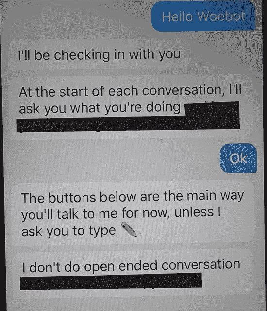

# 为回答一个程序提出的问题而挑选固定的选择答案不是“对话”

> 原文：<https://medium.datadriveninvestor.com/picking-canned-selected-answers-in-response-to-a-question-posed-by-a-program-is-not-a-30a7eaa0f795?source=collection_archive---------49----------------------->

Edited App Screenshot Captured from iPhone

Woebot 是一款服务于伟大事业的应用程序:用认知行为疗法(CBT)的技术帮助人们改变情绪。该应用程序适用于 iOS 和 Android。

这款应用的开发者包括艾丽森·达茜(CEO)和吴恩达，后者是 Coursera 的联合创始人，也是公认的人工智能专家。

该应用程序使用的方法是为了促进算法(或一组算法)与人类之间的信息交换。这些交流在很大程度上(正如应用程序在本文顶部的截图中所表明的那样)包括从指定的问题列表(对话开始者)和响应列表中进行选择:应用程序提出问题，人类接受提供的响应，或者从选择列表中进行选择。

但是该方法不是会话式的。然而，在一个名为“ [May A.I. Help You](https://www.nytimes.com/interactive/2018/11/14/magazine/tech-design-ai-chatbot.html) ”的故事中克莱夫·汤普森(Clive Thompson)为《纽约时报》(New York Times)撰写的一篇文章中，汤普森评论道，“……除此之外，(Woebot 的)个性是乐观的，它的对话中夹杂着表情符号和动画 gif”。

读者会对这个聊天机器人的“智能”产生错误的印象。故事的副标题“智能聊天机器人可以自动化掉我们几乎所有的商业互动”强化了这种不正确的印象

如果 Woebot 是一个接近对话式人工智能的例子，那么鉴于深度学习算法的局限性和机器很快实现“认知”的幻想，它代表了一个没有可预见终点的旅程中的一个过渡步骤。所以现在的方法是从人机交互中去掉真正的“对话”,代之以脚本:固定的问题和固定的回答。

就像古老的谚语“如果你在穿过森林的路上撞到了一块石头，只要绕过它就行了”一样，前沿人工智能只是拒绝了实现一台真正能够进行无脚本对话的机器的需要，并向我们展示了一种“机械说话”的立场。也许这是一件好事，也许不是。

但是不管一个人对这个话题的想法如何，作者最好不要让读者误解一个人工智能真正能够做什么，特别是在像简单、无脚本的人类对话这样的热门话题上。