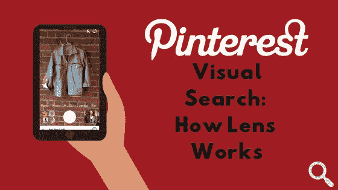
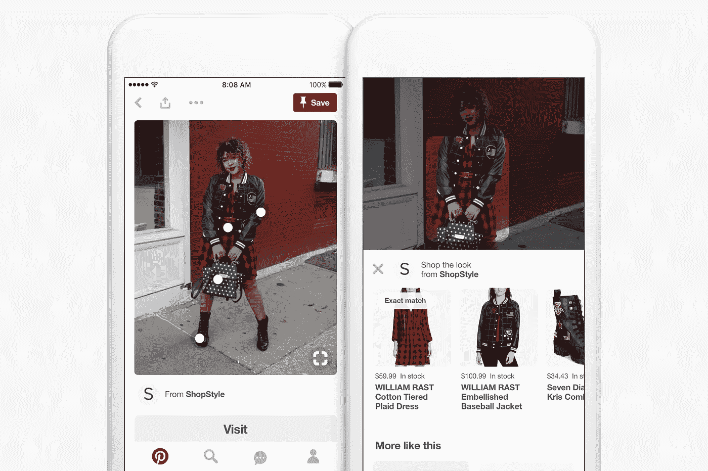
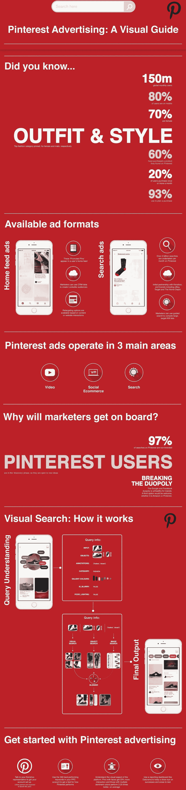

# Pinterest 视觉搜索:统计，广告，以及如何开始使用 Pinterest 镜头。

> 原文：<https://medium.datadriveninvestor.com/pinterest-visual-search-statistics-advertising-and-how-to-get-started-with-pinterest-lens-c9750328b2b3?source=collection_archive---------11----------------------->

Created by author.

Pinterest 的视觉搜索技术有了显著改善，尤其是通过推出 Pinterest Lens。

当用户没有足够的词语来描述他们正在寻找的东西时，他们现在可以使用智能手机的摄像头作为搜索输入。

这对时尚或家居装饰公司来说意义重大，因为视觉搜索开辟了一种全新的与观众互动的方式。

这很重要，因为我们可以说视觉搜索创造了一种前所未有的真正新颖的行为。语音搜索通常只是表示不同的输入格式，而意图本身保持不变，而视觉搜索允许我们搜索过去不知道如何找到的对象。

例如，如果有人正在为即将到来的活动寻找服装灵感，但无法描述他们正在寻找的东西，他们可以从 Pinterest 的 [Lens the Look](https://newsroom.pinterest.com/en/post/introducing-the-next-wave-of-visual-search-and-shopping) 产品中获得一些帮助。用户可以将一件衣服作为搜索的刺激，为 Pinterest 提供一个起点来识别其图像数据库中的相关物品。

使用计算机视觉算法的品牌可以让它们的商品在 Pinterest 搜索结果中排名靠前。鉴于 Pinterest 的良好转换率(价值 1 美元至 199 美元的篮子的转换率为 [9%](https://heapanalytics.com/blog/data-stories/4-key-facts-you-should-know-before-allocating-ad-spend) ，密切关注这个平台是值得的。

Lens the Look

当然，更多的行业将很快释放视觉搜索的潜力。

考虑到这一点，下面的指南包含了一些重要的 Pinterest 视觉搜索用户统计数据，以及 Lens 如何解释查询的细节，以及品牌如何在 Pinterest 上开始广告。

Created by author.

要了解有关视觉搜索的更多信息，请查看:

Pinterest [工程博客](https://medium.com/@Pinterest_Engineering)

[视觉搜索统计](https://medium.com/@clarkboyd/visual-search-trends-statistics-tips-and-uses-in-everyday-life-d20084dc4b0a)、[趋势、新闻](https://medium.com/@clarkboyd/visual-search-trends-statistics-tips-and-uses-in-everyday-life-d20084dc4b0a)。

视觉搜索的过去、现在和未来