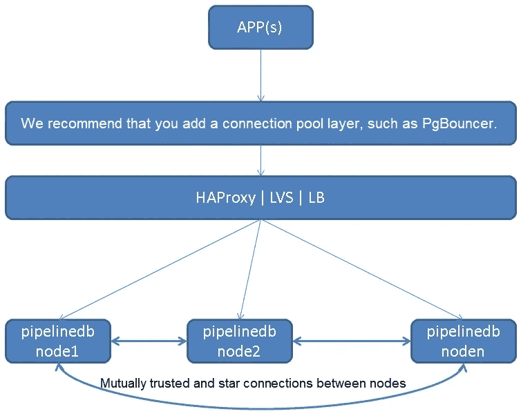
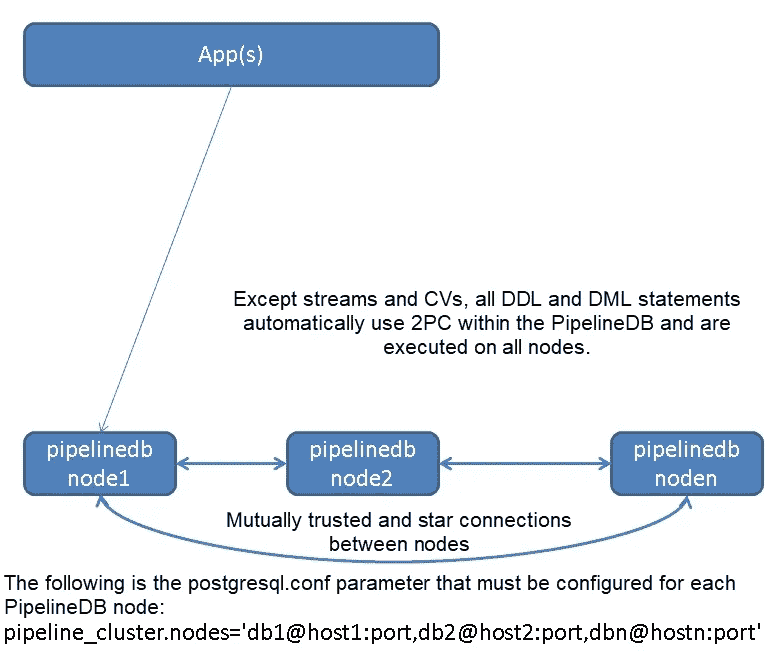
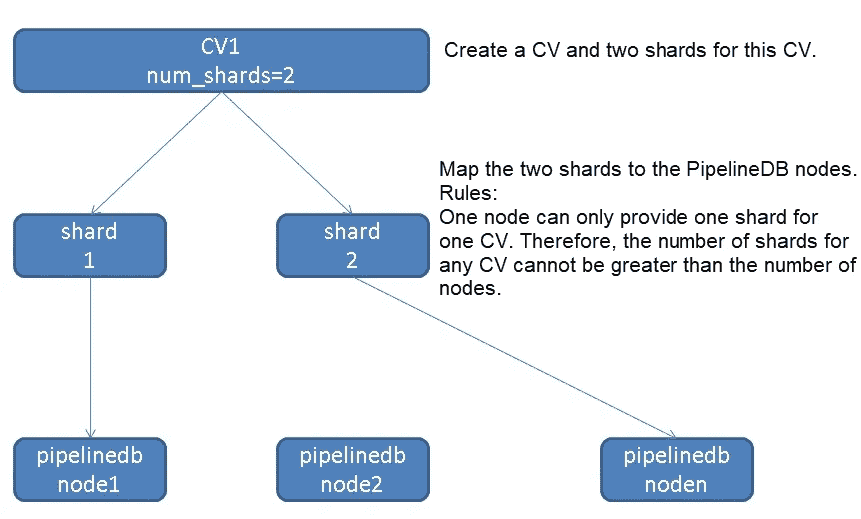
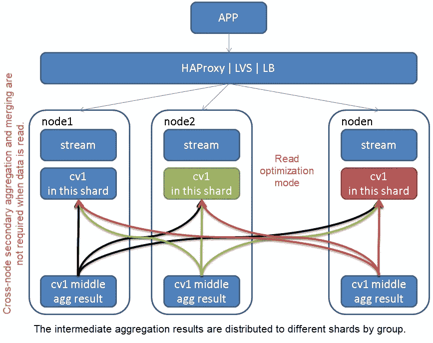
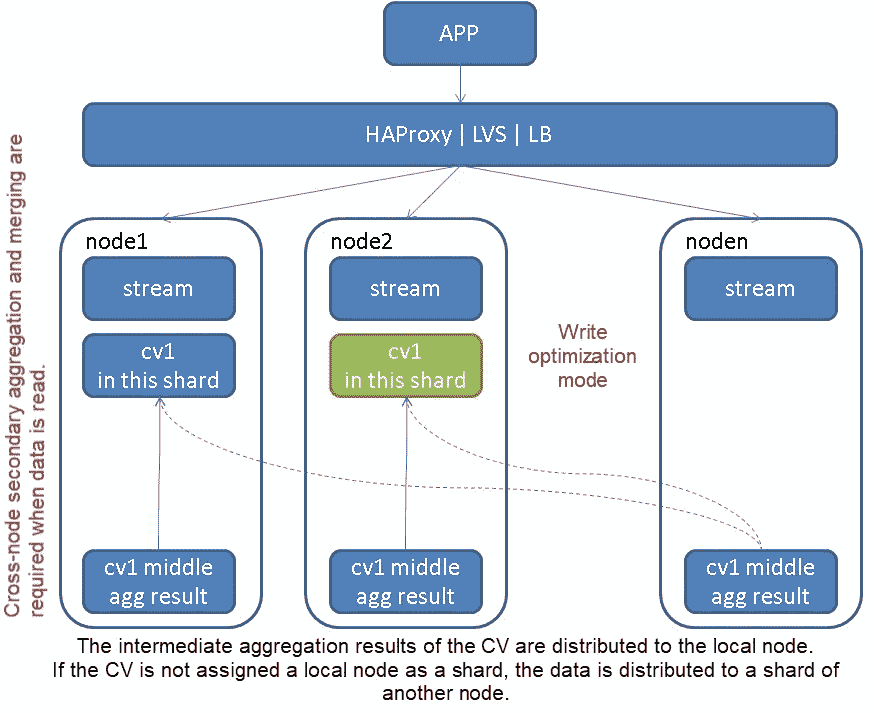
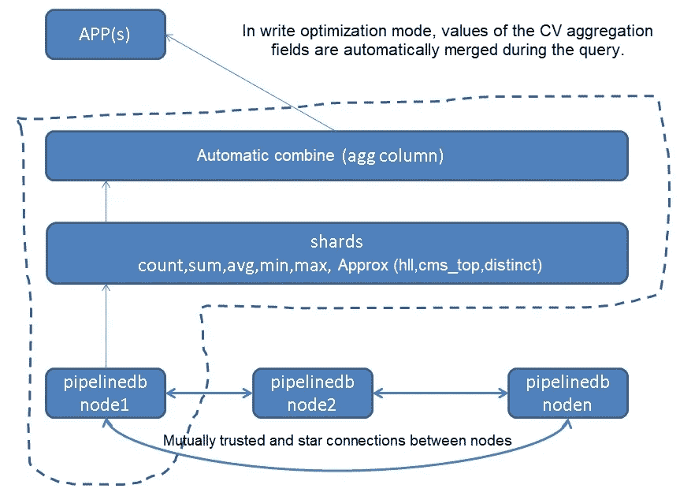
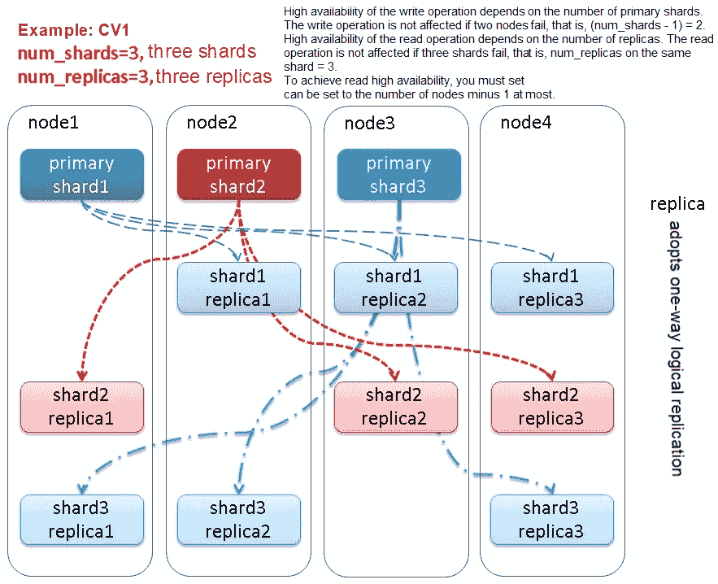

# 面向分布式流计算的 PipelineDB 分片集群

> 原文：<https://medium.datadriveninvestor.com/pipelinedb-sharding-cluster-for-distributed-stream-computing-26402bcf796?source=collection_archive---------11----------------------->

*按双目标*

PipelineDB 集群是一个强大的分布式流计算引擎，因其可伸缩性、高可用性、负载平衡、读写优化和自动数据合并功能而广受欢迎。在本文中，我们将介绍 PipelineDB 集群架构，并讨论它如何优化其网络并在碎片故障中保持读/写操作的高可用性。

# PipelineDB 集群架构



为了实现无主架构，PipelineDB 集群中的所有节点以可信的方式相互通信，以实现中间连续视图(CV)聚合结果的自动分发，以及通用数据(流和 CV 除外)的 DML 和 DDL 语句的完全分发和 2 阶段提交(2PC)。

由于无主机架构，客户端可以连接到任何 PipelineDB 共享节点。

除了 CVs 之外，所有其他 DDL 和 DML 操作都使用 2PC 模式，并在所有节点上执行。确保所有节点都有完整的非 CV 和非流数据。



我们建议应用程序通过连接池连接到 HAProxy 或其他负载平衡软件，然后连接到每个 PipelineDB 节点，以实现最大吞吐量。我们还建议您使用 HAProxy 或 LVS 来实现负载平衡。目前，JDBC、libpq 或许多其他驱动程序都支持负载平衡配置。

可以使用 PgBouncer 实现连接池功能。PgBouncer 是纯 C 开发的，是一个高效的 PostgreSQL 连接池。

# 碎片和节点概念

节点是指 PipelineDB 数据节点。碎片是一个逻辑概念。创建 CV 时，必须指定要为此 CV 启用的分段数。

请注意，每个节点只负责同一 CV 的一个碎片，以最大化水平缩放效率。那么，一个 CV 最多可以创建多少个碎片呢？答案是为一个 CV 创建的碎片数不能超过节点数。



可以使用以下两种方法来定义 CV 的分段数:

```
CREATE CONTINUOUS VIEW v WITH (num_shards=8) AS    
  SELECT x::integer, COUNT(*) FROM stream GROUP BY x;    

CREATE CONTINUOUS VIEW v WITH (shard_factor=50) AS    
  SELECT x::integer, COUNT(*) FROM stream GROUP BY x;
```

当使用 shard_factor 时，您实际上指定了一个从 1 到 100 的百分比值。因此，如果将 16 节点集群的 shard_factor 设置为 50，将创建 8 个碎片。

创建 CV 时，还会生成元数据来指示 CV 的位置和分片策略(读优化或写优化)。元数据结构如下:

```
\d pipeline_cluster.shards    
  View "pipeline_cluster.shards"    
     Column      |   Type   | Modifiers    
-----------------+----------+-----------    
 shard           | text     |    
 owner           | text     |    
 continuous_view | text     |    
 shard_id        | smallint |    
 shard_type      | text     |    
 sharding_policy | text     |    
 is_local        | boolean  |    
 balanced        | boolean  |    
 reachable       | boolean  |
```

# 数据路由策略

创建 CV 时，可以使用 sharding_policy 来指定数据路由策略。

# 读取优化

在 CV 中，同一聚合组中的数据被路由到一个节点，在读取时不需要进行第二次合并。然而，写入可能涉及数据重新分布。该操作由 PipelineDB shard 节点完成，对应用程序是透明的。但是，写入性能肯定会降低。

注意，分布在网络上的数据是聚合数据，也就是聚合结果。数据按组分发到相应的 shard。

这意味着实际上只需要路由传入行的聚合结果。这是为了最小化网络开销和分配工作而设计的。



```
INSERT INTO stream (x) VALUES (0), (0), (0), (0), (0);
```

假设工作进程以足够快的速度一次读取这五行，那么只有聚合行(0，5)会被路由到分组的指定节点，然后像往常一样与磁盘上的数据组合。

```
CREATE CONTINUOUS VIEW v0 WITH (sharding_policy='read_optimized') AS    
  SELECT x::integer, COUNT(*) FROM stream GROUP BY x;
```

# 写优化

每个分片管理自己的 CV，因此相同维度的数据可能出现在多个分片上。写入性能达到最大吞吐量。

只有当本地节点不包含目标 CV 的任何碎片时，才必须分发部分聚集结果。注意代码，检查一批中间结果是随机分配给所有分片还是随机选择一个分片，整批中间结果是否分配给这个分片。

只有在为给定组产生部分聚合结果的节点没有该组的连续视图的任何碎片时，才需要路由。



```
CREATE CONTINUOUS VIEW v1 WITH (sharding_policy='write_optimized') AS    
  SELECT x::integer, COUNT(*) FROM stream GROUP BY x;
```

# 读取合并

使用写优化模式时，需要合并读操作以确保数据完整性。因此，PipelineDB 必须支持所有 cv 的合并，包括公共指标(如 count、avg 和 sum)和概率指标(如 CMS-TOP 和 HLL)。幸运的是，所有这些概率类型目前都支持相同类型指标的联合。



```
CREATE CONTINUOUS VIEW v WITH (sharding_policy='write_optimized', shards=16) AS    
  SELECT x::integer, AVG(y::integer) FROM stream GROUP BY x;
```

由于它使用 write_optimized 分组策略，每个分组平均值可能存在多个本地副本。在读取时，这些组将在不丢失信息的情况下进行组合，产生最终结果，每个组正好有一行。请参考官方文档了解更多[http://docs.pipelinedb.com/aggregates.html#combine](http://docs.pipelinedb.com/aggregates.html#combine)

# 高可用性和分片负载平衡

PipelineDB 提供了“逐分片复制”功能，以便在节点故障或停机时实现高可用性。请参考官方文档了解更多[http://enterprise . pipeline db . com/docs/high-avail ability . html](http://enterprise.pipelinedb.com/docs/high-availability.html)



1.  写操作的高可用性取决于主碎片的数量。如果两个节点出现故障，即(num_shards — 1) = 2，写操作不会受到影响。
2.  读取操作的高可用性取决于副本的数量。如果三个 shard 失败，即同一个 shard 上的 num _ replicas = 3，读操作不受影响。
3.  为了实现读取操作的高可用性，必须将 pipeline_cluster.primary_only 设置为 FALSE。
4.  您不能在与主碎片相同的节点上配置副本碎片。因此，num_replicas 的最大值是节点数减 1。

在 CV 中使用 PostgreSQL 异步逻辑订阅函数(逻辑解码)来实现 CV 结果的多个副本。创建 CV 时，可以使用 num_replicas 来指定每个碎片的副本数量。

注意，这里使用的是异步复制。因此，当您创建 CV 时，“num_shards = 3”表示三个主碎片，“num_replicas = 2”表示每个主碎片有两个副本。

```
CREATE CONTINUOUS VIEW v WITH (num_shards=3, num_replicas=2) AS    
  SELECT x::integer, COUNT(*) FROM stream GROUP BY x;
```

如果在创建 CV 时未指定 num_replicas，则使用 pipeline_cluster.num_replicas 参数的值。

# 读取负载平衡

当配置了多个副本时，可以在碎片之间实施读取负载平衡:

读取负载平衡:如果将 pipeline_cluster.primary_only 设置为默认值 FALSE(表示允许读取副本碎片)，副本碎片将作为读取负载平衡节点包含在内。例如，如果一个主碎片有三个副本碎片，那么读取负载可以在四个碎片之间平衡。注意，PipelineDB 副本采用异步逻辑复制模式，可能存在数据延迟。读取负载平衡可能会导致数据不一致。

# 节点异常处理机制

1.Read:只要设置 pipeline_cluster.primary_only 为 FALSE 且 num_replicas 大于等于 1，当主分片所在的节点出现故障时，系统读取副本分片上的数据。

读取操作的高可用性取决于副本的数量。如果三个碎片失败，即同一个碎片上的 num _ replicas = 3，读操作不受影响。

为了实现读取操作的高可用性，必须将 pipeline_cluster.primary_only 设置为 FALSE。

2.阅读:当一个主碎片和所有对应的副本碎片都不可用时，这个碎片就真的不可用了。至少，这个碎片上的数据是无法读取的。

但是，可以通过将 pipeline _ cluster . skip _ unavailable 设置为 TRUE 来跳过不可用的碎片。这意味着可以返回部分数据。

3.写入:当一个主碎片不可用时，数据被写入其他可用的主碎片。只有当所有主碎片都不可用时，才会丢弃此聚合的中间结果。

写操作的高可用性取决于主碎片的数量。如果两个节点出现故障，即(num_shards — 1) = 2，写操作不会受到影响，数据也不会丢失。

当所有主碎片都不可用时，如果集群仍有可用节点(即，当为 CV 设置的 num_shards 小于 PipelineDB 集群中的节点数时)，该节点将继续计算数据，但结果将被丢弃，因为没有主碎片可用。

4.写:如果 CV 采用读优化模式，并且一个主分片失败，数据可以正常路由到其他主分片。但是，在读取优化模式下，CV 组数据的分布被破坏，导致数据不平衡。如果在不执行合并的情况下读取不平衡的 CV，将读取不一致的结果。有关如何解决这个问题的更多信息，请参见后面关于平衡的章节。

# 数据怎么会丢失？

当主碎片所在的节点出现故障且无法恢复时，数据可能会丢失。副本碎片使用异步逻辑复制模式。因此，他们无法确保数据不会丢失。此外，副本旨在提高读取负载平衡能力，而不是设计为故障切换节点。即副本采用单向复制。

# 如何防止数据丢失？

您可以为节点所在的 PostgreSQL 实例实现高可用性和备份策略。为了实现零丢失，您可以在实例级别使用多个副本，或者共享多个存储副本。

只要主节点上的数据没有丢失，就不会丢失任何数据。

# 你应该如何处理数据丢失？

在阅读过程中，如何跳过不可用的碎片？也就是说，当一个碎片的主碎片和它的所有副本碎片都不可用时，你如何获得部分结果呢？查询时，可以通过将以下参数设置为“true”来跳过不可用的碎片并获得不完整的 CV 结果。

```
pipeline_cluster.skip_unavailable = true
```

# 读取优化模式下的数据重新平衡

在读优化模式(read_optimized)下，当一个主分片出现异常时，应该分配给这个主分片的 CV 组的数据可能会被写入另一个主分片，以保证正常写入和数据完整性。

但是，在读取优化模式下，从 CV 读取数据时不会合并数据。所以这部分数据是存在的，但无法读取。

如果 pipeline_cluster.shards 元数据表的 balanced 列设置为 FALSE，则必须重新平衡该 shard 的数据。如果在读取优化模式下 shard balanced 列设置为 FALSE，则需要手动重新平衡。

在写入优化模式下，pipeline _ cluster . shards . balanced 始终为 TRUE，因为在此模式下不需要重新平衡，并且 agg 列在查询期间合并。

将来，PipelineDB 集群将在后台自动检查读取优化模式下的 CVs。如果检查结果表明需要重新平衡，数据会自动重新平衡，以确保查询的全局一致性。这个问题只是偶尔发生，还没有完美的解决方案。

下面提供了一个核心优化建议:

在读取优化模式下，您可以首先检查是否需要重新平衡。如果是，请使用 COMBINE for query 并通知重新平衡任务启用异步重新平衡。

# 起源

PipelineDB 和 Citus 有一定的关系。PipelineDB 集群版大量借鉴了 Citus pg_shard 插件的设计理念，甚至可能重用大量代码。

[https://www.citusdata.com/product](https://www.citusdata.com/product?spm=a2c41.13602596.0.0)

https://github.com/citusdata/pg_shard

【https://github.com/citusdata/citus 

# 摘要

PipelineDB 集群是一个分布式流计算引擎。它提供了良好的计算可扩展性、可靠性和负载平衡能力。同一个 CV 支持跨片计算、读优化模式和写优化模式。它还支持写优化模式下聚合计算结果的自动合并，是一个优秀的分布式流计算引擎。

PipelineDB 集群通过分发中间聚合结果来优化网络开销。

在读取可用性方面，一个 CV 通过内部逻辑订阅实现多个副本，实现读取高可用性和负载均衡。

就写可用性而言，任何主碎片都可以接受数据存储(数据在被读取时被合并)，因此写操作本身是高度可用的。

# 参考

[http://enterprise.pipelinedb.com/docs/index.html](http://enterprise.pipelinedb.com/docs/index.html?spm=a2c41.13602596.0.0)

[http://docs.pipelinedb.com/aggregates.html#combine](http://docs.pipelinedb.com/aggregates.html?spm=a2c41.13602596.0.0#combine)

[https://www.citusdata.com/product](https://www.citusdata.com/product?spm=a2c41.13602596.0.0)

# 原始资料

[](https://www.alibabacloud.com/blog/pipelinedb-sharding-cluster-for-distributed-stream-computing_595369?spm=a2c41.13602596.0.0) [## 面向分布式流计算的 PipelineDB 分片集群

### di goal 2019 年 9 月 20 日 829 pipeline db 集群是一个强大的分布式流计算引擎，因…

www.alibabacloud.com](https://www.alibabacloud.com/blog/pipelinedb-sharding-cluster-for-distributed-stream-computing_595369?spm=a2c41.13602596.0.0)