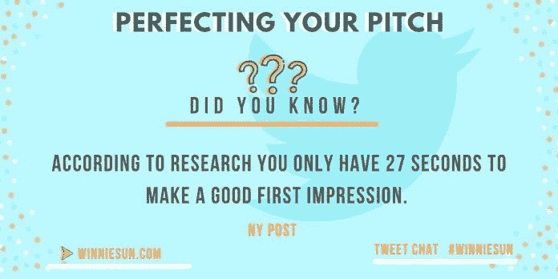
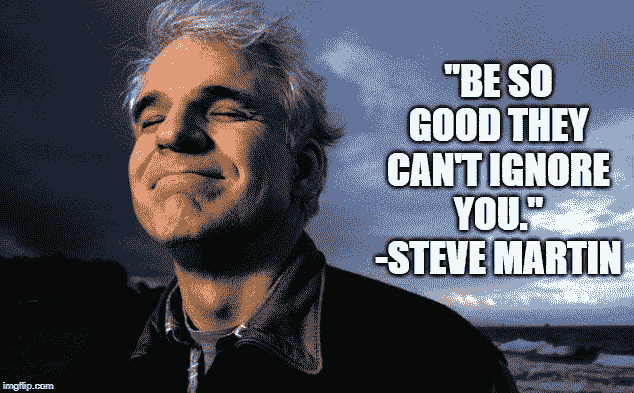
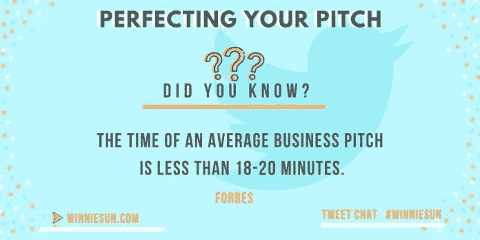

# 直接投在中间

> 原文：<https://medium.datadriveninvestor.com/pitch-right-down-the-middle-b52ffb76a0ee?source=collection_archive---------7----------------------->

## 最好的演示感觉就像对话一样自然

创意只和他们的广告词一样好，专业人士是选择广告词来改进商业提案的大师。

这一行中的三位佼佼者——[埃文·怀克](https://twitter.com/evanwyk_)、[布兰特·皮维迪奇](https://twitter.com/brantpinvidic)和[布莱恩·克里斯蒂亚诺](https://twitter.com/boldceo)——与金融专家[温妮·孙](https://twitter.com/winniesun)一起解释了为什么最佳投手永远不会感到被强迫。

Wyk 是一名企业家，专门从事[品牌开发](https://medium.com/datadriveninvestor/incredible-value-bespeaks-experience-75b319f97a86)、在线身份、品牌合作和个人发展。

《3 分钟规则 》的作者，Pinvidic 是一位演讲者、制片人、导演、顶级播客和福布斯撰稿人。

 [## 用你最好的推销方式传达信息

### 成功的博客始于找到你的声音

medium.datadriveninvestor.com](/send-a-message-with-your-best-pitch-29dc892d1b97) 

克里斯蒂亚诺是一位白手起家的企业家、增长战略家、营销专家、主题演讲人、现代说书人，还是专注于战略、营销和分析的 [BOLD Worldwide](https://boldworldwide.com/#services) 的创始人兼首席执行官。

自称“财富密语者”的孙是一位金融顾问、企业家、演说家和媒体人。她被《美国消费者新闻与商业频道》、《福克斯商业》、《切达》等媒体特别报道，并出现在 100 多个不同媒体的采访中。

通常，第一印象在不到 30 秒内形成。从他们走进房间的那一刻起，专业的推销员就以积极、成功的方式塑造他们给人的第一印象。

孙说:“我以前的一位经理告诉我，在办公室的大厅里等别人打招呼时，最好是站着。“我不知道这是不是真的，但这已经成了我的习惯。这一点以及带着欢迎的微笑站直似乎有助于最初的问候。”

Wyk 警告不要错失良机。

“你永远不会有第二次机会留下第一印象——引用原话，引用原话，”他说。“尽你最大的努力。你的着装、肢体语言和面部表情应该“彰显”自信。表现出你在那里有多高兴。

“别忘了做你自己，”Wyk 说。“做一个不是你自己的人是没有意义的。我相信它会阻碍而不是帮助你。”

Pinvidic 重视沉默。

“等一下再说话，”他说。“人们常常想成为第一个说话的人。少说话，说对话更重要。”

# 情报收集

提前侦察为投球奠定基础。

“了解你的观众，”克里斯蒂亚诺说。“你在会见谁？他们看重什么？他们希望如何定位？他们希望解决什么难题？

“穿着和说话的部分，”他说。“如果你要穿着西装向高管们做演示，那就穿西装。如果你要向[伯顿滑雪板](https://twitter.com/burtonsnowboard)做演示，脱掉西装。而且*总是*知道你的内容。成为专家。”

 [## 从你的未来和为什么你最适合这份工作开始

### 你完美的演讲将你职业生涯中的点点滴滴联系起来

medium.com](https://medium.com/an-idea/lead-with-your-future-and-why-youre-best-for-the-job-7f4d85474bc4) 

有时候少即是多。那些在复杂行业中的人可能会想要展示一个有很多细节的作品。最好简化信息，只包含核心概念。

“总的来说，我同意少即是多，”孙说。“然而，重要的是要了解你在向谁推销。

“例如，如果你向工程师或医生推销，他们可能需要更多的数据来适应你的信息，”她说。"如果你是在推销创意，推销可能需要更具美感."

这又回到了事先了解受众的问题上。

“越少越好，”Wyk 说。“推销时，专注于你推销的理由——你的目标。添加一些统计数据——数据——让你有机会“吸引他们”——而不是向他们推销什么。然后喜结良缘。”

他强调推销是对话。投手不应该是机器人。

“你必须从买家的角度出发，”克里斯蒂亚诺说。“他们有什么问题？然后只关注你的推销中能解决问题的领域。剩下的就没必要了。问问你自己，“他们有什么问题是我解决的？”"

熟能生巧。在镜子前或朋友面前练习投球。这有助于推销者以快速、清晰、简洁、舒适的方式解释他们的业务或提议。

"如果你不习惯推销自己或自己的公司，那就反复练习，直到你对自己的演示感到满意为止，"孙说。“我发现给自己录像最有效，尤其是因为我无法忍受看着或听着自己。

“练习迫使我更快地修复或纠正，”她说。“这是一个很好的教学工具。”

# 寥寥数语能说明一切

这也表明少即是多。

“最重要的是关注需要说什么，而不仅仅是你想说什么，”Pinvidic 说。“当你说得更少时，你会更自信。你的观众会感觉到的。”

克里斯蒂亚诺给出了他所谓的创造音高的最强有力的过程:

*   第一步:拍摄。
*   第二步:回看。
*   第三步:像观察第三方一样评论它。
*   第四步:诚实。解决可能更好的问题。
*   第五步:重复第一步。

 [## 你的身体比语言更响亮

### 面部表情、手势和姿势传达了清晰的信息

medium.datadriveninvestor.com](/your-body-speaks-louder-than-words-ea9ea043d601) 

“一定要排练——首先让你的‘剧本’完美无缺，然后让其他人做出反应，”Wyk 说。“然后做一个‘脚本编辑’，重复给志同道合的人听。最重要的部分是保持专注于你的信息。在 60 到 120 秒内搞定一切。

“记录你自己——特别是如果你对观看或听到自己的声音有点消极的话，”他说。

在推销时，演示者应该突出他们的与众不同之处，他们为客户解决了什么问题，以及他们或他们的业务的独特之处。

“让我与众不同的是，我花很多时间为每个客户做准备，然后花更多的时间去了解客户，”孙说。“这样我才能真正理解需求是什么。

“没有什么是仓促的，”她说。“大家都舒服，听到了。这听起来很简单，但真正的倾听艺术是我多年来一直在练习和提高的。”

# 诚实的陈述

一定要讲故事就是讲真话。

“永远要诚实，”Wyk 说。“没有什么比假装更能‘扼杀’你的机会了。做生意的人会看穿你的。忠于你的经历，突出你积极的观点。坦率地说出你会给他们带来什么——你的价值。”

透过最重要的眼睛看。

“与大多数大型咨询公司或广告公司不同，我们从企业家的角度解决整体业务挑战，”克里斯蒂亚诺说。“我们就像给一家公司注入火箭燃料。而且要快。对所有人来说。找到你提供的独特体验，并突出它。”

故事需要抓住观众的注意力并保持住。

“始于事实，终于事实，”孙说。“这是我一直以来发现的最有效、最相关的方法。

“人们希望你试着卖给他们一些东西，”她说。“当然，我可以，但他们会回家，并有买家后悔。我想让他们觉得这是他们的正确决定。因此，减少销售，更多地使用相关场景进行解释和分享。”

 [## 你的故事从口语开始

### 演讲会帮助人们在交流中获得自信

medium.datadriveninvestor.com](/your-story-starts-with-the-spoken-word-5b86ce1dcf2f) 

真诚和骄傲强调价值。

“说出你的心声，”威克说。“表明你关心你的产品或服务。永远为你的品牌感到骄傲。在许多场合，表现出真诚会引起共鸣。最后，问问你自己，在这次谈话中，你是否做了你自己？真相永远占上风。”

重点是在球场上，而不是投手。

克里斯蒂亚诺说:“讲述你创造的结果，但无论是从一个类似的客户或客户的角度，还是从你推销的客户的角度。”“记住，虽然这是你的故事，但实际上是关于他们的，而不是你。”

价值来自洞察力而不是重复。

“一定要确保你没有告诉观众他们应该已经知道的事情，”皮维迪奇说。“如果你的价值非常明显，就不需要重述。寻找一些实际上有价值的信息，而不仅仅是一些很酷的话。

“一个故事是一点一点讲出来的，”他说。“你想把你的信息引向你的最终结论。不要陈述和证明。你总是想通知和领导。”

# 知识建立自信

即使面对友好的人群，怯场也是真实的，但可以避免。

“我的长期商业伙伴总是说上台前紧张是好事，”孙说。“这意味着你仍然关心。

“消除恐惧的最好方法是练习、练习、再练习，”她说。“你不会尽善尽美，但知道自己做好了准备，你会感觉更舒服。那就微笑吧，去争取吧。”

Wyk 遵循以下建议:

*   微笑，呼吸，慢慢说。
*   站直，双脚牢牢踩在地板上。
*   如果你的手倾向于抖动，在不使用来强调你的观点时，保持紧握。
*   不要随意，不要悠闲。

“信心来自于你相信你带给你的观众的价值，”Pinvidic 说。“你对自己的信息越有信心，你的怯场就会减少。不是相信自己的问题。而是要相信自己带来的价值。”

 [## 给没有被提及的企业家的建议

### 良好的沟通能增进工作内外的关系

medium.datadriveninvestor.com](/tips-for-entrepreneurs-not-spoken-for-9de87df8653) 

产品知识是消除怯场的一剂良药。

“了解你的主题，”克里斯蒂亚诺说。“当你了解自己的东西时，就很容易说话，很容易回答，你会散发出自信。练习。记住，这只是一次推销。75%的人害怕做你已经在做的事情。太棒了。”

了解受众包括对特定参与者的研究。

"我尽我所能去研究我可能会向谁推销，"孙说。“网上有这么多信息。了解某人对不同主题的看法有助于更好地个性化演示。”

这是最大限度利用研究的时候。

“上网查找背景资料，”Wyk 说。“这样你就能清楚地知道你在和谁对抗，在和谁交谈。提及一两个你发现的事实很容易对你有利。打动他们。”

# 放松油门

虽然投手知道他们的战术，但他们应该是微妙的。

“整合研究总是一个好主意，但要非常小心，不要太明显，”Pinvidic 说。“你的观众会对尝试让他们觉得更个性化的策略很敏感。让你的信息领先。”

从某种意义上说，成功的投手是潜行者。

克里斯蒂亚诺说:“我在社交媒体上寻找一个潜在客户——他是私人的——发现他们喜欢白葡萄酒。“猜猜我给球场带来了什么？我在一个朋友的朋友的 Instagram 上找到了他们的照片。毛骨悚然？也许吧。有效？你打赌。交易完成。”

自我评价可以用“推回式”问题来完成。尝试在你的推销中找出漏洞可以改善它。

 [## 演讲者聚焦新领域

### 在网上和现场演讲时充满自信

medium.datadriveninvestor.com](/speakers-zoom-to-new-realms-208bc047f377) 

“我最喜欢的问题是，这真的能给对方带来价值吗？”孙说。

“很多时候，我们推销的东西只会给推销我们的人带来价值，”她说。“这不应该是关于我们，而应该是关于我们能给下一个潜在客户带来的价值。一直质疑你的推销，直到它说出这种语言。”

在坏消息出现之前阻止它。

“你应该问自己的第一个问题是，‘我希望我的观众没有发现什么？’"维迪奇说道. "你得在他们之前解决这个问题。他们总会发现的。他们在找绳子和洞。积极主动。"

使用反推式问题也可以衡量观众的注意力。

“后推是一种很好的方式来发现你的听众是否真的在听你说话，”Wyk 说。保持问题与主题相关:以前这样做过吗？有什么问题导致头痛吗？结果满意度？通过关键绩效指标提出解决方案。”

# 有益的补充

最好的推销可以配有各种各样的附件。

孙说:“演讲提纲有助于让演讲继续进行，并帮助你记住你需要详细讲述的内容。”。“虽然即使是一个精心构思的大纲也能做到这一点。

“如今，我们通常只是从一张白纸开始，在做任何形式的展示之前了解客户，”她说。

 [## 富有创意、独一无二、令人难忘——并且有利可图

### 没有人会吹嘘从一个无聊的品牌购买

medium.datadriveninvestor.com](/be-creative-unique-memorable-and-profitable-e371cabbf6de) 

好投手也会留下回忆。

Wyk 说:“留下来取决于你所处的环境。”“在活动中，一个 u 盘就足够了。对于办公室会议，一张幻灯片加上一次边走边谈，一张名片或服务明信片就能达到目的。

“演示文稿是一份相当详细的文件，”他说。“推介资料通常是您的演示文稿的简化版本。不用说，两者都需要‘说’同样的语言，提供同样的信息。”

谨防 PowerPoint 死亡。

“如果你用 PowerPoint 演示，不要把讲义当成幻灯片，”Pinvidic 说。“说话的时候不要让人看。我使用简单的要点——最多只有几个词。”

推销中一个被忽视但却很重要的部分是跟进。

“任何会议的后续行动都是互动中最重要的方面，”孙说。“每个人都想感觉自己被倾听、被需要、被重视。

她说:“及时跟进那些为进一步交流敞开大门的人。”“不要让温暖的铅变冷。快速跟进和交付。”

# 紧迫感

Wyk 强调快速反应。

“在整个会面过程中，你应该已经意识到项目的紧迫性和潜在客户的工作量，”他说。“这将很好地表明你在会后应该采取什么样的后续行动。

“一般来说，发送邮件前 48 小时的停顿对我来说很有效，”Wyk 说。“在又一个 24 到 48 小时的‘没有回复’之后，一封快速提醒邮件会响起，并承诺第二天会打电话。一定要信守承诺。”

 [## 轰动的经历创造遗产

### 感觉，经历，感觉。这些情绪和感觉与令人难忘的品牌完全一致。

medium.datadriveninvestor.com](/sensational-experience-creates-legacies-e795e90f43f6) 

同时，他告诫不要过度焦虑。

“我最好的建议是不要轰炸客户的收件箱，也不要用信息堵塞他们的语音信箱，”Wyk 说。“没有什么比给人留下过于急切或非常绝望的印象更令人不快的了。面对现实吧，惹人厌不是一个好的属性。避之。”

演示后的信息收集至关重要。

“获取手机号码，”克里斯蒂亚诺说。演示结束后，立即给潜在客户发短信。在交易完成之前，每天都要关注他们。”

底线是不要忘记。

“这是一个忙碌的世界，”皮维迪奇说。“跟进有助于让你保持头脑清醒，但你不能强迫别人做出决定。你必须让它自己来。”

**关于作者**

吉姆·卡扎曼是[拉戈金融服务公司](http://largofinancialservices.com/)的经理，曾在空军和联邦政府的公共事务部门工作。你可以在[推特](https://twitter.com/JKatzaman)、[脸书](https://www.facebook.com/jim.katzaman)和 [LinkedIn](https://www.linkedin.com/in/jim-katzaman-33641b21/) 上和他联系。

*原载于 2019 年 12 月 20 日*[*https://www.datadriveninvestor.com*](https://www.datadriveninvestor.com/2019/12/20/pitch-right-down-the-middle/)*。*