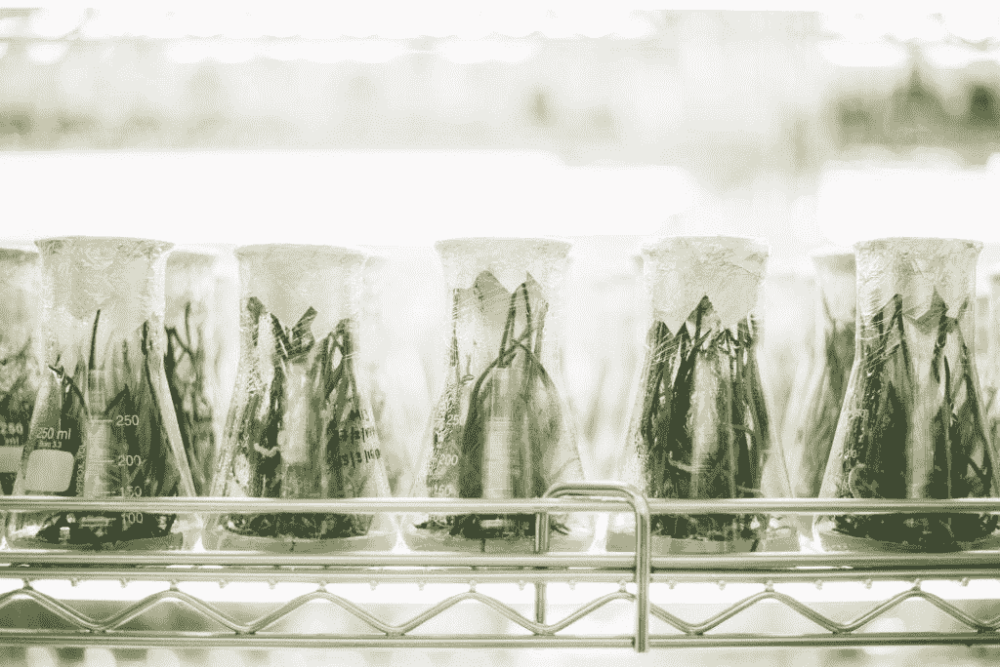

# 地点很重要:房地产、生命科学和技术

> 原文：<https://medium.datadriveninvestor.com/place-matters-property-the-life-sciences-and-tech-fe48243d451d?source=collection_archive---------33----------------------->

Photo by [chuttersnap](https://unsplash.com/photos/UmncJq4KPcA?utm_source=unsplash&utm_medium=referral&utm_content=creditCopyText) on [Unsplash](https://unsplash.com/search/photos/laboratory?utm_source=unsplash&utm_medium=referral&utm_content=creditCopyText)

弗朗西斯·克里克研究所是一座非凡的建筑，旨在鼓励生物医学研究中的合作、创新和透明。该研究所的目的很明确——通过生命科学改善英国的健康和财富。正是在这里，我有机会听到房地产开发在支持伦敦知识集群方面的作用。

此次活动是 2018 年 10 月发布报告[伦敦知识集群](http://merchantland.co.uk/londons-knowledge-clusters-briefing/) *的后续活动。

# 地点问题

我们知道这个地方很重要。我们从伦敦商业集群的历史发展中看到了这一点——从金融城、哈顿花园和珠宝，到萨维尔街及其定制服装。知识“集群”是吸引知识经济组织的地理位置，其明确的焦点是知识资本。成为集群的一部分可以为知识交流和创造创造重要的机会。

在卫生部门，集群往往围绕特定的支柱形成，如医院或大学。他们将具有各种专业知识的人聚集在一起，提供了一个生态系统，如果做得好，可以促进共享学习、合作和合资企业。

这份名为 [*伦敦知识集群、*](http://citypropertyassociation.com/londons-knowledge-clusters/) 的报告聚焦于四个生态系统——国王十字车站/尤斯顿、白城、白教堂和萨顿。它确定了伦敦房地产业在这些领域的主要机遇和挑战。这些机遇和挑战对每个人来说都是独一无二的，我已经在这里写了这些。

# 知识集群是如何形成的

集群不仅仅是人和建筑。他们的成功不可或缺的是，他们变得比他们的部分之和更伟大。机缘巧合也起了作用。在伦敦，这包括在特定地点聚集的一系列因素——历史、社区、交通、领导力、愿景以及对跨部门和跨组织工作的开放态度。

政策和愿景在规划道路和交通基础设施、支持社区方面有着明确的作用。对此至关重要的是人与网络的融合。在所有这一切中，房地产行业是关键，在发展适应性建筑和空间，包括公共领域，促进集群出现的正确环境。

# 机遇和挑战

后英国退出欧盟时代的英国将会是什么样子还是个未知数。但有一点是清楚的，那就是集群的成长不可能孤立地发生。

MedCity 的 2016 年报告， [*规划增长*](http://www.medcityhq.com/wp-content/uploads/2016/05/MedCity-Planning-for-Growth-Demand-for-Healthcare-RnD-Space-in-London-March-2016-1.pdf) *，*显示，在伦敦，医疗保健研发空间的需求明显超过供应。除此之外，还有高昂的房地产成本、在投资回报可能需要多年时间的情况下获得融资的挑战，以及房地产开发的缓慢步伐。还需要了解社区、研究人员、卫生服务、科学家的当前和未来需求。这需要早期和持续的利益相关者参与以及适应性政策框架的组合。但这不全是关于商业，社区需要成为这些对话的核心。

我很高兴有机会将机构、卫生系统和社区聚集在一起，设计我们需要和想要的空间。在生命科学中，这意味着开发满足今天需求并适应未来的空间。这是关于建造重要的场所和空间。

*该报告由未来空间工作室 Jack Sallabank 撰写，受伦敦房地产联盟(CPA 和 WPA)委托，由 British Land、Cushman & Wakefield 和 Derwent London 赞助。

**关于作者**

Sophie Taysom 是 Keyah Consulting 的独立政策顾问，提供医疗保健、人工智能伦理和建筑环境方面的人工智能专业知识。她专门从事政策分析，以支持项目开发和交付。

*原载于 2019 年 2 月 18 日*[*keyahconsulting.com*](http://keyahconsulting.com/place-matters-property-life-sciences-and-tech/)*。*