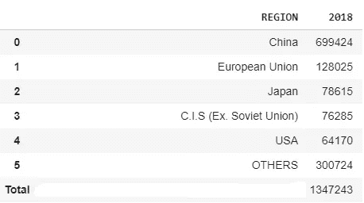
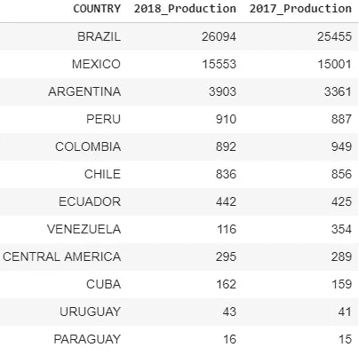
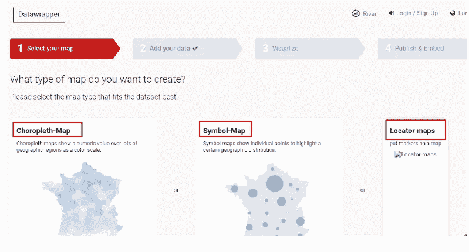
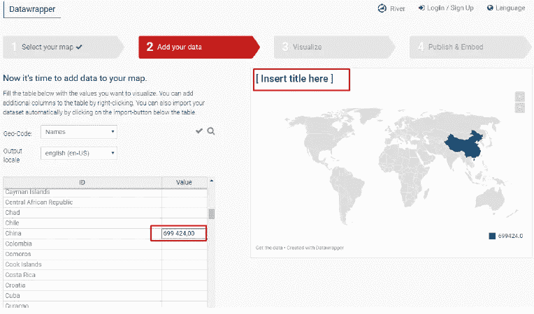
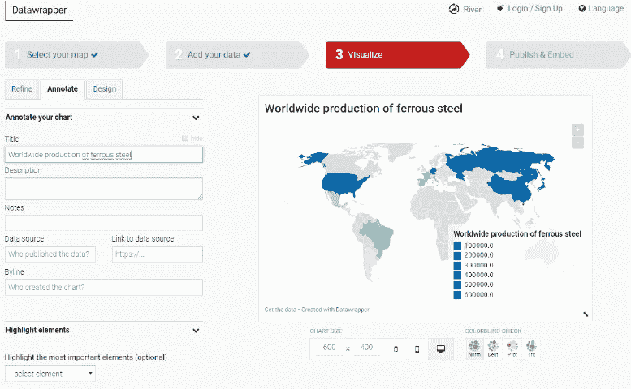
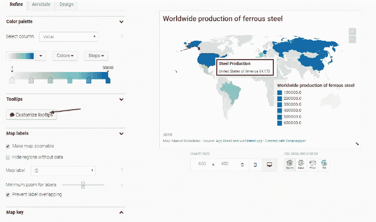
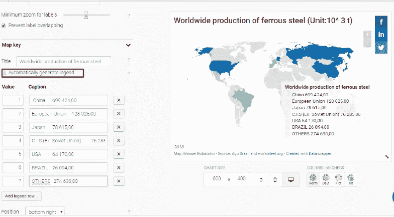
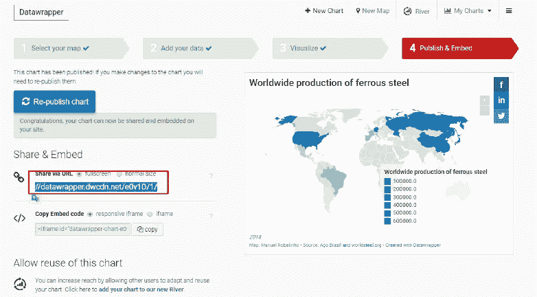
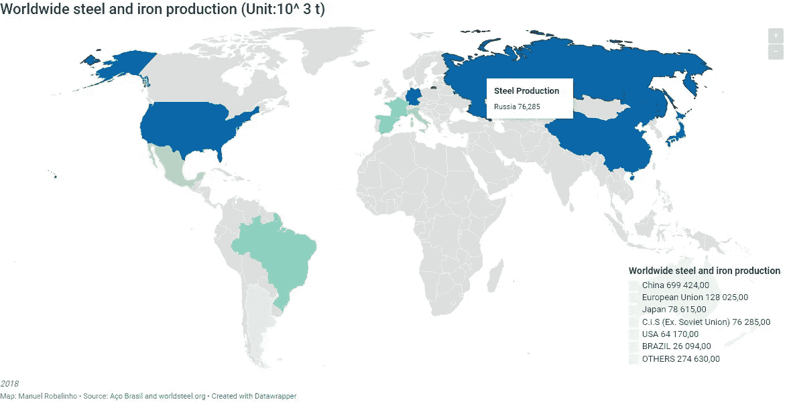

# 在地理地图上放置统计数据可能很简单

> 原文：<https://medium.datadriveninvestor.com/placing-statistics-on-geographic-maps-can-be-simple-d9c6d573b5ae?source=collection_archive---------16----------------------->

我发现了一个应用程序 [datawrapper](https://app.datawrapper.de) ，它可以使制作演示变得简单，并且在必须实际有效的时候……可能是解决方案。

datawrapper 应用程序创建包括您的统计信息在内的交互式图表。你有一个按国家、地区输入数据的屏幕，或者你可以导入你的 csv 表。

您可以配置您的标题，您的标签，把您的来源信息，配置颜色，并插入工具提示信息时，鼠标在该国。

因为我是学钢铁的，所以我有一些关于 2018 年世界钢铁产量的统计信息，在这里和那个[网页](http://www.acobrasil.org.br)里得到的[。](https://www.worldsteel.org/)

这张桌子的底座是这样的:

## 2018 年世界钢产量，单位 10^ 3 t

[www.acobrasil.org.br](http://www.acobrasil.org.br)

## 2018 年拉丁美洲钢产量，单位 10^ 3 t

[www.acobrasil.org.br](http://www.acobrasil.org.br)

根据管理 wep 页面的公司提供的信息，这些数据是根据截至 2018 年 10 月的实际生产数据以及 2018 年 11 月和 12 月的预测数据获得的。

## 在地理地图上绘制信息

1.  在[https://app . data wrapper . de](https://app.datawrapper.de)上选择地图类型

2.在左侧表格中填写您的数据

3.配置您的标题、颜色和注释

4.自定义您的 tootlip 信息

5.定制您的传奇

6.发布您的地图

你获得一个链接或嵌入代码，放在你的网站上。

**结论:**

容易，非常容易。漂亮又有用的 APP。[看这里……](https://datawrapper.dwcdn.net/e0v1D/4/)

***参考文献:***

[https://www.worldsteel.org/](https://www.worldsteel.org/)

[http://comexstat.mdic.gov.br/pt/home](http://comexstat.mdic.gov.br/pt/home)

[www.acobrasil.org.br](http://www.acobrasil.org.br)