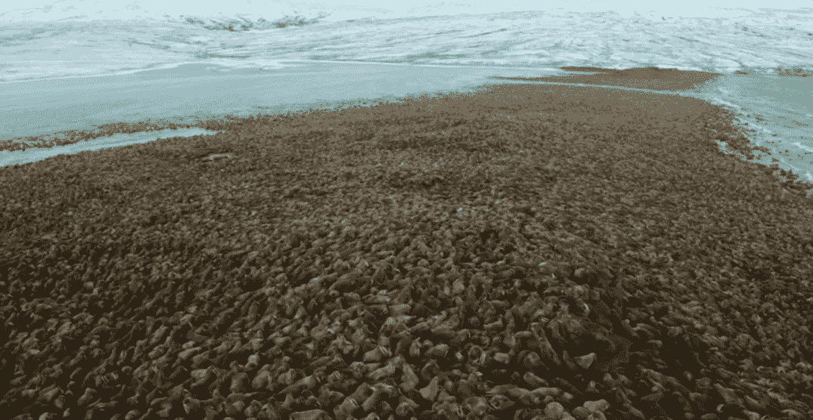
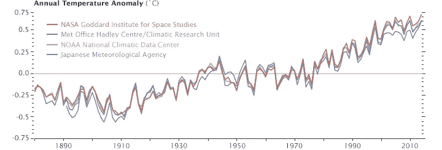
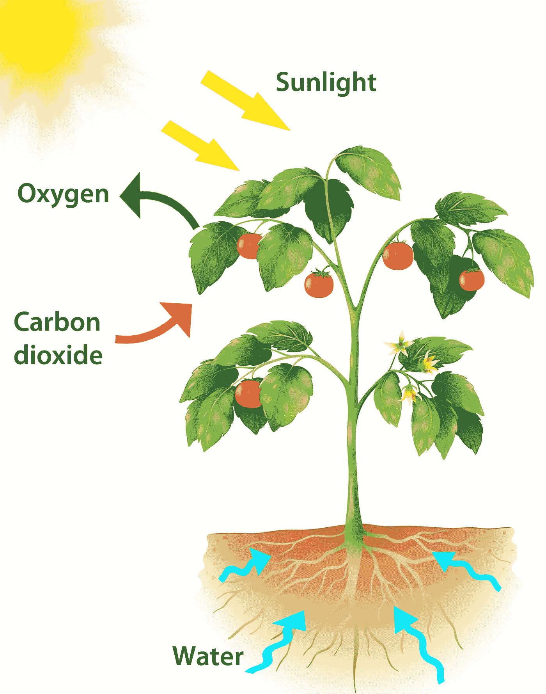
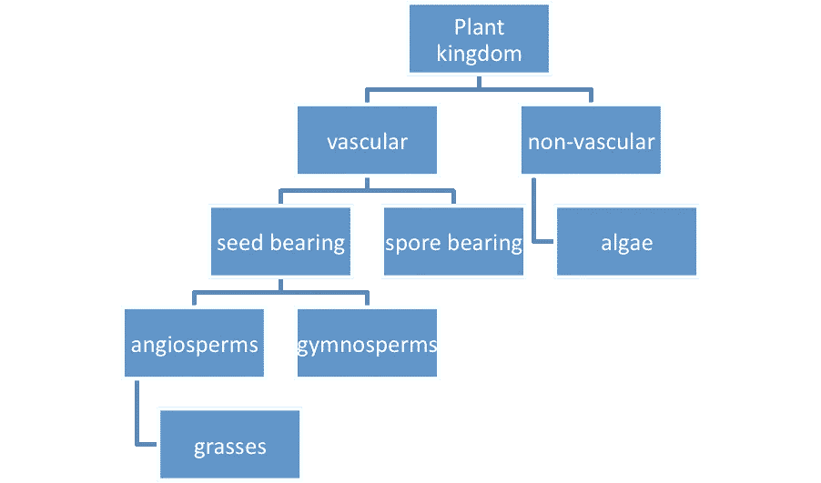
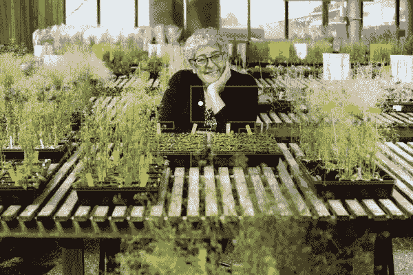
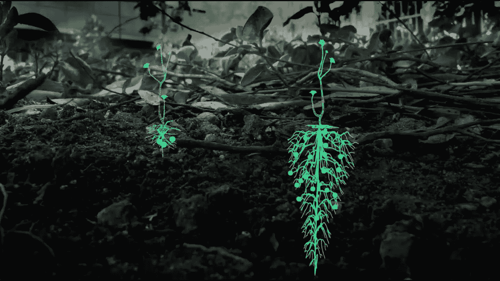
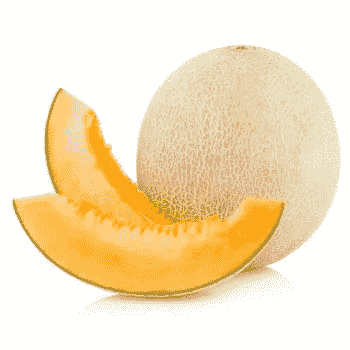

# 拥有超能力的植物⚡

> 原文：<https://medium.datadriveninvestor.com/plants-with-superpowers-2662e8577af5?source=collection_archive---------2----------------------->

## 如何利用基因编辑创造**“增压植物”**来抑制大气碳水平。

> **只有当像你这样的人非常在乎的时候，什么都不会变好……不会的。——苏斯博士(Lorax)** 🌳

当我十岁的时候，我在一部叫做**的电影中听到了这句话**

Credit: Universal Pictures

它一直伴随着我，因为**我非常关心当地和全球的问题**我通过组织" [**WE "接触到这些问题。**](https://www.we.org/)

** [## 气候变化、ESG 和对更好数据的追求|数据驱动的投资者

### 在地球上许多地方经历了另一个令人难以置信的炎热夏季后，来自 S&P 的最新发现…

www.datadriveninvestor.com](https://www.datadriveninvestor.com/2018/08/24/climate-change-esg-and-the-quest-for-better-data/) 

我太在乎了，以至于我把解决一些世界上最大的问题(例如，受教育的机会)作为我的目标。

当我 14 岁的时候，我发现我可以利用指数技术来解决我关心的这些大问题，比如基因组学、人工智能、量子计算等等。

我加入了一个针对 13-17 岁青少年的加速器和创新项目，名为: [**“知识社会”**](https://theksociety.com/) ，在那里我可以了解新兴技术以及如何利用它们解决大问题。** 

**在知识社会，我了解到我非常关心这个问题。我非常热衷于解决这个问题，以至于我会花很多时间研究这个问题，并寻找利用技术解决它的方法。**

**我的任务就是帮助解决这个问题:**

## **是气候变化。**

**你可能听说过，也可能没听说过…**

**我猜你可能知道这件事。在过去十年左右的时间里，这一直是一个热门话题，今年随着气候行动主义的流行，单词**“气候罢工”**被评为 2019 年最常用的单词之一。🤯**

**你可能不知道的事情:**气候变化并不是真正的问题。****

**这实际上是不同环境问题综合的结果。像全球变暖、塑料污染和森林砍伐这样的问题。**

**这些都是 Lorax 的问题。**

**我只希望我们能防止我们的未来看起来像劳雷克斯中的那样。**

****

**(Credit: Universal Pictures)**

**有很多关于地球气候变化的令人震惊的统计数据。这个给我留下了最深刻的印象:**

## **每年，超过地球处理能力的 180 亿吨碳被释放到大气中。**

**18 亿吨！**

**这是一个惊人的数字。**

**大气中不断增加的过量碳(一种温室气体)导致地球温度上升，也称为全球变暖。**

**从栖息地丧失到珊瑚礁漂白，全球变暖的影响已经是毁灭性的。**

****

**Those small islands are covered completely with Walruses, due to their habitat loss as a result of global warming. (Credit: Our Planet — I would highly recommend watching this documentary).**

**在过去的十年里，**我们已经失去了海洋中超过 50%的珊瑚礁。****

**随着全球平均气温继续上升，情况只会越来越糟。**

**根据美国宇航局戈达德太空研究所的数据，自 1880 年以来，全球平均气温上升了 0.8 摄氏度。**

****

**Credit: NASA Goddard**

**气温仅上升 0.8 度，就已经产生了如此多的后果。**

**出于这个原因以及其他许多原因，我知道我必须找到一种方法来应对气候变化，从碳排放开始。**

**最初，我试图通过寻找使用技术去除碳的方法来找出碳水平问题的解决方案。**

**有很多公司试图用像海洋捕集器和空气碳捕集器这样的技术来做到这一点，但是他们制造的碳往往比他们捕获的多，而且还没有达到他们需要的水平。**

**有一天，我在考虑基因编辑的酷应用，突然想到了！**

# **植物真的很擅长通过光合作用这个古老的过程来吸收碳。🌱**

**在我们能够找出如何通过合成生物学或机器来模拟光合作用的过程之前，**我认为使用植物是我们从大气中去除和抵消碳的最佳选择。****

**这里有一个关于植物光合作用的小复习:**

**基本上，植物吸收二氧化碳+水，并将其转化为氧气(我们呼吸的物质)😉氧气)+生物量在☀️的帮助下**

****

**Boom now you know the basics! 😎**

**植物可以利用一点帮助在这个他们已经很擅长的过程中变得更好。**

**怎么会？你可能会问。**

**在我个人最喜欢的技术的帮助下:**

# **基因编辑**

**这包括以下工具:**

*   ****CRISPR Cas-9 和****
*   ****主要编辑****

**就像人类、微生物和地球上的其他生物一样，植物也有一个基因组。植物物种和植物与人类的区别在于它们遗传密码的细微变化。那就是 DNA 中的 **A，C，T，G 的**。(要了解更多关于基因组的知识，请查看我以前的文章😉).**

**几乎所有东西都有基因编码。**

**如果我们能找出哪个基因控制碳封存(碳捕获和大气二氧化碳的长期储存)，那么我们就有可能提高植物封存碳的能力，并有朝一日提高其他光合生物封存碳的能力。**

****

**Plant classification. 🌿**

**在这篇文章中，我将关注一组被称为**“被子植物”**(这些是开花植物:某些树木，像芥菜植物等)的植物中需要进行基因工程改造的内容。)给他们碳汇超能力！⚡**

**当我对我必须通过基因工程改造植物来吸收更多碳的想法进行研究时，我遇到了一位研究人员，他的工作与我想从事的工作完全吻合。😎**

**遇见**乔安妮·乔莉:****

****

**Joanne Chory w/ some super-plants.**

**植物遗传学家，研究员，+索尔克工业 [**的世界改变者。**](https://www.salk.edu/) 🌱在过去的 30 年里，她一直致力于研究如何创造“超级工厂”。🤯**

**Her TED Talk on this idea 😍**

**她的项目 [**理想植物项目**](https://www.salk.edu/science/power-of-plants/) 专注于**利用植物的自然碳捕获能力来对抗气候变化！**💪**

**她发现为了拥有这些超能力，被子植物的三个主要部分/功能需要被编辑:**

1.  ****植物需要能够长出更多的根** ⬆️**
2.  ****植物需要能够生长更深的根** ⬇️**
3.  ****植物需要产生更多的木栓质** ⬆️**

****

**(Credit: Salk Industries) (Left Image: Normal plant, Right Image: Edited “Super Plant”)**

# **为什么更深+更根？**

**植物越往下，根越多，就有越多的碳可以被吸收到土壤中。**

**此外，当正常植物死亡时，它们会向大气中释放大量的二氧化碳。😥**

**当增压植物死亡时，它们应该会向大气中释放较少的碳，因为它们更深的根会让更少的碳从土壤中逸出。**

**将碳更深地封存在土壤中也对土壤健康大有裨益。从作物健康和增产的角度来看，这是目前农业领域的一个大热点。这也有助于降低农业的大量碳足迹。**

**除非你是植物遗传学家或热爱生物学，否则你可能不太了解的木栓质在这方面也有很大的作用。**

# **木栓质的天然能力是抵抗短期分解。**

****

**Suberin ^ (Credit: Salk Industries)**

**木栓质本质上是**软木。****

> **正是这种魔力使得植物(尤其是被子植物)能够储存更多的碳。 ✨**

**有趣的事实:这也是哈密瓜的果皮。**

****

**Suberin is all around us.**

## **木栓质是一种碳聚合物，这意味着它是一种非常善于储存碳的大分子。**

**⬆️ **木栓质=** ⬇️ **大气中的二氧化碳****

**要点:弄清楚如何对植物进行基因编辑以增加其木栓质产量应该是当务之急。🔑**

# **地球土壤的碳含量是大气的三倍。**

**这只是在前两米。🤯**

**如果我们能够对农业生产中种植的作物进行基因编辑，那么**所有用于种植这些作物的土地也可以用于固碳。**😍**

**这将改变气候变化的碳水平。更不用说它对土壤健康和作物生产+作物健康也有好处(我之前也提到过)。**

## **🎉这对农民和我们的星球来说是双赢的！**

**我们要感谢 Joanne Chory 和她的团队在 Chory Labs 所取得的重大突破！**

**在碳封存之后，还有很多研究要做，还有更多气候变化领域要解决(例如，塑料污染)。**

**我知道我想成为这方面工作的一部分，以及整个气候变化的结果。**

**如果你想聊聊这个项目，解决气候变化，或者其他什么，请发邮件给我:astronautadara@gmail.com😎**

**解决碳排放问题需要许多人和国家的合作。**

****我希望像理想植物项目这样的创新解决方案和其他结合了生物学和技术的想法能让我们更接近解决这个问题。****

# **最重要的信息😉**

*   **每年，超过地球所能处理的 180 亿吨碳被排放到大气中。**
*   ****利用植物的自然光合能力并结合基因编辑是我们能够隔离更多碳的一种方式。****
*   ****我们需要对植物进行基因编辑，让它们有更多的根，更深的根，产生更多的木栓质。****
*   ****这些超级发电厂可以彻底改变农业的碳足迹，并有助于遏制全球变暖。****

**是时候团结所有关心气候变化(和其他问题)的人，开始想办法解决这些问题了**

**所以我们的未来看起来不像这样:**

****

**(Credit: Disney — Wall-E)**

**沿着这条线再走一点:**

****

**Okay… maybe our trees don’t look like this but I think you get my point. (Credit: Universal Pictures)**

**—因为如果我们不能让这些人开始致力于此，任何事情都不会变得更好…不会的。**

**谁在里面？🙋**

**非常感谢您阅读我的第一篇文章，这是一系列文章中的第一篇 ***使用植物+其他光合生物结合基因编辑来遏制气候排放！*🌎****

**我是阿达拉👋一个 16 岁的有抱负的植物遗传学家。我目前在刚建的实验室用 CRISPR Cas-9 学习基因工程。🧬:我的使命是利用新兴技术解决世界上最紧迫的问题，最重要的是，我想帮助减缓气候变化！**

**如果你想跟随我的旅程，你可以在****[**Twitter**](https://twitter.com/astro_adara)**和**[**Linkedin**](https://www.linkedin.com/in/adara-hagman-78a563171/)**上关注或联系我。********

****✌️Dara****