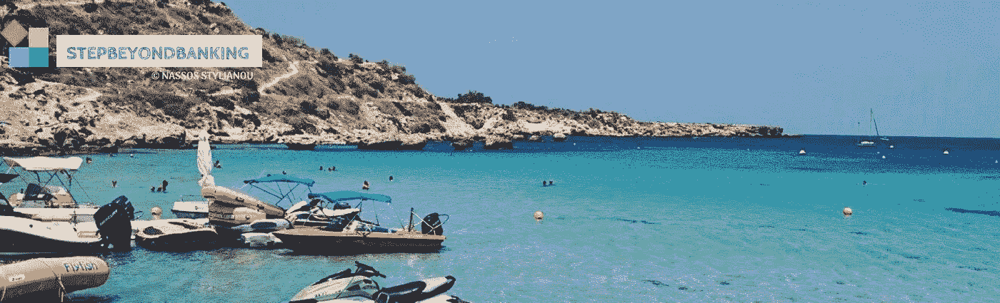

# 塑料还是钱？

> 原文：<https://medium.datadriveninvestor.com/plastic-or-money-3ed5861294b0?source=collection_archive---------20----------------------->

Konnos Beach, Ayia Napa (Cyprus)

我躺在塞浦路斯最具标志性的海滩之一的日光浴床上写这篇文章，这个海滩因其辉煌的蓝色海水和金色沙滩而被授予多面蓝色旗帜。我认为自己是幸运和幸运的一员，因为每年夏天(如果我想的话，冬天也可以)都能在这些水域游泳。然而，在从岸边游了一小段距离后，我从同一水域捞出了两个金属罐和几个塑料吸管和杯子。

当这个星球发现自己被[国家地理](https://www.nationalgeographic.com/environment/planetorplastic/)**令人不安的[关于塑料如何慢慢杀死我们的星球](https://www.nationalgeographic.com/environment/plastic-facts/)的图片“震惊”时，我们仍然不小心“喂养”塑料。塑料杯，塑料袋，塑料板，塑料人。 ***行星还是塑料？*****

**在塞浦路斯，7 月 1 日标志着超市、面包店、售货亭、咖啡店塑料袋“末日的开始”。意思是:你仍然可以得到它们，但是要花很少的钱。**

**这是今年第一个没有塑料袋的月份吗？**

**绝对不是。**

**如果说有什么不同的话，那就是在夏季的几个月里，塑料杯子、吸管和塑料袋的使用量比一年中的任何时候都要多。**

**如果到现在你还不知道这和金融科技博客有什么关系，请继续阅读 。**

**你会惊讶地发现，金融科技和环保并不是两个互相排斥的术语。 [HelloGold](https://www.hellogold.com/) 成功地将两者可持续地结合在一起，并为马来西亚和新加坡的民众提供了(a)保护地球和(b)保护自己口袋的选择。**

**一个人的垃圾桶最终也会成为他的黄金。 HelloGold 在马来西亚各地推出自动售货机，将塑料瓶和铝罐转换成投资级黄金。由 [**KLEAN**](https://www.klean.my/) 公司设立的反向贩卖机( **RVM** )为马来西亚人提供 0.00059 克黄金，以换取他们“喂”进机器的每一个回收塑料瓶或铝罐。**

**为了变得更富有(在思想上和价值上)，你需要首先从谷歌或苹果商店下载 HelloGold 应用程序，注册并创建一个帐户。通过将塑料瓶和铝罐带到任何 KLEAN RVM 进行回收，用户可以选择通过 KLEAN 数字钱包和移动应用程序之间的无缝集成将其 KLEAN 电子积分转换为黄金。**

**KLEAN RVMs 用虚拟积分奖励用户。这些积分可以作为虚拟货币来购买任何东西，从手机信贷，食品和其他产品。所以你可能不会变得(字面上)富有，但你肯定会在很多方面变得更加富有。如果我们在所有的塞浦路斯海滩和度假胜地都有 rvm，我自己肯定会赚几克金子…**

**更近一步来说，有多种方法可以减少塑料的使用，并支持当地社区这样做。**

**这里有一些我最喜欢的(本地)建议，欢迎采纳(并实施！).**

1.  **首先，你可以选择用他们的[可重复使用塑料杯](https://www.starbucks.com/responsibility/environment/cups-and-materials)来装你每天喝的星巴克咖啡，这种塑料杯你可以在任何一家星巴克塞浦路斯店购买€2 号，并且你要求用可重复使用的杯子提供的每杯咖啡都可以享受咖啡价格 15%的优惠。**
2.  **你可以在可重复使用的星巴克杯中添加一个金属吸管，这可以从[让我们绿化塞浦路斯](http://www.letsmakecyprusgreen.com/)倡议中订购(€12 的 4x ),并终生使用。**
3.  **获得时尚**"**[ιδαλιαδεσ](https://www.facebook.com/idaliades/)**"**(Idaliades)帆布购物袋一个；从事传统工艺的尼科西亚大理退休妇女制作的环保袋。**"**[ιδαλιαδεσ](https://www.facebook.com/idaliades/)**"**是一项侧重于增强其成员权能和创造性参与的倡议，有助于传统职业的复兴，并为贫困和退休妇女提供财政援助。[ιδαλιαδει已经与 Alphamega 超市合作](https://www.alphamega.com.cy/en/did-you-get-your-unique-bag-from-alphamega-hypermarkets-yet/)，环保袋的部分销售利润将用于集团的目的。你可以在他们的脸书页面 [**这里**](https://www.facebook.com/idaliades/) 找到更多关于这个团体的信息。**
4.  **通过访问[Let Make Cyprus Green](http://www.letsmakecyprusgreen.com/)(**【LMCG】**)网站，发现所有可以帮助 ***让塞浦路斯变得绿色*** 的方法，该网站旨在告知和教育公众过度使用塑料对地球造成的危害。
    LMCG 致力于消除塞浦路斯的塑料垃圾，并开发各种高品质的环保产品。它还启动了针对当地企业的合作伙伴计划，这些企业希望将自己的品牌形象与环境价值观结合起来，许多企业已经签署了该计划。**
5.  **你不一定需要实物奖励(尽管这肯定会带来额外的激励)，要意识到你每天单独浪费的大量塑料，以及减少和回收的必要性。一切都从那里开始。**

**如果你读到这里，说明你在乎。我希望你也能受到一点点启发，在日常生活中做出一些改变。**

**为了提高自己对塑料消费的认识，我寻找了省钱(这是金融科技通常发挥作用的地方)和保护地球可以共存的替代方法。从 HelloGold 和 KLEAN 公司的合作来看，这是可以做到的。**

**下一次我们选择用塑料杯装外卖咖啡，或者下一次我们对放在沙滩上“无人看管”的塑料袋视而不见时，让我们都把它当作思考的食粮。**