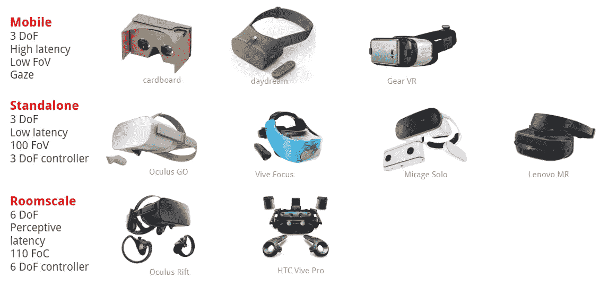
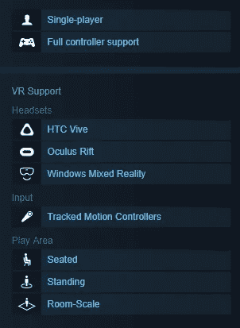

# 沉浸式媒体应用和游戏的游戏区

> 原文：<https://medium.datadriveninvestor.com/play-area-for-immersive-media-apps-and-games-e7d26bcd4a1a?source=collection_archive---------30----------------------->

PC/笔记本电脑上的游戏或应用程序总是在坐着的时候使用。同样，移动应用在使用和播放格式方面也没有区别。

对于沉浸式媒体(又名虚拟现实、增强现实和最新的混合现实)，提及应用程序的使用格式变得更加重要。

VR 和 MR 硬件允许用户环顾四周，并在他们所在的空间中移动。下图显示了基于控制用户移动的重要参数的 VR 硬件分类。

## 具有 3 自由度或 3 自由度的硬件允许用户环顾四周，而 6 自由度或 6 自由度允许用户不仅环顾四周，还可以在他们所在的空间中移动

类似的分类可用于在虚拟和/或混合现实中玩的应用和游戏。对于像膝上型电脑和移动电话这样的硬件介质，应用程序之间没有这种区别，它们具有移动和便携的固有能力。事实上，所有的手机应用程序都应该只在坐着或站着的时候使用，并且不鼓励用户移动。

有趣的是，随着新的沉浸式媒体的出现，指定应用程序可以使用的使用格式和播放区域变得非常必要。

这些参数很重要，原因有两个

*   让用户意识到游戏/应用程序的人体工程学
*   在使用和沉浸方面设定正确的期望值
*   允许用户设置游戏竞技场，以便在使用应用程序时不会自残

[*库马尔·阿希尔*](http://www.kumarahir.com) *是沉浸式技术和设计领域的独立顾问。他是新的沉浸式技术和设计的传播者，积极参与设计思维、AR 和 VR 设计、混合现实技术原型的研讨会。*

他的目标是为沉浸式技术创造一个更好的设计生态系统。

*在*[*LinkedIn*](https://www.linkedin.com/in/kumarahir)*和* [*Twitter*](https://twitter.com/kernel_kumar) 了解他更多