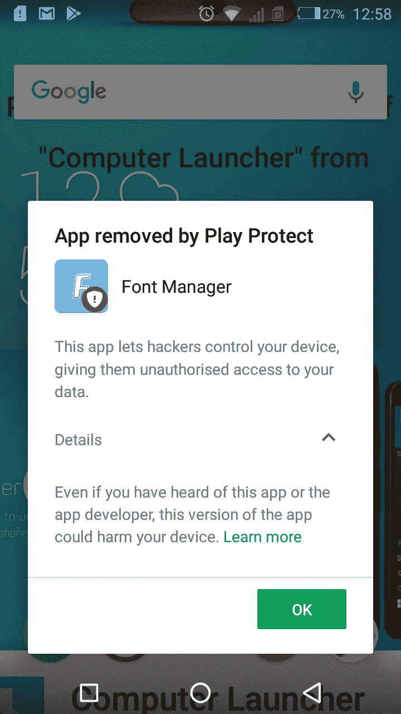

# 玩保护假人游戏

> 原文：<https://medium.datadriveninvestor.com/play-protect-for-dummies-ad998f400aa5?source=collection_archive---------10----------------------->

> 了解谷歌正在做什么来“保护”我们，以及他们如何让 android 变得更好。

这篇文章将描绘出我们今天所处的位置，以及我们是如何进入 Android 生态系统的。

# 服务

Android 中有哪些后台服务？

一个**服务**是一个在**后台**运行的组件，不与屏幕上的用户直接交互。同样，即使你没有打开 WhatsApp，它也会弹出一条消息。

**服务**用于重复性和潜在的长时间运行的操作，检查新数据、数据处理、索引内容等。via[[https://guides . code path . com/Android/starting-background-services]](https://guides.codepath.com/android/starting-background-services)

# 恶意软件

android 上的恶意软件是由流氓开发者开发的应用程序，目的是窃取你的信息或破坏你的手机。

这些应用程序通常与其他安全应用程序一起安装。在早期版本的 Android 中，流氓开发者通过恶意应用程序(恶意软件)侵犯和渗透用户隐私，窃取联系人、消息、图库图片和视频。

[“Play Protect 内置于每台装有 Google Play 的设备中，随时更新，并自动采取措施保护您的数据和设备安全，因此您无需动一根手指，”](https://www.android.com/play-protect/)

# **应用权限**

当谷歌团队如此关注 Android 平台上用户的安全和隐私时，他们在 android 5.1 Lollipop 中推出了应用权限。

这意味着，对于一个从设备上访问敏感数据的应用程序来说，例如查看 gallery 中的照片、读取电话簿中的联系人、进行语音通话和读取通话记录，该应用程序必须获得用户的同意才能继续。这有助于我们控制应用程序如何处理我们的数据。

# Google Play Protect——永不休眠的安全系统

Play protect 是与 Android 8.0 Oreo 一起推出的，以应对对 Android 恶意软件上升的担忧。Play protect 分析应用程序正在访问的数据以及它是如何请求这些数据的。一旦算法识别出可疑活动，play protect swings 就会开始运行，并代表你删除该应用程序。

随着奥利奥的出现，谷歌的工程副总裁戴夫·伯克对其机器学习元素赞不绝口，理论上这应该让它处于领先地位。

