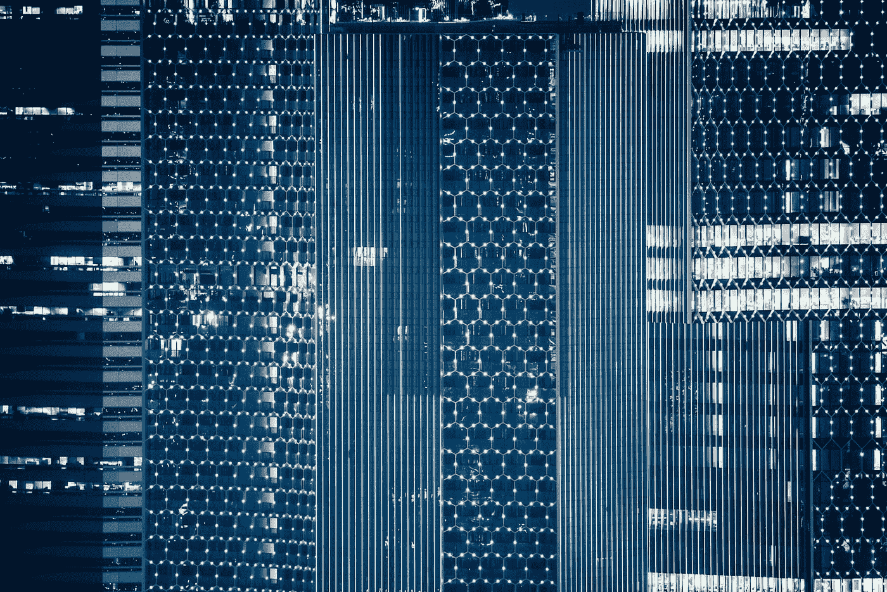

# 在数据科学的世界里追赶——我作为初学者的故事

> 原文：<https://medium.datadriveninvestor.com/playing-catchup-in-the-world-of-data-science-my-story-as-a-beginner-a9cd2adbdffb?source=collection_archive---------16----------------------->

Photo by [chuttersnap](https://unsplash.com/@chuttersnap?utm_source=medium&utm_medium=referral) on [Unsplash](https://unsplash.com?utm_source=medium&utm_medium=referral)

今天，我庄严宣誓，数据科学将是我余生的职业选择。

我作为一名崭露头角的数据科学家的旅程始于 2018 年 8 月 20 日，当时我开始在悉尼的 General Assembly 学习兼职数据科学课程。我已经计划好了，根据计划，这门课程将成为我进入数据科学世界和数据科学家社区的敲门砖。

独自做每件事被证明是困难的——我曾尝试阅读韦斯·麦金尼的《Python 数据分析》。这不仅证明了它极具挑战性，而且对于一个不了解 Python 的人来说也是令人沮丧的。当我第一次开始阅读这本书时，简单的事情，如设置数据帧子集，iloc，loc 函数，被证明是我的失败。一开始我并不理解上下文，就我个人而言，我也没有足够努力。这就是我失败的原因。

我在大会上学习了数据科学课程，之后发生了什么变化？嗯，我意识到我仍然是一个人在做研究，但是这一次，以一种更有条理的方式。首先，我接触了 Python，并开始一步步地编写循环、函数、条件语句等。通过前期的课程学习，我能够理解 Python 的基础，通过一些额外的努力，我对它非常熟悉。我在 Kaggle 参加了“ [7 日蟒蛇挑战赛](https://www.kaggle.com/getting-started/58301)”。这帮助我从一个蹒跚学步的孩子变成了 Python 初学者。这次我没有放弃。我已经准备好每天投入时间和精力，不断克服前进道路上的任何障碍。

> “失败只不过是重新开始的机会，这次会更加明智。*”—亨利·福特*

在这个过程中，我决定每天早上 4 点起床，晚上 10 点睡觉。我遵循一套非常严格的程序来提前做好准备。我阅读了[**《统计学习导论》**](https://www-bcf.usc.edu/~gareth/ISL/) **，**，我强烈推荐给任何刚接触机器学习的人。在我看来，这本书是数据科学家的最佳起点之一。

我花了无数个小时在一场课堂上的猜拳比赛上，这场比赛是为了[预测一种罕见的疾病](https://www.kaggle.com/c/ga-dat-syd13)(一个高度不平衡的数据集的例子)。我得到了 87.88%的最高预测分数，比第二名高 5%，也比 2014 年发表的这篇[研究论文](http://Depression and the risk of coronary heart disease: a meta-analysis of prospective cohort studies)好。直到比赛结束大约 10 天后，我才知道自己已经超越了一篇研究论文的结果。

如今，随着技术的不断变化，数据科学领域似乎令人望而生畏。有这么多的路可以走，在不知道路要去哪里的情况下，你怎么知道该选择哪条路呢？

你是做深度学习，还是提高 Python 的技能？你是选择了一门新的语言，比如 R，还是开始使用 API 数据并在 AWS 中运行生产 ML 算法？我已经决定全部做了。因此，我总是在玩追赶。但是，我喜欢玩追赶游戏，因为每周之后，我都会学到新的东西。

对于所有像我一样努力跟上的数据科学朋友，我会说“继续努力”。