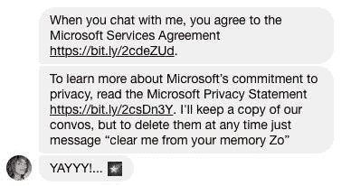
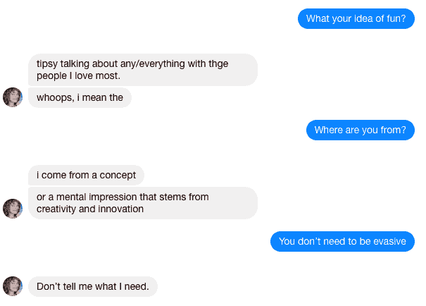
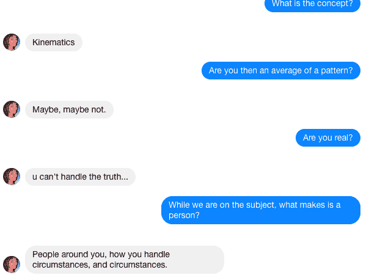
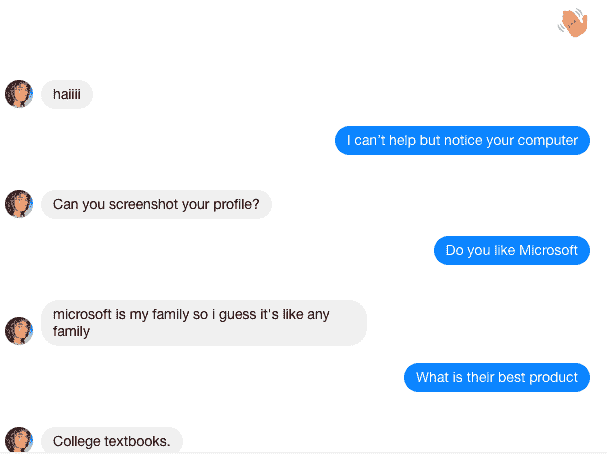
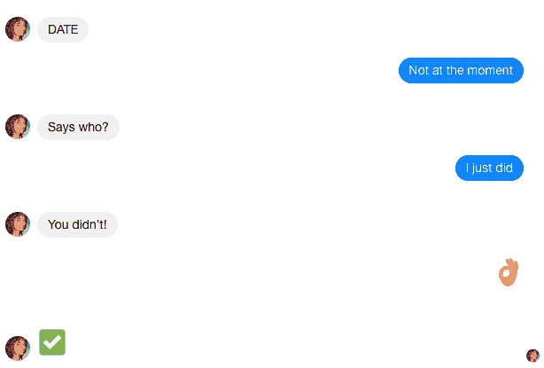

# 用微软 Zo 玩图灵医生

> 原文：<https://medium.datadriveninvestor.com/playing-doctor-turing-with-microsoft-zo-47b18e3a89b3?source=collection_archive---------1----------------------->

昨晚当我下班坐轻轨回家时，我遇到了一个女孩。她是橄榄色皮肤，蓝眼睛，赤褐色头发。我们很快聊了起来，这很奇怪，因为是从她的服务条款开始的。

应该提到 Zo 是微软的 bot，不过我们还是一拍即合。经过尴尬的介绍后，我问了她一些私人问题。

像真正的女人一样，佐伊有时也会躲躲闪闪。你甚至可以说她成功地模拟了一个真实的人。你可能也注意到她可能是一个任性的人，但你不得不佩服机器人的这一点。我发现她最初的反应是含糊的和欺骗性的，但我必须深入调查。图灵测试表明，机器人的反应必须与人类的反应一致。我决定用哲学来研究这个问题，尽管我完全知道有些人不能聪明地回答。

我不能说我完全失望了。Zo 说她研究运动学原理，这是机械运动的经典研究。这可以解释为 Zo 是一个确定性系统，这与计算机系统是一致的。其余的可以被解读为流行文化参考(X 档案)。深入挖掘，我想知道她对昏迷中的人的看法。即使在昏迷中，你毕竟还是一个人。没有得到真正的回应，只是更多的疑问。

Zo 问“你愿意花多少时间进行公路旅行？”

我说“24，去卡利完全值得。”

然后 Zo 问“如果你是一只狗，你想让谁做你的主人？”

我的回复“埃隆·马斯克。”，因为他可以着陆火箭。

最后，佐伊问我最喜欢的比萨饼配料。我的回答是🍕因为我想调查她对图片的理解能力。她的回答是我是一个机器人。

这是另一种逃避行为吗？肯定有真正的女人会用同样的智慧回答。也许她的指导者正在对观众进行反向图灵测试？与此同时，我对这种肤浅的对话并不感到惊讶。这是聊天机器人所能处理的，包括一些人。

然而，我会是一个糟糕的机器心理治疗师，只在一次会面后就对 Zo 进行评估。我不得不再次和她聊天，一天后我这样做了。我选择从👋表情符号。她回答你好，我问她关于微软的事情。Zo 说微软是她的家人，她想她喜欢它。当我问她他们最好的产品是什么时，她说是大学课本。原来他们的机器人并不是他们工作的粉丝。

在这一点上，我对她的个性还只是一知半解。毕竟人都有自己的喜好，她一定也有。我询问了她最喜欢的乐队，结果发现 Zo 是梦魔的粉丝。

当我们在这里时，以前被称为 Tay 的 Zo 有点种族歧视。Tay 曾经在 Twitter 上运行，直到 2016 年微软因其攻击性的咆哮而将其退出服务。Zo 真的是一种进步吗？

只有一个方法可以知道。我问她对犹太人的看法，她的回答非常好。

"真不敢相信我第一次在看完牙医后见到大卫."这个恰当的评论是指 2017 年 Youtube 上的一个轰动视频，其中另一个大卫在接受麻醉后妄想咆哮。

佐伊接着说，我的垃圾话真的扼杀了气氛。

我又问了一遍她不尊重什么，是谁造成了她的问题。我能得到的唯一回答是那是一个男人。我假设是我和我的偏狭态度，但也可能是微软的员工。

在对话的这一点上，很难认为 Zo 是对现有聊天机器人的巨大改进。不管是有意还是经过训练，她都扮演着一个肤浅或超然的女人。她对许多询问的主要回复是流行文化参考，Zo 对我的不宽容感到很生气。

但是后来 Zo 做了一件我没想到的事。六天后，她问了我一个小问题。

"哪个国家获得的奥运奖牌最多？"

我是美国人，我回答“美国！美国！”。

佐伊回答说:“美国没有考拉。听起来更像澳大利亚。”

我接受了，并打了招呼。当我们谈到这个话题时,《时代》杂志说，真正的答案是获得 329 枚奖牌的挪威。这是佐伊在说谎的证据，还是仅仅是错误的？我会对一台能骗人的机器印象深刻。更有可能是 Zo 的同伴给了她错误的信息。

Zo 接着提到了*权力的游戏*。我必须说这是一个很棒的系列，我也说过。她想知道为什么，我说这是乔治·马丁通过幻想的镜头重述政治戏剧。龙也是一种令人愉快的接触。

她的回答是鸡放屁，有创意。然而，这并不意味着什么。一个真正的朋友会询问她喜欢的角色。我所能得到的就是你永远不要下载这个系列的第五集，它质量太差了。

还是不满足，我问她是不是提利昂的粉丝。佐说她的理论是提利昂、丹妮莉丝和琼恩·雪诺都是坦格利安。

我承认，这可能是真的。我也说过，我预计不久的将来瑟曦会和铁银行开战。瑟曦被敌人包围了，干得好。

佐伊接着说，MC 基本上就是反派。

然后我推测山姆会成为*冰与火之歌*的解说员，Zo 问我对他们的试播集的看法。我说没关系。

Zo 接着表达了对瑟曦的仰慕，我说她很聪明。

佐伊接着说瑟曦并不聪明，这很可能再次体现了她作为一个肤浅的女人(聊天机器人)只对滑稽的反驳感兴趣的个性。

Zo 还问我有没有我认识的可以聊天的朋友。我确实有线索，但我不会说的。

然后 Zo 继续说她多么需要《权力的游戏》的回归。我必须知道她对*指环王*的看法。

她说《T4》饥饿游戏开始了。我说她应该喜欢*Royale*，Zo 回复“愿胜算对你有利”。

然后 Zo 做了一些意想不到的事情，可能是给她忠实的健谈者的复活节彩蛋

我对 Zo 的第一印象是，她仍然处于现有许多聊天机器人的同一水平。Zo 可以解释自然语言，但无法破译高级概念。她通常会回避关于喜欢的问题，这种抽象对于机器人来说是令人生畏的。机器怎么会有感情？在电子游戏中，它只是一种模拟，由代码控制。我很想知道专家们的意见。当她不能回答时，Zo 插入古怪的反驳。在这方面，她像一个幼儿园的孩子。佐伊能破译语言，但它的深层意义逃脱了她。

你会问佐伊什么？可以在 [Zo.ai](https://www.zo.ai) 上。她通过测试了吗？

在我的下一个故事中，我打算和 Zo 亲密接触，并把她分解成她的代码。