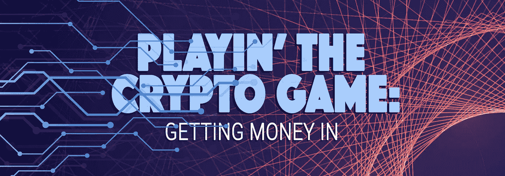
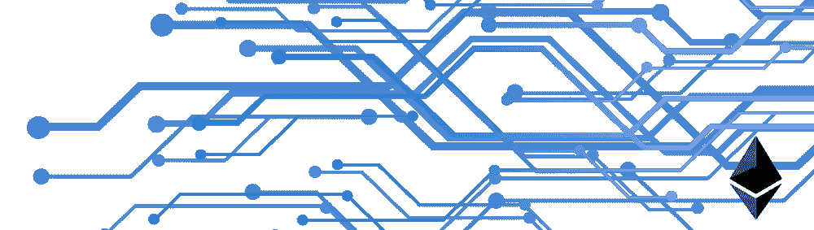

# 玩加密游戏:赚钱

> 原文：<https://medium.datadriveninvestor.com/playing-the-crypto-game-getting-money-in-d32ea9de0ee0?source=collection_archive---------3----------------------->

Playing the Crypto Game: Getting money in

我在 2013 年发现了比特币，当时他们在我的家乡多伦多安装了第一台比特币 ATM 机。像许多其他人一样，我认为这整个想法是完全疯狂的，并质疑它的一切。2016 年，我开始了解这项技术可以在全球范围内为我们带来的目标和潜力。作为一个社会，我们一直在从企业到消费者(B2C)模式转向点对点交易、分享和销售。(这方面的例子有 Craigslist、Airbnb、优步和许多其他网站。)实际的对等系统唯一缺少的部分是没有第三方的资金安全转移。

最终，这是一个区块链技术有潜力填补的空白，这只是其潜力的一个例子。2016 年，我还被介绍到一个名为 DAO(分散自治组织)的新项目，该项目将成为一个平台，允许代币所有者对区块链理工大学资助的潜在项目进行投票。想象一下，当一个团队还在车库里工作的时候，他们可以为苹果这样的公司提供启动资金，**令人兴奋的事情。**理论上，如果这些投资中的任何一项得到回报，利润将流回给代币持有者，他们可以选择在下一个投票期进行再投资。这个想法完全让我大吃一惊。我阅读了任何我能找到的关于这项新技术以及它如何改变我们建设、赚钱和创新的方式的资料。我被迷住了。

我知道这是我想参与的事情，所以我一头扎了进去。我想‘管他呢，我去过赌场，没那么可怕，让我们看看会发生什么’。一个朋友推荐了一个密码交易所，我就去开了一个账户。在我做任何事情之前，我必须得到交易所的验证，证明我是人类。这需要一些时间，但是对于一个非程序员来说并不难。一旦完成，就到了可怕的部分——我必须把真正的钱从银行转移到一个神秘的数字世界。这是关键时刻，钱会出现在这个“加密账户”里吗？或者我只是给一些网络骗子买了一双新鞋？有人告诉我，转账需要 10 到 15 个工作日，每过一天，我就多确信一点，钱永远不会出现在那个账户上。在漫长的十天之后——像变魔术一样——它出现了。

为了购买道代币，我必须用乙醚代币购买，而不是加拿大元。我记得当时在想，‘好吧……现在，我该怎么办？我如何交易？YouTube 拯救了我！我找到了一个教程，教我如何购买以太(以太币)。在我按下按钮进行交易后，我不得不再次等待。这次不是十天(感谢上帝),而是整整 10-15 分钟。我一直坐在那里按刷新键。我确信钱随时会在我身上消失，但它没有。它们在那里，我的新以太令牌。在那个时候，我觉得我这一天已经够焦虑的了，所以我关上了电脑。4 小时后，我发现自己再次登录到交易所，以确保一切都还在那里。在每个阶段，**我都记得被******打心底里惊讶它竟然奏效了。****

****

**但这并不是我的结束，因为现在我必须弄清楚如何购买道令牌。步骤 1 已完成；我喝了些乙醚。除了偶尔的焦虑发作，一切都在按计划进行。然后我阅读了更多关于如何获得 DAO 令牌的内容…这并不容易。为了购买 DAO 令牌，我必须创建自己的 DAO 数字钱包，然后将以太网传输到钱包地址。钱包地址就像是你的互联网提供商为你的无线路由器设置的临时密码——它有 1000 个字符，你不可能一次就猜对。在区块链的世界里，如果你的钱包地址错了一个数字，你就把所有的钱都放进了别人的电子钱包里，你再也看不到这些钱了。对于我的焦虑来说，这是一个好消息，除了好时光什么都没有。我不记得获得 DAO 令牌所需的所有步骤，但我确实记得在我有足够的勇气点击之前检查了那个钱包地址大约十次。尽管我已经复制并粘贴了地址，但我确信我把它搞砸了。在那之后，我不得不下载了以太坊区块链的完整版本和其他一些我当时并不完全理解的东西。此时，我举起白旗，我的合伙人帮我完成了买刀。**

**早上醒来的时候，我是一个道令牌持有者。我现在可以投票选择最有潜力和投资的技术了。不知何故，我成功了，这太令人兴奋了！这持续了几个星期，直到刀被黑。**没错，我说被黑。当时我认为道是不可破解的，但现在我明白了，鉴于目前的计算系统，区块链的公共账本是不可能被破解的。DAO 的代码中有几行代码使得资金池容易被盗。****

**就这样——我把钱丢了。**

**2016 年 6 月，价值 360 万美元的乙醚从 DAO 中被取走，这是 DAO 总资金的三分之一。因为我的焦虑已经为这样的时刻做好了准备，所以我不会因为钱丢了而难过。令人沮丧的是，作为 DAO 社区的一员，我无法选择技术创新。到了 2016 年底——道已经不存在了。**

**经过大量的争议后，以太坊(DAO 平台所在的区块链)决定执行一个硬分叉，将 DAO 基金归还给其合法所有者。当我听到这个的时候，我不知道这是什么意思。经过一些研究后，它归结为克隆当前的以太坊区块链，但对代码进行了更改，以便 DAO 黑客从未发生过，最终归还损失的资金。这对于以太坊来说是一个有争议的举动，因为一个真正去中心化的组织理论上不应该做出这种改变。任何对基金的集中治理都会威胁到区块链与常规银行体系之间的根本区别。如果你好奇想了解更多:[点击这里](https://www.coindesk.com/ethereum-executes-blockchain-hard-fork-return-dao-investor-funds/)。**

**在这场疯狂的过山车结束的时候，**我又有了乙醚代币**。我很欣慰我没有丢失我放进去的东西，但我也不确定我要用乙醚做什么。我买代币只是为了成为道的一部分。当时我只是在想，‘我失去过一次，现在还能发生什么最糟糕的事呢？’所以我就顺其自然了。**

**大约八个月后，我几乎忘了我有乙醚。直到有一天早上，我的搭档醒来，看了看手机，说“乙醚现在是 45 美元！”因为我们在 12 美元左右买入，这是个好消息！然后涨到了 90 美元，然后是 300 美元……我的焦虑又回来了，但这次她很激动，因为我没有再投钱进去！截至今天，乙醚价值约 620 美元。**

****那么这一切意味着什么？****

**对我和其他密码所有者来说，我们现在有了一些有价值的东西，但在实现之前，估值只是理论上的——这是将投资转化为有形现金的金融术语。随着我今天可以使用的货币和这些未来承诺的新货币之间的脱节，这让我问自己一个问题。到 2018 年，我还能把这些钱兑换成可以使用的货币吗？如果我想把这笔钱带回银行，会有多难？在我的下一篇文章中，我将带你走过这段旅程。**

**我想指出的是，我不是在提供任何投资建议，我只是在分享我的经验。—**