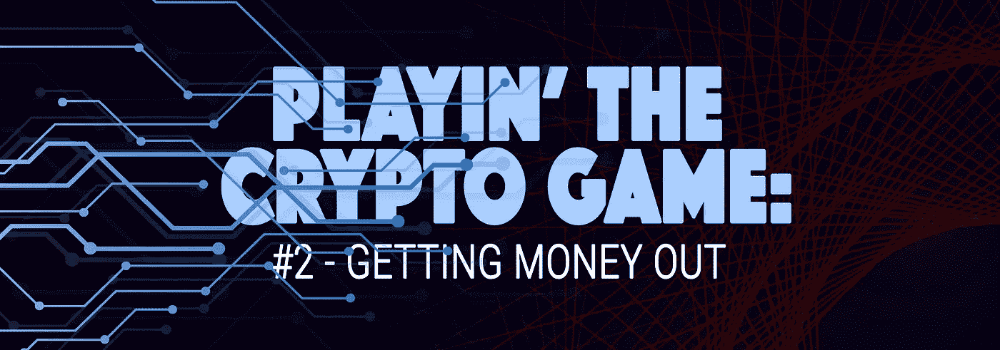
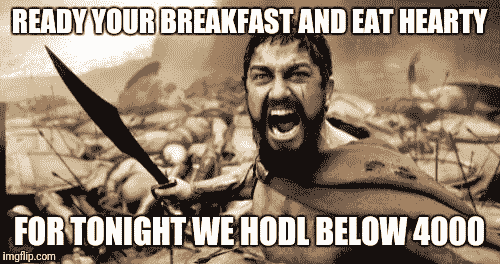

# 玩加密游戏:把钱取出来

> 原文：<https://medium.datadriveninvestor.com/playing-the-crypto-game-getting-money-out-2453c5a91e86?source=collection_archive---------3----------------------->

你可能已经在我的[上一篇文章](https://medium.com/@aprildezen/playing-the-crypto-game-getting-money-in-d32ea9de0ee0)中注意到了，拥有和交易加密货币有一个学习曲线。这是一个全新的金融环境，当前软件的可用性仍在解决中。由于加密交换经常被使用，在它们存在的短短几年里，它们已经变得更好了。不幸的是，使用加密基金购买商品的支付从 2017 年开始减少。主要原因是货币的巨大波动。任何使用比特币进行常规购买的人都面临着为商品或服务支付过多的风险，而供应商则面临着要价过低的危险。

**为什么？**

假设你花 20 美元买了一个披萨，在购买的时候，价值 20 美元的比特币是 0.0001。在你吃了那个披萨之后，比特币的价格刚刚上涨了 60%(目前对 cryptos 来说这是一个温和的上涨)。也就是说，你实际上给了那家披萨店 32 美元来买那块 20 美元的披萨。现在，从供应商的角度来看。比方说，披萨店直到周末才把比特币兑换成加拿大的资金，到那时比特币已经减少了 80%，这意味着披萨店将只能从那 20 美元的披萨中获得 4 美元。在目前的状态下，这不是一个理想的支付系统。许多密码持有者选择不使用密码购买商品，要么继续持有货币，要么像对待股票市场一样对待密码交易所；想快速赚钱。

## 考虑到我们不能在 2018 年使用这种货币——那我们为什么还要持有它呢？

有两个主要原因可以解释为什么美国的密码拥有者非常珍惜这些代币/硬币。**第一个原因**涉及对这项新技术背后的核心理念的真诚信仰——分散资金和支付渠道使勤劳的个人能够真正控制财务，并防止资本主义者通过高额费用或资金管理不善导致的回报损失来染指他们的口袋。尚不清楚加密货币会取得成功，但这个想法已经被释放出来，并广受欢迎。第二个原因在人类行为中更加明显和普遍——贪婪*。睡觉时抓住赚钱的东西不放是显而易见的。许多持有加密货币的人猜测，这些货币将大幅升值，他们只需要持有这些货币，直到有理由卖出。就我个人而言，我相信我们大多数人都是出于这两个原因而加入这个游戏的。#HODL*

For a definition if HODL, [click here](https://www.urbandictionary.com/define.php?term=hodl)

在我的上一篇帖子中，我问了一个问题，我相信我们很多人都在问自己。**如果我想把这笔钱带回银行，会有多难？**

我联系了 Github 上提出这个问题的几个社区，我注意到一个趋势——**没有一个加密所有者试图套现，或者可能没有人公开谈论它。**这些社区持有他们的密码或投入更多资金，希望获得高回报。由于我找不到任何人来采访将密码转换回加拿大现金的现实，我决定自己尝试一下。我想知道实现我们都认为我们正在创造的利润有多困难。毕竟，加密环境中的波动性使得整个系统看起来很脆弱，如果我们中的任何人决定取出资金，将它们带回更熟悉的东西，有谁知道会发生什么吗？

我是这项技术背后的理念的忠实信徒，所以我不打算在它刚刚开始的时候兑现。我的策略只是取出我最初投入的加拿大基金的价值。我选择这个数额的主要动机是向我的父母证明，我没有失去理智，数字货币确实存在并有效。我在考虑带一份打印好的银行对账单参加下周日的晚餐，并穿上一件写有“*妈妈没有养傻瓜*”的 t 恤，但这可能会让我活该挨一巴掌，而不是继续我的案子。

将钱转入/转出加密货币都是通过各种加密交易所完成的。因为我打算把这笔钱带回一家加拿大银行，所以我首先要弄清楚我所使用的交易所是否能做到这一点，因为许多交易所只交易美元和欧元。幸运的是，他们中的一个做到了。如果你想了解更多关于交易加拿大基金的交易所的细节，[点击这里。](https://www.buybitcoinworldwide.com/canada/)每个交易所的工作方式略有不同，对我来说，这就像通过加密交易所直接向我的银行分行存款一样简单。直接存款的过程对我来说没什么大不了的，因为我以前已经做过无数次了。

加密交换所需的银行验证是最少的，这加快了一切。在我的银行建好之后，我深深地吸了一口气，并开始申请提款。在我使用的交易所，无论转账金额多少，都有固定的取款费，这与当前的银行系统非常相似。我输入小额取款金额，然后点击“发送”再次，这是回到等待游戏，伟大的，我最不喜欢的部分。根据我使用的交易所，取款可能需要 2-15 个工作日，这取决于接收取款的国家和银行。当你不能 100%确定钱会出现的时候，15 天是一段很长的等待时间。与我第一次购买乙醚并每隔几分钟检查一次我的账户的时候不同，我不是在检查我的银行账户中要达到的数量。我原以为我的运气会持续整整 15 天，但是 4 个工作日之后——就这样——我的账户又恢复了。我仍然对没有任何戏剧性事件感到震惊，但我想银行在接受金钱方面做得很好，不管它来自哪里——或者现在看起来是这样。我敢肯定，当他们抓住这种转让“便利”费用将神奇地出现。

## **是这样吗？有那么容易吗？**

现在我的账户里有资金了，下一个问题是，我必须交税吗？我取出了最小数量的钱来测试这个过程，但是如果有人取出更多，他们将如何在他们的税收中申报，他们将被征税多少？这是我想深入探讨的另一个问题，因为没有人真正谈论它。目前，我正在研究这个话题，并接触会计师。**普遍的冲击是将任何加密投资视为资本收益。**

我想指出的是，我不是在提供任何投资建议，我只是在分享我的经验。—