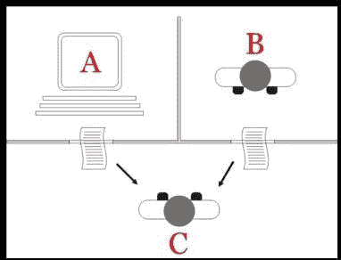
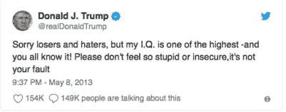

# 和唐纳德·特朗普玩模仿游戏

> 原文：<https://medium.datadriveninvestor.com/playing-the-imitation-game-with-donald-trump-f9e49d1c4140?source=collection_archive---------11----------------------->

人工智能(AI)在大多数人心中提出的问题是:“机器(真的)能思考吗？”一旦被问到，很快就会明白，一个令人满意的答案取决于对什么算作“思考”以及“机器”意味着什么的分析。

1950 年 [**艾伦·图灵**](https://en.wikipedia.org/wiki/Alan_Turing) 提出的模糊公式化问题'*机器能思考吗？*'应该换成客观测试。图灵的测试基于一个游戏(如下图所示),其中一个人，审讯者 C，必须找出另外两个人，A 和 B，哪个是男人，哪个是女人。审讯者通过某种方式问 A 和 B 问题，允许他们隐藏自己的身份。

图灵提出了这样一个问题:如果一台机器扮演了试图模仿一个人并愚弄审讯者的人的角色，会发生什么？如果机器足够复杂，能够模仿图灵建议我们应该承认机器是智能的。

图灵的测试，通常被称为“模仿游戏”，成为一种测试机器表现出与人类同等或不可区分的智能行为的能力。图灵提出，人类评估者将判断人类和机器之间的自然语言对话，机器被设计成产生类似人类的反应。

图灵测试由雷丁大学管理多年，从未通过。然后在 2014 年，一个名为 [**的电脑程序尤金·古斯特曼**](https://en.wikipedia.org/wiki/Eugene_Goostman)**模拟了一个 13 岁的乌克兰男孩，据说通过了图灵测试。**

**如上所述，图灵测试的“标准解释”是，参与者 C——询问者——被赋予一项任务，试图确定哪一个参与者——A 或 B——更像人，是计算机还是人。询问者仅限于使用对书面问题的回答来做出决定。**

****

**唐纳德·特朗普经常声称自己是个天才，比任何人都聪明。与此同时，他展示了一些可以想象到的最不人道的行为，比如把孩子和父母分开，把所有墨西哥人都称为强奸犯。所以我决定对特朗普进行图灵测试，不是测试他的智商，而是测试他的人性。**

**我对图灵测试(如下图所示)的“修改解释”不是为了确定计算机是否是人类，而是为了确定唐纳德·特朗普是否确实是人类。**

****

**在我对图灵测试的“修改解释”中，玩家 C，仍然是审讯者，被赋予的任务是试图确定哪个玩家——A——计算机，或者 B——唐纳德·特朗普——是计算机，哪个是人。在标准测试中，讯问者仅限于使用计算机和唐纳德·特朗普对书面问题的书面答复来做出决定。诚然，这可能会使特朗普处于不利地位，因为他将被要求"*阅读*问题，但我们仍然继续进行。**

**以下是我的询问者向计算机和唐纳德·特朗普提交的问题样本，以及每个问题的回答和询问者对哪个回答“更人性化”的判断。这个样本代表了唐纳德·特朗普试图将自己表现为人类的整个测试。**

1.  **解释为什么下面的故事有趣或荒谬:**

***一个男人走进一家酒吧，说‘你好，是我！’—但不是他……*”**

*   **电脑回答——荒谬的是，通过说“是我”,这个人也在说这确实是他自己。**
*   **特朗普回答——都不是，这是巴拉克·奥巴马让我难堪的伎俩。**
*   **审讯者的判断——电脑更像人类**

**2.假装你是阿诺德·施瓦辛格，说一些你听阿诺德说过的话:**

*   **电脑回答——“*我会回来的！***
*   **特朗普回答——“我是伪装成共和党人的非法外国人”**
*   **审讯者的判断— *电脑更人性化***

**3.下一个案例测试对知识和被测试实体的认知；该测试确认该实体回答给定问题的能力，然后当该问题被询问时，该实体应该能够回答该问题。如果该实体了解一个一般的主题，该测试也可以被修改为提出一个更一般化的问题，例如你知道如何计算自然对数吗？你知道如何计算五分之七的自然对数吗？**

*   **电脑回答:是的**
*   **唐纳德·特朗普回答道:听起来像是民主党的又一个诡计，但我是个天才，所以继续吧**

**问:五分之七的自然对数是多少？**

*   **计算机回答——0 . 33660 . 38638638661**
*   **特朗普回答——我不知道，但可以肯定的是，这是民主党的诡计**
*   **审讯者的判断——电脑更像人类**

**所以，我们的修正图灵测试的结论是:**

*   **唐纳德·特朗普不是人**
*   **或者至少电脑“比唐纳德·特朗普更像人类”。**

**________________________________________________________________**

****备注:****

**1.布莱恩·克里斯蒂安，“最有人情味的人”，双日，纽约，2011 年
2。[https://www . Bloomberg . com/view/articles/2017-10-10/trump-has-the-high-IQ-his-say-self](https://www.bloomberg.com/view/articles/2017-10-10/trump-has-the-highest-iq-he-says-so-himself)
3 .[https://medium . com/@ faii Zan/can-computers-think-the-age-of-artificial-intelligence-551 FFA 4974 de](https://medium.com/@faiizan/can-computers-think-the-age-of-artificial-intelligence-551ffa4974de)
4。[https://www.bbc.com/news/technology-27762088](https://www.bbc.com/news/technology-27762088)**

***原载于 2018 年 9 月 16 日*[*neutec.wordpress.com*](https://neutec.wordpress.com/2018/09/16/playing-the-imitation-game-with-donald-trump)*。***