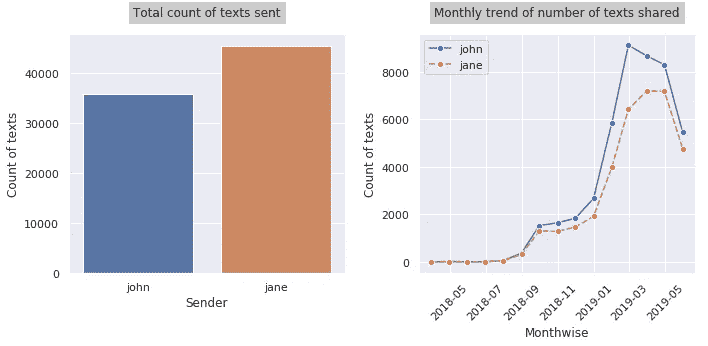
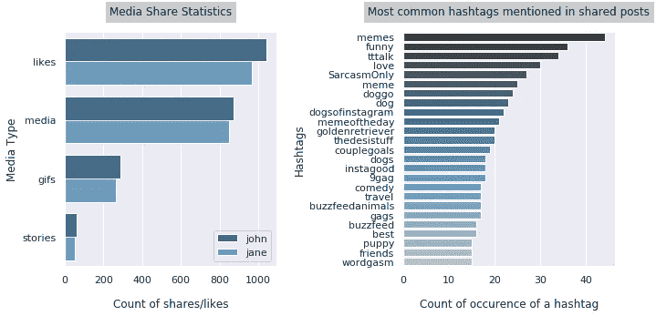
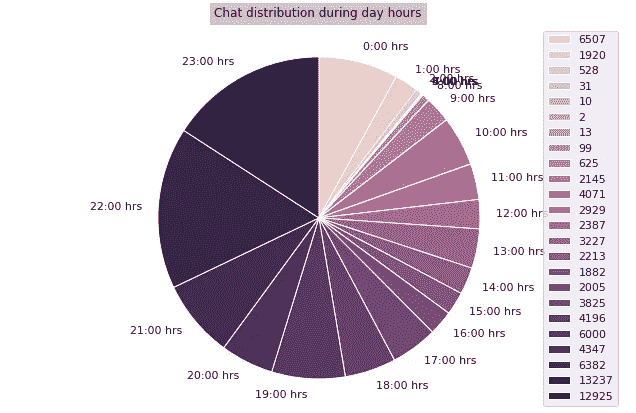

# 玩 Instagram 数据

> 原文：<https://medium.datadriveninvestor.com/playing-with-instagram-data-53ede72cb756?source=collection_archive---------1----------------------->

## 下载和可视化 Instagram 直接对话

Photo by [Erik Lucatero](https://unsplash.com/@erik_lucatero?utm_source=medium&utm_medium=referral) on [Unsplash](https://unsplash.com?utm_source=medium&utm_medium=referral)

由于 Instagram 没有为其聊天提供搜索机制，因此寻找从最开始就开始的旧对话成为了一项非常艰巨的任务，因为唯一可能实现这一点的方法是通过滚动消息一直到顶部，每几条文本之间的加载暂停会使情况变得更糟！

因此，在寻找出路的过程中，为了找到一种不那么费力的方式来替代这种令人厌倦的滚动，我知道 Instagram 终于推出了一项功能，允许用户请求并下载他们的 Instagram 数据。请求下载的步骤如下:

 [## 社交媒体倾听让你时刻保持联系——数据驱动的投资者

### 虽然社交媒体倾听是一种顶级趋势，但它应该是每个现代营销策略的一部分。保持和谐…

www.datadriveninvestor.com](https://www.datadriveninvestor.com/2019/02/26/social-media-listening-keeps-you-plugged-in/) 

*   登录 Instagram.com 并访问隐私和安全部分。
*   点击数据下载部分下的“请求下载”。
*   输入您的 Instagram 凭据以确认请求。

他们会在 48 小时内将包含你所有 Instagram 数据的邮件发送到你注册的电子邮件地址，但你很可能会更快收到邮件，不到一个小时。提取压缩的电子邮件附件后，您会发现一个“messages.json”文件，其中包含您与其他用户交换的所有 Instagram 聊天/直接消息。

一旦你掌握了数据，我们就可以开始利用手头的数据了。文章的其余部分将主要集中在可视化和分析两个用户(不是群聊)之间共享的直接消息，我们称他们为 John 和 Jane。本文使用的所有代码和图片都可以在 [Github](https://github.com/SharvilN/Instagram-Data-Visualization) 找到。

# **加载和理解数据结构**

数据是一个 [JSON 数组](https://restfulapi.net/json-array/)，数组的每个元素由两个键组成，即**参与者**，它本身是直接消息中涉及的一对用户，以及**对话，**存储该对话的所有细节，如消息文本、发送者、时间戳、媒体等

“created_at”的时区被更改为本地时区，以确保在进一步分析中的清晰性和一致性。然后，消息的时间戳被设置为数据帧的索引，以便利用有效的计算。结果数据帧中的一些列的含义是:
**发送者** —发送消息的人的用户名
**文本** —发送消息的文本
**创建 _ 在** —消息的时间戳
**媒体 _ 共享 _ 标题** —共享媒体帖子的标题
**喜欢** —共享帖子喜欢、消息喜欢、故事喜欢

# **探索性数据分析**

现在我们的数据已经可以被查询了，我们将首先可视化每个用户发送的消息数。然后，让我们尝试通过每月对数据进行重新采样来捕捉消息交换是如何随着时间的推移而增加的。

**媒体份额统计**

现在，首先让我们做一个简单的任务，确定对话的每个参与者分享的帖子、故事、动画 gif 的数量，并描述他们的记录是如何累加的。

之后，由于我们已经掌握了属性 **media_share_caption** 中分享的 Instagram 帖子的所有标题，让我们再深入挖掘一下，从这些标题中提取所有的标签，以尝试了解最常分享的帖子/媒体的类型。

**聊天的小时分布**

最后，让我们通过绘制一个描述性的饼图来深入了解聊天消息在一天中是如何传播的，该饼图将清楚地展示消息在 24 小时内的传输速率。

在本文中，我们仅仅探索了直接消息数据，在 Instagram 提供的其他数据中，有更多的可视化和找出隐藏模式的范围，你们都可以尝试一下！

如果你喜欢这篇文章，请告诉我你的观点！

在那之前，快乐观想！